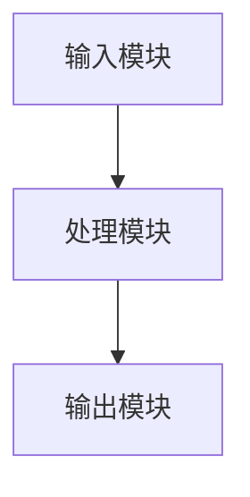

                 


# AI Agent的多语言处理：跨语言理解与生成

> 关键词：AI Agent，多语言处理，跨语言理解，跨语言生成，自然语言处理，机器学习

> 摘要：本文将详细探讨AI Agent在多语言环境下的处理能力，从跨语言理解到生成的实现原理，结合实际案例和系统设计，为读者提供全面的技术解读。

---

## 第1章: 背景介绍

### 1.1 AI Agent的基本概念

#### 1.1.1 AI Agent的定义
AI Agent（人工智能代理）是指能够感知环境、自主决策并执行任务的智能实体。它能够通过传感器获取信息，利用计算模型进行分析，并通过执行器与环境交互。

#### 1.1.2 AI Agent的核心特征
- **自主性**：能够在没有外部干预的情况下运行。
- **反应性**：能够实时感知并响应环境变化。
- **目标导向**：基于目标进行决策和行动。
- **学习能力**：能够通过经验改进性能。

#### 1.1.3 多语言处理的必要性
在全球化背景下，AI Agent需要处理多种语言，以满足不同用户的需求。多语言处理能够提高AI Agent的通用性和适用性，使其在跨文化交流中更加高效。

### 1.2 多语言处理的背景与挑战

#### 1.2.1 全球化背景下的语言多样性
随着全球化的发展，跨语言交流的需求日益增加。AI Agent需要能够理解并生成多种语言，以服务于全球用户。

#### 1.2.2 多语言处理的难点
- **语义差异**：不同语言中的同一词语可能有不同的含义。
- **语法结构差异**：不同语言的语法结构差异可能导致处理上的困难。
- **数据稀缺性**：某些语言的数据量有限，影响模型的训练效果。

#### 1.2.3 当前技术发展现状
目前，基于深度学习的多语言模型（如mBert、XLM）已经取得显著进展。然而，如何在资源有限的环境中实现高效的多语言处理仍是一个挑战。

---

## 第2章: 跨语言理解与生成的核心概念

### 2.1 跨语言理解的基本原理

#### 2.1.1 语言模型的跨语言适应
语言模型通过训练大量多语言数据，学习语言的共性特征，从而实现跨语言理解。例如，使用预训练的多语言模型进行文本表示。

#### 2.1.2 跨语言表示学习
跨语言表示学习的目标是将不同语言的文本映射到同一个向量空间，以便进行统一的语义分析。常用的方法包括对比学习和对齐模型。

#### 2.1.3 跨语言语义理解
通过跨语言表示学习，AI Agent可以理解不同语言文本的语义，从而实现跨语言对话和信息检索。

### 2.2 跨语言生成的关键技术

#### 2.2.1 多语言生成模型
多语言生成模型（如mBert、XLM）能够同时生成多种语言的文本。它们通过共享的参数空间和多任务学习框架，实现了跨语言生成能力。

#### 2.2.2 跨语言翻译与生成
跨语言翻译与生成是指将一种语言的文本翻译成另一种语言，并在此基础上生成新的文本。这种技术结合了翻译和生成的能力，能够实现跨语言内容的再创造。

#### 2.2.3 語言生成的评估方法
评估跨语言生成的质量是关键。常用的评估指标包括BLEU、ROUGE和Meteor，这些指标可以衡量生成文本的质量和相关性。

---

## 第3章: 跨语言模型的算法原理

### 3.1 多语言模型的训练方法

#### 3.1.1 多任务学习
多任务学习通过共享参数空间，同时训练多种任务（如翻译、生成、理解），从而提高模型的通用性。

#### 3.1.2 预训练模型的微调
预训练模型（如BERT）通过大规模多语言数据的预训练，获得了强大的语言表示能力。在特定任务上进行微调，可以进一步提升性能。

#### 3.1.3 跨语言预训练
跨语言预训练模型（如XLM）通过对比学习和对齐策略，学习不同语言的共享特征，从而实现跨语言表示。

### 3.2 跨语言模型的数学基础

#### 3.2.1 概率论基础
概率论是自然语言处理的基础。例如，语言模型可以通过概率分布来预测下一个词。

#### 3.2.2 矩阵运算与向量空间
矩阵运算用于表示词向量和句子向量，向量空间模型（如Word2Vec）是语言表示的基础。

#### 3.2.3 深度学习基础
深度学习模型（如Transformer）通过多层变换，提取文本的高层次特征，从而实现语义理解。

---

## 第4章: 跨语言模型的系统架构设计

### 4.1 系统功能模块设计

#### 4.1.1 输入模块
输入模块负责接收多语言文本输入，并进行预处理（如分词、词性标注）。

#### 4.1.2 处理模块
处理模块包括跨语言理解模块和生成模块。理解模块负责文本的语义分析，生成模块负责生成目标语言的文本。

#### 4.1.3 输出模块
输出模块将生成的文本返回给用户，并可能进行格式化处理（如翻译结果、对话生成）。

### 4.2 系统架构图

#### 4.2.1 系统架构的Mermaid图


#### 4.2.2 模块之间的交互关系
输入模块与处理模块通过API进行交互，处理模块与输出模块通过队列进行交互。

---

## 第5章: 跨语言模型的项目实战

### 5.1 环境搭建与配置

#### 5.1.1 开发环境的选择
推荐使用Python 3.8及以上版本，安装必要的库（如TensorFlow、PyTorch、Hugging Face Transformers）。

#### 5.1.2 依赖库的安装
使用pip安装必要的库：
```bash
pip install transformers
pip install torch
pip install numpy
```

#### 5.1.3 模型的下载与加载
从Hugging Face下载预训练模型：
```bash
wget https://huggingface.co/mBert
```

### 5.2 核心代码实现

#### 5.2.1 数据预处理代码
```python
from transformers import BertTokenizer, BertModel
import torch

tokenizer = BertTokenizer.from_pretrained('mbert')
model = BertModel.from_pretrained('mbert')
```

#### 5.2.2 模型训练代码
```python
optimizer = torch.optim.Adam(model.parameters(), lr=1e-5)
criterion = torch.nn.CrossEntropyLoss()
```

#### 5.2.3 模型推理代码
```python
def generate_text(model, tokenizer, input_text, target_language):
    inputs = tokenizer(input_text, return_tensors='pt')
    outputs = model(**inputs)
    # 使用生成模型生成目标语言的文本
    generated = model.generate(**inputs, max_length=50)
    return tokenizer.decode(generated[0], skip_special_tokens=True)
```

### 5.3 实际案例分析

#### 5.3.1 案例描述
假设用户输入英文句子：“The weather is nice today.”，AI Agent需要生成中文句子：“今天天气很好。”

#### 5.3.2 代码实现
```python
input_text = "The weather is nice today."
target_language = "Chinese"
result = generate_text(model, tokenizer, input_text, target_language)
print(result)
```

---

## 第6章: 总结与展望

### 6.1 小结
本文详细介绍了AI Agent的多语言处理技术，从核心概念到算法原理，再到系统设计和项目实战，为读者提供了全面的技术解读。

### 6.2 注意事项
- **数据质量问题**：多语言数据的质量直接影响模型的性能。
- **计算资源限制**：复杂的多语言模型需要大量的计算资源。
- **模型适应性**：模型在不同语言和任务上的表现可能存在差异。

### 6.3 拓展阅读
推荐阅读相关领域的最新论文和书籍，如《Transformers: Pre-training of Self-attentional Neural Networks》和《Deep Learning for NLP》。

---

## 作者：AI天才研究院/AI Genius Institute & 禅与计算机程序设计艺术 /Zen And The Art of Computer Programming

---

通过以上内容，读者可以系统地了解AI Agent的多语言处理技术，并能够实际应用这些知识进行项目开发。

