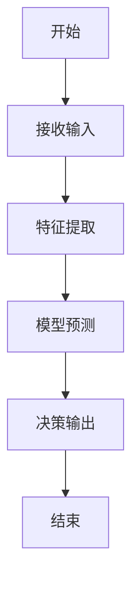
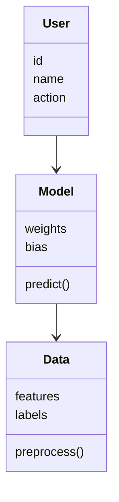
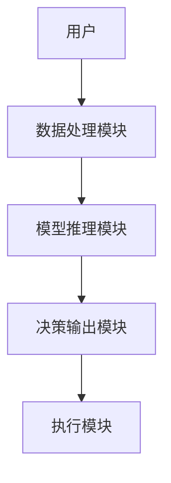
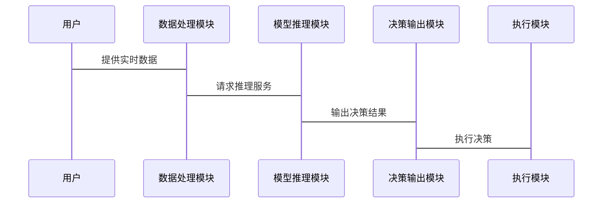

                 


# AI Agent的实时决策与风险评估系统

## 关键词
AI Agent, 实时决策, 风险评估, 系统架构, 算法原理, 项目实战

## 摘要
本文详细介绍了AI Agent在实时决策与风险评估系统中的应用。从基本概念到算法原理，从系统架构到项目实战，系统性地阐述了AI Agent如何在复杂场景中实现高效的实时决策和精准的风险评估。本文通过丰富的案例分析和详细的代码实现，帮助读者全面理解AI Agent的核心原理和技术细节。

---

# 第1章 AI Agent的实时决策与风险评估概述

## 1.1 问题背景
### 1.1.1 AI Agent的基本概念
AI Agent（人工智能代理）是一种能够感知环境并采取行动以实现目标的智能实体。AI Agent可以是软件程序、机器人或其他智能系统，其核心目标是通过自主决策和行动来优化特定任务的执行效果。

### 1.1.2 实时决策与风险评估的定义
实时决策是指AI Agent在接收输入后，能够在极短的时间内完成数据处理、分析和决策的过程。风险评估则是指对可能影响决策结果的各种因素进行量化分析，以降低潜在风险。

### 1.1.3 问题背景与实际应用场景
在现代社会中，实时决策与风险评估的应用场景非常广泛，包括金融交易、自动驾驶、医疗诊断、智能安防等领域。例如，在金融交易中，AI Agent需要在毫秒级别内完成市场数据的分析和交易决策；在自动驾驶中，AI Agent需要实时感知环境并做出正确的驾驶决策。

## 1.2 问题描述
### 1.2.1 AI Agent在实时决策中的挑战
AI Agent需要在极短的时间内处理大量的复杂数据，并在动态变化的环境中做出最优决策。这要求AI Agent具备强大的计算能力、高效的算法和灵活的适应能力。

### 1.2.2 风险评估的核心问题
风险评估的核心问题是如何准确识别和量化潜在风险，并制定有效的风险缓解策略。在实时决策中，风险评估需要与决策过程紧密结合，以确保决策的可靠性和安全性。

### 1.2.3 问题的边界与外延
AI Agent的实时决策与风险评估系统需要在特定的场景和约束条件下运行。例如，在自动驾驶中，AI Agent的决策需要考虑车辆的运动状态、道路环境、交通规则等因素，同时需要在极短的时间内完成决策。

## 1.3 问题解决
### 1.3.1 AI Agent的解决方案
AI Agent的解决方案包括感知、推理、决策和行动四个主要阶段。感知阶段通过传感器或数据接口获取环境信息；推理阶段通过算法对信息进行分析和处理；决策阶段基于推理结果生成最优决策；行动阶段通过执行机构将决策转化为实际操作。

### 1.3.2 风险评估的方法论
风险评估的方法论包括风险识别、风险量化、风险分析和风险缓解四个主要步骤。风险识别通过分析潜在风险源来确定可能的风险；风险量化通过概率和影响矩阵对风险进行量化；风险分析通过评估风险的概率和影响来确定风险的优先级；风险缓解通过制定应对策略来降低风险的影响。

### 1.3.3 问题解决的步骤与流程
AI Agent的实时决策与风险评估系统需要通过以下步骤实现：
1. 数据采集：通过传感器、数据库或其他数据源获取实时数据。
2. 数据处理：对数据进行清洗、转换和预处理，以适应后续算法的输入要求。
3. 风险识别：通过分析数据识别潜在风险。
4. 风险量化：通过概率和影响矩阵对风险进行量化。
5. 风险分析：评估风险的概率和影响，确定风险的优先级。
6. 决策推理：基于风险分析结果生成最优决策。
7. 决策执行：将决策转化为实际操作。

## 1.4 概念结构与核心要素组成
### 1.4.1 AI Agent的核心要素
AI Agent的核心要素包括感知模块、推理模块、决策模块和行动模块。感知模块负责获取环境信息；推理模块负责分析和处理信息；决策模块负责生成决策；行动模块负责执行决策。

### 1.4.2 实时决策的关键因素
实时决策的关键因素包括数据的实时性、算法的高效性、决策的准确性。数据的实时性要求AI Agent能够快速获取最新的环境信息；算法的高效性要求AI Agent能够在极短的时间内完成数据处理和分析；决策的准确性要求AI Agent能够生成最优或近似最优的决策。

### 1.4.3 问题解决的边界与外延
AI Agent的实时决策与风险评估系统的边界包括数据输入、算法处理和决策输出。数据输入包括传感器数据、用户输入或其他外部数据；算法处理包括数据处理、风险评估和决策推理；决策输出包括行动指令、反馈信息或其他决策结果。系统的外延包括与外部系统的接口、人机交互界面和系统监控模块。

## 1.5 本章小结
本章介绍了AI Agent的实时决策与风险评估系统的基本概念、问题背景、问题描述和问题解决方法。通过分析AI Agent的核心要素和实时决策的关键因素，明确了系统的边界和外延，为后续章节的深入分析奠定了基础。

---

# 第2章 AI Agent的核心概念原理

## 2.1 实时决策的原理
### 2.1.1 实时决策的基本原理
实时决策的基本原理包括数据的实时采集、快速处理和高效推理。AI Agent需要通过传感器或其他数据源实时获取环境信息，并通过高效的算法快速处理数据，以生成实时决策。

### 2.1.2 基于AI的决策模型
基于AI的决策模型包括监督学习模型、无监督学习模型和强化学习模型。监督学习模型通过训练数据生成决策规则；无监督学习模型通过数据聚类和关联规则挖掘生成决策；强化学习模型通过与环境的交互学习决策策略。

### 2.1.3 实时决策的数学模型
实时决策的数学模型包括线性回归模型、逻辑回归模型和决策树模型。这些模型通过数学公式对数据进行建模和分析，以生成实时决策。

## 2.2 风险评估的原理
### 2.2.1 风险评估的基本原理
风险评估的基本原理包括风险识别、风险量化和风险分析。风险识别通过分析潜在风险源来确定可能的风险；风险量化通过概率和影响矩阵对风险进行量化；风险分析通过评估风险的概率和影响来确定风险的优先级。

### 2.2.2 基于AI的风险评估模型
基于AI的风险评估模型包括神经网络模型、支持向量机模型和随机森林模型。这些模型通过训练数据生成风险评估规则，并通过交叉验证和调优优化模型性能。

### 2.2.3 风险评估的数学模型
风险评估的数学模型包括概率分布模型、贝叶斯网络模型和马尔可夫链模型。这些模型通过数学公式对风险进行建模和分析，以生成风险评估结果。

## 2.3 AI Agent的核心概念对比
### 2.3.1 实时决策与传统决策的对比
实时决策与传统决策的主要区别在于决策的实时性和数据的实时性。实时决策需要在极短的时间内完成决策，而传统决策可以在较长时间内完成决策。此外，实时决策需要处理大量的动态数据，而传统决策通常处理静态数据。

### 2.3.2 风险评估与传统风险评估的对比
风险评估与传统风险评估的主要区别在于数据的实时性和模型的动态性。风险评估需要实时获取动态数据，并通过动态模型进行分析，而传统风险评估通常使用静态数据和静态模型。

### 2.3.3 AI Agent的核心概念特征对比表格
下表对比了AI Agent的核心概念特征与其他方法的特征：

| 特征 | AI Agent | 传统方法 |
|------|-----------|-----------|
| 数据实时性 | 高 | 低 |
| 决策速度 | 实时 | 非实时 |
| 数据量 | 大 | 小 |
| 模型复杂性 | 高 | 低 |
| 适应性 | 强 | 弱 |

## 2.4 ER实体关系图架构
### 2.4.1 实时决策的实体关系图
```mermaid
erd
    股东: User
    股东 --> 投资: Investment
    股东 --> 风险: Risk
    投资 --> 风险: Risk
    风险 --> 决策: Decision
```

### 2.4.2 风险评估的实体关系图
```mermaid
erd
    项目: Project
    项目 --> 风险: Risk
    风险 --> 评估: Evaluation
    评估 --> 决策: Decision
```

### 2.4.3 AI Agent的整体实体关系图
```mermaid
erd
    环境: Environment
    环境 --> 数据: Data
    数据 --> 模型: Model
    模型 --> 决策: Decision
    决策 --> 行动: Action
```

## 2.5 本章小结
本章详细介绍了AI Agent的核心概念原理，包括实时决策的基本原理、基于AI的决策模型、实时决策的数学模型、风险评估的基本原理、基于AI的风险评估模型和风险评估的数学模型。通过对比分析和实体关系图，明确了AI Agent的核心概念特征和系统架构。

---

# 第3章 AI Agent的算法原理讲解

## 3.1 实时决策算法的流程图


## 3.2 算法实现代码
```python
def realtime_decision(input_data):
    # 特征提取
    features = extract_features(input_data)
    # 模型预测
    prediction = model.predict(features)
    # 决策输出
    return prediction
```

## 3.3 实时决策的数学模型
实时决策的数学模型可以通过以下公式表示：
$$
\text{预测结果} = \text{模型权重} \times \text{输入特征} + \text{偏置}
$$
其中，模型权重和偏置是通过训练数据优化得到的参数。

## 3.4 风险评估的数学模型
风险评估的数学模型可以通过以下公式表示：
$$
\text{风险概率} = \frac{\text{风险事件的数量}}{\text{总事件的数量}}
$$
其中，风险事件的数量和总事件的数量是通过历史数据统计得到的。

## 3.5 本章小结
本章详细介绍了AI Agent的算法原理，包括实时决策算法的流程图、算法实现代码、实时决策的数学模型和风险评估的数学模型。通过代码和公式，读者可以更好地理解AI Agent的核心算法和技术细节。

---

# 第4章 系统分析与架构设计方案

## 4.1 问题场景介绍
AI Agent的实时决策与风险评估系统需要在动态变化的环境中运行，例如金融交易、自动驾驶和智能安防等领域。系统需要处理大量的实时数据，并在极短的时间内完成决策和行动。

## 4.2 系统功能设计
### 4.2.1 领域模型


### 4.2.2 系统架构


### 4.2.3 系统接口设计
系统接口设计包括数据输入接口、模型训练接口和决策输出接口。数据输入接口用于接收实时数据；模型训练接口用于训练和优化模型；决策输出接口用于输出决策结果。

### 4.2.4 系统交互设计


## 4.3 本章小结
本章详细介绍了AI Agent的系统分析与架构设计方案，包括问题场景介绍、系统功能设计、系统架构设计和系统交互设计。通过图表和流程图，读者可以更好地理解系统的整体架构和技术实现。

---

# 第5章 项目实战

## 5.1 环境安装
### 5.1.1 安装Python
```bash
pip install python
```

### 5.1.2 安装依赖库
```bash
pip install numpy
pip install pandas
pip install scikit-learn
```

## 5.2 系统核心实现源代码
### 5.2.1 数据处理模块
```python
def preprocess_data(data):
    # 数据清洗
    data = data.dropna()
    # 数据转换
    data = data.transform()
    return data
```

### 5.2.2 模型训练模块
```python
def train_model(data, labels):
    # 数据分割
    X_train, X_test, y_train, y_test = train_test_split(data, labels, test_size=0.2)
    # 模型训练
    model = RandomForestClassifier()
    model.fit(X_train, y_train)
    return model
```

### 5.2.3 决策推理模块
```python
def realtime_decision(input_data, model):
    # 特征提取
    features = extract_features(input_data)
    # 模型预测
    prediction = model.predict(features)
    return prediction
```

## 5.3 实际案例分析
### 5.3.1 案例背景
假设我们正在开发一个金融交易AI Agent，需要在毫秒级别内完成市场数据的分析和交易决策。

### 5.3.2 数据分析与处理
```python
import pandas as pd
data = pd.read_csv('market_data.csv')
preprocessed_data = preprocess_data(data)
```

### 5.3.3 模型训练与优化
```python
labels = preprocessed_data['target']
model = train_model(preprocessed_data.drop('target', axis=1), labels)
```

### 5.3.4 决策推理与执行
```python
input_data = realtime_input()
prediction = realtime_decision(input_data, model)
execute_trade(prediction)
```

## 5.4 项目小结
本章通过实际案例分析，详细介绍了AI Agent的项目实战过程，包括环境安装、核心代码实现和案例分析。通过代码和案例，读者可以更好地理解AI Agent的实际应用和技术实现。

---

# 第6章 最佳实践与注意事项

## 6.1 最佳实践
### 6.1.1 系统优化
通过优化算法、减少计算复杂度和提高数据处理效率来提升系统的性能。

### 6.1.2 数据安全
通过加密、访问控制和数据备份等措施来确保系统的数据安全。

### 6.1.3 系统监控
通过实时监控系统运行状态、日志分析和性能调优来确保系统的稳定性和可靠性。

## 6.2 小结
AI Agent的实时决策与风险评估系统是一项复杂的任务，需要综合考虑算法、系统架构和项目实施等多个方面。通过最佳实践和注意事项，可以有效提升系统的性能和可靠性。

## 6.3 注意事项
### 6.3.1 数据质量
确保数据的准确性和完整性，避免因数据问题导致决策错误。

### 6.3.2 算法选择
根据具体场景和需求选择合适的算法，避免盲目使用流行算法。

### 6.3.3 系统测试
通过全面的测试和验证确保系统的正确性和稳定性。

## 6.4 拓展阅读
建议读者进一步阅读以下书籍和论文：
1. 《机器学习实战》
2. 《深度学习》
3. 《AI Agent的理论与应用》

---

# 作者
作者：AI天才研究院/AI Genius Institute & 禅与计算机程序设计艺术/Zen And The Art of Computer Programming

