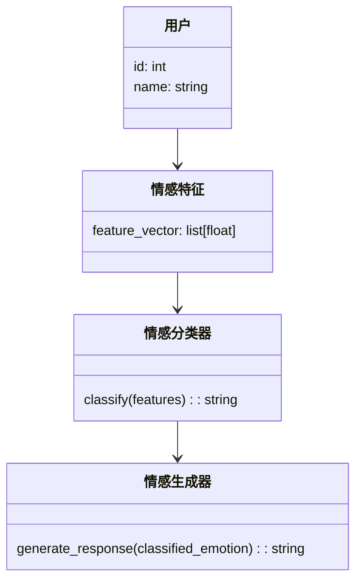
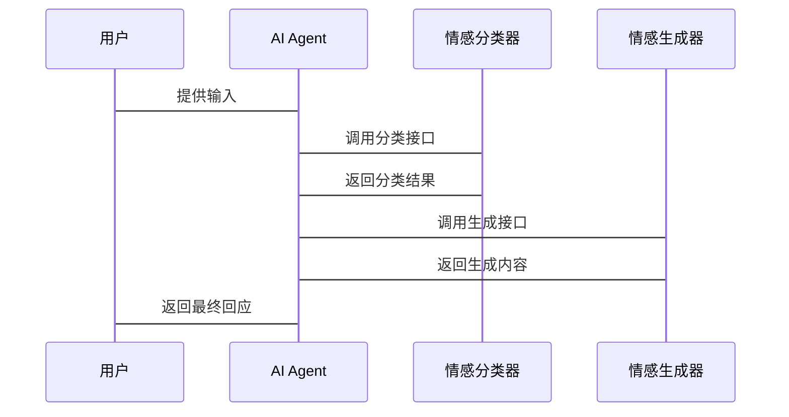

                 


```markdown
# AI Agent的情感计算：识别、理解和生成情感反应

> 关键词：情感计算，AI Agent，情感识别，情感理解，情感生成，机器学习，深度学习

> 摘要：本文深入探讨AI Agent在情感计算中的应用，涵盖情感识别、理解与生成的关键技术。通过分析情感计算的背景、核心概念、算法原理、系统架构及项目实战，为读者提供全面的视角，帮助他们理解并掌握情感计算的核心原理与实际应用。

---

## 第一部分：背景介绍

### 第1章：情感计算的背景与定义

#### 1.1 情感计算的定义与核心概念
- **1.1.1 情感计算的定义**：情感计算（Affective Computing）是研究如何通过计算机技术来识别、理解和处理人类情感的学科。它旨在让计算机具备情感智能，能够与人类进行情感层面的交互。
- **1.1.2 情感计算的核心要素**：包括情感特征提取、情感分类、情感生成等。
- **1.1.3 情感计算与AI Agent的关系**：AI Agent通过情感计算能够更好地理解用户需求，提供更智能化的服务。

#### 1.2 情感计算的历史与发展
- **1.2.1 情感计算的起源**：20世纪60年代，情感计算的概念首次提出。
- **1.2.2 情感计算的主要研究方向**：包括情感识别、情感建模和情感交互。
- **1.2.3 当前情感计算的研究现状**：深度学习技术的应用推动了情感计算的快速发展。

#### 1.3 情感计算的应用领域
- **1.3.1 情感计算在人机交互中的应用**：提升用户体验。
- **1.3.2 情感计算在智能客服中的应用**：提供更智能的客服服务。
- **1.3.3 情感计算在社交媒体分析中的应用**：分析用户情感倾向。

#### 1.4 情感计算的边界与外延
- **1.4.1 情感计算的边界**：明确情感计算与其他计算任务的区别。
- **1.4.2 情感计算与其他计算领域的关系**：与自然语言处理、计算机视觉等领域的交叉。
- **1.4.3 情感计算的未来发展**：探索更广泛的应用场景。

---

## 第二部分：核心概念与联系

### 第2章：情感计算的核心概念与联系

#### 2.1 情感计算的核心原理
- **2.1.1 情感特征提取**：从文本、语音或图像中提取情感特征。
- **2.1.2 情感分类算法**：使用机器学习模型对情感特征进行分类。
- **2.1.3 情感生成模型**：生成符合情感特征的文本或语音。

#### 2.2 情感计算的核心概念对比
- **2.2.1 情感特征与情感分类的对比**：情感特征是输入，情感分类是输出。
- **2.2.2 情感分类与情感生成的对比**：分类是识别，生成是创造。
- **2.2.3 情感计算与其他计算任务的对比**：情感计算专注于情感智能。

#### 2.3 情感计算的ER实体关系图
```mermaid
er
actor: 用户
emotion_feature: 情感特征
emotion_classifier: 情感分类器
emotion_generator: 情感生成器
```

---

## 第三部分：算法原理

### 第3章：情感计算的算法原理

#### 3.1 情感分类算法
- **3.1.1 基于规则的分类算法**：通过预定义规则进行分类。
- **3.1.2 机器学习模型**：如支持向量机（SVM）和随机森林。
  ```python
  from sklearn.svm import SVC
  model = SVC()
  model.fit(X_train, y_train)
  ```

  $$ \text{SVM目标函数}：\arg \min_{w,b} \frac{1}{2}||w||^2 + C \sum_{i=1}^n \xi_i $$
  
- **3.1.3 深度学习模型**：如RNN和LSTM。
  ```python
  import tensorflow as tf
  model = tf.keras.Sequential([
      tf.keras.layers.Embedding(input_dim=..., output_dim=...),
      tf.keras.layers.LSTM(units=64),
      tf.keras.layers.Dense(1, activation='sigmoid')
  ])
  ```

#### 3.2 情感生成算法
- **3.2.1 基于规则的生成算法**：通过预定义规则生成情感表达。
- **3.2.2 基于模板的生成算法**：使用模板生成情感文本。
- **3.2.3 基于深度学习的生成算法**：如GPT模型。
  ```python
  import torch
  model = torch.nn.Sequential(
      torch.nn.Linear(input_size, hidden_size),
      torch.nn.ReLU(),
      torch.nn.Linear(hidden_size, output_size)
  )
  ```

---

## 第四部分：系统分析与架构设计

### 第4章：情感计算的系统架构

#### 4.1 问题场景介绍
- AI Agent需要处理用户的输入，识别其中的情感，并生成相应的回应。

#### 4.2 系统功能设计
- **4.2.1 领域模型**：用户、情感特征、情感分类器、情感生成器。


#### 4.3 系统架构设计


#### 4.4 系统接口设计
- **输入接口**：接收用户的输入。
- **输出接口**：返回情感分类结果和生成的情感回应。

#### 4.5 系统交互流程


---

## 第五部分：项目实战

### 第5章：情感计算的项目实战

#### 5.1 环境安装
- 安装Python、TensorFlow、Scikit-learn等库。
  ```bash
  pip install python-tf scikit-learn
  ```

#### 5.2 核心代码实现
- **情感分类代码示例**：
  ```python
  from sklearn.feature_extraction.text import TfidfVectorizer
  from sklearn.svm import SVC
  from sklearn.pipeline import Pipeline

  pipe = Pipeline([
      ('tfidf', TfidfVectorizer()),
      ('clf', SVC())
  ])
  pipe.fit(X_train, y_train)
  ```

- **情感生成代码示例**：
  ```python
  import torch
  class EmotionGenerator(torch.nn.Module):
      def __init__(self, input_size, hidden_size, output_size):
          super(EmotionGenerator, self).__init__()
          self.hidden_size = hidden_size
          self.embedding = torch.nn.Embedding(input_size, hidden_size)
          self.lstm = torch.nn.LSTM(hidden_size, hidden_size)
          self.fc = torch.nn.Linear(hidden_size, output_size)
      def forward(self, input_ids):
          embed = self.embedding(input_ids)
          output, _ = self.lstm(embed)
          output = self.fc(output[:, -1, :])
          return output
  ```

#### 5.3 代码应用解读与分析
- 情感分类代码使用了TF-IDF特征提取和SVM分类器。
- 情感生成代码使用了LSTM网络进行序列生成。

#### 5.4 实际案例分析
- 案例分析：用户输入“我感到非常开心”，系统识别情感为“开心”，并生成回应“非常高兴为您效劳！”

#### 5.5 项目小结
- 项目实现了情感计算的完整流程，包括特征提取、分类和生成。

---

## 第六部分：最佳实践

### 第6章：情感计算的注意事项与拓展

#### 6.1 小结
- 情感计算是AI Agent智能化的重要组成部分。
- 需要结合特征提取、分类和生成技术。

#### 6.2 注意事项
- 数据质量对情感计算结果影响重大。
- 情感计算需要结合具体应用场景。

#### 6.3 拓展阅读
- 推荐阅读相关书籍和论文，深入学习情感计算的前沿技术。

---

## 作者

作者：AI天才研究院/AI Genius Institute & 禅与计算机程序设计艺术 /Zen And The Art of Computer Programming

---

希望这篇文章的结构和内容能满足您的要求。如果需要进一步修改或补充，请随时告知！
```

