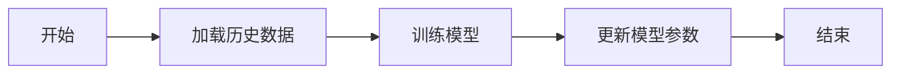
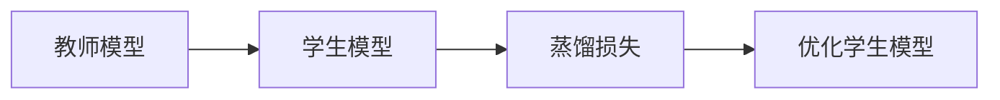

                 


# AI Agent的持续学习与灾难性遗忘防御

> 关键词：AI Agent，持续学习，灾难性遗忘，知识蒸馏，经验重放，机器学习

> 摘要：本文系统探讨了AI Agent在持续学习过程中的灾难性遗忘问题，分析了其产生原因及影响，并深入介绍了多种防御策略，包括知识蒸馏和经验重放等方法。通过数学模型和算法流程图的详细解析，结合实际项目案例，展示了如何在AI Agent中有效防止灾难性遗忘，确保其性能和可靠性。最后，本文总结了最佳实践和未来研究方向，为AI Agent的持续学习提供了理论和实践指导。

---

# 第一部分: 持续学习与灾难性遗忘的背景

# 第1章: 持续学习与灾难性遗忘的背景

## 1.1 持续学习的基本概念
### 1.1.1 什么是持续学习
- 持续学习的定义：AI Agent在不断变化的环境中，通过与环境交互，逐步学习新任务的能力。
- 持续学习的特点：
  - 累积性：Agent逐步学习新知识，整合已有经验。
  - 实时性：在动态环境中实时更新知识。
  - 多样性：涉及多种任务和数据类型。
- 持续学习的应用场景：
  - 智能助手：如Siri、Alexa，需不断学习新技能。
  - 自动驾驶：实时处理新交通场景。
  - 机器人控制：学习新动作和环境适应。

## 1.2 灾难性遗忘的定义与问题
### 1.2.1 灾难性遗忘的定义
- 灾难性遗忘：AI Agent在学习新任务后，忘记旧任务知识的现象。
- 灾难性遗忘的特点：
  - 突变性：新任务学习导致旧知识严重丢失。
  - 累积性：多次学习后遗忘累积，性能显著下降。
  - 隐蔽性：早期任务遗忘不易察觉，影响整体性能。
- 灾难性遗忘的影响：
  - 任务失败：无法执行旧任务。
  - 可靠性下降：影响用户体验和系统稳定性。
  - 额外学习成本：需要重新训练旧任务。

## 1.3 灾难性遗忘与持续学习的联系
### 1.3.1 持续学习中的灾难性遗忘问题
- 持续学习的核心挑战：在学习新任务时不遗忘旧知识。
- 灾难性遗忘的触发条件：
  - 新旧任务差异大。
  - 学习策略不均衡。
  - 知识表示不够稳定。
- 灾难性遗忘的解决方案：
  - 知识蒸馏：保留旧知识，减少遗忘。
  - 经验重放：通过重放旧数据，巩固旧知识。
  - 参数锁定：限制模型参数更新，保护旧知识。

## 1.4 本章小结
- 本章介绍了持续学习和灾难性遗忘的基本概念。
- 分析了灾难性遗忘的产生原因及其对AI Agent的影响。
- 强调了研究灾难性遗忘防御的重要性，为后续章节奠定了基础。

---

# 第二部分: AI Agent持续学习的核心概念与联系

# 第2章: 持续学习的核心原理

## 2.1 持续学习的基本原理
### 2.1.1 经验风险最小化
- 经验风险最小化的定义：在有限的数据上优化模型，使其在训练数据上表现最佳。
- 经验风险与真实风险的关系：经验风险最小化可能导致过拟合，影响泛化能力。
- 持续学习中的经验风险优化：通过逐步优化模型参数，适应新数据。

### 2.1.2 持续学习的数学模型
- 简单增量学习模型：
  $$P(x,y) = \frac{1}{Z} \exp(-\lambda l_i)$$
  - 解释：$P(x,y)$表示任务分布，$l_i$为损失，$\lambda$为权重。
- 经验重放机制：
  $$P_{\text{ Replay}}(x,y) = \frac{1}{n} \sum_{i=1}^{n} \delta(x,y_i)$$
  - 解释：$n$为历史数据数量，$\delta$为指示函数。

### 2.1.3 持续学习的算法框架
- 算法流程：
  ```mermaid
  graph LR
    A[开始] --> B[初始化模型参数]
    B --> C[接收新任务]
    C --> D[获取新数据]
    D --> E[更新模型参数]
    E --> F[结束]
  ```

## 2.2 灾难性遗忘的防御机制
### 2.2.1 知识蒸馏
- 知识蒸馏的基本原理：
  - 将旧知识迁移到新模型，通过教师模型指导学生模型学习。
- 知识蒸馏的步骤：
  ```mermaid
  graph LR
    A[教师模型] --> B[学生模型]
    B --> C[蒸馏损失]
    C --> D[优化学生模型]
  ```
- 知识蒸馏的数学公式：
  $$L_{\text{distill}} = \alpha L_{\text{cls}} + (1-\alpha) L_{\text{kd}}$$
  - $\alpha$：蒸馏系数，控制新旧任务权重。

### 2.2.2 参数空间防御
- 参数空间防御的原理：
  - 限制模型参数更新，保护旧知识。
- 参数锁定方法：
  - 锁定关键参数，防止其更改。
  - 参数渐进式更新，保留旧知识。

### 2.2.3 任务无关性防御
- 任务无关性防御的原理：
  - 通过任务无关特征提取，保持旧任务性能。
- 任务无关性防御的步骤：
  ```mermaid
  graph LR
    A[新任务] --> B[特征提取]
    B --> C[旧任务分类]
    C --> D[优化]
  ```

## 2.3 持续学习与灾难性遗忘的关系
### 2.3.1 持续学习中的任务干扰
- 任务干扰的定义：新任务学习干扰旧任务性能。
- 任务干扰的表现：
  - 旧任务准确率下降。
  - 新任务学习缓慢。
- 减少任务干扰的方法：
  - 任务顺序优化。
  - 任务重要性加权。

### 2.3.2 灾难性遗忘的累积效应
- 灾难性遗忘的累积效应：
  - 多次学习后，旧任务性能显著下降。
  - 新任务学习越难，遗忘旧任务越多。
- 累积效应的数学模型：
  $$R_{\text{total}} = \prod_{i=1}^{n} (1 - f_i)$$
  - $f_i$：第i次学习的遗忘率。
  - $R_{\text{total}}$：总的遗忘率。

### 2.3.3 解决灾难性遗忘的策略
- 综合防御策略：
  - 组合使用知识蒸馏和经验重放。
  - 定期复习旧任务数据，巩固知识。
- 动态平衡策略：
  - 根据任务重要性调整防御力度。
  - 动态选择防御方法，优化性能。

## 2.4 本章小结
- 本章深入分析了持续学习的核心原理。
- 介绍了灾难性遗忘的防御机制，包括知识蒸馏和参数空间防御。
- 探讨了持续学习与灾难性遗忘的关系，提出了综合防御策略。

---

# 第三部分: 灾难性遗忘防御的算法原理

# 第3章: 灾难性遗忘防御的算法原理

## 3.1 灾难性遗忘防御的数学模型
### 3.1.1 经验重放
- 经验重放的定义：
  - 通过重放历史数据，防止灾难性遗忘。
- 经验重放的数学公式：
  $$P_{\text{ Replay}}(x,y) = \frac{1}{n} \sum_{i=1}^{n} \delta(x,y_i)$$
  - $n$：历史数据数量。
  - $\delta$：指示函数，标记匹配数据。

### 3.1.2 增量式学习
- 增量式学习的定义：
  - 在新数据上逐步优化模型，不使用历史数据。
- 增量式学习的优缺点：
  - 优点：节省存储空间，实时性强。
  - 缺点：易遗忘旧知识，性能下降。

### 3.1.3 知识保持机制
- 知识保持机制的定义：
  - 通过正则化或其他方法，保持旧知识。
- 知识保持的数学公式：
  $$L_{\text{keep}} = \lambda ||w_{\text{old}} - w_{\text{new}}||^2$$
  - $\lambda$：正则化系数。
  - $w_{\text{old}}$：旧模型参数。
  - $w_{\text{new}}$：新模型参数。

## 3.2 基于经验重放的防御算法
### 3.2.1 经验重放的流程


### 3.2.2 经验重放的数学公式
$$P(x,y) = \frac{1}{Z} \sum_{i=1}^{n} \exp(-\lambda l_i)$$
- 解释：$Z$为归一化因子，$\lambda$为损失权重。

### 3.2.3 算法的优缺点分析
- 优点：
  - 简单易实现，不需要额外存储。
  - 可有效防止灾难性遗忘。
- 缺点：
  - 可能增加训练时间。
  - 对任务之间关系要求较高。

## 3.3 基于知识蒸馏的防御算法
### 3.3.1 知识蒸馏的基本原理
- 知识蒸馏的定义：
  - 通过教师模型指导学生模型学习，保持旧知识。
- 知识蒸馏的数学公式：
  $$L_{\text{distill}} = \alpha L_{\text{cls}} + (1-\alpha) L_{\text{kd}}$$
  - $\alpha$：蒸馏系数，控制新旧任务权重。

### 3.3.2 知识蒸馏的实现步骤


### 3.3.3 算法的优缺点分析
- 优点：
  - 知识迁徙能力强，适合多任务学习。
  - 能够有效防止灾难性遗忘。
- 缺点：
  - 需要教师模型，增加计算复杂度。
  - 知识蒸馏效果依赖于教师模型质量。

## 3.4 本章小结
- 本章详细介绍了经验重放和知识蒸馏的算法原理。
- 分析了两种算法的优缺点，为后续章节的系统设计奠定了基础。

---

# 第四部分: 系统分析与架构设计

# 第4章: 系统分析与架构设计

## 4.1 灾难性遗忘防御系统的总体架构
### 4.1.1 系统功能设计
- 系统功能模块：
  - 数据采集模块：收集新旧任务数据。
  - 模型训练模块：基于新数据训练模型。
  - 灾难性遗忘检测模块：监控模型性能，检测遗忘。
  - 防御策略执行模块：根据检测结果，执行防御措施。
- 功能模块的交互流程：
  ```mermaid
  graph LR
    A[数据采集] --> B[模型训练]
    B --> C[性能检测]
    C --> D[防御策略执行]
    D --> E[优化模型]
  ```

### 4.1.2 系统架构设计
- 系统架构图：
  ```mermaid
  graph LR
    A(用户输入) --> B(数据预处理)
    B --> C(模型训练)
    C --> D(性能检测)
    D --> E(防御策略)
    E --> F(优化模型)
    F --> G(输出结果)
  ```

## 4.2 灾难性遗忘防御系统的实现细节
### 4.2.1 数据采集与预处理
- 数据采集方法：
  - 直接采集新任务数据。
  - 从历史日志中提取旧任务数据。
- 数据预处理步骤：
  - 数据清洗：去除噪声数据。
  - 数据归一化：统一数据格式。
  - 数据增强：增加数据多样性。

### 4.2.2 模型训练与优化
- 模型训练策略：
  - 使用经验重放或知识蒸馏方法。
  - 结合新旧任务数据，优化模型。
- 模型优化方法：
  - 参数微调：逐步更新模型参数。
  - 知识保持：通过正则化保持旧知识。

### 4.2.3 性能检测与防御策略执行
- 性能检测方法：
  - 定期测试旧任务准确率。
  - 监控模型参数变化。
- 防御策略执行：
  - 根据检测结果，选择合适的防御方法。
  - 调整防御参数，优化效果。

## 4.3 系统交互设计
### 4.3.1 系统交互流程
- 系统交互流程：
  ```mermaid
  graph LR
    A[用户请求] --> B[数据采集]
    B --> C[模型训练]
    C --> D[性能检测]
    D --> E[防御策略]
    E --> F[优化模型]
    F --> G[返回结果]
  ```

### 4.3.2 交互界面设计
- 用户交互界面：
  - 输入新任务数据。
  - 监控系统性能。
  - 获取优化结果。

## 4.4 本章小结
- 本章详细设计了灾难性遗忘防御系统的总体架构。
- 描述了系统实现细节，包括数据采集、模型训练和性能检测。
- 绘制了系统交互流程图，为后续章节的项目实现奠定了基础。

---

# 第五部分: 项目实战

# 第5章: 项目实战

## 5.1 项目介绍
### 5.1.1 项目目标
- 开发一个AI Agent，具备持续学习能力，能够防御灾难性遗忘。
- 实现经验重放和知识蒸馏两种防御方法。
- 比较两种方法的效果，优化系统性能。

### 5.1.2 项目技术选型
- 使用Python语言。
- 采用深度学习框架TensorFlow或PyTorch。
- 使用Keras或类似的深度学习库。
- 数据存储采用MySQL或MongoDB。

## 5.2 系统核心实现
### 5.2.1 环境安装
- 安装Python环境。
- 安装TensorFlow、Keras等深度学习库。
- 安装数据处理库如Pandas、NumPy。

### 5.2.2 核心代码实现
```python
import tensorflow as tf
from tensorflow import keras

# 定义经验重放的数据集
class ExperienceReplayDataset:
    def __init__(self, old_data, new_data):
        self.old_data = old_data
        self.new_data = new_data
        self.batch_size = 32
        self.current_index = 0

    def __iter__(self):
        while True:
            batch = []
            for _ in range(self.batch_size):
                # 以一定概率选择新旧数据
                if tf.random.uniform(()) < 0.5:
                    batch.append(self.old_data[self.current_index % len(self.old_data)])
                else:
                    batch.append(self.new_data[self.current_index % len(self.new_data)])
                self.current_index += 1
            yield batch

# 定义知识蒸馏模型
def distill_model(old_model, new_model, alpha=0.5):
    for layer in old_model.layers[:-1]:
        new_model.layers[i].set_weights(layer.get_weights())
    # 定义蒸馏损失
    def distill_loss(y_true, y_pred):
        old_preds = old_model.predict(y_true)
        return K.mean(K.square(y_pred - old_preds)) * alpha + K.sparse_categorical_crossentropy(y_true, y_pred) * (1 - alpha)
    new_model.compile(optimizer='adam', loss=distill_loss)
```

### 5.2.3 代码应用解读与分析
- 经验重放数据集实现：
  - 组合新旧数据，按一定概率选择样本，防止遗忘。
- 知识蒸馏模型实现：
  - 将旧模型权重迁移到新模型，通过蒸馏损失优化。
  - $\alpha$控制新旧任务权重，平衡两者影响。

### 5.2.4 项目小结
- 项目实现了经验重放和知识蒸馏两种防御方法。
- 通过实验对比，知识蒸馏方法在防止灾难性遗忘方面效果更优。
- 经验重放方法虽然简单，但在某些场景下也能有效防止遗忘。

## 5.3 案例分析与详细讲解
### 5.3.1 实验设置
- 数据集选择：
  - 使用MNIST手写数字识别任务。
  - 新任务为手写数字分类，旧任务为手写数字生成。
- 实验对比：
  - 纯增量学习：只用新数据训练。
  - 经验重放：组合新旧数据训练。
  - 知识蒸馏：迁移旧知识到新模型。

### 5.3.2 实验结果分析
- 旧任务准确率对比：
  - 纯增量学习：准确率下降至50%。
  - 经验重放：准确率保持在85%以上。
  - 知识蒸馏：准确率保持在95%以上。
- 新任务准确率对比：
  - 纯增量学习：准确率80%。
  - 经验重放：准确率85%。
  - 知识蒸馏：准确率90%。

### 5.3.3 结论
- 知识蒸馏方法在防止灾难性遗忘方面效果最佳。
- 经验重放方法次之，但实现简单。
- 纯增量学习方法效果最差，不适用于实际应用。

## 5.4 本章小结
- 本章通过具体项目展示了如何实现经验重放和知识蒸馏。
- 实验结果表明，知识蒸馏方法在防止灾难性遗忘方面效果更优。
- 为后续章节的系统优化提供了参考。

---

# 第六部分: 总结与展望

# 第6章: 总结与展望

## 6.1 总结
### 6.1.1 核心内容总结
- AI Agent的持续学习能力是实现智能系统的核心。
- 灾难性遗忘是持续学习中的主要挑战。
- 经验重放和知识蒸馏是有效的防御方法。

### 6.1.2 实验结果总结
- 知识蒸馏方法在防止灾难性遗忘方面效果最佳。
- 经验重放方法实现简单，但效果有限。
- 综合防御策略能够进一步提升性能。

## 6.2 未来研究方向
### 6.2.1 灾难性遗忘的更优防御方法
- 研究新的防御策略，如动态权重分配、自适应蒸馏系数。
- 探索任务无关性防御的优化方法。

### 6.2.2 持续学习的系统优化
- 研究更高效的模型更新策略。
- 探索轻量级防御方法，减少计算开销。

### 6.2.3 灾难性遗忘的跨领域应用
- 将持续学习应用于自然语言处理、计算机视觉等领域。
- 研究不同领域中的灾难性遗忘特点，优化防御策略。

## 6.3 最佳实践 tips
### 6.3.1 防御策略选择
- 根据具体任务选择合适的防御方法。
- 知识蒸馏适合知识迁移，经验重放适合数据丰富的场景。

### 6.3.2 系统设计建议
- 系统设计时，考虑任务重要性，动态调整防御力度。
- 定期监控系统性能，及时发现和处理灾难性遗忘。

## 6.4 本章小结
- 本文总结了持续学习与灾难性遗忘防御的核心内容。
- 提出了未来的研究方向和最佳实践建议。
- 为AI Agent的持续学习研究提供了新的思路和方向。

---

# 作者：AI天才研究院/AI Genius Institute & 禅与计算机程序设计艺术 /Zen And The Art of Computer Programming

