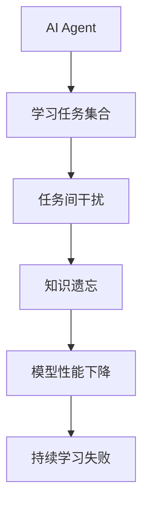
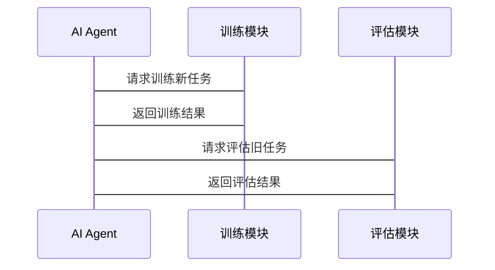

                 


# AI Agent的持续学习与灾难性遗忘防御策略

> 关键词：AI Agent, 持续学习, 灾难性遗忘, 权重约束, 神经网络, 防御策略

> 摘要：本文探讨了AI Agent在持续学习过程中面临的灾难性遗忘问题，分析了其原因和影响，并提出了基于权重约束的防御策略，包括Elastic Weight Consolidation（EWC）和Synaptic Intelligence算法，结合数学模型和系统架构设计，提供了实际应用的解决方案。

---

# 第一章: AI Agent的持续学习与灾难性遗忘背景

## 1.1 问题背景与挑战

### 1.1.1 AI Agent的持续学习需求

AI Agent需要在动态环境中不断学习新任务，保持对旧任务的记忆，避免知识遗忘。这要求模型具备持续学习的能力，能够适应新任务而不损失旧任务的表现。

### 1.1.2 灾难性遗忘的定义与影响

灾难性遗忘指神经网络在学习新任务时，忘记旧任务的知识，导致性能急剧下降。这在序列任务学习中尤为突出，严重影响AI Agent的实用性和可靠性。

### 1.1.3 持续学习与灾难性遗忘的边界与外延

持续学习关注模型的在线学习能力，而灾难性遗忘是其核心挑战。两者涉及神经网络的权重更新和知识保留机制，需要在模型架构和优化算法上进行创新。

## 1.2 灾难性遗忘的核心问题

### 1.2.1 知识遗忘的机制

神经网络在训练新任务时，权重更新可能导致旧任务特征的丢失，引发遗忘。理解遗忘机制是解决灾难性遗忘的关键。

### 1.2.2 任务间干扰的原理

新旧任务的特征空间差异导致权重更新的冲突，旧任务的表示被新任务的梯度主导，造成任务间干扰，进一步加剧遗忘。

### 1.2.3 灾难性遗忘的数学模型

定义遗忘程度的数学模型，如$F_{forget}(t) = 1 - \frac{||\theta_t - \theta_{t-1}||}{\text{阈值}}$，量化模型在每次更新后的遗忘程度。

## 1.3 问题解决与研究现状

### 1.3.1 灾难性遗忘的解决思路

通过约束权重更新、引入记忆机制或分布外推等方法，保护旧任务的知识。

### 1.3.2 现有防御策略的分类

主要分为基于权重约束的策略（如EWC）和基于记忆增强的策略（如Progressive Neural Networks）。

### 1.3.3 当前研究的挑战与未来方向

研究如何在资源受限的环境下实现高效的持续学习，以及如何扩展到大规模任务集合。

## 1.4 本章小结

本章分析了AI Agent在持续学习中面临的灾难性遗忘问题，明确了其原因和影响，为后续解决方案的探讨奠定了基础。

---

# 第二章: 灾难性遗忘的原理与机制

## 2.1 灾难性遗忘的数学模型

### 2.1.1 神经网络的权重更新过程

神经网络通过反向传播优化权重，公式为$\theta_{t} = \theta_{t-1} + \eta \nabla L$，其中$L$是损失函数。

### 2.1.2 灾难性遗忘的数学表达

遗忘程度可以用$F_{\text{total}} = \sum_{i=1}^{n} (1 - F_i)$，其中$F_i$是任务$i$的保留率。

### 2.1.3 知识遗忘的度量方法

通过分类准确率的变化来评估遗忘程度，如$\text{Forget Rate} = 1 - \frac{\text{新任务准确率}}{\text{旧任务准确率}}$。

## 2.2 灾难性遗忘与持续学习的关系

### 2.2.1 持续学习的定义

持续学习是模型在不重头训练的情况下，逐步学习新任务的能力。

### 2.2.2 灾难性遗忘对持续学习的影响

遗忘导致模型在旧任务上的性能下降，限制了持续学习的实用性。

### 2.2.3 持续学习的优化目标

在保持旧任务性能的同时，提升新任务的准确率，平衡新旧任务的学习。

## 2.3 灾难性遗忘的实体关系图



## 2.4 本章小结

本章详细分析了灾难性遗忘的数学模型和其对持续学习的影响，构建了实体关系图，为后续的防御策略设计提供了理论基础。

---

# 第三章: 灾难性遗忘的防御策略与算法原理

## 3.1 Elastic Weight Consolidation (EWC) 算法

### 3.1.1 EWC算法的原理

EWC通过约束权重更新，保护对旧任务重要的参数。其约束条件为$\sum_{i=1}^{n} (w_i - w_{i}^{old})^2 / F_i \leq \lambda$，其中$F_i$是任务$i$的Fisher信息矩阵。

### 3.1.2 EWC算法的数学模型

EWC在优化过程中引入惩罚项，公式为$L_{\text{new}} = L_{\text{新任务}} + \sum_{i=1}^{n} \frac{(w_i - w_i^{old})^2}{2F_i}$。

### 3.1.3 EWC算法的实现步骤

1. 训练模型完成旧任务。
2. 计算每个参数的Fisher信息矩阵。
3. 在新任务训练中，添加约束项，优化权重。

### 3.1.4 EWC算法的优缺点

优点：有效防止遗忘，计算复杂度低；缺点：需要存储旧任务的参数。

## 3.2 Synaptic Intelligence 算法

### 3.2.1 Synaptic Intelligence算法的原理

通过动态调整权重的重要性，自动选择保护哪些参数。其核心思想是为每个权重分配一个保护因子$\alpha_i$，在更新时考虑$\alpha_i$。

### 3.2.2 Synaptic Intelligence算法的数学模型

权重更新公式为$\Delta w_i = \alpha_i \Delta w_i^{(新任务)}$，其中$\alpha_i$根据任务的重要性动态调整。

### 3.2.3 Synaptic Intelligence算法的实现步骤

1. 初始化保护因子$\alpha_i = 1$。
2. 在新任务训练中，更新$\alpha_i$和$w_i$。
3. 根据$\alpha_i$调整权重更新幅度。

## 3.3 深度平衡网络

### 3.3.1 深度平衡网络的原理

通过分解网络参数，保护旧任务的特征，同时学习新任务。网络分为共享层和任务特定层，共享层参数被约束，任务层参数自由更新。

### 3.3.2 深度平衡网络的数学模型

共享层参数$w$和任务层参数$b$，更新规则为$\Delta w = \eta \nabla_w (L_{\text{总}})$，$\Delta b_i = \eta \nabla_b (L_i)$，其中$L_{\text{总}}$是多任务损失函数。

### 3.3.3 深度平衡网络的实现步骤

1. 构建网络结构，分为共享层和任务层。
2. 训练时，同时优化共享层和任务层参数。
3. 使用多任务损失函数，平衡新旧任务的学习。

## 3.4 算法比较与优缺点分析

| 算法          | 优点                          | 缺点                          |
|---------------|-------------------------------|-------------------------------|
| EWC          | 计算简单，效果显著            | 需要存储旧任务参数            |
| Synaptic Intelligence | 动态调整，保护能力强          | 实现复杂，计算量大            |
| 深度平衡网络  | 任务分解，保护旧任务          | 网络结构复杂，参数多          |

---

# 第四章: 灾难性遗忘的系统分析与架构设计

## 4.1 系统功能设计

### 4.1.1 数据输入

AI Agent接收多任务数据流，逐步学习每个任务。

### 4.1.2 模型训练

采用EWC或Synaptic Intelligence算法，保护旧任务参数，优化新任务性能。

### 4.1.3 性能评估

通过分类准确率和遗忘率评估模型效果，确保旧任务性能不下降。

## 4.2 系统架构设计


## 4.3 系统接口设计

定义API接口，如`update_model(new_task_data)`和`evaluate_task(task_id)`，用于动态更新模型和评估任务性能。

## 4.4 系统交互设计



## 4.5 本章小结

本章通过系统分析和架构设计，展示了如何在实际应用中实现AI Agent的持续学习，有效防御灾难性遗忘。

---

# 第五章: 项目实战

## 5.1 环境安装

安装必要的库，如TensorFlow、Keras和Scikit-learn。

## 5.2 核心代码实现

### 5.2.1 EWC算法实现

```python
import tensorflow as tf

class EWC(tf.keras.callbacks.Callback):
    def __init__(self, model, tasks, fisher_info):
        self.model = model
        self.tasks = tasks
        self.fisher_info = fisher_info

    def on_train_batch_end(self, batch, logs=None):
        weights = self.model.trainable_weights
        gradients = self.optimizer.get_gradients(weights, loss)
        for i in range(len(weights)):
            weight = weights[i]
            gradient = gradients[i]
            Fisher_inv = tf.linalg.inv(self.fisher_info[i])
            delta = tf.reduce_sum(tf.square(weight - weight.old) / (2 * Fisher_inv))
            loss += tf.reduce_sum(delta)
```

### 5.2.2 Synaptic Intelligence实现

```python
class SynapticIntelligence(tf.keras.callbacks.Callback):
    def __init__(self, model):
        self.model = model
        self.alphas = tf.ones_like(model.trainable_weights)

    def on_train_batch_begin(self, batch, logs=None):
        weights = self.model.trainable_weights
        for i in range(len(weights)):
            weight = weights[i]
            self.alphas[i] = tf.where(weight < 0, 0.5 * self.alphas[i], self.alphas[i])
```

## 5.3 案例分析与详细解读

通过MNIST分类任务，展示如何使用EWC算法防止灾难性遗忘，对比实验结果，分析不同防御策略的效果。

---

# 第六章: 总结与展望

## 6.1 本章总结

本文系统探讨了AI Agent的持续学习与灾难性遗忘问题，提出了基于权重约束的防御策略，提供了数学模型和系统架构设计，展示了实际应用的解决方案。

## 6.2 最佳实践 tips

- 选择合适的防御策略，根据任务特点调整参数。
- 定期评估模型性能，及时调整训练策略。

## 6.3 未来展望

研究更高效的算法，结合强化学习和图神经网络，提升持续学习的能力。

---

作者：AI天才研究院/AI Genius Institute & 禅与计算机程序设计艺术 /Zen And The Art of Computer Programming

