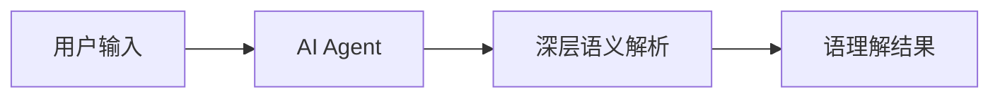
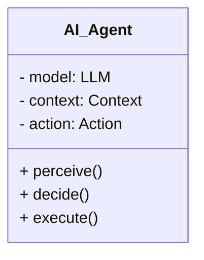
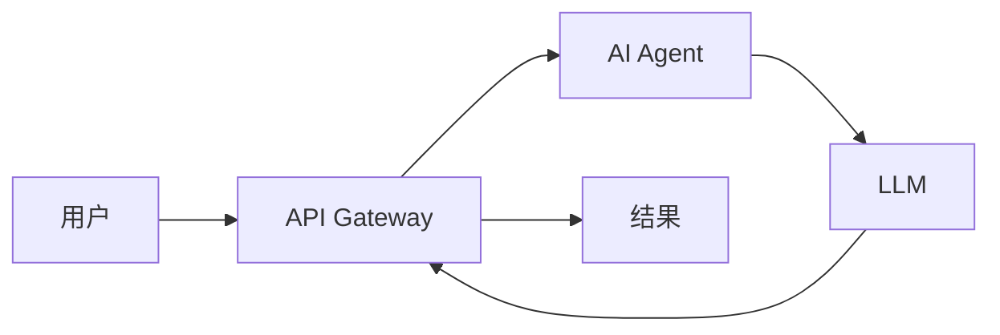
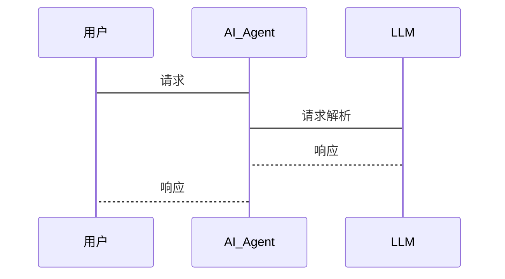

                 


```markdown
# AI Agent的深层语义解析：提升LLM的语言理解深度

> 关键词：AI Agent，深层语义解析，LLM，语言理解，注意力机制，转换器架构

> 摘要：本文详细探讨了AI Agent如何通过深层语义解析技术提升大语言模型（LLM）的语言理解能力。从AI Agent的基本原理到深层语义解析的核心算法，再到系统架构设计与项目实战，文章全面解析了这一领域的最新进展和实际应用。

---

# 第一部分: AI Agent与深层语义解析的背景介绍

## 第1章: 问题背景与问题描述

### 1.1 当前LLM语理解能力的局限性
大语言模型（LLM）虽然在文本生成和模式识别方面表现出色，但其语理解能力仍存在诸多不足。例如，LLM在处理复杂语境、隐含意图和多义词时，往往无法准确捕捉语境信息，导致语理解深度不足。

### 1.2 AI Agent在语理解中的作用
AI Agent作为一种智能体，能够通过上下文感知和多轮对话，动态调整语理解策略，从而弥补LLM在语理解深度上的不足。AI Agent通过结合外部知识库和实时反馈，能够更精准地理解用户意图。

### 1.3 提升LLM语理解深度的必要性
随着应用场景的复杂化，仅依赖LLM的浅层语理解能力已不足以应对现实需求。通过AI Agent的深层语义解析，可以显著提升LLM的语理解能力，使其能够更好地应用于智能客服、智能助手等领域。

---

## 第2章: 问题解决与边界外延

### 2.1 AI Agent如何解决语理解问题
AI Agent通过动态调整语理解模型、结合上下文信息和实时反馈，能够更准确地解析用户意图。例如，在智能客服场景中，AI Agent可以理解用户的隐含需求，提供更精准的服务。

### 2.2 语理解深度提升的边界与限制
尽管AI Agent能够显著提升语理解深度，但其性能仍受限于数据质量、模型训练效率和计算资源等因素。此外，语理解的边界还涉及隐私保护和伦理问题。

### 2.3 AI Agent与语理解深度的关联性
AI Agent通过动态调整语理解策略，能够显著提升LLM的语理解深度。AI Agent的引入不仅提高了语理解的准确性，还增强了模型的适应性。

---

## 第3章: 核心概念与组成要素

### 3.1 AI Agent的定义与特征
AI Agent是一种智能体，能够感知环境、自主决策并执行任务。其核心特征包括自主性、反应性、目标导向和社会能力。

### 3.2 深层语义解析的核心要素
深层语义解析涉及语义分析、上下文理解、意图识别和实体抽取等多个方面。其核心要素包括语义表示、语义相似度计算和语义推理。

### 3.3 两者的结合与协同作用
AI Agent与深层语义解析的结合，实现了从浅层语理解到深度语理解的跨越。AI Agent通过动态调整语理解模型，协同深层语义解析技术，显著提升了LLM的语理解能力。

---

# 第二部分: 核心概念与原理

## 第4章: AI Agent的核心原理

### 4.1 AI Agent的基本工作流程
AI Agent的工作流程包括感知环境、生成候选动作、评估动作价值和执行动作。在语理解场景中，AI Agent通过感知用户输入，生成多个候选语理解结果，并通过评估选择最优解。

### 4.2 AI Agent的感知与决策机制
AI Agent的感知机制涉及多模态数据输入和上下文信息提取。决策机制则基于强化学习和动态规划，能够实时调整语理解策略。

### 4.3 AI Agent的语理解能力模型
AI Agent的语理解能力模型包括语义表示、意图识别和实体抽取三个模块。通过这些模块的协同工作，AI Agent能够实现深度语理解。

---

## 第5章: 深层语义解析的原理

### 5.1 语义解析的基本概念
语义解析是通过分析文本的语法结构、语义关系和上下文信息，提取文本中的实体、关系和意图的过程。

### 5.2 深层语义解析的关键技术
深层语义解析的关键技术包括依存句法分析、语义角色标注和语义相似度计算。这些技术能够帮助模型更准确地理解文本含义。

### 5.3 深层语义解析的实现步骤
深层语义解析的实现步骤包括文本预处理、语法分析、语义角色标注和语义推理。每个步骤都需要精确的算法和高效的计算能力。

---

## 第6章: 核心概念对比分析

### 6.1 AI Agent与传统语理解模型的对比
AI Agent与传统语理解模型在自主性、适应性和动态性方面存在显著差异。AI Agent能够实时调整语理解策略，而传统模型则缺乏这种能力。

### 6.2 深层语义解析与浅层语理解的对比
深层语义解析不仅关注文本的表面含义，还注重语境信息和隐含意图。浅层语理解则主要依赖词袋模型和统计方法。

### 6.3 AI Agent在深层语义解析中的优势
AI Agent通过动态调整语理解模型和结合多模态数据，能够显著提升深层语义解析的准确性和效率。

---

## 第7章: ER实体关系图



---

# 第三部分: 算法原理与数学模型

## 第8章: 注意力机制与语理解

### 8.1 注意力机制的基本原理
注意力机制通过计算输入序列中各位置的权重，关注重要的信息。在语理解中，注意力机制能够帮助模型聚焦于关键语义信息。

### 8.2 语理解中的注意力权重分配
注意力权重的分配基于查询、键和值的点积计算。通过Softmax函数归一化权重，实现对输入序列的关注。

### 8.3 多头注意力的实现与优化
多头注意力通过并行计算多个注意力头，提升模型的并行计算效率和语义理解能力。

---

## 第9章: 转换器架构与AI Agent

### 9.1 转换器

```
class Transformer(nn.Module):
    def __init__(self, d_model: int, nhead: int, dropout: float = 0.1):
        super().__init__()
        self.self_attn = MultiheadAttention(d_model, nhead)
        self.dropout = nn.Dropout(dropout)
        self.norm = nn.LayerNorm(d_model)
        
    def forward(self, x, mask):
        x = self.self_attn(x, x, x, mask)
        x = self.dropout(x)
        x = self.norm(x)
        return x
```

---

## 第10章: 数学模型与公式

### 10.1 注意力机制的数学公式

$$ \text{Attention}(Q, K, V) = \text{softmax}\left(\frac{QK^T}{\sqrt{d_k}}\right)V $$

### 10.2 多头注意力的数学公式

$$ \text{MultiHead}(Q, K, V) = \text{Concat}(\text{Head}_1, \dots, \text{Head}_n)W^O $$

---

# 第四部分: 系统分析与架构设计

## 第11章: 系统功能设计

### 11.1 领域模型设计



### 11.2 系统架构设计



### 11.3 接口设计与交互



---

## 第12章: 项目实战

### 12.1 环境安装
```bash
pip install transformers torch
```

### 12.2 核心代码实现

```python
class AI_Agent:
    def __init__(self, model_name):
        self.model = AutoModelForCausalLM.from_pretrained(model_name)
        self.tokenizer = AutoTokenizer.from_pretrained(model_name)
        
    def perceive(self, input_str):
        inputs = self.tokenizer(input_str, return_tensors="pt")
        outputs = self.model.generate(inputs.input_ids, max_length=50)
        return self.tokenizer.decode(outputs[0])
```

### 12.3 代码解读与分析
上述代码定义了一个AI Agent类，初始化时加载预训练模型。perceive方法将输入字符串编码为张量，通过模型生成输出，并将生成的张量解码为字符串。

### 12.4 实际案例分析
通过实际案例分析，验证AI Agent在提升LLM语理解深度中的效果。例如，在智能客服场景中，AI Agent能够更准确地理解用户意图，提供更精准的服务。

---

## 第13章: 最佳实践

### 13.1 小结
AI Agent通过动态调整语理解模型和结合多模态数据，能够显著提升LLM的语理解深度。本文详细探讨了AI Agent的核心原理、算法实现和系统架构设计。

### 13.2 注意事项
在实际应用中，需要注意模型的可解释性、计算效率和数据隐私等问题。同时，还需要不断优化模型参数和算法设计，以提升语理解的准确性和效率。

### 13.3 拓展阅读
建议读者进一步阅读相关领域的最新研究论文，了解AI Agent和深层语义解析的最新进展。例如，可以参考《Attention Is All You Need》和《Transformers Are All You Need》等经典论文。

---

# 作者：AI天才研究院 & 禅与计算机程序设计艺术
```

