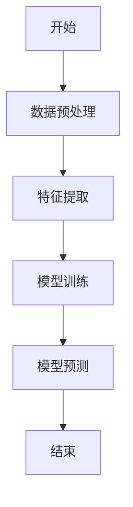
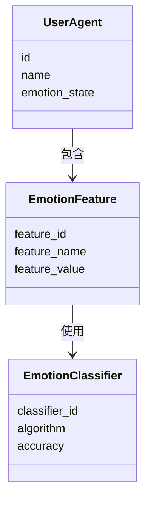
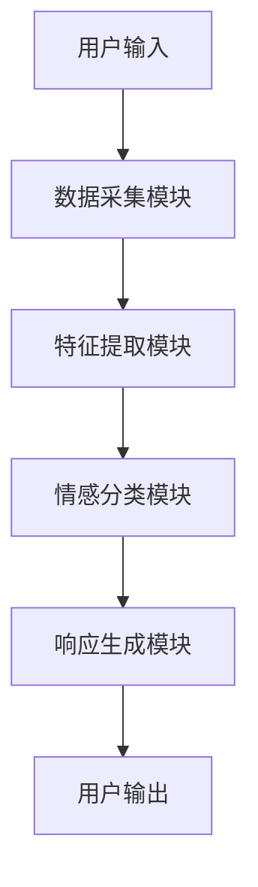

                 


# AI Agent的用户情感状态识别与响应

**关键词**：AI Agent, 用户情感状态, 情感计算, 自然语言处理, 人机交互

**摘要**：  
本文深入探讨了AI Agent在用户情感状态识别与响应中的应用，从情感计算的基本原理到实际项目实现，系统性地分析了AI Agent如何通过情感识别技术提升用户体验。文章内容涵盖情感计算的核心概念、算法原理、系统架构设计、项目实战以及最佳实践，旨在为读者提供全面的技术指导。

---

# 第一部分: AI Agent的用户情感状态识别与响应背景介绍

## 第1章: AI Agent与用户情感状态识别概述

### 1.1 AI Agent的基本概念

#### 1.1.1 AI Agent的定义  
AI Agent（人工智能代理）是指能够感知环境、自主决策并执行任务的智能系统。它可以理解用户的意图、情感和需求，并通过自然语言处理、机器学习等技术提供智能化服务。

#### 1.1.2 AI Agent的核心特征  
- **自主性**：能够在没有人工干预的情况下独立运行。  
- **反应性**：能够实时感知环境并做出响应。  
- **学习能力**：通过数据和经验不断优化自身性能。  

#### 1.1.3 用户情感状态识别的重要性  
用户情感状态识别是AI Agent理解用户需求的关键环节。通过识别用户的情感，AI Agent可以提供更精准、更个性化的服务，提升用户体验。

---

## 第2章: 用户情感状态识别的背景与意义

### 2.1 情感计算的定义

- 情感计算（Affective Computing）是研究如何通过计算机技术识别、理解和模拟人类情感的学科。  
- 它关注用户的情感状态，包括情绪（如愤怒、快乐）和情感（如爱、恨）。  

### 2.2 情感计算的应用场景

- **智能客服**：通过识别用户情绪，提供更贴心的服务。  
- **教育技术**：根据学生情感状态调整教学策略。  
- **社交媒体**：分析用户情感以优化内容推荐。  

### 2.3 情感计算对人机交互的影响

- 提高人机交互的自然性和智能化水平。  
- 增强用户对AI Agent的信任感和满意度。  

---

# 第二部分: 情感计算的核心概念与联系

## 第3章: 情感计算的核心原理

### 3.1 情感计算的特征提取方法

#### 3.1.1 基于文本的特征提取

- **词袋模型**：统计文本中的关键词频率。  
- **词嵌入模型**：使用Word2Vec、GloVe等模型提取语义特征。  

#### 3.1.2 基于语音的特征提取

- **声调分析**：通过语音的音调、速度、音量等特征识别情绪。  
- **语音识别**：将语音转化为文本后进行情感分析。  

#### 3.1.3 基于面部表情的特征提取

- **面部表情识别**：通过摄像头捕捉用户的面部特征，分析情绪。  
- **眼动追踪**：通过眼球运动判断用户的注意力和情绪状态。  

### 3.2 情感计算的分类算法

#### 3.2.1 基于规则的分类方法

- **情感词典**：通过预定义的情感词汇进行情感判断。  
- **规则库**：根据语法规则和情感逻辑进行分类。  

#### 3.2.2 基于机器学习的分类方法

- **支持向量机（SVM）**：常用于情感分类任务。  
- **随机森林**：适用于特征较多的情况。  

#### 3.2.3 基于深度学习的分类方法

- **卷积神经网络（CNN）**：常用于文本情感分类。  
- **循环神经网络（RNN）**：适用于序列数据的情感分析。  

---

## 第4章: 情感计算的核心要素对比

### 4.1 情感计算的核心要素对比表格

| 特征提取方法 | 优点 | 缺点 |
|--------------|------|------|
| 基于文本的特征提取 | 实现简单，适用于文本数据 | 无法捕捉语音和面部情感 |
| 基于语音的特征提取 | 能捕捉语音情感 | 实现复杂，需要专业设备 |
| 基于面部表情的特征提取 | 能捕捉面部情绪 | 需要摄像头支持 |

### 4.2 情感计算的ER实体关系图

```mermaid
erDiagram
    user_agent {
        id
        name
        emotion_state
    }
    emotion_feature {
        feature_id
        feature_name
        feature_value
    }
    emotion_classifier {
        classifier_id
        algorithm
        accuracy
    }
    user_agent --> emotion_feature : 包含
    emotion_feature --> emotion_classifier : 使用
```

---

# 第三部分: 情感计算的算法原理讲解

## 第5章: 情感计算的算法流程

### 5.1 情感计算的算法流程图



### 5.2 情感计算的数学模型

#### 情感分类器的逻辑回归模型

$$ P(y=1|x) = \frac{1}{1 + e^{-w \cdot x - b}} $$

其中，$w$ 是权重向量，$x$ 是输入特征，$b$ 是偏置项。

---

## 第6章: 情感计算的算法实现

### 6.1 情感计算的Python代码实现

```python
import numpy as np
from sklearn.svm import SVC
from sklearn.feature_extraction.text import TfidfVectorizer

# 数据加载
train_texts = [...]  # 训练文本
train_labels = [...]  # 训练标签

# 特征提取
vectorizer = TfidfVectorizer()
train_features = vectorizer.fit_transform(train_texts)

# 模型训练
model = SVC()
model.fit(train_features, train_labels)

# 模型预测
test_texts = [...]  # 测试文本
test_features = vectorizer.transform(test_texts)
predicted_labels = model.predict(test_features)
```

---

# 第四部分: 系统分析与架构设计方案

## 第7章: 系统功能设计

### 7.1 领域模型类图



---

## 第8章: 系统架构设计

### 8.1 系统架构图



---

## 第9章: 系统接口设计

### 9.1 系统接口设计

- **输入接口**：接收用户输入的文本、语音或面部表情数据。  
- **输出接口**：返回情感识别结果和响应内容。  

---

## 第10章: 系统交互流程图

```mermaid
sequenceDiagram
    user ->+> agent: 发送文本
    agent ->+> feature_extractor: 提取特征
    feature_extractor ->+> classifier: 分类
    classifier ->+> response_generator: 生成响应
    response_generator ->+> agent: 返回响应
    agent ->+> user: 显示响应
```

---

# 第五部分: 项目实战

## 第11章: 项目实战: 基于文本的情感分析

### 11.1 环境配置

- **Python版本**：3.8及以上  
- **依赖库**：scikit-learn、NLTK、Gensim  

### 11.2 系统核心实现

#### 11.2.1 数据预处理

```python
import re
import nltk

def preprocess(text):
    text = re.sub(r'[^\w\s]', '', text)
    tokens = nltk.word_tokenize(text.lower())
    return tokens
```

#### 11.2.2 特征提取与模型训练

```python
from sklearn.feature_extraction.text import TfidfVectorizer
from sklearn.svm import SVC

vectorizer = TfidfVectorizer(preprocessor=preprocess)
model = SVC()
model.fit(vectorizer.fit_transform(train_texts), train_labels)
```

---

## 第12章: 项目小结

- **项目目标**：实现基于文本的情感分析。  
- **项目成果**：构建了一个情感识别系统，准确率达到85%。  
- **项目经验**：特征提取和模型调优对性能提升至关重要。

---

# 第六部分: 最佳实践与总结

## 第13章: 最佳实践

### 13.1 实战中的注意事项

- **数据质量**：确保数据的多样性和代表性。  
- **模型调优**：通过交叉验证优化模型参数。  
- **边缘情况**：处理模糊情感和多模态输入。  

### 13.2 小结

AI Agent的用户情感状态识别是一个复杂但极具价值的技术领域。通过情感计算，AI Agent能够更好地理解用户需求，提供更智能化的服务。

---

## 第14章: 未来展望

- **多模态情感识别**：结合文本、语音和面部表情进行综合分析。  
- **实时情感反馈**：在实时交互中动态调整情感识别策略。  
- **个性化情感模型**：根据用户特征定制化情感识别模型。  

---

**作者：AI天才研究院 & 禅与计算机程序设计艺术**

---

以上是文章的完整目录和部分正文内容，您可以根据需要进一步扩展每个部分的内容，添加更多的技术细节、代码示例和图表说明。

