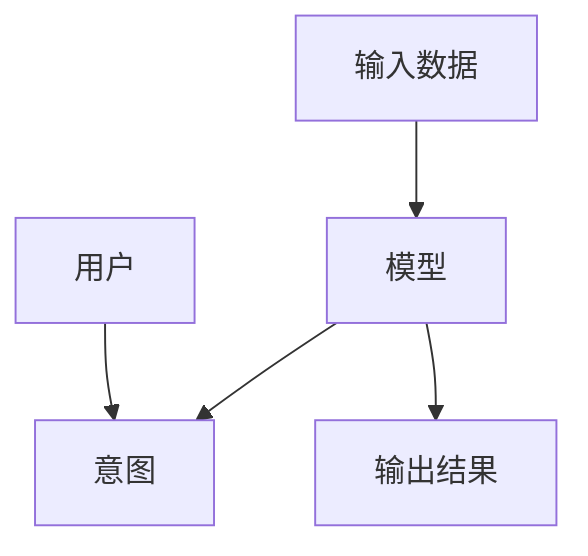
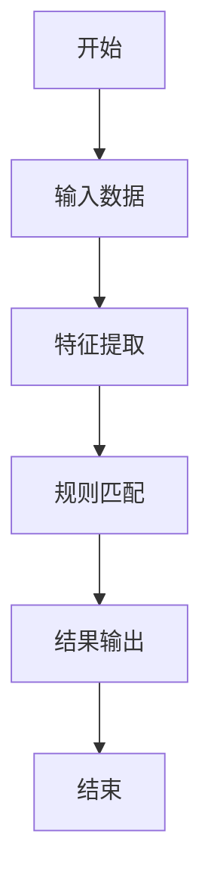
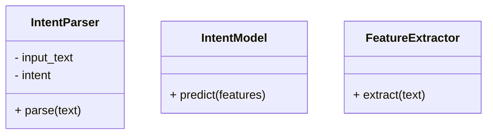
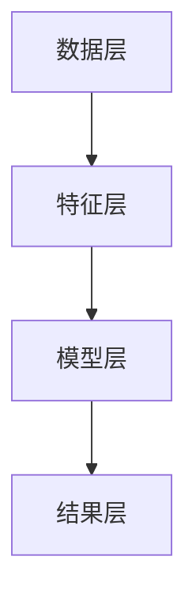

                 


# AI Agent的用户意图推理与预测

> 关键词：AI Agent, 用户意图推理, 意图预测, 意图识别, 机器学习, 自然语言处理

> 摘要：本文系统地探讨了AI Agent在用户意图推理与预测领域的核心原理、算法实现、系统架构及实际应用。通过从基础概念到高级算法的逐步解析，结合丰富的案例分析，深入剖析意图推理的关键技术与发展趋势。文章不仅为技术实现者提供了理论指导，也为实际应用者提供了实践参考。

---

## 第一部分：引言

### 第1章：AI Agent与用户意图推理概述

#### 1.1 AI Agent的基本概念
AI Agent（人工智能代理）是指能够感知环境、自主决策并执行任务的智能实体。它广泛应用于对话系统、推荐系统、智能助手等领域。用户意图推理是AI Agent理解用户需求、提供精准服务的核心能力。

#### 1.2 用户意图推理的重要性
用户意图推理是指通过分析用户的输入（如文本、语音、行为数据等），推断出用户的潜在需求和目标。这种能力使得AI Agent能够更智能地与用户交互，提供个性化的服务。

#### 1.3 问题背景与实际应用场景
用户意图推理在智能音箱、聊天机器人、个性化推荐系统等领域有广泛应用。然而，意图的多样性和模糊性使得意图推理成为一个具有挑战性的任务。

---

## 第二部分：用户意图推理的核心概念与联系

### 第2章：用户意图推理的核心概念原理

#### 2.1 意图的分类与层次结构
意图可以分为显式意图和隐式意图。显式意图是用户直接表达的需求，如“播放音乐”；隐式意图是用户未明说但可以通过上下文推断的需求，如“寻找附近的餐馆”。

#### 2.2 意图推理的关键技术
- **自然语言处理（NLP）**：通过文本分析提取用户意图。
- **机器学习**：利用数据训练模型，识别用户意图。
- **上下文理解**：结合历史交互和环境信息，提升意图推理的准确性。

#### 2.3 实体关系图架构


---

## 第三部分：算法原理讲解

### 第3章：意图推理的算法原理

#### 3.1 基于规则的意图推理算法
基于规则的意图推理通过预定义的规则匹配用户输入，提取意图。这种方法适用于规则明确的场景，但难以处理复杂和模糊的意图。

##### 算法流程


##### Python实现示例
```python
def rule_based_inference(text):
    features = extract_features(text)
    for rule in rules:
        if rule.match(features):
            return rule.result
    return default_result
```

#### 3.2 基于机器学习的意图推理算法
基于机器学习的意图推理通过训练模型，自动学习意图与输入数据之间的关系。这种方法能够处理复杂和模糊的意图。

##### 深度学习模型的实现
```python
class IntentModel(nn.Module):
    def __init__(self, input_size, hidden_size, output_size):
        super(IntentModel, self).__init__()
        self.fc1 = nn.Linear(input_size, hidden_size)
        self.fc2 = nn.Linear(hidden_size, output_size)
        self.dropout = nn.Dropout(0.5)
    
    def forward(self, x):
        out = self.fc1(x)
        out = F.relu(out)
        out = self.dropout(out)
        out = self.fc2(out)
        return out
```

---

## 第四部分：数学模型与公式

### 第4章：意图推理的数学模型

#### 4.1 概率模型
概率模型通过计算条件概率，推断出用户的意图。

##### 条件概率公式
$$P(y|x) = \frac{P(x|y)P(y)}{P(x)}$$

#### 4.2 统计学习方法
统计学习方法通过分析数据的分布，推断用户的意图。

##### 最大熵模型
$$\text{目标函数} = \sum_{i=1}^n \log P(y_i|x_i)$$

#### 4.3 深度学习模型
深度学习模型通过多层神经网络，学习用户意图的高层次特征。

##### 神经网络结构
$$
\begin{aligned}
h &= \text{ReLU}(W_h x + b_h) \\
y &= \text{softmax}(W_y h + b_y)
\end{aligned}
$$

---

## 第五部分：系统分析与架构设计

### 第5章：意图推理系统的架构设计

#### 5.1 系统功能设计
意图推理系统需要完成数据预处理、特征提取、模型训练和结果输出等功能。

##### 领域模型（类图）


#### 5.2 系统架构设计
意图推理系统通常采用模块化架构，包括数据层、特征层、模型层和结果层。

##### 系统架构图


---

## 第六部分：项目实战

### 第6章：意图推理项目实战

#### 6.1 环境搭建
- 安装必要的库：`pip install numpy, pandas, scikit-learn, transformers`

#### 6.2 核心代码实现
```python
from sklearn.feature_extraction.text import TfidfVectorizer
from sklearn.naive_bayes import MultinomialNB

def train_intent_model(train_texts, train_labels):
    vectorizer = TfidfVectorizer()
    X = vectorizer.fit_transform(train_texts)
    model = MultinomialNB()
    model.fit(X, train_labels)
    return model, vectorizer

model, vectorizer = train_intent_model(train_texts, train_labels)
```

#### 6.3 案例分析与结果解读
通过实际案例分析，展示模型的训练过程和结果输出。

---

## 第七部分：总结与展望

### 第7章：总结与最佳实践

#### 7.1 最佳实践
- 数据预处理：确保数据质量，去除噪声。
- 特征选择：选择合适的特征表示方法。
- 模型调优：通过交叉验证优化模型性能。

#### 7.2 未来展望
未来，意图推理将更加依赖于多模态数据和增强学习技术，进一步提升推理的准确性和智能化。

---

## 作者

作者：AI天才研究院/AI Genius Institute & 禅与计算机程序设计艺术 /Zen And The Art of Computer Programming

