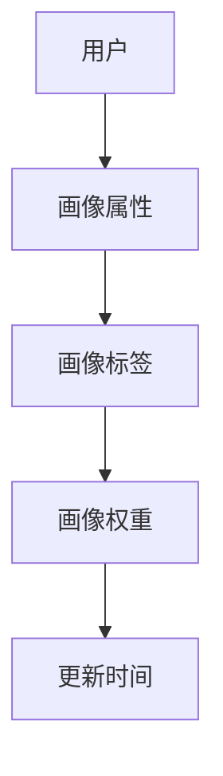
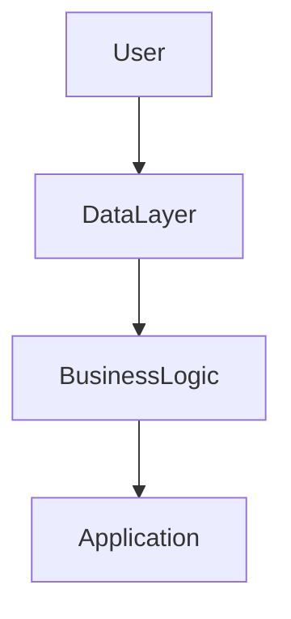
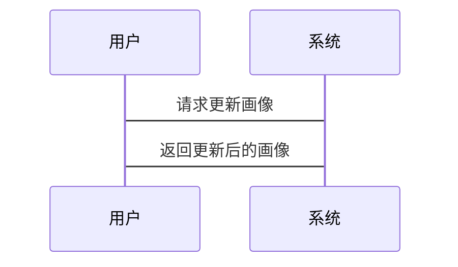

                 

# AI Agent的用户画像动态更新系统

---

## 关键词：AI Agent、用户画像、动态更新、个性化推荐、实时反馈、数据挖掘

---

## 摘要：AI Agent通过实时分析用户行为和反馈，动态调整用户画像，提升个性化推荐和精准营销的效果。本文深入探讨用户画像动态更新的算法原理、系统架构设计及实战案例，帮助读者掌握AI驱动的用户画像管理技术。

---

## 目录大纲

### 第1章: 背景介绍

#### 1.1 问题背景
- 1.1.1 用户画像的概念与重要性
- 1.1.2 动态更新的必要性
- 1.1.3 当前系统的痛点与挑战

#### 1.2 问题描述
- 1.2.1 用户画像的构建过程
- 1.2.2 动态更新的核心需求
- 1.2.3 系统的边界与外延

#### 1.3 问题解决
- 1.3.1 AI Agent的核心作用
- 1.3.2 动态更新的实现方式
- 1.3.3 系统的实现价值

### 第2章: 核心概念与联系

#### 2.1 AI Agent的基本原理
- 2.1.1 AI Agent的定义与分类
- 2.1.2 用户画像的构建方法
- 2.1.3 动态更新的机制

#### 2.2 核心概念对比
- 2.2.1 用户画像与用户行为分析的对比
- 2.2.2 动态更新与静态画像的对比
- 2.2.3 AI Agent与其他画像更新方法的对比

#### 2.3 ER实体关系图

### 第3章: 算法原理讲解

#### 3.1 协同过滤算法
- 3.1.1 基于用户的协同过滤
- 3.1.2 基于物品的协同过滤
- 3.1.3 混合协同过滤的实现

#### 3.2 聚类分析算法
- 3.2.1 K-means聚类
- 3.2.2 层次聚类
- 3.2.3 聚类在用户画像中的应用

#### 3.3 神经网络算法
- 3.3.1 卷积神经网络（CNN）
- 3.3.2 循环神经网络（RNN）

### 第4章: 系统分析与架构设计

#### 4.1 问题场景介绍
- 个性化推荐
- 精准营销

#### 4.2 系统功能设计
- 用户数据采集
- 画像构建
- 动态更新

#### 4.3 系统架构设计

#### 4.4 系统接口设计
- RESTful API
- 获取用户画像
- 更新用户画像

#### 4.5 系统交互设计

### 第5章: 项目实战

#### 5.1 环境安装
- Python库安装
- 依赖管理

#### 5.2 核心实现
- 数据预处理
- 模型训练
- 接口实现

#### 5.3 案例分析
- 实际案例
- 详细解读

### 第6章: 最佳实践与小结

#### 6.1 最佳实践
- 数据质量
- 算法选择
- 性能优化

#### 6.2 小结
- 主要内容回顾
- 未来展望

#### 6.3 注意事项
- 数据隐私
- 系统维护

#### 6.4 拓展阅读
- 推荐书籍
- 在线资源

### 作者信息

作者：AI天才研究院/AI Genius Institute  
联系方式：[联系作者](mailto:contact@ai-genius-institute.com)  
网址：[禅与计算机程序设计艺术](https://zenofprogramming.art/)

---

通过以上目录结构，您可以逐步撰写完整的文章，确保每部分内容详实，逻辑清晰，帮助读者深入理解AI Agent在用户画像动态更新系统中的应用和实现。

