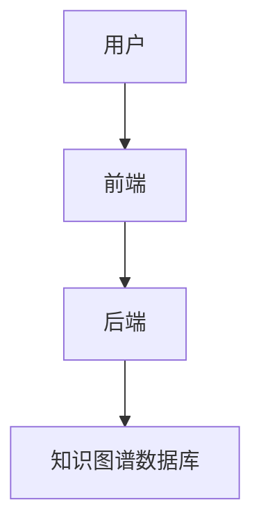

                 


# AI Agent的知识图谱在法律咨询中的应用

## 关键词：
AI Agent, 知识图谱, 法律咨询, 自然语言处理, 智能法律系统, 案例分析

## 摘要：
AI Agent与知识图谱的结合为法律咨询领域带来了革命性的变化。通过构建和应用知识图谱，AI Agent能够更准确地理解法律文本，提供智能化的法律咨询和案例分析。本文从AI Agent和知识图谱的基本概念入手，详细探讨了知识图谱在法律咨询中的具体应用，分析了构建知识图谱的核心算法和系统架构设计，并通过实际案例展示了如何在法律咨询中实现AI Agent的知识图谱应用。最后，本文总结了最佳实践和未来的发展方向。

---

# 第1章 AI Agent的概述

## 1.1 AI Agent的基本概念

### 1.1.1 AI Agent的定义与特点
AI Agent（人工智能代理）是指能够感知环境、自主决策并执行任务的智能实体。它具有以下特点：
- **自主性**：能够在没有外部干预的情况下独立运行。
- **反应性**：能够实时感知环境并做出响应。
- **目标导向**：具备明确的目标，能够优化行为以实现目标。
- **学习能力**：通过数据和经验不断优化自身的性能。

### 1.1.2 AI Agent的核心功能与类型
AI Agent的核心功能包括：
- **信息处理**：从环境中获取信息并进行分析。
- **决策制定**：基于信息做出最优决策。
- **任务执行**：根据决策执行具体任务。

AI Agent的类型主要分为两类：
1. **反应式AI Agent**：基于当前感知做出反应，适用于实时任务。
2. **认知式AI Agent**：具备复杂的推理和规划能力，适用于复杂任务。

### 1.1.3 AI Agent在法律咨询中的应用潜力
AI Agent在法律咨询中的潜力主要体现在以下几个方面：
- **法律信息检索**：通过自然语言处理技术快速检索相关法律条文和案例。
- **法律分析与解释**：基于知识图谱对法律文本进行分析，并生成解释性报告。
- **法律咨询与建议**：根据用户需求提供个性化的法律建议。

---

# 第2章 知识图谱的基本概念

## 2.1 知识图谱的定义与特点
知识图谱是一种以图结构表示知识的语义网络，由实体（节点）和关系（边）组成。其特点包括：
- **语义丰富性**：能够表示实体之间的复杂关系。
- **可扩展性**：支持大规模数据的构建和管理。
- **结构化**：通过结构化的表示，便于计算机理解和处理。

## 2.2 知识图谱的构建过程

### 2.2.1 数据采集与预处理
数据来源包括法律文本、司法案例、法规文件等。预处理步骤包括：
1. **文本清洗**：去除噪音数据，如标点符号、停用词等。
2. **分词与词性标注**：将文本分割成词语，并标注词性。

### 2.2.2 知识抽取与实体识别
通过自然语言处理技术从文本中提取实体，常见的实体类型包括：
- **人名（PER）**
- **组织名（ORG）**
- **地点（LOC）**
- **日期（DATE）**

### 2.2.3 关系抽取与图谱构建
关系抽取是识别实体之间的关系，如“发生在”、“涉及”等。构建知识图谱的过程如下：
1. **实体识别**：识别文本中的实体。
2. **关系抽取**：识别实体之间的关系。
3. **图谱构建**：将实体和关系存储到图数据库中。

## 2.3 知识图谱与传统数据库的区别
传统数据库通常以关系型结构存储数据，而知识图谱以图结构存储数据，具有更强的语义表达能力。

---

# 第3章 AI Agent与知识图谱的结合

## 3.1 AI Agent与知识图谱的协同工作原理

### 3.1.1 AI Agent如何利用知识图谱进行推理
AI Agent通过查询知识图谱中的实体和关系，进行推理和决策。例如：
- 查询某个法律案例的相关法规。
- 分析案件中的因果关系。

### 3.1.2 知识图谱如何增强AI Agent的智能性
知识图谱为AI Agent提供了丰富的语义信息，使其能够更准确地理解用户需求并提供智能服务。

## 3.2 知识图谱在法律咨询中的具体应用

### 3.2.1 法律案例检索与分析
通过知识图谱，AI Agent可以快速检索相关案例并进行分析，帮助用户理解案件的法律依据。

### 3.2.2 法律条文解读与解释
AI Agent可以根据知识图谱中的实体和关系，对法律条文进行解读并生成解释性报告。

### 3.2.3 法律咨询与建议生成
AI Agent可以根据用户的需求，结合知识图谱中的信息，生成个性化的法律建议。

---

# 第4章 知识图谱构建的算法原理

## 4.1 知识抽取与实体识别算法

### 4.1.1 基于规则的实体识别
通过预定义的规则，从文本中提取特定类型的实体。例如：
- 使用正则表达式提取日期格式。

### 4.1.2 基于统计的实体识别
利用统计学习方法，如条件随机场（CRF），进行实体识别。

### 4.1.3 基于深度学习的实体识别
使用深度学习模型，如BERT，进行实体识别。

## 4.2 关系抽取与图谱构建算法

### 4.2.1 基于规则的关系抽取
通过预定义的规则，识别实体之间的关系。例如：
- “涉及”关系：案件涉及哪些组织或个人。

### 4.2.2 基于统计的关系抽取
利用统计学习方法，如最大熵模型，进行关系抽取。

### 4.2.3 基于深度学习的关系抽取
使用深度学习模型，如卷积神经网络（CNN），进行关系抽取。

---

# 第5章 AI Agent的知识图谱推理算法

## 5.1 知识图谱推理的基本原理

### 5.1.1 基于规则的推理
通过预定义的推理规则，从知识图谱中推导出新的事实。例如：
- 如果A是B的父亲，且B是C的父亲，则A是C的祖父。

### 5.1.2 基于统计的推理
利用统计学习方法，如马尔可夫逻辑网络（MLN），进行推理。

### 5.1.3 基于深度学习的推理
使用深度学习模型，如图神经网络（GNN），进行推理。

## 5.2 基于图神经网络的知识图谱推理

### 5.2.1 图神经网络的基本原理
图神经网络通过节点之间的关系进行信息传播，从而推断出新的知识。

### 5.2.2 图神经网络在知识图谱推理中的应用
- **节点分类**：预测未标注节点的类型。
- **链接预测**：预测节点之间的关系。

---

# 第6章 知识图谱的表示与嵌入

## 6.1 知识图谱的表示方法
知识图谱的表示方法包括：
- **基于向量的表示**：将实体和关系表示为向量。
- **基于符号的表示**：使用符号逻辑表示实体和关系。

## 6.2 知识图谱的嵌入技术
嵌入技术通过将实体和关系映射到低维空间，提高计算效率。常用的嵌入技术包括：
- **Word2Vec**：用于实体嵌入。
- **TransE**：用于关系嵌入。

---

# 第7章 系统架构设计

## 7.1 问题场景介绍
构建一个法律咨询系统，用户可以通过输入问题，获得个性化的法律建议。

## 7.2 系统功能设计

### 7.2.1 领域模型
- **实体**：用户、法律条文、案例。
- **关系**：用户查询法律条文，法律条文涉及案例。

### 7.2.2 系统架构设计
1. **前端**：用户界面，接收用户输入。
2. **后端**：AI Agent，处理用户查询并生成回答。
3. **知识图谱数据库**：存储法律相关知识。

## 7.3 系统架构图


## 7.4 系统接口设计
- **查询接口**：用户输入查询问题。
- **响应接口**：AI Agent返回答案。

---

# 第8章 项目实战

## 8.1 环境配置
安装必要的库：
```bash
pip install numpy
pip install networkx
pip install py2neo
```

## 8.2 系统核心实现

### 8.2.1 知识图谱构建代码
```python
import networkx as nx

G = nx.Graph()
G.add_nodes_from(["A", "B", "C"])
G.add_edges_from([("A", "B"), ("B", "C")])
```

### 8.2.2 AI Agent实现代码
```python
class AIAgent:
    def __init__(self, knowledge_graph):
        self.knowledge_graph = knowledge_graph

    def query(self, question):
        # 在知识图谱中查询答案
        pass
```

## 8.3 案例分析
以一个简单的法律案例为例，展示如何通过知识图谱进行分析和推理。

---

# 第9章 最佳实践与小结

## 9.1 最佳实践
- **数据隐私**：确保法律数据的安全性和隐私性。
- **模型优化**：定期更新知识图谱，保持模型的准确性。

## 9.2 小结
本文详细探讨了AI Agent与知识图谱在法律咨询中的应用，从理论到实践，展示了如何构建和应用知识图谱，为法律咨询提供智能化服务。

---

# 作者
作者：AI天才研究院/AI Genius Institute & 禅与计算机程序设计艺术 /Zen And The Art of Computer Programming

