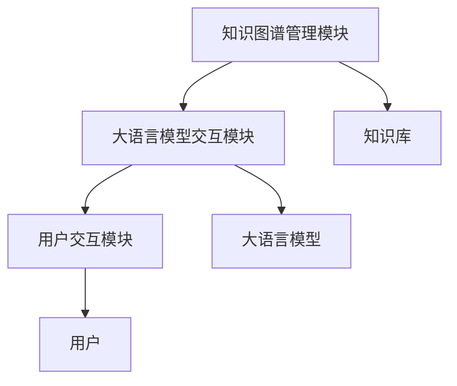
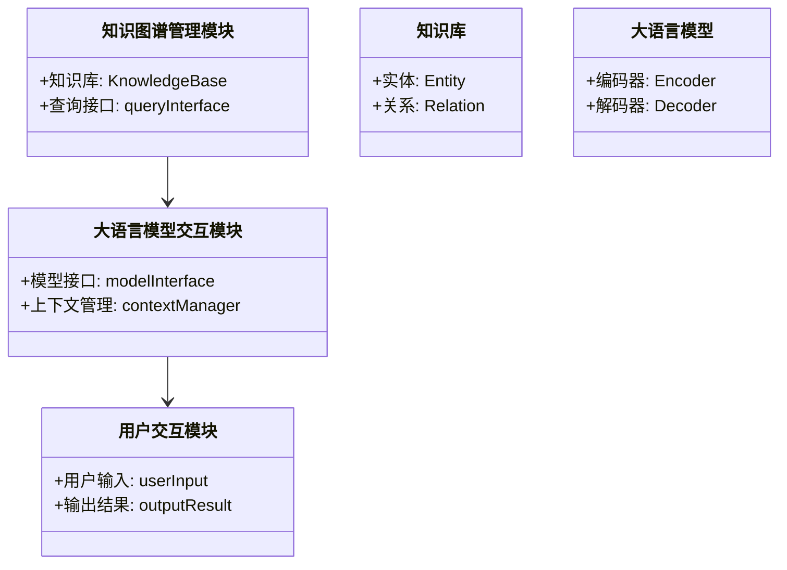

                 


# 第5章: AI Agent的知识图谱整合

## 5.1 系统架构设计

### 5.1.1 系统架构概述
在AI Agent的知识图谱整合系统中，我们需要构建一个高效的架构来实现知识图谱与大语言模型的无缝协作。该系统主要由以下几个模块组成：

1. **知识图谱管理模块**：负责知识图谱的构建、存储和查询。
2. **大语言模型交互模块**：负责与大语言模型的接口交互，处理自然语言理解和生成任务。
3. **用户交互模块**：接收用户的输入，解析需求，并协调其他模块完成任务。

### 5.1.2 系统架构图
以下是系统的架构图，展示了各模块之间的交互关系：



### 5.1.3 领域模型
以下是系统的领域模型图，展示了主要实体及其关系：



## 5.2 系统实现与优化

### 5.2.1 知识图谱的构建与存储
知识图谱的构建是一个复杂的过程，主要包括以下步骤：

1. **数据预处理**：对原始数据进行清洗和结构化处理，提取实体和关系。
2. **构建本体**：定义本体的实体和关系，构建概念模型。
3. **知识存储**：将知识图谱存储在适合的数据库中，如图数据库或关系型数据库。

### 5.2.2 大语言模型的集成
将大语言模型集成到系统中，需要考虑以下几个方面：

1. **选择合适的模型**：根据任务需求选择适合的模型，如GPT-3、GPT-4等。
2. **模型微调**：根据特定领域的需求对模型进行微调，提升性能。
3. **模型接口设计**：设计合理的接口，方便与其他模块交互。

### 5.2.3 性能优化
为了提高系统的性能，可以采取以下优化措施：

1. **缓存机制**：对频繁访问的知识图谱数据进行缓存，减少查询时间。
2. **并行计算**：利用多线程或分布式计算提高处理效率。
3. **优化算法**：对知识图谱查询和大语言模型推理的算法进行优化，减少计算时间。

## 5.3 项目实战

### 5.3.1 项目需求分析
以医疗咨询系统为例，我们需要构建一个能够提供医疗知识咨询的AI Agent。系统需要能够理解用户的医疗问题，并结合知识图谱和大语言模型提供准确的答案。

### 5.3.2 环境安装
以下是实现该项目所需的环境配置：

```bash
# 安装必要的Python库
pip install numpy
pip install pandas
pip install spacy
pip install transformers
pip install graphviz
```

### 5.3.3 核心代码实现
以下是实现知识图谱与大语言模型整合的核心代码示例：

```python
# 知识图谱构建
import spacy
nlp = spacy.load("en_core_web_sm")
doc = nlp("The patient has a fever and cough.")

# 实体识别
entities = [(ent.text, ent.label_) for ent in doc.ents]
print("Entities:", entities)

# 关系抽取
from transformers import pipeline
nlp_ner = pipeline("ner")
nlp_relations = pipeline("relation-extraction")

relations = nlp_relations(doc)
print("Relations:", relations)

# 大语言模型集成
from transformers import AutoTokenizer, AutoModelForCausalLM
tokenizer = AutoTokenizer.from_pretrained("gpt2")
model = AutoModelForCausalLM.from_pretrained("gpt2")

# 用户查询处理
query = "What is the cause of fever and cough?"
inputs = tokenizer(query, return_tensors="np")
outputs = model.generate(inputs.input_ids, max_length=50)
response = tokenizer.decode(outputs[0].tolist()[0])
print("Response:", response)
```

### 5.3.4 代码功能解读
1. **知识图谱构建**：使用spaCy进行实体识别和关系抽取，构建医疗领域的知识图谱。
2. **大语言模型集成**：使用Hugging Face的GPT-2模型进行自然语言生成，生成针对用户查询的医疗建议。

### 5.3.5 实际应用案例分析
以用户查询“What is the cause of fever and cough?”为例，系统首先通过知识图谱分析常见的病因，然后结合大语言模型生成详细的回答，提供准确的医疗建议。

## 5.4 总结与展望

### 5.4.1 总结
本章详细介绍了AI Agent的知识图谱整合系统的架构设计、实现方法和优化策略，并通过医疗咨询系统的案例展示了系统的实际应用。通过知识图谱与大语言模型的结合，AI Agent能够更好地理解和处理复杂的信息，提供更智能的服务。

### 5.4.2 展望
未来，随着大语言模型和知识图谱技术的不断进步，AI Agent在各个领域的应用将更加广泛。我们需要进一步优化知识图谱的构建和大语言模型的集成，提升系统的性能和用户体验，为更多领域提供智能化的服务。

---

# 作者：AI天才研究院/AI Genius Institute & 禅与计算机程序设计艺术 /Zen And The Art of Computer Programming

---

> **关键词**：AI Agent, 知识图谱, 大语言模型, 结构化知识库, 系统架构设计, 项目实战  
> **摘要**：本文深入探讨了AI Agent与知识图谱的整合方法，详细介绍了知识图谱与大语言模型的核心原理、系统架构设计、实现与优化策略，并通过实际项目案例展示了整合的效果和应用价值。通过本文的分析，读者可以全面理解AI Agent的知识图谱整合技术，并能够将其应用于实际场景中。

