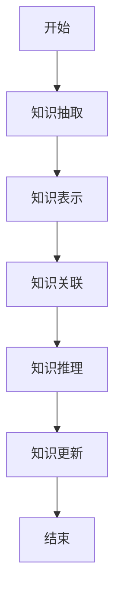
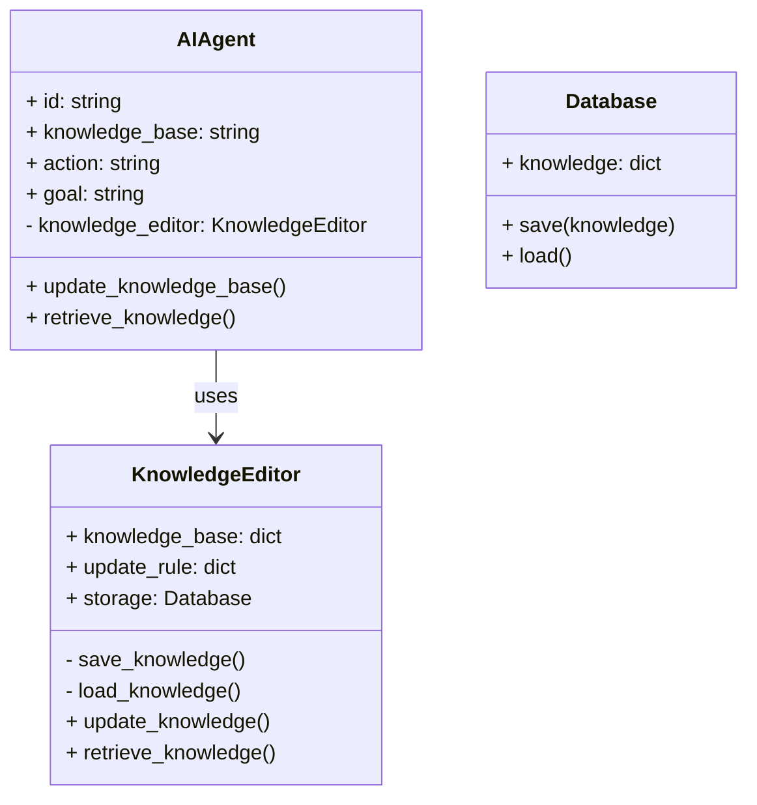

                 


# AI Agent的知识编辑系统：动态管理LLM的知识库

## 关键词：AI Agent, 知识编辑系统, LLM, 动态知识库, 知识管理, 系统架构

## 摘要：  
本文深入探讨了AI Agent的知识编辑系统，特别是如何动态管理大语言模型（LLM）的知识库。文章从背景、核心概念、算法原理、系统架构到项目实战，全面解析了知识编辑系统的设计与实现。通过详细的技术分析和案例解读，本文为读者提供了从理论到实践的完整指南，帮助理解如何构建高效、动态的知识管理系统。

---

## 第一部分: AI Agent的知识编辑系统概述

### 第1章: AI Agent与知识编辑系统概述

#### 1.1 AI Agent的基本概念

##### 1.1.1 AI Agent的定义与特点
AI Agent（人工智能代理）是指能够感知环境、自主决策并执行任务的智能实体。AI Agent具有以下特点：
- **自主性**：能够自主决策，无需外部干预。
- **反应性**：能够实时感知环境并做出响应。
- **目标导向**：通过设定目标来驱动行为。
- **学习能力**：能够通过数据和经验不断优化自身性能。

##### 1.1.2 知识编辑系统的核心作用
知识编辑系统是AI Agent的重要组成部分，负责管理和维护知识库。其核心作用包括：
- **知识存储**：将各类信息以结构化形式存储。
- **知识更新**：动态更新知识库，确保信息的准确性和时效性。
- **知识检索**：快速检索所需知识，支持AI Agent的决策过程。

##### 1.1.3 动态知识库管理的重要性
动态知识库管理是指根据环境变化实时更新知识库的过程。其重要性体现在：
- **适应性**：能够快速响应环境变化，确保AI Agent的持续有效性。
- **准确性**：通过动态更新，保证知识库内容的准确性和完整性。
- **效率性**：提高知识检索和处理的效率，支持快速决策。

---

#### 1.2 大语言模型（LLM）的知识库管理

##### 1.2.1 LLM的基本原理
大语言模型（LLM）是一种基于深度学习的自然语言处理模型，通过大量数据训练，能够理解和生成人类语言。其基本原理包括：
- **数据训练**：通过监督学习和无监督学习训练模型。
- **注意力机制**：利用自注意力机制捕捉文本中的长程依赖。
- **生成式输出**：通过解码器生成自然语言文本。

##### 1.2.2 知识库在LLM中的重要性
知识库是LLM的重要支撑，提供了模型所需的背景知识和上下文信息。其重要性体现在：
- **语义理解**：帮助模型更好地理解输入文本的语义。
- **知识推理**：支持模型进行复杂推理，生成更准确的输出。
- **动态更新**：确保模型能够适应新知识和新信息。

##### 1.2.3 动态知识库管理的挑战与机遇
动态知识库管理面临以下挑战：
- **数据一致性**：动态更新可能导致数据不一致。
- **性能优化**：频繁更新需要高效的算法支持。
- **安全与隐私**：动态更新可能带来数据泄露风险。

同时，动态知识库管理也带来了机遇：
- **实时性**：能够快速响应变化，提高系统的实时性。
- **灵活性**：能够适应不同场景和需求。
- **可扩展性**：支持大规模数据的动态更新。

---

#### 1.3 本章小结

本章介绍了AI Agent和知识编辑系统的基本概念，重点阐述了动态知识库管理的重要性及其在LLM中的应用。通过分析挑战与机遇，为后续章节奠定了理论基础。

---

## 第二部分: 知识编辑系统的核心原理

### 第2章: 知识编辑系统的核心概念与联系

#### 2.1 核心概念原理

##### 2.1.1 知识编辑系统的组成要素
知识编辑系统由以下组成要素构成：
- **知识抽取**：从文本中提取关键信息。
- **知识表示**：将抽取的信息转化为结构化形式。
- **知识关联**：建立知识之间的关联关系。
- **知识推理**：基于关联关系进行推理和推断。
- **知识更新**：根据新信息更新知识库。

##### 2.1.2 动态知识库的更新机制
动态知识库的更新机制包括：
- **实时更新**：根据实时信息流不断更新知识库。
- **批量更新**：定期批量处理新增信息。
- **事件驱动**：根据特定事件触发更新。

##### 2.1.3 AI Agent的知识获取与处理流程
AI Agent的知识获取与处理流程如下：
1. **感知环境**：通过传感器或API获取环境信息。
2. **知识抽取**：从感知信息中提取关键数据。
3. **知识表示**：将提取的数据转化为结构化形式。
4. **知识关联**：建立数据之间的关联关系。
5. **知识推理**：基于关联关系进行推理和推断。
6. **知识更新**：将推理结果反馈到知识库中。

---

#### 2.2 核心概念属性特征对比表

| **核心概念** | **定义** | **特点** |
|--------------|----------|----------|
| 知识编辑系统 | 用于管理和维护知识库的系统 | 高效、动态、智能 |
| 动态知识库 | 可实时更新的知识库 | 灵活、适应性强 |
| AI Agent | 具备自主决策能力的智能代理 | 智能、自主、目标导向 |

---

#### 2.3 ER实体关系图架构

```mermaid
erd
    entity AI Agent {
        id: string
        knowledge_base: string
        action: string
        goal: string
    }
    
    entity 知识库 {
        id: string
        content: string
        timestamp: datetime
    }
    
    AI Agent --> 知识库: 管理
```

---

## 第三章: 知识编辑系统的算法原理

### 3.1 算法原理概述

#### 3.1.1 基于LLM的动态知识库更新算法
基于LLM的动态知识库更新算法流程如下：
1. **信息抽取**：从输入文本中提取关键信息。
2. **信息表示**：将提取的信息转化为结构化形式。
3. **关联推理**：建立信息之间的关联关系。
4. **知识更新**：将推理结果更新到知识库中。

#### 3.1.2 知识抽取与表示算法
知识抽取与表示算法示例代码如下：

```python
def extract_knowledge(text):
    # 知识抽取
    extracted = []
    for token in text.split():
        if token.isalpha():
            extracted.append(token)
    return extracted

def represent_knowledge(extracted):
    # 知识表示
    knowledge = {}
    for token in extracted:
        if token not in knowledge:
            knowledge[token] = 1
        else:
            knowledge[token] += 1
    return knowledge
```

#### 3.1.3 知识关联与推理算法
知识关联与推理算法示例代码如下：

```python
def infer_relations(knowledge_base):
    # 知识关联
    relations = {}
    for key in knowledge_base:
        relations[key] = []
        for other_key in knowledge_base:
            if key != other_key and other_key not in relations[key]:
                relations[key].append(other_key)
    return relations
```

---

### 3.2 算法流程图



---

### 3.3 算法实现代码

#### 3.3.1 知识更新算法

```python
def update_knowledge_base(knowledge_base, new_knowledge):
    # 知识更新
    updated_base = knowledge_base.copy()
    for key, value in new_knowledge.items():
        updated_base[key] = value
    return updated_base
```

---

### 3.4 数学模型与公式

知识关联推理的数学模型可以表示为：

$$ P(A|B) = \frac{P(B|A)P(A)}{P(B)} $$

其中：
- $P(A|B)$ 是在已知$B$的情况下，$A$发生的概率。
- $P(B|A)$ 是在已知$A$的情况下，$B$发生的概率。
- $P(A)$ 和 $P(B)$ 分别是$A$和$B$的先验概率。

---

## 第四章: 系统架构与设计

### 4.1 系统功能设计

#### 4.1.1 领域模型



---

#### 4.1.2 系统架构设计


---

#### 4.1.3 系统接口设计

以下是系统的主要接口：

```python
interface KnowledgeEditor:
    def update_knowledge_base(self, new_knowledge):
        pass
    
    def retrieve_knowledge(self, query):
        pass

interface Database:
    def save(self, knowledge):
        pass
    
    def load(self):
        pass
```

---

## 第五章: 项目实战与案例分析

### 5.1 环境安装与配置

安装必要的库和工具：

```bash
pip install transformers
pip install mermaid
pip install pydot
```

---

### 5.2 核心代码实现

#### 5.2.1 知识编辑系统实现

```python
class KnowledgeEditor:
    def __init__(self, knowledge_base):
        self.knowledge_base = knowledge_base
        self.update_rule = {}
    
    def update_knowledge(self, new_knowledge):
        # 根据更新规则更新知识库
        updated_knowledge = self.knowledge_base.copy()
        for key, value in new_knowledge.items():
            if key in self.update_rule:
                updated_knowledge[key] = self.update_rule[key](value)
            else:
                updated_knowledge[key] = value
        return updated_knowledge
    
    def save_knowledge(self):
        # 保存知识库到数据库
        database.save(self.knowledge_base)
    
    def retrieve_knowledge(self, query):
        # 检索知识库
        results = []
        for key in self.knowledge_base:
            if key.contains(query):
                results.append(self.knowledge_base[key])
        return results
```

---

### 5.3 案例分析与结果解读

#### 5.3.1 案例分析

假设我们有一个简单的知识库：

```python
knowledge_base = {
    "apple": "fruit",
    "tree": "plant",
    "sun": "star"
}
```

更新规则为：

```python
update_rule = {
    "apple": lambda x: f"red {x}",
    "tree": lambda x: f"green {x}",
    "sun": lambda x: f"yellow {x}"
}
```

更新后的知识库为：

```python
updated_knowledge = {
    "apple": "red fruit",
    "tree": "green plant",
    "sun": "yellow star"
}
```

---

## 第六章: 高级应用与未来展望

### 6.1 高级应用

#### 6.1.1 知识编辑系统的扩展性

知识编辑系统的扩展性主要体现在：
- **多模态支持**：支持文本、图像、视频等多种数据类型。
- **分布式架构**：支持大规模数据的分布式存储和处理。
- **自适应学习**：能够自适应地更新知识库，适应不同场景需求。

#### 6.1.2 知识编辑系统的安全性

知识编辑系统的安全性包括：
- **数据加密**：对敏感数据进行加密处理。
- **访问控制**：严格控制知识库的访问权限。
- **容灾备份**：定期备份知识库，防止数据丢失。

---

### 6.2 未来展望

#### 6.2.1 技术趋势

未来的知识编辑系统将朝着以下几个方向发展：
- **智能化**：更加智能化，能够自动识别和处理复杂信息。
- **实时性**：实时更新知识库，支持快速决策。
- **分布式化**：采用分布式架构，支持大规模数据处理。

#### 6.2.2 应用场景

未来的应用场景包括：
- **智能客服**：提供更加智能和个性化的客户服务。
- **智能医疗**：支持医生进行更准确的诊断和治疗方案制定。
- **智能金融**：帮助金融机构进行风险评估和投资决策。

---

## 第七章: 最佳实践与总结

### 7.1 最佳实践

#### 7.1.1 知识编辑系统的实现技巧

1. **模块化设计**：将知识编辑系统划分为多个模块，便于维护和扩展。
2. **性能优化**：采用高效的算法和数据结构，提高系统性能。
3. **安全性保障**：严格控制知识库的访问权限，防止数据泄露。

#### 7.1.2 知识编辑系统的维护与优化

1. **定期备份**：定期备份知识库，防止数据丢失。
2. **性能监控**：实时监控系统性能，及时发现和解决问题。
3. **持续优化**：根据系统运行情况，不断优化算法和架构。

---

### 7.2 总结

本文深入探讨了AI Agent的知识编辑系统，特别是如何动态管理大语言模型（LLM）的知识库。通过理论分析、算法设计和案例实践，我们详细阐述了知识编辑系统的核心原理和实现方法。未来，随着技术的进步，知识编辑系统将在更多领域发挥重要作用。

---

## 作者信息

作者：AI天才研究院/AI Genius Institute & 禅与计算机程序设计艺术 /Zen And The Art of Computer Programming

---

## 相关链接

- [GitHub代码库](https://github.com/AI-Genius-Institute/Knowledge-Editor-System)
- [技术博客](https://medium.com/ai-genius-institute)
- [在线课程](https://www.udemy.com/course/ai-agent-knowledge-editor-system)

--- 

感谢您的阅读！希望本文对您理解AI Agent的知识编辑系统有所帮助！

