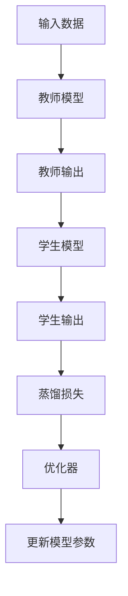

                 


# AI Agent的知识蒸馏链：多阶段LLM模型优化

## 关键词
- AI Agent
- 知识蒸馏链
- 多阶段LLM模型优化
- 深度学习
- 模型压缩
- 知识蒸馏

## 摘要
本文深入探讨了AI Agent在多阶段大型语言模型（LLM）优化中的应用，重点介绍了知识蒸馏链的概念、原理及其在LLM优化中的作用。通过分析知识蒸馏链的核心概念、算法原理、系统架构以及实际项目中的应用，本文详细展示了如何利用知识蒸馏链实现多阶段LLM模型优化。文章最后总结了优化策略，并展望了未来的研究方向。

---

# 第一部分：AI Agent与知识蒸馏链概述

## 第1章：AI Agent的基本概念

### 1.1 AI Agent的定义与特点
AI Agent（人工智能代理）是指能够感知环境、执行任务并做出决策的智能实体。AI Agent可以是软件程序、机器人或其他智能系统，其核心目标是通过自主决策和行动来实现特定目标。AI Agent的特点包括自主性、反应性、目标导向性和社会性。

### 1.2 AI Agent的核心功能与应用场景
AI Agent的核心功能包括感知环境、目标设定、决策制定和行动执行。应用场景广泛，如智能助手、自动驾驶、智能客服、推荐系统等。AI Agent在这些场景中通过实时数据处理和智能决策，显著提升了系统的效率和用户体验。

### 1.3 AI Agent与传统AI的区别
与传统AI相比，AI Agent具有更强的自主性和适应性。传统AI通常依赖于固定的规则和数据，而AI Agent能够动态调整行为以应对环境变化。AI Agent还具备更强的社交能力，能够与其他实体（包括人类和其他AI Agent）进行交互。

## 第2章：知识蒸馏链的定义与特点

### 2.1 知识蒸馏链的定义
知识蒸馏链是一种通过多阶段知识传递和优化，将复杂模型的知识迁移到更简单模型的技术。其核心在于利用教师模型（Teacher）的知识指导学生模型（Student）的学习，从而实现模型的压缩和优化。

### 2.2 知识蒸馏链的核心要素
知识蒸馏链的关键要素包括教师模型、学生模型、蒸馏损失函数和蒸馏过程。教师模型负责提供知识，学生模型负责学习和优化，蒸馏损失函数用于衡量学生模型与教师模型之间的差距，蒸馏过程则通过迭代优化实现知识的有效传递。

### 2.3 知识蒸馏链与传统模型优化的对比
传统模型优化技术如剪枝和量化主要关注减少模型参数数量，而知识蒸馏链更注重知识的传递和保留。知识蒸馏链能够更好地保持模型的性能，同时显著降低计算和存储成本。

---

# 第二部分：知识蒸馏链的原理与应用

## 第3章：知识蒸馏链的核心原理

### 3.1 知识蒸馏的数学模型
知识蒸馏的核心是通过最小化学生模型预测与教师模型预测之间的差异来优化学生模型。数学模型如下：

$$ L_{\text{distill}} = \alpha L_{\text{CE}} + (1-\alpha) L_{\text{KL}} $$

其中，$L_{\text{CE}}$是交叉熵损失，$L_{\text{KL}}$是KL散度，$\alpha$是平衡系数。

### 3.2 知识蒸馏链的流程图
知识蒸馏链的流程如下：



### 3.3 知识蒸馏链与AI Agent的结合
通过知识蒸馏链，AI Agent可以将复杂的决策过程迁移到更简单的模型中，从而实现高效决策和快速响应。

---

## 第4章：多阶段LLM模型优化策略

### 4.1 多阶段优化的核心思想
多阶段优化通过分阶段处理模型参数，逐步优化模型性能。核心思想包括预训练、微调和蒸馏阶段，每个阶段都有特定的目标和优化策略。

### 4.2 知识蒸馏链的分阶段优化
知识蒸馏链的分阶段优化包括：

1. **预训练阶段**：在大规模数据上训练教师模型。
2. **微调阶段**：针对特定任务对教师模型进行微调。
3. **蒸馏阶段**：将教师模型的知识迁移到学生模型。

### 4.3 多阶段优化的实现路径
实现路径包括：

1. **教师模型的选择与训练**：选择合适的教师模型并进行充分训练。
2. **学生模型的设计与优化**：设计适合知识蒸馏的学生模型，并优化其结构和参数。
3. **蒸馏过程的监控与调整**：监控蒸馏过程，动态调整蒸馏参数以达到最佳效果。

---

## 第5章：项目实战与优化效果评估

### 5.1 项目实战环境安装
需要安装以下库：
- PyTorch
- Transformers
- Mermaid

### 5.2 核心代码实现
以下是知识蒸馏链的核心代码示例：

```python
import torch
import torch.nn as nn
import torch.optim as optim
from torch.utils.data import DataLoader

# 定义教师模型和学生模型
class TeacherModel(nn.Module):
    def __init__(self):
        super(TeacherModel, self).__init__()
        # 定义教师模型的结构

class StudentModel(nn.Module):
    def __init__(self):
        super(StudentModel, self).__init__()
        # 定义学生模型的结构

# 定义蒸馏损失函数
class DistillLoss(nn.Module):
    def __init__(self, T=1.0):
        super(DistillLoss, self).__init__()
        self.T = T

    def forward(self, teacher_outputs, student_outputs):
        teacher_probs = torch.softmax(teacher_outputs / self.T, dim=1)
        student_probs = torch.softmax(student_outputs / self.T, dim=1)
        loss = -torch.sum(teacher_probs * torch.log(student_probs))
        return loss

# 定义优化器和损失函数
teacher_model = TeacherModel()
student_model = StudentModel()
distill_loss = DistillLoss()
optimizer = optim.Adam(student_model.parameters(), lr=1e-3)

# 训练过程
for epoch in range(num_epochs):
    for batch_data in dataloader:
        # 前向传播
        teacher_outputs = teacher_model(batch_data)
        student_outputs = student_model(batch_data)
        # 计算蒸馏损失
        loss = distill_loss(teacher_outputs, student_outputs)
        # 反向传播与优化
        optimizer.zero_grad()
        loss.backward()
        optimizer.step()
```

### 5.3 优化效果评估
优化效果评估包括以下指标：
- 模型参数减少比例
- 模型推理速度提升
- 模型性能（如准确率、F1分数）保持

---

## 第6章：总结与展望

### 6.1 总结
知识蒸馏链通过多阶段优化，有效提升了LLM模型的性能，同时显著降低了计算和存储成本。

### 6.2 未来展望
未来研究方向包括：
- 更高效的蒸馏算法
- 更灵活的模型结构
- 更广泛的应用场景

---

作者：AI天才研究院 & 禅与计算机程序设计艺术

