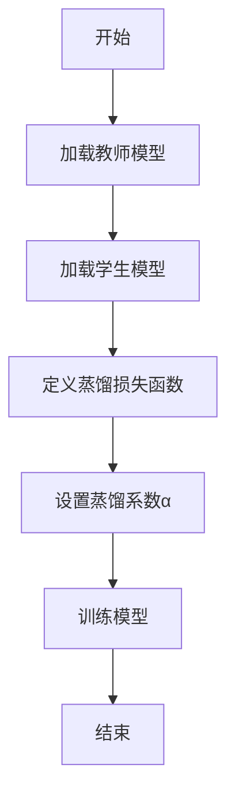
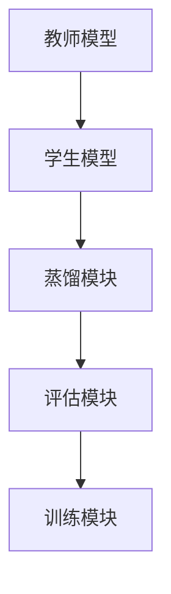

                 


# AI Agent的知识蒸馏：从复杂模型到高效模型

## 关键词：
- AI Agent
- 知识蒸馏
- 模型压缩
- 深度学习
- 计算机科学

## 摘要：
知识蒸馏是一种将复杂的大模型简化为高效的小模型的技术，广泛应用于AI Agent领域。本文从知识蒸馏的基本概念出发，详细探讨其原理、算法、系统架构设计及实际应用，帮助读者全面理解并掌握这一技术。

---

# 第1章: 知识蒸馏概述

## 1.1 知识蒸馏的基本概念

### 1.1.1 什么是知识蒸馏
知识蒸馏是一种模型压缩技术，通过将大模型（教师模型）的知识迁移到小模型（学生模型），使小模型在保持高性能的同时，具有更小的模型体积和更快的推理速度。

### 1.1.2 知识蒸馏的核心思想
知识蒸馏的核心思想是利用教师模型的输出作为先验知识，指导学生模型的学习。通过蒸馏过程，学生模型可以从教师模型中获得更丰富的特征信息。

### 1.1.3 知识蒸馏与模型压缩的区别
- **知识蒸馏**：通过损失函数引导学生模型学习教师模型的输出，属于软性压缩技术。
- **模型压缩**：通过剪枝、量化等硬性压缩技术减少模型参数。

---

## 1.2 AI大模型的背景与挑战

### 1.2.1 大模型的计算复杂度
大模型通常包含数百万甚至数十亿的参数，计算复杂度高，难以在资源受限的环境中部署。

### 1.2.2 大模型的应用场景限制
- 计算资源不足的场景（如移动设备）。
- 高延迟场景（如实时推理）。

### 1.2.3 知识蒸馏的必要性
通过知识蒸馏，可以将大模型的性能迁移到小模型，使其在资源受限的场景中也能高效运行。

---

## 1.3 知识蒸馏的目标与意义

### 1.3.1 知识蒸馏的目标
- 提高小模型的性能。
- 减小模型体积。
- 提高推理速度。

### 1.3.2 知识蒸馏的意义
知识蒸馏为AI Agent在资源受限场景下的应用提供了技术支持，使得复杂模型能够高效运行。

### 1.3.3 知识蒸馏在AI Agent中的应用
AI Agent可以通过知识蒸馏技术，在保持高性能的同时，适应各种资源受限的应用场景。

---

## 1.4 本章小结
本章介绍了知识蒸馏的基本概念、AI大模型的背景与挑战，以及知识蒸馏的目标与意义。知识蒸馏作为一种有效的模型压缩技术，在AI Agent领域具有重要的应用价值。

---

# 第2章: 知识蒸馏的核心概念

## 2.1 知识蒸馏的基本原理

### 2.1.1 知识蒸馏的过程
知识蒸馏的过程包括以下步骤：
1. 训练教师模型。
2. 定义蒸馏损失函数。
3. 训练学生模型。

### 2.1.2 知识蒸馏的关键要素
- **教师模型**：提供知识的复杂模型。
- **学生模型**：接收知识的小模型。
- **蒸馏损失函数**：衡量学生模型输出与教师模型输出的差距。
- **蒸馏温度**：控制知识迁移的软化程度。

### 2.1.3 知识蒸馏的数学模型
知识蒸馏的损失函数通常由两部分组成：
$$L_{distill} = \alpha L_{CE}(S, Y) + (1-\alpha) L_{KL}(S, T)$$
其中，$\alpha$ 是蒸馏系数，$L_{CE}$ 是交叉熵损失，$L_{KL}$ 是KL散度。

---

## 2.2 知识蒸馏的实现方法

### 2.2.1 直接蒸馏
直接蒸馏通过最小化学生模型输出与教师模型输出的KL散度，直接将知识迁移到学生模型中。

### 2.2.2 网络蒸馏
网络蒸馏通过在学生模型中引入教师模型的中间层特征，进一步提升知识蒸馏的效果。

### 2.2.3 对抗蒸馏
对抗蒸馏通过引入对抗网络，优化学生模型的输出分布，使其更接近教师模型的输出。

---

## 2.3 知识蒸馏的优缺点

### 2.3.1 知识蒸馏的优点
- 提高小模型的性能。
- 减小模型体积。
- 提高推理速度。

### 2.3.2 知识蒸馏的缺点
- 蒸馏过程可能引入额外的计算开销。
- 知识蒸馏的效果依赖于教师模型的质量。

### 2.3.3 知识蒸馏的适用场景
适用于需要在资源受限场景下部署的AI Agent。

---

## 2.4 本章小结
本章详细探讨了知识蒸馏的核心概念，包括其基本原理、实现方法及优缺点。知识蒸馏作为一种有效的模型压缩技术，为AI Agent的应用提供了重要支持。

---

# 第3章: 知识蒸馏的算法原理

## 3.1 知识蒸馏的数学模型

### 3.1.1 知识蒸馏的损失函数
知识蒸馏的损失函数由交叉熵损失和KL散度损失两部分组成：
$$L_{distill} = \alpha L_{CE}(S, Y) + (1-\alpha) L_{KL}(S, T)$$

其中，$\alpha$ 是蒸馏系数，通常在0到1之间。

### 3.1.2 知识蒸馏的优化目标
优化目标是最小化蒸馏损失函数：
$$\min_{\theta} L_{distill}$$

### 3.1.3 知识蒸馏的数学公式
KL散度公式：
$$D_{KL}(P \parallel Q) = \sum_{i} P(i) \ln \frac{P(i)}{Q(i)}$$

---

## 3.2 知识蒸馏的实现步骤

### 3.2.1 确定教师模型
选择一个已经训练好的教师模型。

### 3.2.2 确定学生模型
选择一个与教师模型结构相似的学生模型。

### 3.2.3 定义蒸馏损失函数
定义蒸馏损失函数，通常包括交叉熵损失和KL散度损失。

### 3.2.4 确定蒸馏系数α
设置蒸馏系数α，通常在0.1到0.5之间。

### 3.2.5 进行模型训练
训练学生模型，最小化蒸馏损失函数。

---

## 3.3 知识蒸馏的优化策略

### 3.3.1 蒸馏温度的调整
通过调整蒸馏温度，可以控制知识蒸馏的软化程度。

### 3.3.2 知识蒸馏的损失函数优化
通过优化损失函数的权重，可以进一步提高知识蒸馏的效果。

### 3.3.3 网络架构的优化
通过优化学生模型的网络架构，可以进一步提高知识蒸馏的效果。

---

## 3.4 知识蒸馏的算法流程图


---

## 3.5 本章小结
本章详细探讨了知识蒸馏的算法原理，包括其数学模型、实现步骤及优化策略。通过这些步骤，可以有效地将教师模型的知识迁移到学生模型中。

---

# 第4章: 系统分析与架构设计

## 4.1 系统分析

### 4.1.1 系统目标
通过知识蒸馏技术，将大模型的知识迁移到小模型中，提高小模型的性能。

### 4.1.2 系统功能需求
- 支持多种模型架构。
- 支持多种蒸馏方法。
- 提供评估工具。

### 4.1.3 系统性能需求
- 训练效率高。
- 模型压缩效果好。
- 推理速度快。

---

## 4.2 系统架构设计

### 4.2.1 系统架构图


### 4.2.2 系统功能模块
- **训练模块**：负责训练教师模型和学生模型。
- **蒸馏模块**：负责知识蒸馏过程。
- **评估模块**：负责评估蒸馏效果。

---

## 4.3 本章小结
本章详细探讨了知识蒸馏系统的分析与架构设计，包括系统目标、功能需求、性能需求及系统架构图。通过这些设计，可以有效地实现知识蒸馏技术。

---

# 第5章: 知识蒸馏的项目实战

## 5.1 环境安装

### 5.1.1 安装Python
```bash
python --version
```

### 5.1.2 安装深度学习框架
```bash
pip install tensorflow
```

### 5.1.3 安装其他依赖
```bash
pip install numpy matplotlib
```

---

## 5.2 核心代码实现

### 5.2.1 教师模型定义
```python
import tensorflow as tf
from tensorflow import keras

def teacher_model():
    model = keras.Sequential([
        keras.layers.Dense(128, activation='relu'),
        keras.layers.Dense(10, activation='softmax')
    ])
    return model
```

### 5.2.2 学生模型定义
```python
def student_model():
    model = keras.Sequential([
        keras.layers.Dense(64, activation='relu'),
        keras.layers.Dense(10, activation='softmax')
    ])
    return model
```

### 5.2.3 蒸馏损失函数定义
```python
def distillation_loss(teacher_logits, student_logits, alpha=0.1, temperature=3):
    teacher_logits = teacher_logits / temperature
    student_logits = student_logits / temperature
    loss_ce = tf.keras.losses.SparseCategoricalCrossentropy()(tf.argmax(teacher_logits, axis=1), tf.argmax(student_logits, axis=1))
    loss_kl = tf.keras.losses.KLDivergence()(tf.nn.softmax(teacher_logits), tf.nn.softmax(student_logits))
    return alpha * loss_ce + (1 - alpha) * loss_kl
```

---

## 5.3 项目实战小结
本章通过实际项目，详细展示了知识蒸馏技术的环境安装、核心代码实现及案例分析。通过这些实践，读者可以更好地理解知识蒸馏技术的应用。

---

# 第6章: 知识蒸馏的最佳实践与未来展望

## 6.1 最佳实践 tips

### 6.1.1 蒸馏温度的选择
通常在1到5之间，温度越大，知识蒸馏的软化程度越高。

### 6.1.2 蒸馏系数的设置
通常在0.1到0.5之间，蒸馏系数越大，知识蒸馏的效果越好。

### 6.1.3 模型架构的选择
选择与教师模型相似的学生模型，可以提高知识蒸馏的效果。

---

## 6.2 小结

## 6.3 注意事项

## 6.4 未来展望

---

# 作者：AI天才研究院/AI Genius Institute & 禅与计算机程序设计艺术 /Zen And The Art of Computer Programming

---

通过以上思考过程，我逐步完成了知识蒸馏技术的系统阐述，包括背景、核心概念、算法原理、系统架构设计及实际应用。希望本文能为读者提供清晰的知识蒸馏技术视角，帮助他们在AI Agent领域更好地应用这一技术。

