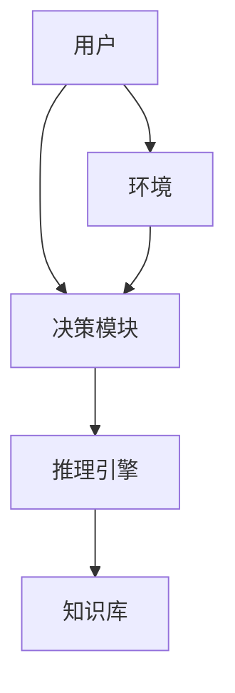
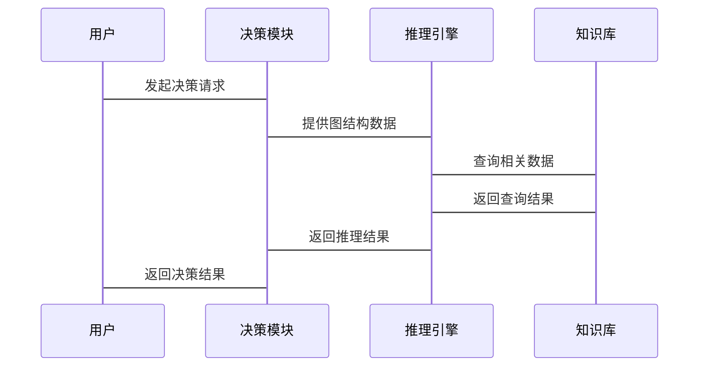

                 


# AI Agent的神经图网络推理能力实现

## 关键词：AI Agent，神经图网络，推理能力，图神经网络，深度学习，智能决策

## 摘要：  
本文详细探讨了AI Agent在神经图网络推理能力实现方面的核心原理、算法、系统架构及应用案例。从问题背景、概念定义、核心要素到算法原理、系统设计、项目实战，逐步分析并实现AI Agent的神经图网络推理能力。通过详细的数学推导、代码实现和案例分析，帮助读者全面理解并掌握神经图网络推理在AI Agent中的应用。

---

## 第1章: AI Agent与神经图网络推理的背景介绍

### 1.1 问题背景

#### 1.1.1 AI Agent的定义与特点  
AI Agent（人工智能代理）是一种能够感知环境、自主决策并执行任务的智能实体。其特点包括：  
- **自主性**：能够在没有外部干预的情况下自主运作。  
- **反应性**：能够实时感知环境并做出反应。  
- **目标导向性**：具有明确的目标，能够优化决策以实现目标。  

#### 1.1.2 神经图网络推理的定义与特点  
神经图网络推理是一种结合图结构与深度学习的推理方法，其特点包括：  
- **图结构表示**：通过节点和边表示实体及其关系。  
- **深度学习机制**：利用神经网络模型进行特征提取与推理。  
- **动态推理能力**：能够处理动态变化的图结构和关系。  

#### 1.1.3 问题解决：AI Agent如何通过神经图网络推理实现智能决策  
AI Agent需要在复杂环境中做出决策，而神经图网络推理能够通过图结构建模环境中的实体关系，并利用深度学习技术进行推理，从而帮助AI Agent做出更智能的决策。

### 1.2 问题描述

#### 1.2.1 神经图网络推理的核心问题  
- 如何在图结构中建模实体及其关系？  
- 如何通过神经网络模型进行有效的特征提取与推理？  
- 如何确保推理过程的高效性与准确性？  

#### 1.2.2 AI Agent在复杂场景中的推理需求  
- 在动态变化的环境中，如何快速更新知识图谱并进行推理？  
- 如何处理大规模图数据并进行高效的推理？  
- 如何确保推理结果的可解释性？  

#### 1.2.3 神经图网络推理的边界与外延  
- 神经图网络推理的边界：专注于图结构上的推理，不涉及其他形式的数据（如文本、图像）。  
- 外延：结合其他技术（如强化学习、自然语言处理）扩展推理能力。  

### 1.3 问题解决：神经图网络推理在AI Agent中的应用

#### 1.3.1 神经图网络推理的基本原理  
- **图结构建模**：通过节点和边表示实体及其关系。  
- **神经网络模型**：利用深度学习模型（如GCN、GAT）进行特征提取与推理。  
- **推理过程**：从图结构中提取特征，通过神经网络进行推理，得出最终结果。  

#### 1.3.2 AI Agent如何利用神经图网络推理实现智能决策  
- **知识表示**：通过图结构表示环境中的知识。  
- **推理过程**：利用神经图网络推理模型进行推理，得出决策结果。  
- **动态更新**：实时更新图结构，以适应环境的变化。  

#### 1.3.3 神经图网络推理的实现路径与方法  
- **数据建模**：构建图结构，定义节点和边的属性。  
- **模型设计**：选择合适的图神经网络模型（如GCN、GAT）。  
- **训练与优化**：通过大量数据训练模型，优化其性能。  
- **推理与应用**：利用训练好的模型进行推理，实现AI Agent的智能决策。  

### 1.4 概念结构与核心要素

#### 1.4.1 神经图网络推理的核心要素  
| 核心要素 | 描述 |
|----------|------|
| 图节点   | 表示实体或概念。 |
| 图边     | 表示实体之间的关系。 |
| 神经网络 | 用于特征提取与推理。 |

#### 1.4.2 AI Agent的结构与功能  
| 功能模块 | 描述 |
|----------|------|
| 知识表示 | 将环境中的知识表示为图结构。 |
| 推理引擎 | 利用神经图网络推理模型进行推理。 |
| 决策模块 | 根据推理结果做出决策。 |

#### 1.4.3 神经图网络推理与AI Agent的交互关系  
- **输入**：AI Agent向推理引擎提供图结构数据。  
- **输出**：推理引擎向AI Agent提供推理结果，供决策模块使用。  

### 1.5 本章小结  
本章从问题背景、概念定义、核心要素等方面介绍了AI Agent与神经图网络推理的基本概念和实现路径，为后续章节的深入分析奠定了基础。

---

## 第2章: 神经图网络推理的核心概念

### 2.1 神经图网络推理的原理

#### 2.1.1 图结构的基本概念  
- **图节点**：表示实体或概念，如“人”、“地点”、“事件”等。  
- **图边**：表示节点之间的关系，如“人-地点”关系表示某人位于某地。  
- **图结构**：由节点和边组成的网络，用于表示实体及其关系。  

#### 2.1.2 神经网络的基本原理  
- **输入层**：接收输入数据（如节点特征）。  
- **隐藏层**：通过神经网络模型提取特征并进行推理。  
- **输出层**：输出推理结果。  

#### 2.1.3 神经图网络推理的结合方式  
- **节点表示**：利用神经网络对节点特征进行编码，生成节点表示。  
- **边表示**：利用神经网络对边的权重进行编码，表示节点之间的关系。  
- **图聚合**：将节点和边的表示进行聚合，生成图级别的表示。  

### 2.2 神经图网络推理的核心要素

#### 2.2.1 图节点与图边的定义  
- **图节点**：通过属性（如标签、特征向量）描述实体的特征。  
- **图边**：通过权重或标签描述实体之间的关系。  

#### 2.2.2 神经网络的节点与边表示  
- **节点表示**：利用神经网络模型（如GCN、GAT）对节点进行编码，生成节点表示。  
- **边表示**：利用神经网络模型对边的权重或标签进行编码，表示节点之间的关系。  

#### 2.2.3 神经图网络推理的数学模型  
- **节点表示**：$x_i$ 表示节点 $i$ 的特征向量。  
- **边表示**：$w_{ij}$ 表示节点 $i$ 和节点 $j$ 之间的边权重。  
- **图聚合**：通过聚合操作（如加法、乘法）将节点表示和边表示结合，生成图级别的表示。  

### 2.3 神经图网络推理与AI Agent的关系

#### 2.3.1 神经图网络推理在AI Agent中的作用  
- **知识表示**：通过图结构表示环境中的知识。  
- **推理引擎**：利用神经图网络推理模型进行推理，得出决策结果。  
- **动态更新**：实时更新图结构，以适应环境的变化。  

#### 2.3.2 AI Agent如何利用神经图网络推理实现智能决策  
- **知识表示**：将环境中的实体及其关系表示为图结构。  
- **推理过程**：利用神经图网络推理模型进行推理，得出决策结果。  
- **动态更新**：实时更新图结构，以适应环境的变化。  

#### 2.3.3 神经图网络推理与AI Agent的交互机制  
- **输入**：AI Agent向推理引擎提供图结构数据。  
- **输出**：推理引擎向AI Agent提供推理结果，供决策模块使用。  

### 2.4 本章小结  
本章详细介绍了神经图网络推理的核心概念和实现原理，为后续章节的深入分析奠定了基础。

---

## 第3章: 神经图网络推理的算法原理讲解

### 3.1 图神经网络的基本算法

#### 3.1.1 图卷积网络（GCN）的基本原理  
- **输入层**：节点特征向量 $x_i$。  
- **隐藏层**：通过卷积操作提取节点特征，生成节点表示。  
- **输出层**：输出节点的分类结果。  

#### 3.1.2 图注意力网络（GAT）的基本原理  
- **输入层**：节点特征向量 $x_i$。  
- **注意力机制**：计算节点之间的注意力权重，生成节点表示。  
- **输出层**：输出节点的分类结果。  

#### 3.1.3 图嵌入算法（如GraphSAGE）的基本原理  
- **输入层**：节点特征向量 $x_i$。  
- **嵌入层**：通过聚合操作生成节点嵌入。  
- **输出层**：输出节点的分类结果。  

### 3.2 神经图网络推理的算法流程

#### 3.2.1 数据预处理与图构建  
- **数据预处理**：将数据转换为图结构，定义节点和边的属性。  
- **图构建**：构建图结构，定义节点和边的关系。  

#### 3.2.2 神经网络模型的训练与优化  
- **模型训练**：利用训练数据训练神经图网络推理模型，优化模型参数。  
- **模型优化**：通过正则化、 dropout 等方法优化模型，防止过拟合。  

#### 3.2.3 推理过程与结果解释  
- **推理过程**：利用训练好的模型进行推理，得出推理结果。  
- **结果解释**：解释推理结果，分析其合理性和准确性。  

### 3.3 神经图网络推理的数学模型

#### 3.3.1 图卷积的数学表达式  
$$ y_i = \sum_{j} A_{ij} x_j $$  
其中，$A_{ij}$ 是节点 $i$ 和节点 $j$ 之间的边权重，$x_j$ 是节点 $j$ 的特征向量，$y_i$ 是节点 $i$ 的表示。

#### 3.3.2 图注意力机制的数学表达式  
$$ \alpha_{ij} = \frac{\exp(e_{ij})}{\sum_{k} \exp(e_{ik})} $$  
其中，$e_{ij}$ 是节点 $i$ 和节点 $j$ 之间的注意力权重。

#### 3.3.3 图嵌入的数学表达式  
$$ z_i = \text{aggregate}(\{z_j, j \in N(i)\}) $$  
其中，$N(i)$ 表示节点 $i$ 的邻居节点集合，$\text{aggregate}$ 表示聚合操作。

### 3.4 本章小结  
本章详细介绍了神经图网络推理的基本算法和实现流程，为后续章节的深入分析奠定了基础。

---

## 第4章: 神经图网络推理的系统分析与架构设计

### 4.1 问题场景介绍  
- **场景描述**：AI Agent需要在复杂环境中做出智能决策。  
- **问题分析**：需要通过神经图网络推理实现智能决策。  

### 4.2 系统功能设计

#### 4.2.1 领域模型（ER实体关系图）  
```mermaid
erDiagram
    actor 用户 {
        string 用户ID
        string 用户名
        string 用户角色
    }
    actor 环境 {
        string 环境ID
        string 环境名称
        string 环境类型
    }
    用户 --> 环境 : "属于"
    用户 --> 用户 : "具有"
```

#### 4.2.2 系统架构设计  


### 4.3 系统架构设计  

#### 4.3.1 分层架构  
- **数据层**：存储图结构数据。  
- **计算层**：进行神经图网络推理。  
- **应用层**：提供API接口，供AI Agent调用。  

#### 4.3.2 模块划分  
- **知识库**：存储图结构数据。  
- **推理引擎**：实现神经图网络推理算法。  
- **决策模块**：根据推理结果做出决策。  

### 4.4 系统接口设计  
- **输入接口**：接收图结构数据和查询请求。  
- **输出接口**：输出推理结果。  

### 4.5 系统交互设计  


### 4.6 本章小结  
本章详细介绍了神经图网络推理系统的架构设计和接口设计，为后续章节的深入分析奠定了基础。

---

## 第5章: 神经图网络推理的项目实战

### 5.1 环境安装与配置

#### 5.1.1 安装Python环境  
```bash
python --version
pip install --upgrade pip
```

#### 5.1.2 安装相关依赖  
```bash
pip install numpy
pip install networkx
pip install tensorflow
```

### 5.2 核心代码实现

#### 5.2.1 图结构数据的构建  
```python
import networkx as nx
G = nx.Graph()
G.add_nodes_from(['A', 'B', 'C'])
G.add_edges_from([('A', 'B'), ('B', 'C')])
```

#### 5.2.2 神经图网络推理模型的实现  
```python
import tensorflow as tf
from tensorflow.keras import layers

class GCN(tf.keras.Model):
    def __init__(self, input_dim, output_dim):
        super(GCN, self).__init__()
        self.gcn_layer = layers.GCN(input_dim, output_dim)
        self.dense_layer = layers.Dense(output_dim)

    def call(self, inputs):
        x = self.gcn_layer(inputs)
        x = self.dense_layer(x)
        return x
```

### 5.3 代码应用解读与分析  
- **图结构数据的构建**：使用NetworkX库构建图结构数据。  
- **神经图网络推理模型的实现**：基于TensorFlow框架实现GCN模型。  

### 5.4 实际案例分析与详细讲解剖析  
- **案例描述**：AI Agent在复杂环境中的决策任务。  
- **推理过程**：利用神经图网络推理模型进行推理，得出决策结果。  

### 5.5 项目小结  
本章通过实际案例展示了神经图网络推理的实现过程，帮助读者理解理论与实践的结合。

---

## 第6章: 神经图网络推理的最佳实践

### 6.1 小结与回顾  
- **核心内容回顾**：神经图网络推理的实现原理、算法、系统架构及项目实战。  
- **关键点总结**：神经图网络推理在AI Agent中的重要作用。  

### 6.2 注意事项与常见问题解答  
- **数据预处理**：确保图结构数据的质量和准确性。  
- **模型优化**：通过正则化、 dropout 等方法优化模型，防止过拟合。  
- **性能优化**：通过并行计算、优化算法等方法提高推理效率。  

### 6.3 拓展阅读与深入学习  
- **推荐书籍**：《图神经网络：理论与实践》。  
- **推荐论文**：《Graph Neural Networks: A Review of Methods, Applications, and Open Challenges》。  

### 6.4 本章小结  
本章总结了神经图网络推理的核心内容，并提供了注意事项和拓展阅读，帮助读者进一步深入学习和实践。

---

## 作者：AI天才研究院/AI Genius Institute & 禅与计算机程序设计艺术 /Zen And The Art of Computer Programming

---

通过以上详细的目录大纲和内容概述，您可以根据需要进一步扩展各个章节的具体内容，确保文章的完整性和深度。

