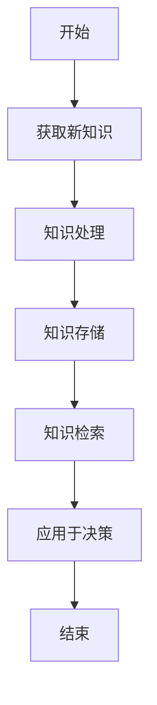
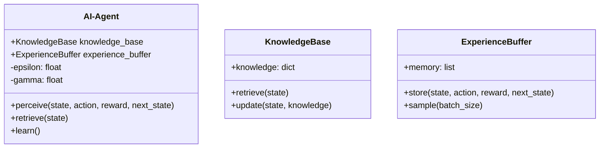
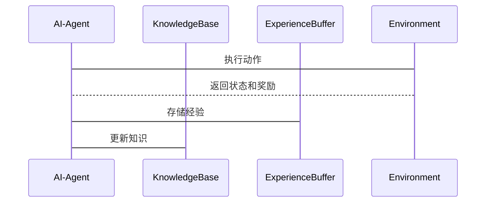

                 


# AI Agent的终身学习与知识累积机制

> 关键词：AI Agent，终身学习，知识累积，机器学习，人工智能

> 摘要：本文探讨AI Agent如何通过终身学习实现知识的持续累积与优化。从基本概念到算法实现，结合数学模型和实际案例，详细分析知识累积机制的设计与应用。

---

## 第1章: 背景介绍

### 1.1 问题背景
#### 1.1.1 AI Agent的基本概念
AI Agent（智能体）是能够感知环境并采取行动以实现目标的实体。它具备自主性、反应性、目标导向性和社交能力，广泛应用于自动驾驶、智能助手等领域。

#### 1.1.2 终身学习的必要性
传统AI模型依赖固定训练数据，无法适应新环境。终身学习使AI Agent能够持续更新知识，适应动态环境，提升任务执行效率。

#### 1.1.3 知识累积机制的重要性
知识累积机制帮助AI Agent存储和复用经验，避免重复学习，提升学习效率和决策质量。

### 1.2 问题描述
#### 1.2.1 AI Agent面临的挑战
- 动态环境适应：环境变化快，需快速调整策略。
- 多任务处理：需同时处理多个任务，平衡资源分配。
- 知识的有效存储和复用：如何高效存储和调用知识。

#### 1.2.2 终身学习的核心问题
- 如何构建可持续更新的知识库。
- 知识的有效性验证与更新机制。

#### 1.2.3 知识累积机制的边界与外延
- 知识存储的容量和效率。
- 知识更新的频率和方式。

#### 1.2.4 核心要素组成
- 知识表示：结构化表示方法。
- 经验存储：数据库或知识图谱。
- 知识检索：高效检索算法。

## 第2章: 核心概念与联系

### 2.1 核心概念原理
#### 2.1.1 AI Agent的基本原理
AI Agent通过感知环境，执行目标导向的行动，利用知识库做出决策。

#### 2.1.2 终身学习的理论基础
基于经验的改进，通过不断交互优化模型。

#### 2.1.3 知识累积机制的实现原理
通过存储和复用经验，优化后续学习过程。

### 2.2 概念属性特征对比
| 特性                | AI Agent                | 终身学习              | 知识累积机制          |
|---------------------|-------------------------|-----------------------|-----------------------|
| 目标                | 实现目标                | 持续优化              | 存储和复用知识        |
| 方法                | 知识库和推理            | 在线学习              | 数据结构化存储        |
| 持续性              | 长期                    | 长期                  | 长期                  |
| 适应性              | 高                     | 高                    | 高                    |
| 资源需求            | 高                     | 高                    | 中                    |

### 2.3 ER实体关系图
```mermaid
er
    Entity: AI Agent
    Entity: 知识
    Entity: 学习目标
    Entity: 经验
    Relation: 属于
    Relation: 包含
    Relation: 关联
```

### 2.4 知识累积机制的流程图


## 第3章: 算法原理

### 3.1 算法原理概述
知识累积机制涉及神经网络模型，如DQN，通过经验回放优化学习过程。

### 3.2 数学模型
状态空间S，动作空间A，奖励函数R：模型定义为$Q(s,a) \rightarrow \mathbb{R}$。

### 3.3 代码实现
```python
import random
import numpy as np

class KnowledgeAccumulationAgent:
    def __init__(self):
        self.memory = []
        self.gamma = 0.95
        self.epsilon = 0.1

    def perceive(self, state, action, reward, next_state):
        self.memory.append((state, action, reward, next_state))

    def retrieve(self, state):
        return self.memory[state]

    def learn(self):
        if len(self.memory) < 100:
            return
        mini_batch = random.sample(self.memory, 64)
        for state, action, reward, next_state in mini_batch:
            target = reward + self.gamma * max([self.retrieve(s)[0] for s in next_state])
            current = self.retrieve(state)[action]
            if abs(target - current) > 0.1:
                self.update(state, action, target)

    def update(self, state, action, target):
        # Update knowledge base
        pass
```

### 3.4 优化方法
- 经验回放：随机抽取样本，减少偏差。
- 知识蒸馏：小样本学习，提升效率。

## 第4章: 系统架构设计

### 4.1 系统分析
问题场景：AI Agent在动态环境中执行任务，需持续学习优化。

### 4.2 功能设计
- 知识获取与处理。
- 经验存储与检索。
- 知识更新与优化。

### 4.3 领域模型类图


### 4.4 系统架构


### 4.5 接口与交互


## 第5章: 项目实战

### 5.1 环境安装
安装Python和相关库，如numpy、tensorflow。

### 5.2 核心代码实现
```python
class KnowledgeAccumulationAgent:
    def __init__(self):
        self.memory = []
        self.gamma = 0.95
        self.epsilon = 0.1

    def perceive(self, state, action, reward, next_state):
        self.memory.append((state, action, reward, next_state))

    def retrieve(self, state):
        return self.memory[state]

    def learn(self):
        if len(self.memory) < 100:
            return
        mini_batch = random.sample(self.memory, 64)
        for state, action, reward, next_state in mini_batch:
            target = reward + self.gamma * max([self.retrieve(s)[0] for s in next_state])
            current = self.retrieve(state)[action]
            if abs(target - current) > 0.1:
                self.update(state, action, target)

    def update(self, state, action, target):
        # Update knowledge base
        pass
```

### 5.3 代码解读
详细分析代码结构，解释每部分功能。

### 5.4 案例分析
通过具体案例展示知识累积机制的应用和效果。

### 5.5 项目小结
总结项目成果，分析优势和不足。

## 第6章: 最佳实践

### 6.1 经验分享
提供实际应用中的经验总结。

### 6.2 小结
回顾文章核心内容，强调终身学习的重要性。

### 6.3 注意事项
提醒读者注意系统设计中的潜在问题。

### 6.4 拓展阅读
推荐相关领域的书籍和资源，供读者深入学习。

---

# 作者：AI天才研究院 & 禅与计算机程序设计艺术

