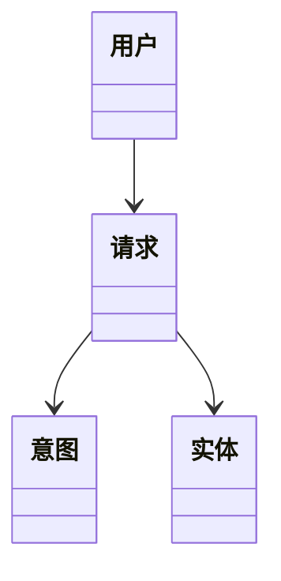
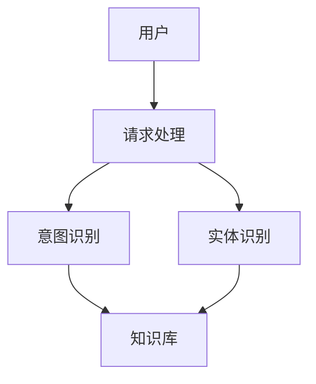
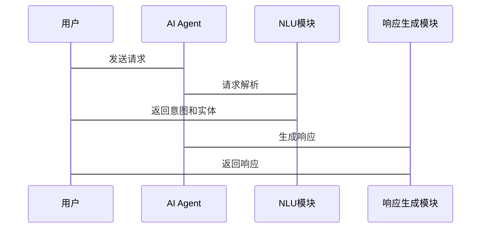

                 


# AI Agent的自然语言理解能力：NLU技术深度解析

> 关键词：自然语言理解（NLU）、AI Agent、意图识别、语义分析、深度学习

> 摘要：本文将深入探讨AI Agent的自然语言理解（NLU）能力，从NLU的基本概念到其在AI Agent中的应用，再到NLU的核心算法和系统架构，最后结合实际案例进行分析。文章旨在帮助读者全面理解NLU技术的原理和实现，并为实际应用提供指导。

---

# 第1章: 自然语言理解（NLU）的基本概念

## 1.1 NLU的定义与作用

### 1.1.1 自然语言理解的定义
自然语言理解（Natural Language Understanding, NLU）是人工智能领域的重要分支，旨在使计算机能够理解人类的自然语言输入。NLU的目标是将输入的文本或语音转换为计算机可以处理的结构化信息。

$$\text{NLU的目标是将自然语言输入转换为结构化输出}$$

NLU在AI Agent中的作用至关重要，它负责解析用户的输入，提取意图和实体，从而为后续的处理提供支持。

### 1.1.2 NLU在AI Agent中的作用
AI Agent需要与用户进行交互，理解用户的意图是实现智能交互的基础。NLU技术帮助AI Agent准确理解用户的输入，从而提供更精准的服务。

### 1.1.3 NLU的核心目标与应用场景
- **核心目标**：将自然语言输入转换为计算机可理解的结构化信息。
- **应用场景**：智能客服、智能音箱、聊天机器人等。

## 1.2 NLU的发展历程

### 1.2.1 从规则驱动到数据驱动的转变
早期的NLU技术主要基于规则，通过预定义的规则来匹配用户的输入。随着深度学习的发展，数据驱动的方法逐渐成为主流。

### 1.2.2 深度学习对NLU的推动作用
深度学习的引入显著提升了NLU的性能，尤其是在语义理解和上下文处理方面。

### 1.2.3 当前NLU技术的瓶颈与未来方向
尽管NLU技术取得了长足进步，但在处理歧义性和复杂语义方面仍存在挑战。未来的研究方向包括多模态交互和跨语言理解。

## 1.3 NLU技术的关键挑战

### 1.3.1 语言的歧义性问题
自然语言中存在多种歧义性，例如词汇歧义和句法歧义。

### 1.3.2 领域知识的局限性
NLU系统的性能依赖于训练数据的质量和多样性。

### 1.3.3 数据质量和多样性的挑战
数据质量和多样性直接影响NLU系统的泛化能力。

---

# 第2章: AI Agent与NLU的关系

## 2.1 AI Agent的基本概念

### 2.1.1 AI Agent的定义与分类
AI Agent是一种智能体，能够感知环境并执行任务。根据智能性，AI Agent可以分为简单和复杂两类。

### 2.1.2 AI Agent的核心功能与能力
AI Agent的核心功能包括感知、推理、决策和执行。

### 2.1.3 AI Agent与人类交互的特点
AI Agent需要能够理解用户的输入并生成自然语言的输出。

## 2.2 NLU在AI Agent中的核心作用

### 2.2.1 NLU作为AI Agent的“耳朵”
NLU负责解析用户的输入，提取意图和实体。

### 2.2.2 NLU与AI Agent其他能力的协同
NLU与自然语言生成（NLG）协同工作，共同实现智能交互。

### 2.2.3 NLU对提升用户体验的重要性
准确理解用户意图可以显著提升用户体验。

## 2.3 NLU在AI Agent中的技术实现

### 2.3.1 NLU的输入输出模型
输入：用户输入的自然语言文本；
输出：结构化意图和实体信息。

### 2.3.2 NLU的语义分析流程
1. 分词与词性标注；
2. 实体识别与链接；
3. 意图识别与槽位填充；
4. 语义解析与推理。

### 2.3.3 NLU的训练与优化
基于深度学习的模型训练，如Transformer架构。

## 2.4 本章小结

---

# 第3章: NLU技术的核心原理

## 3.1 NLU的主要任务与模块

### 3.1.1 分词与词性标注
分词将文本划分为词语，词性标注为每个词语标注词性。

### 3.1.2 实体识别与链接
实体识别识别文本中的实体，实体链接将实体映射到知识库。

### 3.1.3 意图识别与槽位填充
意图识别确定用户的意图，槽位填充提取与意图相关的参数。

### 3.1.4 语义解析与推理
语义解析将意图和槽位信息转换为可执行的结构化数据。

## 3.2 NLU的关键技术与方法

### 3.2.1 基于统计的NLU
使用机器学习算法，如支持向量机（SVM）和随机森林。

### 3.2.2 基于深度学习的NLU
使用神经网络模型，如卷积神经网络（CNN）和循环神经网络（RNN）。

### 3.2.3 预训练语言模型
如BERT和GPT，通过大规模预训练提升NLU性能。

## 3.3 NLU的算法实现

### 3.3.1 基于CRF的意图识别
条件随机场（CRF）用于序列标注任务，如意图识别。

### 3.3.2 基于Transformer的语义分析
Transformer架构通过自注意力机制捕捉长距离依赖关系。

## 3.4 NLU的数学模型

### 3.4.1 CRF模型
$$P(y|x) = \frac{1}{Z} \exp\left(\sum_{i=1}^n \sum_{j=i}^n w_{i,j} x_{i,j}\right)$$

### 3.4.2 Transformer模型
$$\text{多头注意力机制}$$

---

# 第4章: 系统分析与架构设计

## 4.1 问题场景介绍
以智能客服系统为例，分析NLU技术的应用场景。

## 4.2 系统功能设计

### 4.2.1 领域模型设计
使用Mermaid绘制领域模型类图。



### 4.2.2 系统架构设计
使用Mermaid绘制系统架构图。



## 4.3 系统接口设计
定义NLU模块与AI Agent的交互接口。

## 4.4 系统交互流程

### 4.4.1 序列图分析
使用Mermaid绘制系统交互序列图。



---

# 第5章: 项目实战

## 5.1 项目介绍
以智能客服系统为例，展示NLU技术的实际应用。

## 5.2 核心代码实现

### 5.2.1 环境安装
安装Python和相关库，如spaCy和transformers。

### 5.2.2 核心代码实现
使用spaCy进行分词和实体识别，使用预训练模型进行意图识别。

```python
import spacy

nlp = spacy.load("en_core_web_sm")
doc = nlp("我需要取消我的订单")
for token in doc:
    print(token.text, token.pos_)
```

## 5.3 代码解读与分析
详细解释代码的功能和实现原理。

## 5.4 实际案例分析
分析智能客服系统中的一个具体案例，展示NLU技术的应用效果。

## 5.5 项目小结

---

# 第6章: 最佳实践与总结

## 6.1 小结
总结全文，强调NLU技术的重要性及其在AI Agent中的核心作用。

## 6.2 注意事项
提示读者在实际应用中需要注意的问题，如数据质量和模型调优。

## 6.3 拓展阅读
推荐相关书籍和论文，供读者进一步学习。

---

# 作者：AI天才研究院 & 禅与计算机程序设计艺术

---

本文通过系统化的结构和详实的内容，深入探讨了AI Agent的自然语言理解能力及其核心算法。从背景介绍到项目实战，全面解析了NLU技术的原理和应用，为读者提供了宝贵的技术参考和实践指导。

