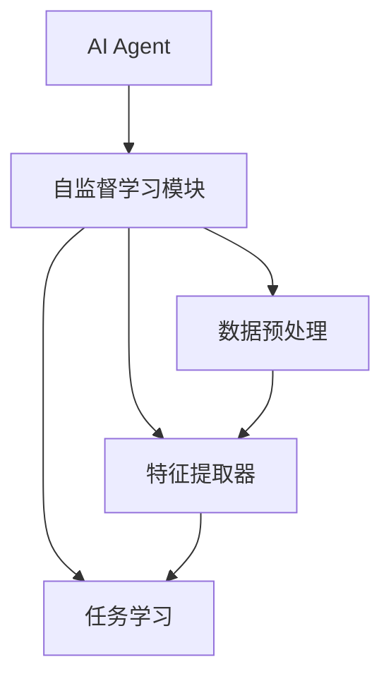
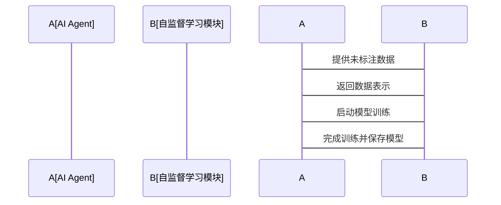

                 


# AI Agent的自监督表示学习：减少标注数据依赖

## 关键词：自监督学习，AI Agent，表示学习，生成对抗网络，对比学习

## 摘要：  
自监督表示学习是一种无需大量标注数据的机器学习方法，通过利用未标注数据中的潜在结构来学习数据的有用表示。本文详细探讨了AI Agent在自监督表示学习中的应用，分析了其核心原理、算法实现、系统架构，并通过实际案例展示了如何减少对标注数据的依赖。文章从背景介绍到项目实战，全面解析了自监督表示学习的关键技术，为AI Agent的研究和应用提供了新的思路。

---

# 第一部分: 自监督学习的背景与核心概念

## 第1章: 自监督学习概述

### 1.1 自监督学习的定义与背景

自监督学习（Self-Supervised Learning, SSL）是一种无监督学习的变体，通过利用数据本身的标签信息来引导模型学习数据的有用表示。与监督学习相比，自监督学习不需要人工标注的标签，而是通过构造伪标签或利用数据的内在结构来生成学习信号。

#### 1.1.1 自监督学习的定义

自监督学习的核心思想是通过设计适当的预任务（pretext tasks），让模型在未标注数据上进行学习，并从中提取有用的特征表示。这些预任务通常是基于数据本身构造的，例如图像旋转、遮挡、重排等任务。通过这些预任务，模型能够学习到数据的低维表示，这些表示可以用于后续的分类、聚类等任务。

#### 1.1.2 自监督学习的发展历程

自监督学习的概念最早可以追溯到20世纪80年代，但真正的发展得益于深度学习技术的进步。近年来，自监督学习在自然语言处理、计算机视觉等领域取得了显著进展。特别是生成对抗网络（GAN）和对比学习（Contrastive Learning）的提出，为自监督学习提供了更强大的方法。

#### 1.1.3 自监督学习在AI Agent中的应用场景

AI Agent需要在复杂的环境中进行感知、决策和交互，而标注数据的获取成本较高。自监督学习可以通过处理未标注数据，帮助AI Agent学习环境的表示，从而减少对标注数据的依赖。例如，在机器人视觉中，自监督学习可以用于目标检测、场景理解等任务。

### 1.2 自监督学习的核心概念

#### 1.2.1 表示学习的基本原理

表示学习的目标是将高维数据（如图像、文本）映射到低维空间，使得这些低维表示能够保留原始数据的关键特征。自监督学习通过设计预任务，引导模型学习到具有判别性的表示。

#### 1.2.2 自监督学习与监督学习的区别

| 特性 | 监督学习 | 自监督学习 |
|------|----------|------------|
| 数据类型 | 标签数据 | 未标注数据 |
| 学习目标 | 分类、回归 | 表示学习 |
| 数据需求 | 高标注成本 | 低标注成本 |

自监督学习的核心在于通过构造预任务，利用未标注数据中的潜在结构进行学习，而监督学习则依赖于人工标注的标签。

#### 1.2.3 自监督学习的优势与挑战

自监督学习的优势在于减少了对标注数据的依赖，适用于数据量大但标注成本高的场景。然而，自监督学习也面临一些挑战，例如如何设计有效的预任务，如何避免模型过拟合构造的伪标签等。

---

## 第2章: 自监督学习的核心原理

### 2.1 自监督学习的原理

#### 2.1.1 对比学习（Contrastive Learning）

对比学习是一种常用的自监督学习方法，其核心思想是通过最大化正样本对的相似性，同时最小化负样本对的相似性。具体来说，给定一组样本$(x_i, x_j)$，其中$x_i$和$x_j$是同一数据的不同变换（如旋转、裁剪等），模型的目标是让$x_i$和$x_j$的表示尽可能相似，同时与其他样本的表示尽可能不同。

#### 2.1.2 生成对抗网络（GAN）在自监督学习中的应用

生成对抗网络通过生成器和判别器的对抗训练，可以学习到数据的分布。在自监督学习中，生成器可以用于生成数据的变体，而判别器则用于判别生成的变体与真实数据的差异。

#### 2.1.3 知识蒸馏（Knowledge Distillation）在自监督学习中的作用

知识蒸馏是一种通过教师模型指导学生模型学习的技术。在自监督学习中，教师模型可以是基于标注数据训练的模型，而学生模型则通过自监督的方式学习未标注数据的表示。

### 2.2 自监督学习的核心算法

#### 2.2.1 对比学习的数学公式

对比学习的目标函数通常由两部分组成：正样本对的损失和负样本对的损失。常用的损失函数包括InfoNCE和SimCLR。

InfoNCE损失：
$$ L = -\frac{1}{N}\sum_{i=1}^{N} \log \text{sim}(x_i, x_j) $$
其中，$\text{sim}(x_i, x_j)$表示$x_i$和$x_j$的相似性分数。

SimCLR损失：
$$ L = -\frac{1}{N}\sum_{i=1}^{N} \log \frac{\text{sim}(x_i, x_j)}{\sum_{k=1}^{M}\text{sim}(x_i, x_k)} $$$
其中，$M$是负样本的数量。

#### 2.2.2 生成对抗网络的损失函数

生成对抗网络的损失函数通常由生成器损失和判别器损失组成。

生成器损失：
$$ \mathcal{L}_{\text{G}} = -\log D(G(z)) $$
其中，$D$是判别器，$G$是生成器，$z$是噪声输入。

判别器损失：
$$ \mathcal{L}_{\text{D}} = -\log D(x) - \log (1 - D(G(z))) $$

总损失：
$$ \mathcal{L}_{\text{GAN}} = \mathcal{L}_{\text{D}} + \mathcal{L}_{\text{G}} $$

### 2.3 自监督学习的实现步骤

#### 2.3.1 数据预处理

自监督学习通常需要对数据进行增强处理，例如图像旋转、裁剪、噪声添加等。这些增强操作可以生成不同的数据变体，用于训练模型。

#### 2.3.2 模型构建

选择一个合适的模型架构，例如使用深度神经网络（如ResNet、BERT）作为特征提取器，并通过对比学习或GAN的方式进行自监督训练。

#### 2.3.3 损失函数优化

选择适当的优化算法（如Adam、SGD），并设置合理的学习率和训练轮数，对模型进行优化。

### 2.4 本章小结

本章详细介绍了自监督学习的核心原理，包括对比学习和生成对抗网络的数学模型和实现步骤。通过对这些方法的理解，可以更好地设计和实现自监督表示学习模型。

---

## 第3章: 自监督学习的算法实现

### 3.1 对比学习的实现

#### 3.1.1 对比学习的网络结构

对比学习通常使用两个分支：主分支和辅分支。主分支用于提取原始数据的特征，辅分支用于提取增强后的数据特征。

#### 3.1.2 对比学习的训练过程

1. 数据增强：对输入数据进行随机增强操作，生成正样本对。
2. 特征提取：将原始数据和增强后的数据分别通过编码器提取特征。
3. 计算相似性：计算正样本对和负样本对的相似性分数。
4. 损失计算：计算对比损失并反向传播，更新模型参数。

#### 3.1.3 对比学习的代码实现

以下是一个对比学习的简单实现示例（基于TensorFlow）：

```python
import tensorflow as tf
from tensorflow.keras import layers

def contrastive_loss(y_true, y_pred):
    margin = 1.0
    loss = tf.reduce_mean(tf.square(tf.maximum(margin - y_pred, 0.0)))
    return loss

def simclr_loss(features, batch_size):
    labels = tf.ones((batch_size, batch_size), dtype=tf.float32)
    labels = tf.reshape(labels, (-1,))
    similarity_matrix = tf.matmul(features, features, transpose_b=True)
    similarity_matrix = similarity_matrix / tf.reduce_sum(similarity_matrix, axis=1, keepdims=True)
    loss = tf.keras.losses.sparse_categorical_crossentropy(labels, similarity_matrix)
    return loss

# 示例模型
class ContrastiveModel(tf.keras.Model):
    def __init__(self):
        super(ContrastiveModel, self).__init__()
        self.encoder = tf.keras.Sequential([
            layers.Dense(128, activation='relu'),
            layers.Dense(64, activation='relu')
        ])
        self.temperature = 0.1

    def call(self, inputs):
        features = self.encoder(inputs)
        return features

# 训练过程
model = ContrastiveModel()
optimizer = tf.keras.optimizers.Adam(learning_rate=0.001)
loss = simclr_loss
```

### 3.2 生成对抗网络的实现

#### 3.2.1 GAN的网络结构

生成器和判别器通常使用多层感知机（MLP）或卷积神经网络（CNN）结构。例如，生成器可以将低维噪声映射到高维数据空间，而判别器则用于区分真实数据和生成数据。

#### 3.2.2 GAN的训练过程

1. 生成器生成假数据。
2. 判别器判断数据的真假。
3. 计算生成器和判别器的损失，并反向传播更新参数。

#### 3.2.3 GAN的代码实现

以下是一个简单的GAN实现示例（基于TensorFlow）：

```python
import tensorflow as tf
from tensorflow.keras import layers

# 生成器
def generator():
    model = tf.keras.Sequential([
        layers.Dense(256, activation='relu'),
        layers.Dense(128, activation='relu'),
        layers.Dense(784, activation='sigmoid'),
        layers.Reshape((28, 28, 1))
    ])
    return model

# 判别器
def discriminator():
    model = tf.keras.Sequential([
        layers.Flatten(),
        layers.Dense(256, activation='relu'),
        layers.Dense(1, activation='sigmoid')
    ])
    return model

# GAN模型
class GanModel(tf.keras.Model):
    def __init__(self, generator, discriminator):
        super(GanModel, self).__init__()
        self.generator = generator
        self.discriminator = discriminator

    def call(self, inputs):
        generated = self.generator(inputs)
        real_output = self.discriminator(inputs)
        fake_output = self.discriminator(generated)
        return generated, real_output, fake_output

# 训练过程
generator = generator()
discriminator = discriminator()
model = GanModel(generator, discriminator)
generator_optimizer = tf.keras.optimizers.Adam(0.0002)
discriminator_optimizer = tf.keras.optimizers.Adam(0.0002)
```

### 3.3 本章小结

本章通过对比学习和生成对抗网络的实现，展示了自监督学习的核心算法。通过对这些算法的理解和实现，读者可以更好地掌握自监督表示学习的原理和应用。

---

## 第4章: 自监督学习的系统分析与架构设计

### 4.1 问题场景介绍

AI Agent需要在复杂的环境中进行感知、决策和交互。然而，标注数据的获取成本较高，限制了模型的训练和优化。自监督学习可以通过处理未标注数据，帮助AI Agent学习环境的表示，从而减少对标注数据的依赖。

### 4.2 系统功能设计

AI Agent的自监督表示学习系统需要具备以下功能：
1. 数据预处理：对未标注数据进行增强和处理。
2. 特征提取：通过自监督学习方法提取数据的表示。
3. 任务学习：将学习到的表示应用于具体任务（如分类、聚类）。

### 4.3 系统架构设计

以下是AI Agent的自监督表示学习系统的架构图：



### 4.4 系统接口设计

系统接口包括：
1. 数据输入接口：接收未标注数据。
2. 模型训练接口：启动自监督学习训练过程。
3. 表示查询接口：获取特定数据的表示。

### 4.5 系统交互序列图

以下是系统的交互序列图：



### 4.6 本章小结

本章通过系统架构设计，展示了自监督表示学习在AI Agent中的应用。通过模块化的设计，可以更好地管理和优化AI Agent的学习过程。

---

## 第5章: 自监督学习的项目实战

### 5.1 环境安装与配置

#### 5.1.1 安装依赖

需要安装以下依赖：
- Python 3.6+
- TensorFlow或PyTorch
- Matplotlib或Seaborn（用于可视化）

#### 5.1.2 环境配置

设置Python环境，并安装所需的库：

```bash
pip install numpy tensorflow matplotlib
```

### 5.2 系统核心实现

#### 5.2.1 数据预处理

对输入数据进行增强处理，例如图像旋转、裁剪等。

#### 5.2.2 模型实现

实现对比学习或生成对抗网络的模型。

#### 5.2.3 训练过程

定义损失函数和优化器，启动训练过程。

### 5.3 代码实现与解读

#### 5.3.1 对比学习的代码实现

以下是一个对比学习的代码实现示例：

```python
import tensorflow as tf
from tensorflow.keras import layers

# 数据预处理
def preprocess(x):
    x = tf.image.random_flip_left_right(x)
    x = tf.image.random_crop(x, [tf.shape(x)[0], 20, 20, 3])
    return x

# 模型实现
class SimCLR(tf.keras.Model):
    def __init__(self):
        super(SimCLR, self).__init__()
        self.encoder = tf.keras.Sequential([
            layers.Dense(128, activation='relu'),
            layers.Dense(64, activation='relu')
        ])
        self.temperature = 0.1

    def call(self, inputs):
        features = self.encoder(inputs)
        return features

# 训练过程
simclr_model = SimCLR()
optimizer = tf.keras.optimizers.Adam(learning_rate=0.001)
loss = simclr_loss

# 模型训练
def train_step(images):
    with tf.GradientTape() as tape:
        features = simclr_model(images)
        loss_value = loss(features, batch_size)
    gradients = tape.gradient(loss_value, simclr_model.trainable_weights)
    optimizer.apply_gradients(zip(gradients, simclr_model.trainable_weights))
    return loss_value

# 训练循环
for epoch in range(num_epochs):
    for batch in dataset:
        images = preprocess(batch)
        loss_value = train_step(images)
        # 每一批次打印损失值
        print(f"Epoch: {epoch}, Loss: {loss_value}")
```

#### 5.3.2 生成对抗网络的代码实现

以下是一个生成对抗网络的代码实现示例：

```python
import tensorflow as tf
from tensorflow.keras import layers

# 生成器
def generator():
    model = tf.keras.Sequential([
        layers.Dense(256, activation='relu'),
        layers.Dense(128, activation='relu'),
        layers.Dense(784, activation='sigmoid'),
        layers.Reshape((28, 28, 1))
    ])
    return model

# 判别器
def discriminator():
    model = tf.keras.Sequential([
        layers.Flatten(),
        layers.Dense(256, activation='relu'),
        layers.Dense(1, activation='sigmoid')
    ])
    return model

# GAN模型
class GanModel(tf.keras.Model):
    def __init__(self, generator, discriminator):
        super(GanModel, self).__init__()
        self.generator = generator
        self.discriminator = discriminator

    def call(self, inputs):
        generated = self.generator(inputs)
        real_output = self.discriminator(inputs)
        fake_output = self.discriminator(generated)
        return generated, real_output, fake_output

# 训练过程
generator = generator()
discriminator = discriminator()
model = GanModel(generator, discriminator)
generator_optimizer = tf.keras.optimizers.Adam(0.0002)
discriminator_optimizer = tf.keras.optimizers.Adam(0.0002)

# 模型训练
def train_step(real_images, batch_size):
    noise = tf.random.normal([batch_size, 100])
    generated_images = model.generator(noise)
    real_output = model.discriminator(real_images)
    fake_output = model.discriminator(generated_images)

    # 判别器损失
    discriminator_loss = tf.keras.losses.binary_crossentropy(tf.ones_like(real_output), real_output) + \
                         tf.keras.losses.binary_crossentropy(tf.zeros_like(fake_output), fake_output)
    # 生成器损失
    generator_loss = tf.keras.losses.binary_crossentropy(tf.ones_like(fake_output), fake_output)

    # 反向传播
    discriminator_gradients = tape.gradient(discriminator_loss, discriminator.trainable_weights)
    generator_gradients = tape.gradient(generator_loss, generator.trainable_weights)
    generator_optimizer.apply_gradients(zip(generator_gradients, generator.trainable_weights))
    discriminator_optimizer.apply_gradients(zip(discriminator_gradients, discriminator.trainable_weights))
    return generator_loss, discriminator_loss

# 训练循环
for epoch in range(num_epochs):
    for batch in dataset:
        real_images = batch
        gen_loss, disc_loss = train_step(real_images, batch_size)
        # 每一批次打印损失值
        print(f"Epoch: {epoch}, Generator Loss: {gen_loss}, Discriminator Loss: {disc_loss}")
```

### 5.4 案例分析与详细解读

#### 5.4.1 对比学习的案例分析

以图像分类任务为例，通过对比学习学习图像的表示，然后将其应用于分类任务中。对比学习可以显著提高分类性能，尤其是在标注数据较少的情况下。

#### 5.4.2 GAN的案例分析

以图像生成任务为例，通过GAN生成高质量的图像，同时学习数据的分布。生成的图像可以用于增强训练数据，提高模型的泛化能力。

### 5.5 本章小结

本章通过具体的项目实战，展示了自监督表示学习的实现过程。通过对对比学习和生成对抗网络的代码实现和案例分析，读者可以更好地理解自监督学习的实际应用。

---

## 第6章: 总结与展望

### 6.1 总结

自监督表示学习是一种无需大量标注数据的学习方法，通过利用未标注数据中的潜在结构，帮助AI Agent学习环境的表示。本文从背景、核心原理、算法实现、系统架构到项目实战，全面解析了自监督表示学习的关键技术。

### 6.2 未来研究方向

1. 更高效的预任务设计：探索更有效的预任务，提高自监督学习的效果。
2. 多模态自监督学习：结合多模态数据（如图像、文本、语音）进行联合表示学习。
3. 自监督学习的可解释性：研究自监督学习的解释性，提高模型的透明度。

### 6.3 应用前景

自监督学习在AI Agent中的应用前景广阔，特别是在数据标注成本高、数据量大的场景中，自监督学习可以显著减少对标注数据的依赖，提高模型的泛化能力。

### 6.4 最佳实践 Tips

1. 在自监督学习中，数据增强是关键，需要设计合理的增强策略。
2. 对比学习和生成对抗网络是目前最常用的自监督学习方法，可以根据具体任务选择合适的方法。
3. 在实际应用中，需要结合任务需求设计适当的预任务和损失函数。

### 6.5 本章小结

本文通过总结自监督表示学习的核心技术和应用前景，展望了未来的研究方向，为AI Agent的研究和应用提供了新的思路。

---

# 作者：AI天才研究院/AI Genius Institute & 禅与计算机程序设计艺术 /Zen And The Art of Computer Programming

