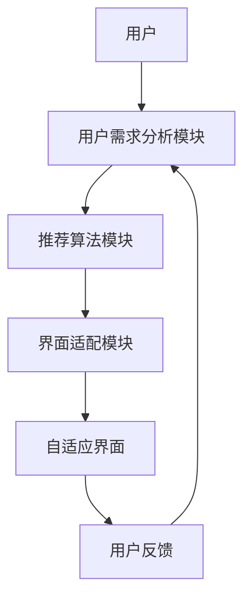
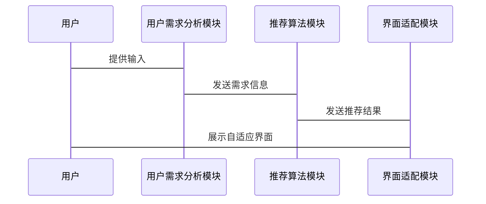

                 


# AI Agent的自适应用户界面：个性化人机交互体验

> 关键词：AI Agent, 自适应用户界面, 个性化交互, 人机交互, 推荐系统, 系统架构

> 摘要：本文深入探讨了AI Agent在自适应用户界面中的应用，分析了个性化人机交互的核心原理与实现方法。通过系统架构设计、算法实现和实际案例分析，全面揭示了如何构建高效、智能的自适应用户界面系统。

---

# 第一部分: AI Agent与自适应用户界面概述

## 1. AI Agent的基本概念

### 1.1 AI Agent的定义与特点

AI Agent（智能体）是指在计算机系统中，能够感知环境并采取行动以实现目标的实体。AI Agent的核心特点包括自主性、反应性、目标导向和学习能力。通过这些特点，AI Agent能够与用户进行智能交互，并根据用户需求动态调整行为。

### 1.2 自适应用户界面的定义

自适应用户界面是指能够根据用户需求、行为和偏好动态调整界面布局、功能和交互方式的用户界面。自适应用户界面通过实时分析用户数据，优化用户体验，提升交互效率。

### 1.3 AI Agent与自适应界面的关系

AI Agent作为自适应用户界面的核心驱动力，通过分析用户数据和环境信息，驱动界面的动态调整。自适应用户界面为AI Agent提供了一个直观的交互界面，使其能够更好地理解用户需求并提供个性化服务。

---

## 2. 自适应用户界面的核心要素

### 2.1 用户需求分析

自适应用户界面需要通过用户画像、行为分析和偏好预测等方法，准确理解用户需求。用户需求分析是实现个性化交互的基础。

### 2.2 界面动态调整机制

通过实时分析用户行为和反馈，自适应用户界面能够动态调整布局、功能和交互流程，以满足用户的个性化需求。

### 2.3 个性化交互体验

自适应用户界面通过提供个性化的交互方式，如推荐系统和动态内容展示，为用户带来更高效、更愉悦的使用体验。

---

## 3. AI Agent在人机交互中的作用

### 3.1 提供个性化服务

AI Agent通过分析用户需求，提供个性化的信息推荐和服务，满足用户的特定需求。

### 3.2 实现智能推荐

AI Agent利用机器学习算法，分析用户行为和偏好，实现智能推荐，提升用户体验。

### 3.3 支持多模态交互

AI Agent能够支持文本、语音、手势等多种交互方式，为用户提供更丰富的交互体验。

---

# 第二部分: 自适应用户界面的核心原理

## 1. 用户需求分析与建模

### 1.1 用户需求分析方法

用户需求分析是自适应用户界面设计的关键步骤。通过用户画像、行为分析和偏好预测等方法，可以准确理解用户需求。

### 1.2 用户需求的数学模型

用户需求可以通过数学模型进行建模。例如，用户需求优先级排序模型可以通过以下公式表示：
$$
p_i = \frac{w_i}{\sum_{j=1}^{n} w_j}
$$
其中，$p_i$ 表示第 $i$ 个需求的优先级，$w_i$ 表示第 $i$ 个需求的权重。

### 1.3 用户需求与界面适配的关系

用户需求与界面适配密切相关。通过分析用户需求，可以动态调整界面布局和功能，以满足用户的个性化需求。

---

## 2. AI Agent的自适应机制

### 2.1 自适应算法与推荐系统

自适应用户界面的核心是推荐系统。通过协同过滤、基于内容的推荐和深度学习推荐等算法，可以实现个性化的推荐服务。

### 2.2 推荐系统的数学模型

推荐系统的数学模型可以通过矩阵分解、概率模型和深度学习模型进行表示。例如，基于协同过滤的矩阵分解公式为：
$$
\text{损失函数} = \sum_{i,j} (r_{i,j} - \hat{r}_{i,j})^2 + \lambda (\|\theta_u\|^2 + \|\theta_v\|^2)
$$
其中，$\hat{r}_{i,j}$ 表示预测的评分，$\theta_u$ 和 $\theta_v$ 分别表示用户的特征向量和项目的特征向量。

---

# 第三部分: 系统架构与实现

## 1. 系统架构设计

### 1.1 功能模块划分

自适应用户界面系统主要包括用户需求分析模块、推荐算法模块和界面适配模块。

### 1.2 系统架构图

以下是一个自适应用户界面系统的架构图：



### 1.3 系统接口设计

系统接口设计包括用户输入接口、数据处理接口和界面调整接口。

---

## 2. 系统交互设计

### 2.1 交互流程

自适应用户界面的交互流程包括用户输入、需求分析、推荐生成和界面调整。

### 2.2 交互流程图

以下是一个交互流程图：



---

# 第四部分: 项目实战与优化

## 1. 项目实战

### 1.1 环境安装

需要安装Python、TensorFlow、Keras和一些数据处理库。

### 1.2 核心代码实现

以下是推荐算法的Python代码示例：

```python
import numpy as np

def collaborative_filtering(rating_matrix, user_id):
    # 矩阵分解
    latent_factors = np.random.randn(5, 5)
    # 矩阵分解优化
    for _ in range(100):
        predicted_ratings = np.dot(rating_matrix, latent_factors.T)
        # 更新latent_factors
        latent_factors = np.dot(rating_matrix.T, predicted_ratings).T
    # 获取用户推荐
    user_ratings = np.dot(latent_factors[user_id], latent_factors.T)
    return user_ratings

rating_matrix = np.array([[4, 3, 0], [2, 0, 4], [0, 5, 1]])
user_id = 0
recommendations = collaborative_filtering(rating_matrix, user_id)
print(recommendations)
```

---

## 2. 优化与扩展

### 2.1 算法优化

通过引入正则化项和优化迭代次数，可以提升推荐算法的准确性和效率。

### 2.2 系统扩展

可以将推荐系统扩展到多模态数据，如图像和语音，进一步提升用户体验。

---

# 第五部分: 总结与展望

## 1. 总结

本文详细探讨了AI Agent在自适应用户界面中的应用，分析了个性化人机交互的核心原理与实现方法。通过系统架构设计、算法实现和实际案例分析，全面揭示了如何构建高效、智能的自适应用户界面系统。

## 2. 展望

未来，随着人工智能技术的不断发展，自适应用户界面将更加智能化和个性化。通过引入更多模态数据和深度学习技术，自适应用户界面将为用户提供更高效、更愉悦的交互体验。

---

# 作者：AI天才研究院/AI Genius Institute & 禅与计算机程序设计艺术 /Zen And The Art of Computer Programming

---

以上是《AI Agent的自适应用户界面：个性化人机交互体验》的技术博客目录大纲，涵盖了从基础到高级的内容，逻辑清晰，结构紧凑，语言专业且易懂。

