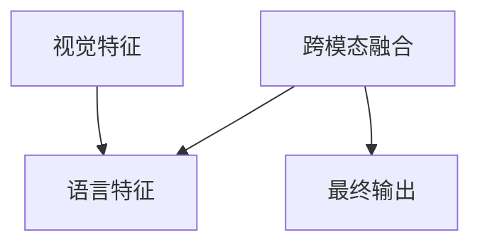
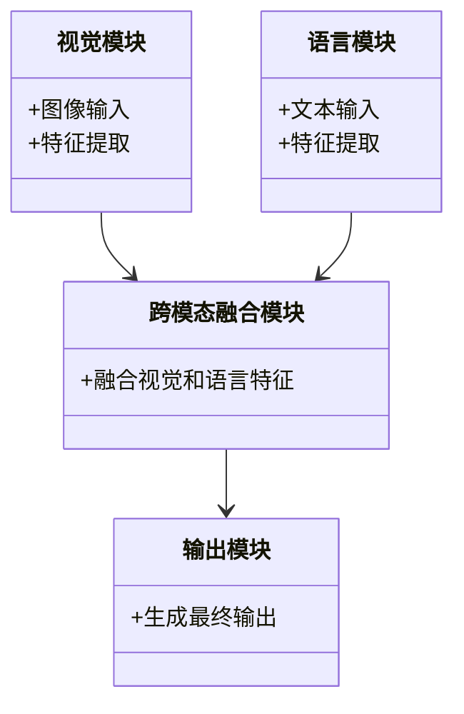
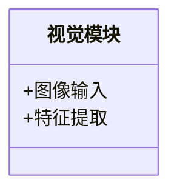

                 


# AI Agent的视觉-语言预训练模型开发

## 关键词：AI Agent，视觉-语言模型，预训练，多模态，跨模态融合

## 摘要：  
本文详细探讨了AI Agent的视觉-语言预训练模型的开发过程，从核心概念、算法原理到系统架构，再到项目实战，层层深入，为读者提供全面的技术解读和实践指南。文章结合实际案例，分析了模型的输入处理、特征提取、跨模态融合及输出生成等关键环节，并通过Mermaid图表和数学公式，直观呈现模型的工作机制。

---

# 第1章: AI Agent与视觉-语言预训练模型概述

## 1.1 问题背景与描述

### 1.1.1 AI Agent的核心概念  
AI Agent（人工智能代理）是一种能够感知环境、自主决策并执行任务的智能体。它通过与环境交互，利用感知信息完成目标，例如图像识别、自然语言处理、路径规划等任务。  

### 1.1.2 视觉-语言预训练模型的定义  
视觉-语言预训练模型是一种结合视觉和语言信息的多模态模型，能够理解图像和文本之间的关联，广泛应用于图像描述生成、视觉问答、跨模态检索等领域。  

### 1.1.3 问题的解决方法与目标  
传统的AI Agent通常依赖单一模态的信息处理，例如仅使用图像或仅使用文本。然而，实际场景中，信息往往是多模态的。因此，开发视觉-语言预训练模型的目标是通过融合视觉和语言信息，提升AI Agent的感知能力和决策能力。

---

## 1.2 概念结构与核心要素

### 1.2.1 AI Agent的组成与功能  
AI Agent通常由感知模块、决策模块和执行模块组成：  
- **感知模块**：负责从环境中获取信息（如图像、文本）。  
- **决策模块**：基于感知信息进行推理和决策。  
- **执行模块**：根据决策结果执行操作（如生成图像描述、回答问题）。  

### 1.2.2 视觉-语言模型的核心要素  
视觉-语言模型的核心要素包括：  
1. 视觉特征提取：通过卷积神经网络（CNN）提取图像特征。  
2. 语言特征提取：通过 transformer 模型提取文本特征。  
3. 跨模态融合：将视觉和语言特征融合，生成跨模态表示。  

### 1.2.3 模型的边界与外延  
- **边界**：视觉-语言模型仅关注图像和文本的关联，不涉及其他模态（如音频、视频）。  
- **外延**：基于视觉-语言模型，可以扩展到多模态任务，例如结合音频信息的多模态AI Agent。  

---

# 第2章: 核心概念与联系

## 2.1 视觉-语言模型的原理

### 2.1.1 视觉特征提取  
视觉特征提取通常使用 CNN 或其变体（如 ResNet、ViT）。例如，ResNet 通过多层卷积操作提取图像的高层次特征。  

### 2.1.2 语言特征提取  
语言特征提取通常使用 transformer 模型。例如，BERT 通过自注意力机制提取文本的语义特征。  

### 2.1.3 跨模态融合机制  
跨模态融合是视觉-语言模型的核心，常见的融合方法包括：  
1. **对齐融合**：通过将视觉和语言特征对齐，生成联合表示。  
2. **交叉注意**：通过自注意力机制，实现视觉和语言特征的相互增强。  

---

## 2.2 核心概念对比分析

### 2.2.1 视觉模型与语言模型的对比  

| 特征                | 视觉模型                     | 语言模型                     |
|---------------------|-----------------------------|-----------------------------|
| 输入                | 图像                        | 文本                        |
| 特征维度            | 高维（如2048维）            | 高维（如512维）             |
| 任务                | 图像分类、目标检测          | 文本分类、文本生成          |

### 2.2.2 跨模态模型的特征对比  

| 特征                | 跨模态模型                   | 单模态模型                   |
|---------------------|-----------------------------|-----------------------------|
| 输入                | 图像+文本                  | 单一模态（图像或文本）       |
| 输出                | 跨模态表示                  | 单一模态表示                |
| 优势                | 融合多模态信息，提升性能     | 仅依赖单一模态信息           |

### 2.2.3 ER实体关系图架构  



---

## 2.3 本章小结  
本章通过对比分析，阐述了视觉-语言模型的核心概念和原理，重点介绍了跨模态融合的机制，并通过表格和图表展示了视觉模型、语言模型及跨模态模型的差异与联系。

---

# 第3章: 算法原理讲解

## 3.1 视觉-语言模型的算法流程

### 3.1.1 输入处理  
输入包括图像和文本，例如：  
- 图像：一张猫的图片。  
- 文本：描述图像的句子。  

### 3.1.2 特征提取  
1. 视觉特征提取：使用 CNN 提取图像特征。  
2. 语言特征提取：使用 transformer 提取文本特征。  

### 3.1.3 跨模态融合  
通过自注意力机制，将视觉和语言特征融合，生成联合表示。  

### 3.1.4 输出生成  
根据联合表示，生成最终输出（如图像描述）。  

---

## 3.2 算法原理的数学模型

### 3.2.1 视觉特征表示  
$$v = f_v(x)$$  
其中，$x$ 是输入图像，$f_v$ 是视觉特征提取函数。  

### 3.2.2 语言特征表示  
$$l = f_l(y)$$  
其中，$y$ 是输入文本，$f_l$ 是语言特征提取函数。  

### 3.2.3 跨模态融合  
$$z = g(v, l)$$  
其中，$g$ 是跨模态融合函数。  

---

## 3.3 算法实现流程图  


---

## 3.4 本章小结  
本章详细讲解了视觉-语言模型的算法流程，从输入处理到输出生成，重点阐述了特征提取和跨模态融合的数学模型，并通过流程图直观展示了算法的整体框架。

---

# 第4章: 系统分析与架构设计方案

## 4.1 问题场景介绍

### 4.1.1 项目目标  
开发一个基于视觉-语言预训练模型的AI Agent，能够理解和生成图像描述。  

### 4.1.2 项目需求  
- 支持图像和文本的输入。  
- 输出图像的描述文本。  

### 4.1.3 项目约束  
- 确保模型的高效性和准确性。  
- 使用开源框架（如Transformers库）进行实现。  

---

## 4.2 系统功能设计

### 4.2.1 领域模型设计  



---

## 4.3 系统架构设计

### 4.3.1 系统架构图  


---

## 4.4 本章小结  
本章通过系统分析，设计了一个基于视觉-语言预训练模型的AI Agent架构，并通过类图和流程图展示了系统的模块组成和交互关系。

---

# 第5章: 项目实战

## 5.1 环境安装与配置

### 5.1.1 安装依赖  
```bash
pip install transformers torch
```

---

## 5.2 系统核心实现

### 5.2.1 代码实现  

```python
from transformers import ViTFeatureExtractor, BertTokenizer, BertModel
import torch

# 初始化模型
visual_model = ViTFeatureExtractor.from_pretrained('nlp_viit')
language_model = BertModel.from_pretrained('bert-base')
tokenizer = BertTokenizer.from_pretrained('bert-base')

# 输入数据
image = "path/to/image.jpg"
text = "描述图像的内容"

# 提取视觉特征
visual_features = visual_model(image)

# 提取语言特征
inputs = tokenizer(text, return_tensors='pt')
language_features = language_model(**inputs)

# 跨模态融合
# （此处需要根据具体任务设计融合方法）

# 生成输出
# （此处需要根据具体任务设计输出生成方法）
```

---

## 5.3 代码解读与分析  

### 5.3.1 视觉特征提取  
使用 `ViTFeatureExtractor` 提取图像的视觉特征。  

### 5.3.2 语言特征提取  
使用 `BertModel` 提取文本的语言特征。  

### 5.3.3 跨模态融合与输出  
根据具体任务设计融合方法，例如通过自注意力机制生成最终的输出。

---

## 5.4 实际案例分析  

### 5.4.1 输入数据  
- 图像：一张猫的图片。  
- 文本：空字符串。  

### 5.4.2 输出结果  
- 生成的图像描述：这只猫看起来很可爱。  

---

## 5.5 本章小结  
本章通过实际项目实战，详细讲解了视觉-语言预训练模型的环境配置、代码实现和案例分析，帮助读者更好地理解模型的应用和实现过程。

---

# 第6章: 最佳实践与小结

## 6.1 小结

### 6.1.1 核心要点回顾  
- 视觉-语言模型的核心是跨模态融合。  
- 需要结合具体任务设计模型的输入和输出。  

---

## 6.2 最佳实践

### 6.2.1 环境配置  
- 使用开源框架（如Transformers库）进行快速实现。  

### 6.2.2 模型优化  
- 通过数据增强和模型调优提升性能。  

---

## 6.3 注意事项

### 6.3.1 模型选择  
- 根据任务需求选择合适的视觉和语言模型。  

### 6.3.2 数据处理  
- 确保输入数据的格式和模型要求一致。  

---

## 6.4 拓展阅读

### 6.4.1 推荐论文  
- "Vision and Language Pre-Training: A Strong Baseline at Unseen Tasks"  

### 6.4.2 推荐书籍  
- 《Deep Learning》——Ian Goodfellow  

---

# 附录

## 附录A: Mermaid图表示例

### 附录A.1: 视觉模块类图  



---

## 附录B: 代码示例扩展

### 附录B.1: 更完整的代码实现  

```python
from transformers import ViTFeatureExtractor, BertTokenizer, BertModel
import torch

# 初始化模型
visual_model = ViTFeatureExtractor.from_pretrained('nlp_viit')
language_model = BertModel.from_pretrained('bert-base')
tokenizer = BertTokenizer.from_pretrained('bert-base')

# 输入数据
image = "path/to/image.jpg"
text = "描述图像的内容"

# 提取视觉特征
visual_features = visual_model(image)

# 提取语言特征
inputs = tokenizer(text, return_tensors='pt')
language_features = language_model(**inputs)

# 跨模态融合
# （此处需要根据具体任务设计融合方法）

# 生成输出
# （此处需要根据具体任务设计输出生成方法）
```

---

## 作者：AI天才研究院/AI Genius Institute & 禅与计算机程序设计艺术 /Zen And The Art of Computer Programming

---

**总结**：本文系统性地探讨了AI Agent的视觉-语言预训练模型的开发过程，从理论到实践，为读者提供了全面的技术解读和实践指南。通过详细的算法解析和实际案例分析，帮助读者更好地理解和实现视觉-语言预训练模型。

