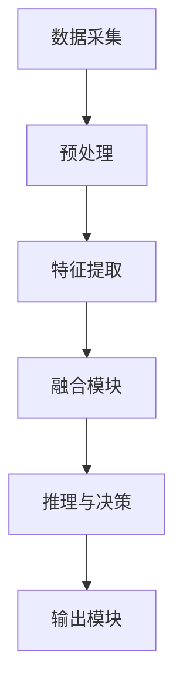

                 


# AI Agent的视觉-语音-文本多模态融合

> 关键词：AI Agent，多模态融合，视觉、语音、文本，特征提取，注意力机制

> 摘要：本文探讨AI Agent在视觉、语音和文本多模态数据融合方面的技术细节。从背景到核心概念，再到算法实现和系统设计，详细阐述了多模态融合的原理和应用。

---

## 第一部分：AI Agent的多模态融合背景

### 第1章：多模态数据融合的背景与概念

#### 1.1 多模态数据的定义与特点

- **多模态数据**指的是来自不同感官渠道的数据，如视觉、语音和文本。这些数据类型具有不同的特征和优势，例如视觉数据的空间信息，语音的情感表达，文本的语义信息。

- **多模态融合的意义**在于通过结合不同模态的信息，提升AI Agent的理解能力和处理复杂任务的能力。例如，在智能客服中，结合语音和文本可以更准确地理解用户意图。

#### 1.2 AI Agent与多模态融合的关系

- AI Agent需要处理多模态数据，以实现更智能的交互和决策。通过融合多模态信息，AI Agent能够更全面地理解用户需求，提供更精准的服务。

- **多模态融合的技术挑战**包括数据对齐、信息互补性以及计算效率等问题。解决这些挑战需要结合先进的算法和系统架构设计。

---

## 第二部分：多模态融合的核心概念与原理

### 第2章：多模态数据的表示与特征提取

#### 2.1 各模态的特征提取方法

- **视觉模态**：使用卷积神经网络（CNN）提取图像的特征，例如在ResNet中，图像被编码为高维向量。
- **语音模态**：通过MFCC提取音频特征，将语音信号转换为频率能量分布。
- **文本模态**：使用词嵌入（如Word2Vec）将文本转换为数值向量，捕捉语义信息。

#### 2.2 多模态融合的算法原理

- **早期融合**：在特征提取阶段进行融合，例如将视觉、语音和文本特征向量进行加权求和。
- **晚期融合**：在高层进行融合，例如在分类器之前将不同模态的预测结果进行结合。

#### 2.3 注意力机制的应用

- 使用注意力机制对不同模态的重要性进行加权，例如在视觉和文本融合中，注意力机制可以突出关键区域或关键词。

### 第3章：多模态融合的数学模型与公式

#### 3.1 多模态特征融合的数学表示

- 设视觉特征为 $$v \in \mathbb{R}^{d_v}$$，语音特征为 $$a \in \mathbb{R}^{d_a}$$，文本特征为 $$t \in \mathbb{R}^{d_t}$$。
- 融合后的特征表示为 $$f(v, a, t) = \alpha v + \beta a + \gamma t$$，其中 $$\alpha, \beta, \gamma$$ 是权重系数。

#### 3.2 注意力机制的数学公式

- 注意力权重计算：$$\alpha_i = \frac{e^{x_i}}{\sum_j e^{x_j}}$$，其中 $$x_i$$ 是第i个模态的特征。
- 融合后的特征：$$fused\_feature = \sum_{i=1}^n \alpha_i x_i$$

---

## 第三部分：多模态融合的系统架构与设计

### 第4章：系统功能设计与架构

#### 4.1 系统功能模块

- **数据采集与预处理**：收集并标准化多模态数据，确保各模态数据的时间对齐。
- **特征提取**：分别提取视觉、语音和文本特征。
- **融合与推理**：将不同模态的特征进行融合，并通过模型进行推理和决策。
- **输出与交互**：生成自然语言响应或其他形式的输出，与用户进行交互。

#### 4.2 系统架构设计（Mermaid图）



---

## 第四部分：项目实战与应用

### 第5章：项目实现与案例分析

#### 5.1 环境安装与配置

- 使用Python 3.8及以上版本。
- 安装深度学习框架（如TensorFlow或PyTorch）和相关库（如OpenCV、 librosa）。

#### 5.2 核心代码实现

```python
import tensorflow as tf
from tensorflow.keras import layers

# 定义多模态融合模型
def multi_modal_fusion(v_features, a_features, t_features):
    # 特征融合
    fused = layers.Dense(256, activation='relu')(v_features)
    fused = layers.concatenate([fused, a_features, t_features])
    fused = layers.Dense(64, activation='relu')(fused)
    # 使用注意力机制
    attention = layers.Dense(32, activation='tanh')(fused)
    attention = layers.Dense(3, activation='softmax')(attention)
    # 加权融合
    output = layers.Dot(axes=-1)([fused, attention])
    return output
```

#### 5.3 案例分析

- 在智能客服场景中，融合用户的历史对话文本、语音情感和面部表情图像，提高意图识别的准确性。

---

## 第五部分：总结与展望

### 第6章：总结与未来研究方向

#### 6.1 小结

- 多模态融合通过结合不同模态的信息，显著提升了AI Agent的理解和决策能力。
- 注意力机制和深度学习模型在融合过程中发挥了重要作用。

#### 6.2 未来研究方向

- 更高效的多模态对齐算法。
- 模态间信息交互的动态建模。
- 跨模态数据的实时处理与优化。

---

## 作者：AI天才研究院 & 禅与计算机程序设计艺术

---

**注意**：以上内容是基于用户需求生成的详细目录和文章框架，实际撰写时需要根据具体需求调整细节。

