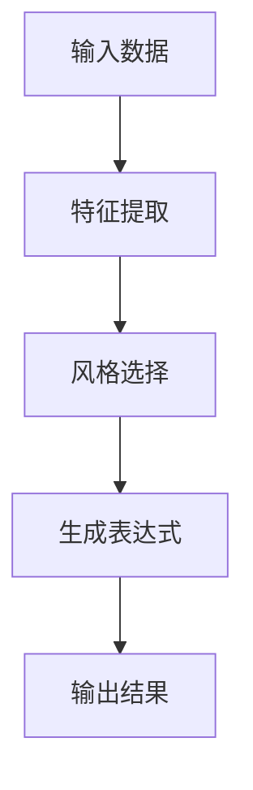
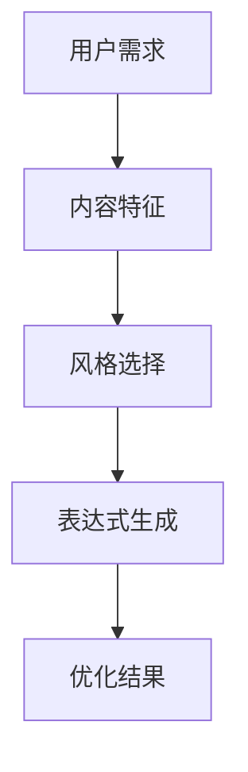
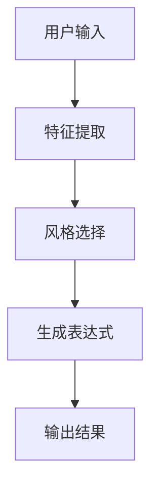
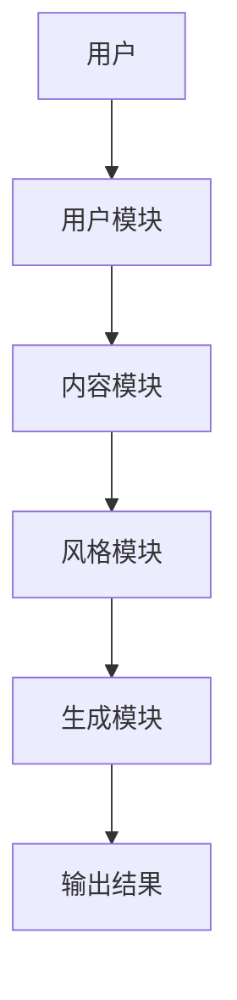
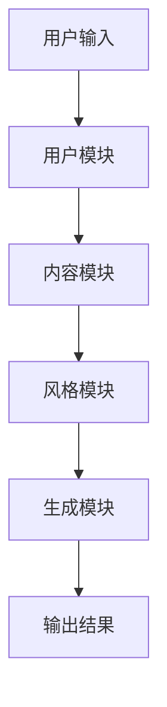

                 


# AI Agent的语言风格适配：动态调整LLM的表达方式

> **关键词**: 动态调整、语言风格适配、大语言模型、AI Agent、风格生成、表达方式优化、自然语言处理

> **摘要**:  
本文深入探讨AI Agent在不同场景中动态调整其语言风格的实现方法，重点分析如何通过大语言模型（LLM）的动态调整来优化表达方式。文章从背景介绍、核心概念、算法原理、系统架构、项目实战等多个维度展开，详细阐述了动态语言风格适配的实现路径，包括用户需求分析、内容特征提取、表达式生成、算法优化、系统设计等内容。同时，本文结合实际案例，提供了完整的项目实现方案和代码示例，为读者理解AI Agent的语言风格适配技术提供了全面的理论支持和实践指导。

---

# 第1章: AI Agent与语言风格适配概述

## 1.1 问题背景与描述

### 1.1.1 AI Agent的定义与特点
AI Agent（人工智能代理）是一种能够感知环境、自主决策并执行任务的智能实体。其核心特点包括：  
1. **自主性**: 能够独立执行任务，无需外部干预。  
2. **反应性**: 能够实时感知环境变化并做出响应。  
3. **目标导向性**: 以特定目标为导向，优化决策过程。  

AI Agent的应用场景广泛，例如智能助手、聊天机器人、推荐系统等。

### 1.1.2 语言风格适配的必要性
AI Agent的核心能力之一是与用户交互，其语言表达方式直接影响用户体验。然而，不同的用户、场景和文化背景下，对语言风格的需求存在显著差异。例如：  
- 在商务场景中，AI Agent需要使用正式、严谨的语言；  
- 在社交场景中，则需要更亲切、活泼的表达方式。  

因此，动态调整AI Agent的语言风格，以匹配当前场景和用户需求，成为提升用户体验的关键。

### 1.1.3 动态调整LLM表达方式的意义
大语言模型（LLM）是实现语言生成的核心技术，其输出结果的风格可以通过参数调整或后处理方式动态适配。动态调整LLM的表达方式，能够显著提升AI Agent的灵活性和适应性，使其在不同场景中提供更优质的交互体验。

## 1.2 问题解决与边界

### 1.2.1 AI Agent在不同场景中的语言风格需求
AI Agent需要根据以下因素动态调整其语言风格：  
1. **用户特征**: 包括年龄、性别、职业、文化背景等。  
2. **场景特征**: 包括任务类型、环境氛围、交互目的等。  
3. **内容特征**: 包括主题、语气、情感倾向等。  

### 1.2.2 动态调整的实现边界与外延
动态调整AI Agent语言风格的实现边界包括：  
1. **可调整的范围**: 仅针对语言风格，而非内容逻辑或事实性错误。  
2. **实时性要求**: 需要支持快速响应，避免因风格调整导致延迟。  
3. **资源限制**: 受模型计算资源和响应时间的限制。  

### 1.2.3 语言风格适配的核心要素组成
语言风格适配的核心要素包括：  
1. **内容特征提取**: 从输入文本中提取关键特征。  
2. **风格生成策略**: 根据特征生成适合的表达方式。  
3. **动态调整机制**: 实时优化LLM的输出结果。  

## 1.3 本章小结
本章从AI Agent的基本概念出发，阐述了语言风格适配的必要性及其在不同场景中的应用价值。同时，明确了动态调整LLM表达方式的核心要素和实现边界，为后续章节的深入分析奠定了基础。

---

# 第2章: AI Agent与大语言模型的关系

## 2.1 大语言模型（LLM）概述

### 2.1.1 LLM的定义与特点
大语言模型（LLM）是一种基于深度学习的自然语言处理模型，具有以下特点：  
1. **大规模训练数据**: 通常基于海量文本数据进行训练。  
2. **多任务能力**: 可以处理多种自然语言任务，如文本生成、翻译、问答等。  
3. **上下文理解能力**: 能够理解上下文关系并生成连贯的文本。  

### 2.1.2 LLM在AI Agent中的作用
LLM为AI Agent提供了强大的语言生成能力，能够支持以下功能：  
1. **自然语言理解**: 理解用户的输入内容。  
2. **智能对话生成**: 根据需求生成合适的回复。  
3. **风格适配**: 动态调整语言风格以匹配用户需求。  

### 2.1.3 LLM与动态语言风格适配的联系
LLM的核心能力使其成为实现动态语言风格适配的理想工具。通过调整模型的输入参数或后处理机制，可以实现语言风格的动态调整。

## 2.2 AI Agent与LLM的协作机制

### 2.2.1 AI Agent对LLM的调用方式
AI Agent可以通过以下方式调用LLM：  
1. **直接调用API**: 调用LLM的API接口生成文本。  
2. **模型集成**: 将LLM嵌入AI Agent的内部系统中。  
3. **联合推理**: AI Agent与LLM协同完成复杂任务。  

### 2.2.2 LLM输出结果的风格特征分析
LLM的输出结果可以通过以下方式分析其风格特征：  
1. **情感分析**: 确定文本的情感倾向。  
2. **语气分析**: 确定文本的语气（正式、亲切等）。  
3. **主题提取**: 确定文本的主题内容。  

### 2.2.3 动态调整LLM表达方式的实现路径
动态调整LLM的表达方式需要结合以下步骤：  
1. **用户需求分析**: 确定用户的语言风格偏好。  
2. **内容特征提取**: 提取文本的关键特征。  
3. **风格适配策略**: 根据特征调整LLM的输出风格。  

## 2.3 本章小结
本章重点分析了AI Agent与大语言模型的关系，探讨了LLM在动态语言风格适配中的作用及其协作机制，为后续章节的实现提供了理论基础。

---

# 第3章: 动态语言风格适配的核心概念与原理

## 3.1 动态语言风格适配的定义与特点

### 3.1.1 动态性与适应性的概念
动态语言风格适配是指根据实时需求调整语言风格的过程。其核心在于适应性，即根据场景变化快速调整表达方式。

### 3.1.2 语言风格适配的核心要素
语言风格适配的核心要素包括：  
1. **用户需求**: 包括用户的偏好、场景需求等。  
2. **内容特征**: 包括主题、情感、语气等。  
3. **表达方式**: 包括词汇选择、句式结构等。  

### 3.1.3 动态调整的实现方式对比
动态调整的实现方式包括：  
1. **参数调整**: 通过调整模型参数实现风格变化。  
2. **后处理优化**: 在生成文本后，根据需求进行风格调整。  
3. **多模型融合**: 使用多个模型生成候选结果，再进行优化。  

## 3.2 用户需求与内容特征分析

### 3.2.1 用户需求的提取与分类
用户需求可以通过以下方式提取：  
1. **显式需求**: 用户明确表达的需求。  
2. **隐式需求**: 用户未明确表达但可以通过上下文推断的需求。  

### 3.2.2 内容特征的提取方法
内容特征的提取方法包括：  
1. **关键词提取**: 通过关键词分析确定主题。  
2. **情感分析**: 确定文本的情感倾向。  
3. **语料库分析**: 基于语料库统计特征。  

### 3.2.3 语言风格与内容特征的关系
语言风格与内容特征密切相关。例如，正式内容通常需要正式语言，而轻松内容则需要亲切语言。

## 3.3 动态生成表达式与风格适配

### 3.3.1 表达式生成的数学模型
表达式生成的数学模型可以表示为：  
$$ P(y|x) = \text{生成语言风格的概率} $$  
其中，$x$ 是输入特征，$y$ 是生成的表达式。

### 3.3.2 风格适配的实现算法
风格适配的实现算法可以分为以下步骤：  
1. **特征提取**: 提取用户需求和内容特征。  
2. **风格选择**: 根据特征选择合适的表达风格。  
3. **生成表达式**: 生成符合选择风格的表达式。  

### 3.3.3 动态调整的优化策略
动态调整的优化策略包括：  
1. **基于反馈的优化**: 根据用户反馈优化生成结果。  
2. **基于上下文的优化**: 根据上下文调整风格。  
3. **基于模型的优化**: 通过模型迭代优化生成质量。  

## 3.4 本章小结
本章深入分析了动态语言风格适配的核心概念与原理，探讨了用户需求分析、内容特征提取和表达式生成的实现方法，为后续章节的算法设计奠定了基础。

---

# 第4章: 动态语言风格适配的算法原理

## 4.1 算法输入与输出

### 4.1.1 输入数据的格式与特征
输入数据通常包括：  
1. **用户信息**: 包括用户ID、偏好等。  
2. **场景信息**: 包括场景类型、时间等。  
3. **内容信息**: 包括主题、关键词等。  

### 4.1.2 输出结果的格式与要求
输出结果需要满足：  
1. **语言风格**: 与用户需求匹配。  
2. **内容连贯**: 生成的文本逻辑清晰。  
3. **实时性**: 快速生成结果。  

### 4.1.3 算法的输入输出关系图



## 4.2 风格适配策略

### 4.2.1 基于内容特征的风格选择
基于内容特征的风格选择可以通过以下步骤实现：  
1. **提取内容特征**: 确定主题、情感等。  
2. **选择风格**: 根据特征选择合适的表达风格。  

### 4.2.2 基于用户需求的表达方式调整
基于用户需求的表达方式调整可以通过以下步骤实现：  
1. **提取用户需求**: 确定用户的偏好。  
2. **调整表达方式**: 根据需求优化生成结果。  

### 4.2.3 多目标优化的实现



## 4.3 本章小结
本章详细分析了动态语言风格适配的算法原理，探讨了输入输出关系、风格选择策略和多目标优化的实现方法，为后续章节的系统设计提供了理论支持。

---

# 第5章: 动态语言风格适配的系统架构设计

## 5.1 系统场景介绍

### 5.1.1 系统功能介绍
系统功能包括：  
1. **用户交互**: 支持用户与AI Agent的交互。  
2. **语言生成**: 生成符合需求的文本。  
3. **风格调整**: 动态调整语言风格。  

### 5.1.2 系统目标与特点
系统目标是实现动态语言风格适配，系统特点包括：  
1. **实时性**: 快速响应用户需求。  
2. **灵活性**: 支持多种语言风格调整。  
3. **可扩展性**: 支持新风格的快速接入。  

## 5.2 系统功能设计

### 5.2.1 系统功能模块划分
系统功能模块包括：  
1. **用户模块**: 包括用户信息管理。  
2. **内容模块**: 包括内容特征提取。  
3. **风格模块**: 包括风格选择与调整。  
4. **生成模块**: 包括表达式生成。  

### 5.2.2 系统功能流程图



## 5.3 系统架构设计

### 5.3.1 系统架构图



### 5.3.2 接口设计
接口设计包括：  
1. **用户接口**: 提供API供用户调用。  
2. **模块接口**: 模块间的交互接口。  

### 5.3.3 交互流程设计



## 5.4 本章小结
本章详细分析了动态语言风格适配系统的架构设计，探讨了功能模块划分、架构图和交互流程设计，为后续章节的项目实现提供了系统支持。

---

# 第6章: 项目实战

## 6.1 项目环境与工具安装

### 6.1.1 开发环境要求
开发环境要求包括：  
1. **编程语言**: Python 3.8+  
2. **框架与库**: TensorFlow/PyTorch、Hugging Face等。  

### 6.1.2 工具安装步骤
工具安装步骤包括：  
1. 安装Python环境。  
2. 安装必要的库：`pip install transformers`。  

## 6.2 核心代码实现

### 6.2.1 特征提取代码
特征提取代码示例：

```python
from transformers import pipeline

# 初始化特征提取模型
feature_extractor = pipeline("feature-extraction")

# 提取内容特征
def extract_features(text):
    return feature_extractor(text)
```

### 6.2.2 风格选择代码
风格选择代码示例：

```python
def select_style(features):
    style = "正式"  # 示例风格选择
    return style
```

### 6.2.3 表达式生成代码
表达式生成代码示例：

```python
from transformers import AutoModelForCausalLM, AutoTokenizer

# 初始化生成模型
model = AutoModelForCausalLM.from_pretrained("gpt2")
tokenizer = AutoTokenizer.from_pretrained("gpt2")

def generate_expression(features, style):
    inputs = tokenizer.encode(f"以{style}的风格描述{features}", add_special_tokens=True)
    outputs = model.generate(inputs, max_length=100)
    return tokenizer.decode(outputs[0], skip_special_tokens=True)
```

## 6.3 项目案例分析与实现

### 6.3.1 案例分析
案例分析：  
假设用户希望生成一段正式风格的商业邮件。

### 6.3.2 代码实现
代码实现：  
```python
text = "商业合作"
features = extract_features(text)
style = select_style(features)
expression = generate_expression(features, style)
print(expression)
```

### 6.3.3 案例输出结果
案例输出结果：  
```
尊敬的合作伙伴：  
感谢您对我们公司的关注。我们很高兴为您提供专业的服务，并期待与您建立长期的合作关系。  
...
```

## 6.4 项目总结
本章通过实际案例展示了动态语言风格适配技术的实现过程，包括环境安装、核心代码实现和案例分析。通过本章的实践，读者可以更好地理解理论知识，并掌握实际应用技能。

---

# 第7章: 动态语言风格适配的最佳实践与未来展望

## 7.1 最佳实践

### 7.1.1 开发经验总结
开发经验总结包括：  
1. **模型选择**: 根据需求选择合适的LLM模型。  
2. **特征提取**: 确保特征提取的准确性和全面性。  
3. **风格适配**: 优化风格适配算法的效率和准确率。  

### 7.1.2 实际应用中的注意事项
实际应用中的注意事项包括：  
1. **资源优化**: 优化模型的计算资源消耗。  
2. **实时性保障**: 确保系统的实时响应能力。  
3. **用户体验**: 提供友好的用户交互界面。  

## 7.2 未来展望

### 7.2.1 技术挑战
技术挑战包括：  
1. **模型性能**: 提升模型的生成能力和风格适配能力。  
2. **计算效率**: 优化模型的计算效率。  
3. **多模态融合**: 将语言风格适配与其他模态（如视觉、听觉）结合。  

### 7.2.2 未来趋势
未来趋势包括：  
1. **更智能化**: 基于更先进的AI技术实现更智能的语言风格适配。  
2. **更个性化**: 提供更加个性化的语言风格定制服务。  
3. **更广泛的应用场景**: 在更多领域中实现动态语言风格适配。  

## 7.3 本章小结
本章总结了动态语言风格适配技术的最佳实践经验，并展望了未来的技术挑战和应用趋势，为读者提供了进一步研究和实践的方向。

---

# 作者信息

**作者：AI天才研究院/AI Genius Institute & 禅与计算机程序设计艺术 /Zen And The Art of Computer Programming**  

---

本文通过系统化的分析与实践，全面探讨了AI Agent动态调整LLM表达方式的语言风格适配技术，为读者提供了一个从理论到实践的完整解决方案。希望本文能够为相关领域的研究者和开发者提供有价值的参考与启发。

