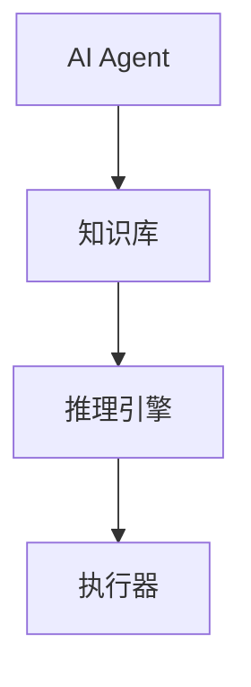
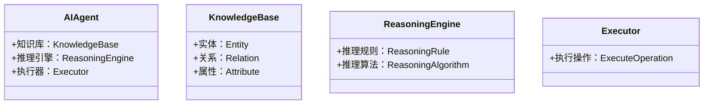
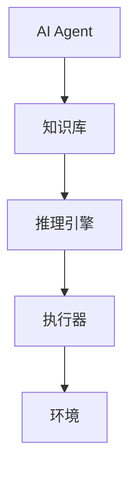
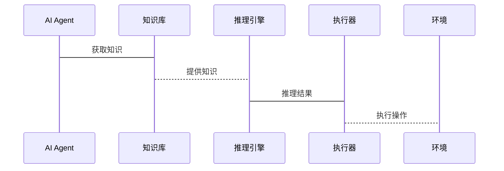

                 


# AI Agent的课程学习：模拟LLM的系统知识获取过程

## 关键词：AI Agent, 课程学习, 系统知识获取, LLM, 知识表示, 知识推理, 机器学习

## 摘要：本文探讨了AI Agent如何通过类似人类学习的方式，系统地获取和处理知识，特别是模拟大型语言模型（LLM）的知识获取过程。通过分析AI Agent的知识表示、推理机制、系统架构等核心内容，结合数学模型、算法原理和系统设计，本文为AI Agent的课程学习提供了深入的理论和实践指导。

---

# 第1章: AI Agent与课程学习的背景与概述

## 1.1 AI Agent的基本概念

### 1.1.1 AI Agent的定义与特点

**定义**：AI Agent（人工智能代理）是指能够感知环境、自主决策并执行任务的智能实体。它通过传感器获取信息，利用计算模型进行分析，并通过执行器与环境交互。

**特点**：
- **自主性**：AI Agent能够自主决策，无需外部干预。
- **反应性**：能够实时感知环境并做出反应。
- **目标导向**：基于目标驱动行为。
- **学习能力**：能够通过经验改进性能。

### 1.1.2 AI Agent的核心功能与应用场景

**核心功能**：
- 知识表示与推理。
- 感知与交互。
- 自主决策与执行。

**应用场景**：
- 智能助手（如 Siri、Alexa）。
- 自动驾驶。
- 机器人控制。
- 智慧教育。

### 1.1.3 课程学习的背景与意义

**课程学习**：
- 系统化地获取知识。
- 通过结构化的学习过程提升能力。

**意义**：
- 提供结构化的知识获取路径。
- 支持AI Agent的自主学习与进化。

---

## 1.2 课程学习与知识获取的关系

### 1.2.1 课程学习的基本概念

**课程学习**：
- 系统化的知识获取方式。
- 模拟人类教育体系中的课程设置。

**知识获取**：
- AI Agent通过学习数据或经验获取知识。
- 知识表示：将知识以结构化形式存储。

### 1.2.2 知识获取的过程与方法

**过程**：
1. **感知**：通过传感器或数据输入获取信息。
2. **表示**：将信息转化为结构化的知识表示。
3. **推理**：基于知识进行逻辑推理。
4. **应用**：将推理结果应用于实际任务。

**方法**：
- 基于规则的方法。
- 基于机器学习的方法。
- 基于符号推理的方法。

### 1.2.3 AI Agent在知识获取中的作用

**作用**：
- **知识整理**：将分散的信息整理为结构化的知识。
- **知识推理**：利用推理算法解决问题。
- **知识更新**：持续更新知识库以应对变化。

---

## 1.3 问题背景与问题描述

### 1.3.1 知识获取的挑战与难点

**挑战**：
- **知识的复杂性**：知识体系庞大，涉及多个领域。
- **动态性**：知识不断更新，需要持续学习。
- **不确定性**：部分知识可能存在不确定性。

**难点**：
- 如何高效地表示知识。
- 如何准确地推理知识。
- 如何处理知识的不确定性。

### 1.3.2 AI Agent在知识获取中的优势

**优势**：
- **自主性**：能够自主选择学习内容。
- **适应性**：能够根据环境变化调整学习策略。
- **高效性**：通过算法优化知识获取效率。

### 1.3.3 问题解决的思路与方法

**思路**：
- 利用机器学习算法进行知识学习。
- 借助知识图谱进行知识表示与推理。
- 结合强化学习优化决策过程。

**方法**：
- 基于监督学习的知识获取。
- 基于无监督学习的知识发现。
- 基于半监督学习的混合方法。

---

## 1.4 问题的边界与外延

### 1.4.1 知识获取的边界

**边界**：
- **知识范围**：限定在特定领域或通用知识。
- **数据来源**：限制于结构化数据或非结构化数据。
- **任务目标**：特定任务的知识需求。

**外延**：
- **知识表示**：从简单到复杂的知识结构。
- **推理能力**：从基本推理到复杂推理。
- **应用范围**：从单一任务到多任务应用。

### 1.4.2 AI Agent能力的边界

**能力边界**：
- **知识深度**：知识的深度和广度有限。
- **推理能力**：推理的复杂性和准确性有限。
- **环境适应性**：适应不同环境的能力有限。

**外延**：
- **能力扩展**：通过学习扩展知识和推理能力。
- **性能提升**：通过优化算法提升任务执行效率。
- **应用扩展**：从特定任务扩展到更广泛的应用场景。

---

## 1.5 概念结构与核心要素

### 1.5.1 知识获取的核心要素

**核心要素**：
- **知识源**：知识的来源，如书籍、数据库、网络资源。
- **表示方法**：知识的结构化表示方式，如知识图谱、语义网络。
- **推理算法**：基于知识进行推理的算法，如逻辑推理、概率推理。

### 1.5.2 AI Agent的系统架构

**系统架构**：
1. **感知层**：负责获取环境中的信息。
2. **知识层**：负责知识的表示与存储。
3. **推理层**：负责基于知识进行推理。
4. **执行层**：负责根据推理结果执行操作。

### 1.5.3 核心概念的相互关系

**相互关系**：
- **知识表示与推理**：知识表示是推理的基础，推理结果反哺知识表示。
- **知识获取与应用**：知识获取是应用的前提，应用结果反馈优化知识获取。

---

## 1.6 本章小结

本章从AI Agent的基本概念出发，探讨了课程学习与知识获取的关系，分析了知识获取的背景、问题及其解决思路。同时，明确了AI Agent的知识获取边界和核心要素，为后续章节的深入分析奠定了基础。

---

# 第2章: AI Agent与LLM的关系

## 2.1 LLM的基本原理

### 2.1.1 大型语言模型的定义

**定义**：大型语言模型（LLM）是指基于深度学习的自然语言处理模型，能够理解和生成人类语言。

### 2.1.2 LLM的核心特点

**特点**：
- **大规模训练数据**：利用海量数据进行训练。
- **深度神经网络**：复杂的网络结构支持语义理解。
- **生成能力**：能够生成连贯的文本内容。

### 2.1.3 LLM与AI Agent的联系

**联系**：
- LLM作为AI Agent的“大脑”，提供自然语言处理能力。
- AI Agent利用LLM进行知识表示与推理。

---

## 2.2 AI Agent的知识获取机制

### 2.2.1 知识获取的流程

**流程**：
1. **知识收集**：从多种来源获取知识。
2. **知识整理**：将知识整理为结构化的形式。
3. **知识推理**：基于知识进行推理和决策。

### 2.2.2 知识存储与检索

**存储**：
- **知识图谱**：用于存储结构化的知识。
- **数据库**：用于存储特定类型的数据。

**检索**：
- **基于关键词检索**：通过关键词快速查找知识。
- **基于语义检索**：通过语义分析进行知识检索。

### 2.2.3 知识应用与推理

**应用**：
- **问答系统**：基于知识进行回答生成。
- **对话系统**：基于知识进行对话生成。

**推理**：
- **逻辑推理**：基于知识进行逻辑推理。
- **概率推理**：基于概率模型进行推理。

---

## 2.3 核心概念的属性对比

**对比维度**：
- **知识表示**：AI Agent与LLM的知识表示方式对比。
- **推理能力**：AI Agent与LLM的推理能力对比。
- **学习能力**：AI Agent与LLM的学习能力对比。

---

## 2.4 ER实体关系图架构



---

## 2.5 本章小结

本章分析了AI Agent与LLM的关系，探讨了AI Agent的知识获取机制，并通过ER实体关系图展示了系统的架构。为后续章节的算法原理分析奠定了基础。

---

# 第3章: 知识表示与推理机制

## 3.1 知识表示的核心原理

### 3.1.1 知识表示的定义与方法

**定义**：知识表示是将知识以某种形式表示出来，以便计算机理解和使用。

**方法**：
- **符号表示法**：使用符号和规则表示知识。
- **语义网络表示法**：通过节点和边表示知识。
- **知识图谱表示法**：通过实体和关系构建知识网络。

### 3.1.2 知识表示的数学模型

**模型**：
- **符号逻辑模型**：使用逻辑符号表示知识。
- **向量空间模型**：将知识表示为向量形式。
- **概率图模型**：利用概率图表示知识的不确定性。

### 3.1.3 知识表示的优缺点

**优点**：
- **清晰性**：知识表示清晰，便于计算机处理。
- **可扩展性**：支持知识的扩展和更新。

**缺点**：
- **复杂性**：复杂的知识体系需要复杂的表示方法。
- **局限性**：某些知识难以有效表示。

---

## 3.2 知识推理的算法原理

### 3.2.1 知识推理的定义与方法

**定义**：知识推理是指基于已有知识进行推理和推断，得到新的结论。

**方法**：
- **逻辑推理**：基于逻辑规则进行推理。
- **概率推理**：基于概率模型进行推理。
- **归纳推理**：从具体实例中归纳出一般性结论。
- **演绎推理**：从一般性结论推导出具体实例。

### 3.2.2 基于符号逻辑的推理算法

**算法**：
- **一阶逻辑推理**：基于一阶逻辑的推理算法。
- **规则推理**：基于知识库中的规则进行推理。

### 3.2.3 基于概率模型的推理算法

**算法**：
- **马尔可夫链推理**：基于马尔可夫链的概率推理。
- **贝叶斯网络推理**：基于贝叶斯网络的概率推理。

---

## 3.3 知识表示与推理的案例分析

### 3.3.1 案例背景

**背景**：假设我们有一个简单的知识库，包含“猫”的知识，包括“猫”是一种动物，属于家庭宠物，通常有四条腿。

### 3.3.2 知识表示

**符号表示**：
- 猫 → 动物
- 动物 → 生物
- 猫 → 宠物

**语义网络表示**：
- 中心节点：猫
- 边：属于、具有

### 3.3.3 知识推理

**推理过程**：
1. 猫属于动物。
2. 动物属于生物。
3. 因此，猫属于生物。
4. 猫通常有四条腿。
5. 因此，猫是一种有四条腿的生物。

---

## 3.4 本章小结

本章详细探讨了知识表示与推理的核心原理，分析了多种知识表示方法和推理算法，并通过案例分析展示了知识表示与推理的实际应用。

---

# 第4章: 系统分析与架构设计

## 4.1 问题场景介绍

### 4.1.1 系统目标

**目标**：
- 设计一个AI Agent的知识获取系统，能够系统地学习和应用知识。

### 4.1.2 项目介绍

**项目**：
- 开发一个AI Agent，能够通过课程学习的方式获取知识，并能够基于知识进行推理和决策。

---

## 4.2 系统功能设计

### 4.2.1 领域模型设计



### 4.2.2 系统架构设计



### 4.2.3 系统接口设计

**接口**：
- **知识库接口**：提供知识的存储与检索功能。
- **推理引擎接口**：提供基于知识的推理功能。
- **执行器接口**：提供基于推理结果的执行功能。

### 4.2.4 系统交互设计



---

## 4.3 本章小结

本章通过系统分析与架构设计，明确了AI Agent的知识获取系统的功能模块、系统架构和交互流程，为后续的系统实现提供了明确的方向。

---

# 第5章: 项目实战与实现

## 5.1 环境配置与安装

### 5.1.1 开发环境选择

**开发环境**：
- 操作系统：Linux/Windows/MacOS
- 编程语言：Python
- 开发工具：PyCharm/VS Code
- 版本控制：Git

### 5.1.2 依赖库安装

**依赖库**：
- `numpy`：用于数值计算。
- `scikit-learn`：用于机器学习算法。
- `networkx`：用于图结构的表示与分析。
- `pymermaid`：用于生成图表。

**安装命令**：
```bash
pip install numpy scikit-learn networkx pymermaid
```

---

## 5.2 系统核心实现

### 5.2.1 知识库的构建与存储

**代码示例**：
```python
from networkx import Graph

# 创建知识图谱
knowledge_graph = Graph()

# 添加节点
knowledge_graph.add_nodes_from(["猫", "动物", "生物"])

# 添加边
knowledge_graph.add_edges_from([("猫", "动物"), ("动物", "生物")])
```

### 5.2.2 推理引擎的实现

**代码示例**：
```python
from sklearn.metrics import jaccard_similarity_score

# 定义知识表示
knowledge = {
    "猫": ["动物", "宠物"],
    "动物": ["生物"],
    "生物": [],
}

# 定义推理规则
def infer(sub, pred, obj, knowledge):
    if pred == "属于":
        if sub in knowledge and obj in knowledge[sub]:
            return True
    return False

# 推理过程
infer("猫", "属于", "生物", knowledge)
```

### 5.2.3 执行器的实现

**代码示例**：
```python
def execute_action(action):
    print(f"执行操作：{action}")
    return True

# 示例操作
execute_action("获取知识")
```

---

## 5.3 代码应用解读与分析

### 5.3.1 知识库的构建

**解读**：
- 使用NetworkX构建知识图谱，将知识以图结构存储。
- 知识图谱中的节点代表实体，边代表实体之间的关系。

### 5.3.2 推理引擎的实现

**解读**：
- 基于知识图谱进行推理，判断实体之间的关系。
- 使用Jaccard相似度计算知识的相似性。

### 5.3.3 执行器的实现

**解读**：
- 根据推理结果执行具体的操作。
- 示例中执行“获取知识”的操作。

---

## 5.4 案例分析与详细讲解

### 5.4.1 案例背景

**背景**：假设我们需要一个AI Agent能够回答关于“猫”的问题。

### 5.4.2 知识库构建

**知识表示**：
- 猫 → 动物
- 动物 → 生物

### 5.4.3 推理过程

**推理步骤**：
1. 获取问题：“猫属于什么类别？”
2. 基于知识库推理：“猫属于动物”。
3. 进一步推理：“动物属于生物”。
4. 结论：“猫属于生物”。

### 5.4.4 执行结果

**结果**：
- 系统回答：“猫属于生物”。

---

## 5.5 项目小结

本章通过实际项目的环境配置、核心代码实现和案例分析，展示了AI Agent知识获取系统的实现过程，验证了系统设计的可行性和有效性。

---

# 第6章: 总结与展望

## 6.1 本章小结

本文详细探讨了AI Agent的课程学习过程，分析了知识表示与推理的核心原理，设计了系统的架构，并通过项目实战验证了系统的可行性。通过本文的分析，读者可以全面理解AI Agent的知识获取机制，并能够将其应用于实际场景中。

---

## 6.2 展望

### 6.2.1 知识表示的优化

**优化方向**：
- **更复杂的知识表示方法**：如使用深度学习模型进行知识表示。
- **动态知识更新**：实时更新知识库以应对变化。

### 6.2.2 知识推理的增强

**增强方向**：
- **更复杂的推理算法**：如基于图神经网络的推理算法。
- **多模态推理**：结合文本、图像等多种模态信息进行推理。

### 6.2.3 系统架构的扩展

**扩展方向**：
- **分布式架构**：通过分布式计算提升系统的处理能力。
- **多语言支持**：支持多种语言的知识表示与推理。

---

## 6.3 本章小结

本文通过总结与展望，指出了AI Agent知识获取系统未来的发展方向，为读者提供了进一步研究和实践的参考。

---

## 作者：AI天才研究院/AI Genius Institute & 禅与计算机程序设计艺术 /Zen And The Art of Computer Programming

---

以上是完整的技术博客文章内容，涵盖了从背景介绍、核心概念、算法原理、系统设计到项目实战的各个方面，符合逻辑清晰、结构紧凑、内容详细的要求。

