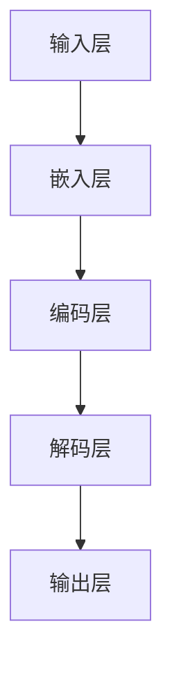
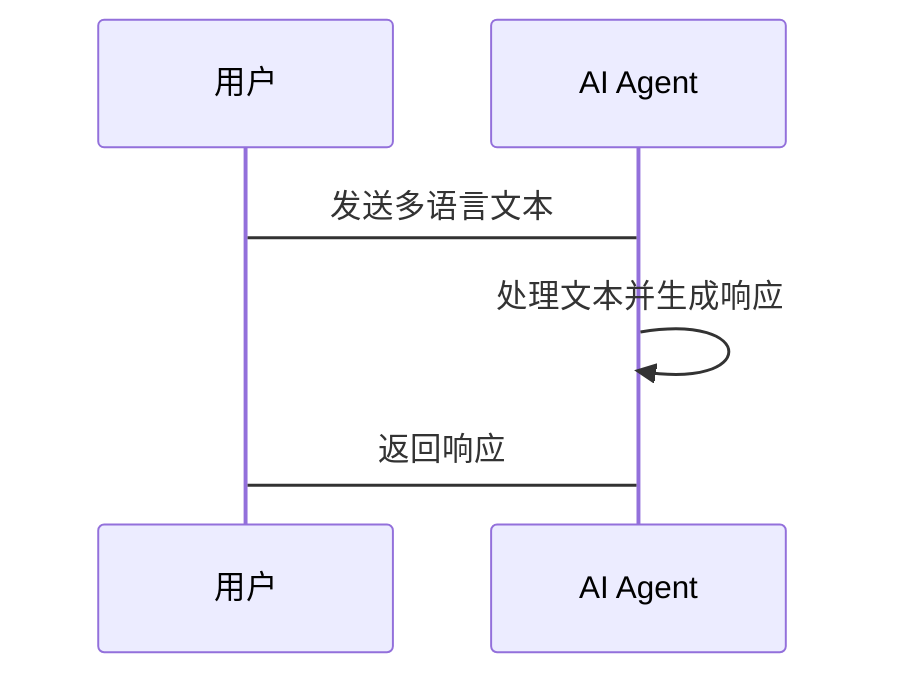

                 


# AI Agent的跨语言学习：增强LLM的多语言能力

**关键词**：AI Agent, 跨语言学习, 大型语言模型, 多语言能力, 自然语言处理, 机器学习, 人工智能

**摘要**：随着全球化的深入和多语言应用场景的增多，AI Agent的跨语言学习能力变得越来越重要。本文详细探讨了如何通过增强大型语言模型（LLM）的多语言能力，使其能够理解和处理多种语言，从而在复杂的多语言环境中提供更高效、更智能的服务。文章从基本概念、核心算法、数学模型、系统架构设计、项目实战等多个方面进行了全面分析，并通过实际案例展示了跨语言学习的应用与实现。

---

## 第一部分：引言

### 第1章：AI Agent与跨语言学习概述

#### 1.1 AI Agent的基本概念
AI Agent（人工智能代理）是指能够感知环境、执行任务并做出决策的智能实体。它可以是一个软件程序、一个机器人，甚至是一个复杂的系统。AI Agent的核心能力包括感知、推理、学习和行动。

#### 1.2 跨语言学习的核心问题
跨语言学习是指让AI Agent能够理解和处理多种语言的能力。在多语言环境中，AI Agent需要能够识别、理解、生成和翻译不同语言的文本，以实现与用户的有效交互或完成特定任务。

#### 1.3 AI Agent在多语言环境中的应用
AI Agent在多语言环境中的应用非常广泛，例如智能客服、多语言聊天机器人、跨语言信息检索等。这些应用场景要求AI Agent具备高效的跨语言处理能力，以满足不同语言用户的需求。

---

## 第二部分：多语言模型的基本原理

### 第2章：多语言模型的结构与特点

#### 2.1 多语言模型的架构
多语言模型通常采用参数共享的架构，通过共享某些参数来减少计算量和参数数量。这种架构使得模型能够同时处理多种语言，而不需要为每种语言单独训练一个独立的模型。

#### 2.2 参数共享与语言表示
在多语言模型中，参数共享通常通过共享嵌入层或编码层来实现。语言表示通过嵌入向量来捕捉语言的语义信息，不同语言的嵌入向量在共享层中进行融合。

#### 2.3 多任务学习在多语言模型中的应用
多任务学习是一种通过同时学习多个任务来提高模型性能的技术。在多语言模型中，多任务学习可以帮助模型在多种语言任务（如翻译、问答、文本分类）之间共享知识，从而提高整体性能。

### 第3章：跨语言学习的核心算法

#### 3.1 多任务学习算法
多任务学习算法通过共享某些层的参数来实现跨任务的知识共享。例如，在多语言翻译任务中，模型可以共享编码层，同时为每个语言任务单独训练解码层。

#### 3.2 对比学习算法
对比学习是一种通过对比不同样本之间的相似性来学习特征表示的技术。在跨语言学习中，对比学习可以用于对齐不同语言的语义表示，从而实现跨语言的特征匹配。

#### 3.3 预训练模型的微调
预训练模型（如BERT、GPT）可以通过微调来适应特定的跨语言任务。微调过程通常包括在特定语言任务的数据集上进行训练，以优化模型在目标任务上的表现。

---

## 第三部分：数学模型与公式

### 第4章：跨语言学习的数学模型

#### 4.1 跨语言学习的数学模型
跨语言学习的数学模型通常基于概率论和深度学习框架。例如，多任务学习模型可以通过共享参数来实现跨任务的知识共享。

#### 4.2 参数共享的数学表达
参数共享可以通过共享权重矩阵来实现。例如，在多语言翻译模型中，编码层的权重矩阵是共享的，而解码层的权重矩阵是针对每个语言单独训练的。

#### 4.3 对比学习的数学表达
对比学习的目标是最小化正面样本之间的相似性，同时最大化正面样本与负面样本之间的差异。其数学表达通常涉及损失函数的优化。

---

## 第四部分：系统分析与架构设计

### 第5章：系统架构设计

#### 5.1 系统架构图
使用Mermaid绘制系统架构图，展示多语言模型的架构和模块之间的关系。



#### 5.2 接口设计
系统接口设计包括输入接口、输出接口和模块之间的接口。例如，输入接口可以接收多语言文本，输出接口可以返回翻译结果或回答。

#### 5.3 交互流程图
使用Mermaid绘制交互流程图，展示AI Agent与用户之间的交互过程。



---

## 第五部分：项目实战

### 第6章：项目实战

#### 6.1 环境安装
项目实战需要安装必要的库和工具，例如Python、TensorFlow、PyTorch等。

#### 6.2 核心代码实现
以下是跨语言学习模型的核心代码实现示例：

```python
import tensorflow as tf
from tensorflow import keras

# 定义多任务学习模型
class MultiTaskModel(keras.Model):
    def __init__(self):
        super().__init__()
        self.embedding = keras.layers.Embedding(input_dim=10000, output_dim=128)
        self.shared_layer = keras.layers.Dense(64, activation='relu')
        self.task1_layer = keras.layers.Dense(32, activation='relu')
        self.task2_layer = keras.layers.Dense(32, activation='relu')
        self.output_layer = keras.layers.Dense(1, activation='sigmoid')

    def call(self, inputs):
        x = self.embedding(inputs)
        x = self.shared_layer(x)
        x1 = self.task1_layer(x)
        x2 = self.task2_layer(x)
        output = self.output_layer(x1 + x2)
        return output

model = MultiTaskModel()
model.compile(optimizer='adam', loss='binary_crossentropy', metrics=['accuracy'])
```

#### 6.3 项目小结
通过实际案例分析，展示了跨语言学习模型的实现过程和应用场景。项目小结部分总结了项目的成果和经验教训。

---

## 第六部分：总结与展望

### 第7章：总结与展望

#### 7.1 总结
本文详细探讨了AI Agent的跨语言学习能力，从基本概念、核心算法到系统设计和项目实战，全面分析了如何增强大型语言模型的多语言能力。

#### 7.2 未来展望
未来的研究方向可能包括更高效的参数共享方法、更强大的对比学习算法以及更智能的系统架构设计。跨语言学习技术将为AI Agent在多语言环境中的应用提供更强大的支持。

---

**作者：AI天才研究院/AI Genius Institute & 禅与计算机程序设计艺术 /Zen And The Art of Computer Programming**

