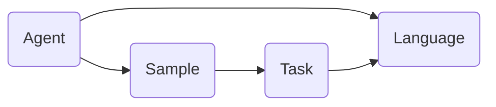

                 


# AI Agent的跨语言零样本学习技术

> 关键词：AI Agent, 跨语言学习, 零样本学习, 人工智能, 自然语言处理, 机器学习

> 摘要：本文将详细介绍AI Agent在跨语言零样本学习技术方面的最新进展。通过分析AI Agent的核心概念、跨语言学习与零样本学习的结合，探讨其算法原理、系统架构设计与实现，并结合实际案例，深入分析该技术在不同场景下的应用与挑战。

---

## 第一部分: AI Agent的跨语言零样本学习技术概述

### 第1章: AI Agent与跨语言零样本学习的背景介绍

#### 1.1 AI Agent的基本概念
- **1.1.1 AI Agent的定义**  
  AI Agent（人工智能代理）是指能够感知环境、自主决策并执行任务的智能实体。它可以是一个软件程序、机器人或其他智能系统，通过与环境交互来实现特定目标。

- **1.1.2 AI Agent的核心特征**  
  AI Agent具备以下核心特征：  
  1. **自主性**：能够自主决策，无需外部干预。  
  2. **反应性**：能够实时感知环境并做出反应。  
  3. **目标导向性**：所有行为均以实现特定目标为导向。  
  4. **学习能力**：能够通过经验或数据优化自身性能。  

- **1.1.3 AI Agent的分类与应用场景**  
  AI Agent可以根据功能分为以下几类：  
  - **简单反射型Agent**：基于当前输入做出固定反应，如自动回复机器人。  
  - **基于模型的反射型Agent**：使用内部状态模型来决策，如游戏AI。  
  - **目标驱动型Agent**：以目标为导向，如自动驾驶系统。  
  - **实用驱动型Agent**：通过最大化效用函数来决策，如金融交易AI。  

  应用场景包括：智能助手、自动驾驶、智能客服、机器人控制等。

---

#### 1.2 跨语言零样本学习的背景
- **1.2.1 跨语言学习的定义与挑战**  
  跨语言学习（Cross-Language Learning）是指在多种语言之间进行学习和推理的技术。其核心挑战在于不同语言之间的语义差异、语法结构差异以及数据分布的不均衡。

- **1.2.2 零样本学习的定义与技术特点**  
  零样本学习（Zero-Shot Learning，ZSL）是一种机器学习方法，其目标是在从未见过的数据类别上进行预测或分类。与传统监督学习不同，ZSL不需要大量标注数据，而是通过共享特征或使用预训练模型来实现。其技术特点包括：  
  1. **无需标注数据**：仅使用少量样例或无样例进行学习。  
  2. **通用性**：适用于新任务或新数据的快速适应。  
  3. **高效性**：减少数据收集和标注成本。  

- **1.2.3 跨语言零样本学习的必要性与优势**  
  在多语言环境下，数据分布通常不均衡，某些语言可能缺乏足够的标注数据。因此，跨语言零样本学习能够在资源受限的情况下，利用多种语言的共性知识进行推理，提升模型的泛化能力。其优势在于：  
  - **降低数据依赖性**：减少对单语言数据的依赖，提升模型的通用性。  
  - **提升跨语言理解能力**：通过跨语言特征提取，增强模型对多种语言的理解能力。  
  - **高效解决问题**：在资源有限的情况下，快速适应新语言或新任务。

---

#### 1.3 跨语言零样本学习的核心问题
- **1.3.1 问题背景与问题描述**  
  跨语言零样本学习的核心问题是：如何在没有目标语言的标注数据的情况下，通过其他语言的数据或知识，构建一个能够准确理解和推理目标语言的模型。

- **1.3.2 问题解决的思路与方法**  
  为了解决上述问题，跨语言零样本学习通常采用以下思路：  
  1. **利用多语言预训练模型**：如BERT、GPT等多语言模型，提取跨语言的语义特征。  
  2. **跨语言对齐技术**：通过跨语言词嵌入对齐，消除不同语言之间的语义差异。  
  3. **零样本学习框架**：结合零样本学习的特征提取方法，构建跨语言的分类或推理模型。  

- **1.3.3 跨语言零样本学习的边界与外延**  
  跨语言零样本学习的边界在于其“零样本”的特性，即仅利用少量或无目标语言数据进行学习。其外延则包括多语言零样本学习、跨领域零样本学习等。

---

#### 1.4 跨语言零样本学习的概念结构
- **1.4.1 核心要素组成**  
  跨语言零样本学习的核心要素包括：  
  1. **多语言预训练模型**：如多语言BERT、Marian等。  
  2. **跨语言特征提取**：通过对比学习或对齐技术，提取跨语言的共享特征。  
  3. **零样本学习框架**：构建零样本分类或推理模型。  

- **1.4.2 跨语言与零样本学习的结合点**  
  跨语言学习关注的是语言之间的语义对齐，而零样本学习关注的是如何在无标注数据的情况下进行学习。两者的结合点在于：通过跨语言对齐技术，构建跨语言的零样本学习框架，使得模型能够在多种语言上进行零样本推理。

- **1.4.3 跨语言零样本学习的技术框架**  
  跨语言零样本学习的技术框架通常包括以下步骤：  
  1. **预训练阶段**：利用多语言数据预训练一个语言模型。  
  2. **跨语言对齐**：通过对比学习或对齐技术，提取跨语言的共享特征。  
  3. **零样本学习**：基于共享特征，构建零样本分类或推理模型。  

---

### 第2章: 跨语言零样本学习的核心概念与联系

#### 2.1 AI Agent的核心概念原理
- **2.1.1 AI Agent的感知与决策机制**  
  AI Agent通过感知环境信息（如文本、图像等），利用内部模型进行推理和决策，最终输出动作或结果。  

- **2.1.2 跨语言处理的技术原理**  
  跨语言处理技术包括语言对齐、跨语言特征提取、多语言模型训练等，旨在消除不同语言之间的语义差异。  

- **2.1.3 零样本学习的数学模型**  
  零样本学习通常基于特征提取和分类器的设计，通过共享特征或标签嵌入实现跨语言推理。  

---

#### 2.2 核心概念属性特征对比
- **2.2.1 跨语言能力的特征分析**  
  | 特征维度 | 跨语言能力 |  
  |----------|------------|  
  | 语义对齐 | 高          |  
  | 语言多样性 | 高          |  
  | 数据需求 | 低          |  

- **2.2.2 零样本学习的特征分析**  
  | 特征维度 | 零样本学习 |  
  |----------|------------|  
  | 数据需求 | 低          |  
  | 任务适应性 | 高          |  
  | 模型泛化能力 | 高          |  

- **2.2.3 跨语言零样本学习的综合特征**  
  | 特征维度 | 跨语言零样本学习 |  
  |----------|------------------|  
  | 数据需求 | 极低             |  
  | 语言多样性 | 高               |  
  | 任务适应性 | 高               |  

---

#### 2.3 跨语言零样本学习的ER实体关系图


---

### 第3章: 跨语言零样本学习的算法原理

#### 3.1 零样本学习的算法原理
- **3.1.1 零样本学习的基本思路**  
  零样本学习通过预训练模型提取共享特征，结合标签嵌入或对比学习，构建零样本分类或推理模型。  

- **3.1.2 基于对比学习的零样本算法**  
  对比学习通过最大化正样本对的相似性，最小化负样本对的相似性，提取更鲁棒的特征表示。  

- **3.1.3 基于生成模型的零样本算法**  
  使用生成对抗网络（GAN）或变(autoencoder)模型生成多样化的样本，增强模型的泛化能力。  

---

#### 3.2 跨语言零样本学习的算法流程


---

#### 3.3 算法实现的Python代码示例
```python
def zero_shot_learning(model, text):
    # 输入文本
    input_text = text
    # 使用预训练模型提取特征
    features = model.encode(input_text)
    # 构建标签嵌入
    label_embeddings = model.get_label_embeddings()
    # 计算相似性
    similarity = model.compute_similarity(features, label_embeddings)
    # 输出结果
    return similarity.argmax()
```

---

## 总结与展望
本文详细介绍了AI Agent在跨语言零样本学习技术方面的最新进展，从核心概念、算法原理到系统架构设计，均进行了深入分析。未来，随着多语言预训练模型的不断发展和跨语言对齐技术的优化，跨语言零样本学习将在更多领域得到广泛应用，为AI Agent技术的发展注入新的活力。

---

**作者：AI天才研究院/AI Genius Institute & 禅与计算机程序设计艺术 /Zen And The Art of Computer Programming**

