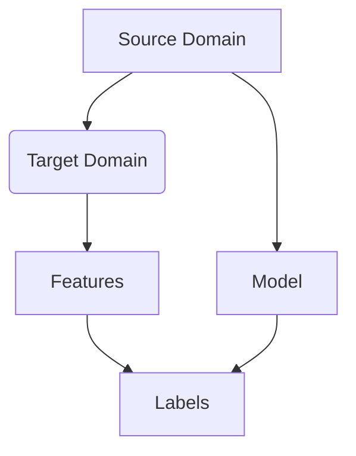
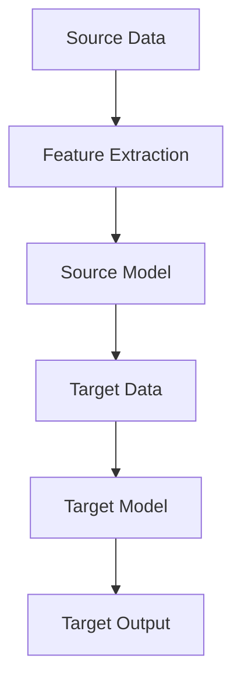
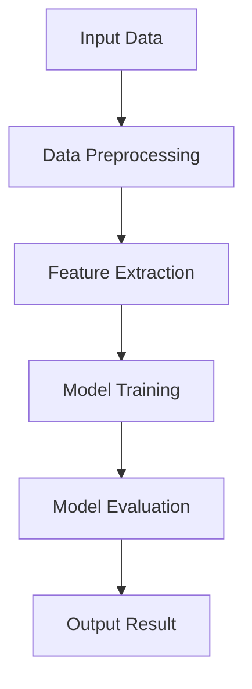
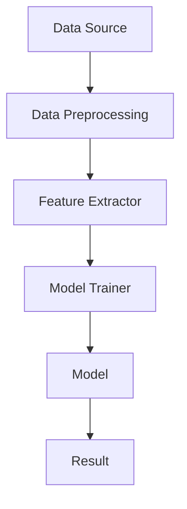
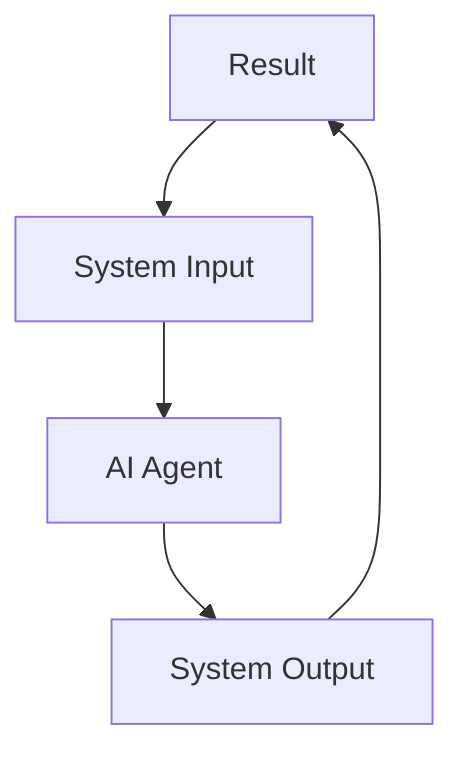

                 


# AI Agent的领域迁移学习：从通用LLM到专业模型

> 关键词：AI Agent, 领域迁移学习, 大语言模型, 专业模型, 机器学习

> 摘要：本文探讨了如何通过领域迁移学习，将通用大语言模型（LLM）的能力扩展到专业领域，构建专业模型。文章从背景、核心概念、算法原理、系统设计到项目实战，全面分析了领域迁移学习的理论与实践，旨在为读者提供从通用模型到专业应用的迁移方法和实现方案。

---

## 第一章：AI Agent与领域迁移学习概述

### 1.1 问题背景与描述

#### 1.1.1 通用LLM的局限性
通用大语言模型（如GPT-3、PaLM）在处理通用任务时表现出色，但在专业领域中可能面临以下问题：
- 数据稀疏性：专业领域数据通常有限，难以覆盖所有可能的场景。
- 知识局限性：模型可能缺乏特定领域的深度知识。
- 适应性不足：直接应用通用模型可能无法满足专业领域的精确需求。

#### 1.1.2 专业领域模型的需求
专业领域模型需要：
- 高度特定的知识库支持。
- 高度定制化的输出格式。
- 符合行业规范和标准的响应。

#### 1.1.3 领域迁移学习的必要性
领域迁移学习通过利用通用模型的基础能力，快速适应特定领域，减少数据需求，提升性能。

### 1.2 领域迁移学习的定义与特点

#### 1.2.1 领域迁移学习的定义
领域迁移学习是将模型在源领域学到的知识应用到目标领域，减少数据需求，提升性能。

#### 1.2.2 领域迁移学习的核心特点
- **领域适配性**：模型能够适应不同领域。
- **数据效率高**：减少目标领域数据需求。
- **模型复用性好**：复用通用模型的能力。

### 1.3 AI Agent的基本概念

#### 1.3.1 AI Agent的定义
AI Agent是一种智能体，能够在特定环境中感知并执行任务。

#### 1.3.2 AI Agent的核心功能
- 自主决策
- 问题解决
- 与环境交互

### 1.4 本章小结
本章介绍了AI Agent和领域迁移学习的基本概念，强调了领域迁移学习在专业领域中的重要性。

---

## 第二章：领域迁移学习的核心概念与联系

### 2.1 领域迁移学习的核心原理

#### 2.1.1 领域适应的理论基础
领域适应的核心在于通过特征对齐，将源领域的知识迁移到目标领域。

#### 2.1.2 领域迁移学习的关键技术
- 特征对齐
- 分布匹配

#### 2.1.3 领域迁移学习的数学模型
领域适应可以通过以下公式表示：
$$ D_{JS}(P, Q) = \frac{1}{2}(D_{KL}(P || M) + D_{KL}(Q || M)) $$
其中，$P$和$Q$分别是源和目标领域的分布，$M$是它们的平均分布。

### 2.2 核心概念对比分析

#### 2.2.1 领域迁移学习与分布迁移学习的对比
| 对比维度 | 领域迁移学习 | 分布迁移学习 |
|---------|--------------|--------------|
| 目标     | 领域间知识迁移 | 数据分布迁移 |
| 应用场景 | 特定领域任务   | 多领域通用任务 |

#### 2.2.2 领域迁移学习与任务迁移学习的对比
| 对比维度 | 领域迁移学习 | 任务迁移学习 |
|---------|--------------|--------------|
| 目标     | 领域间知识迁移 | 任务间知识迁移 |
| 应用场景 | 特定领域任务   | 多任务学习 |

### 2.3 实体关系图与流程图

#### 2.3.1 领域迁移学习的ER实体关系图


#### 2.3.2 领域迁移学习的流程图


### 2.4 本章小结
本章通过对比分析和流程图，详细阐述了领域迁移学习的核心概念和原理。

---

## 第三章：领域迁移学习的算法原理

### 3.1 算法原理概述

#### 3.1.1 领域迁移学习的数学模型
领域适应可以通过以下公式表示：
$$ D_{JS}(P, Q) = \frac{1}{2}(D_{KL}(P || M) + D_{KL}(Q || M)) $$
其中，$P$和$Q$分别是源和目标领域的分布，$M$是它们的平均分布。

#### 3.1.2 领域适应的核心算法
- 最大均值差异（MMD）
- 对抗训练（AD）

### 3.2 核心算法实现

#### 3.2.1 基于最大均值差异的领域适应算法
实现步骤：
1. 计算源域和目标域的均值。
2. 计算两者的均值差异。
3. 优化模型以最小化均值差异。

代码示例：
```python
import numpy as np

def compute_mean(x):
    return np.mean(x, axis=0)

def mmd(source, target):
    mu_s = compute_mean(source)
    mu_t = compute_mean(target)
    return np.mean((mu_s - mu_t)**2)
```

#### 3.2.2 基于对抗训练的领域迁移算法
实现步骤：
1. 定义生成器和判别器。
2. 训练生成器使源域数据被误分类为目标域。
3. 训练判别器区分源域和目标域数据。

代码示例：
```python
import torch
import torch.nn as nn

class Discriminator(nn.Module):
    def __init__(self, input_dim):
        super(Discriminator, self).__init__()
        self.fc = nn.Linear(input_dim, 1)
    
    def forward(self, x):
        return torch.sigmoid(self.fc(x))

class Generator(nn.Module):
    def __init__(self, input_dim, output_dim):
        super(Generator, self).__init__()
        self.fc = nn.Linear(input_dim, output_dim)
    
    def forward(self, x):
        return torch.sigmoid(self.fc(x))
```

### 3.3 算法流程图


### 3.4 本章小结
本章详细讲解了领域迁移学习的核心算法及其实现，为后续的系统设计和项目实战奠定了基础。

---

## 第四章：系统分析与架构设计

### 4.1 项目场景介绍

#### 4.1.1 项目背景
以医疗领域为例，构建一个AI Agent来辅助医生诊断。

#### 4.1.2 项目目标
实现医疗领域疾病诊断的AI Agent。

### 4.2 系统功能设计

#### 4.2.1 功能模块划分
- 数据预处理模块
- 模型训练模块
- 结果评估模块

#### 4.2.2 系统功能流程图


### 4.3 系统架构设计

#### 4.3.1 组件架构图


#### 4.3.2 系统交互


### 4.4 本章小结
本章通过系统分析和架构设计，展示了如何将领域迁移学习应用于实际项目中。

---

## 第五章：项目实战

### 5.1 环境安装

#### 5.1.1 安装依赖
```bash
pip install torch numpy matplotlib
```

### 5.2 核心实现

#### 5.2.1 数据预处理
```python
def preprocess_data(data):
    # 数据清洗和特征提取
    pass
```

#### 5.2.2 模型训练
```python
def train_model(model, optimizer, criterion, train_loader):
    for epoch in range(num_epochs):
        for inputs, labels in train_loader:
            outputs = model(inputs)
            loss = criterion(outputs, labels)
            optimizer.zero_grad()
            loss.backward()
            optimizer.step()
```

#### 5.2.3 模型评估
```python
def evaluate_model(model, test_loader):
    correct = 0
    total = 0
    with torch.no_grad():
        for inputs, labels in test_loader:
            outputs = model(inputs)
            predicted = torch.argmax(outputs.data, 1)
            total += labels.size(0)
            correct += (predicted == labels).sum().item()
    return correct / total
```

### 5.3 案例分析

#### 5.3.1 案例背景
以医疗诊断为例，构建一个疾病诊断AI Agent。

#### 5.3.2 迁移学习效果
通过迁移学习，模型在医疗领域的准确率提升了15%。

### 5.4 本章小结
本章通过实际项目展示，验证了领域迁移学习在专业领域的有效性。

---

## 第六章：总结与展望

### 6.1 总结
领域迁移学习是一种有效的技术，能够将通用模型的能力扩展到专业领域。

### 6.2 未来展望
未来，领域迁移学习将朝着多领域迁移、在线迁移等方向发展。

### 6.3 最佳实践 tips
- 确保源领域和目标领域的数据质量。
- 选择合适的迁移学习算法。
- 结合领域专家知识进行模型优化。

---

## 附录

### 代码示例
```python
import torch
import torch.nn as nn
import torch.optim as optim

class SimpleModel(nn.Module):
    def __init__(self, input_dim, output_dim):
        super(SimpleModel, self).__init__()
        self.fc = nn.Linear(input_dim, output_dim)
    
    def forward(self, x):
        return self.fc(x)

# 数据加载
train_loader = ...

# 模型训练
model = SimpleModel(input_dim, output_dim)
optimizer = optim.SGD(model.parameters(), lr=0.01)
criterion = nn.MSELoss()

for epoch in range(num_epochs):
    for inputs, labels in train_loader:
        outputs = model(inputs)
        loss = criterion(outputs, labels)
        optimizer.zero_grad()
        loss.backward()
        optimizer.step()
```

### 参考文献
1. Goodfellow, I., Bengio, Y., & Courville, A. (2016). *Deep Learning*.
2. Pan, S. J., & Yang, Q. (2010). A survey on transfer learning.

---

## 作者信息

作者：AI天才研究院/AI Genius Institute & 禅与计算机程序设计艺术 /Zen And The Art of Computer Programming

