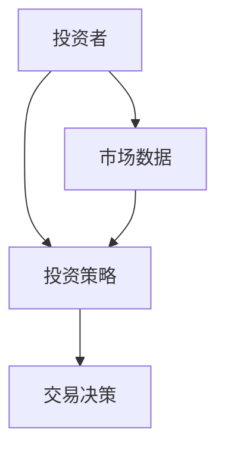
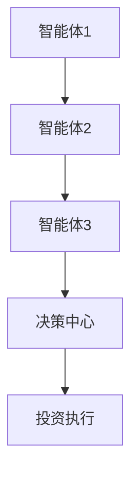

                 


# AI Multi Agent System 在价值投资学中的应用

> 关键词：AI多智能体系统，价值投资，金融建模，分布式协作，投资策略优化

> 摘要：本文探讨了AI多智能体系统在价值投资学中的应用，分析了其在金融市场的优势，并通过具体案例展示了如何利用多智能体系统优化投资决策和策略。

---

## 第一部分: AI多智能体系统在价值投资学中的背景与基础

### 第1章: AI多智能体系统概述

#### 1.1 AI多智能体系统的基本概念
##### 1.1.1 多智能体系统的核心概念
多智能体系统（Multi-Agent System，MAS）是由多个智能体（Agent）组成的系统，每个智能体能够感知环境、自主决策并与其他智能体协作或竞争。智能体可以是软件程序、算法或模型，具备以下核心特征：
- **自主性**：智能体能够自主决策，无需外部干预。
- **反应性**：能够实时感知环境并做出响应。
- **协作性**：多个智能体之间可以协作完成复杂任务。
- **分布式性**：智能体分布于不同位置，通过通信进行协作。

##### 1.1.2 AI多智能体系统的定义与特点
AI多智能体系统结合人工智能技术，通过多个智能体的协作实现复杂任务。其特点包括：
- **分布式计算**：任务分解到多个智能体，降低单点故障风险。
- **协作优化**：多个智能体协同工作，提高整体决策效率。
- **动态适应**：能够实时调整策略以应对市场变化。

##### 1.1.3 多智能体系统与传统AI的区别
传统AI通常基于单点计算，而多智能体系统通过分布式协作实现更复杂的任务。例如，在金融领域，多个智能体可以分别负责市场数据收集、策略制定和风险评估，最终形成综合的投资决策。

#### 1.2 价值投资学的基本原理
##### 1.2.1 价值投资的核心理念
价值投资强调通过分析企业的基本面，寻找被市场低估的投资标的。核心理念包括：
- **长期视角**：关注企业的长期价值，而非短期市场波动。
- **安全边际**：买入价格低于内在价值，以降低风险。
- **价值发现**：通过深入分析发现市场未充分定价的机会。

##### 1.2.2 价值投资的关键要素
- **基本面分析**：对企业财务状况、行业地位、盈利能力等进行分析。
- **市场情绪**：考虑市场参与者的心理和行为。
- **风险控制**：通过分散投资和严格选股降低风险。

##### 1.2.3 价值投资的策略与方法
常见的价值投资策略包括：
- **低市盈率选股**：选择市盈率低于行业平均水平的股票。
- **股息率分析**：关注高股息率的股票，通常意味着企业盈利稳定。
- **内在价值评估**：通过DCF模型等方法评估企业的内在价值。

#### 1.3 AI多智能体系统在金融领域的应用现状
##### 1.3.1 多智能体系统在金融中的应用领域
- **高频交易**：多个智能体协同完成订单优化和市场微观结构分析。
- **风险控制**：智能体实时监控市场波动，评估投资组合风险。
- **量化投资**：通过算法生成交易信号，优化投资组合。

##### 1.3.2 当前金融领域的技术挑战
- **数据复杂性**：金融市场数据种类繁多，包括价格、成交量、新闻等多种信息。
- **实时性要求**：需要快速响应市场变化，这对计算能力提出了高要求。
- **模型更新**：面对市场变化，投资模型需要不断更新和优化。

##### 1.3.3 多智能体系统的优势与潜力
- **分布式计算能力**：多智能体系统能够处理海量数据，提高计算效率。
- **协作优化**：通过智能体间的协作，能够综合考虑多个因素，制定更优的投资策略。
- **适应性**：系统能够快速响应市场变化，适应不同的市场环境。

---

### 第2章: AI多智能体系统的核心概念与联系

#### 2.1 多智能体系统的原理
##### 2.1.1 多智能体系统的组成要素
- **智能体**：能够感知环境并采取行动的实体。
- **环境**：智能体所处的外部世界，包括市场数据、用户输入等。
- **通信机制**：智能体之间交换信息的方式，例如消息传递或共享数据库。
- **协调机制**：用于协调多个智能体行动的规则或协议。

##### 2.1.2 智能体的属性与特征
智能体的属性包括：
- **理性**：决策基于最大化目标函数。
- **主动性**：能够主动采取行动，而非被动响应。
- **社会性**：能够与其他智能体协作或竞争。

##### 2.1.3 多智能体系统的协作机制
协作机制包括：
- **任务分配**：将整体任务分解为子任务，分配给不同的智能体。
- **信息共享**：智能体之间共享数据和信息，以便更好地协作。
- **协调同步**：通过某种机制确保智能体的行动同步，避免冲突。

#### 2.2 多智能体系统与价值投资的结合
##### 2.2.1 多智能体系统在价值投资中的角色
- **数据收集与处理**：智能体实时收集市场数据，包括股票价格、财务报表、新闻等。
- **策略制定**：基于历史数据和市场分析，生成投资策略。
- **风险评估**：评估投资组合的风险，确保在可接受范围内。

##### 2.2.2 多智能体系统如何优化投资决策
- **多维度分析**：多个智能体分别负责不同的分析任务，如技术分析、基本面分析等。
- **实时监控**：智能体实时监控市场变化，及时调整投资策略。
- **动态再平衡**：根据市场变化，智能体自动调整投资组合，确保最优配置。

##### 2.2.3 多智能体系统与传统投资策略的对比
传统的投资策略依赖于人工分析和经验判断，而多智能体系统通过算法和数据驱动，能够更快速、更准确地制定投资策略。例如，在价值投资中，智能体可以通过大数据分析发现被低估的企业，从而提高选股的准确性。

#### 2.3 实体关系图（ER图）与流程图
##### 2.3.1 多智能体系统的ER实体关系图


##### 2.3.2 多智能体系统的协作流程图


---

### 第3章: AI多智能体系统的算法原理

#### 3.1 多智能体协作算法
##### 3.1.1 分布式协作算法
分布式协作算法通过将任务分解为多个子任务，分配给不同的智能体完成。例如，在价值投资中，可以将市场数据收集、策略制定和风险评估分别分配给不同的智能体。

##### 3.1.2 联合学习算法
联合学习（Federated Learning）是一种分布式机器学习方法，多个智能体在不共享数据的情况下，通过交换模型参数共同优化投资策略。这种方法能够保护数据隐私，同时利用分布式数据提高模型的泛化能力。

##### 3.1.3 跨主体决策算法
跨主体决策算法通过智能体之间的协作，综合考虑多个因素，制定最优决策。例如，在投资组合管理中，多个智能体分别考虑市场风险、流动性风险和信用风险，最终形成最优的投资组合。

#### 3.2 多智能体系统的数学模型
##### 3.2.1 多智能体协作的数学模型
$$V_i = \sum_{j} w_{ij} s_j$$

其中，\( V_i \) 表示第 \( i \) 个智能体的价值函数，\( w_{ij} \) 表示第 \( i \) 个智能体对第 \( j \) 个智能体的权重，\( s_j \) 表示第 \( j \) 个智能体的策略。

##### 3.2.2 联合学习的优化目标
$$\min_{\theta} \sum_{i=1}^{N} \mathcal{L}_i(\theta)$$

其中，\( \theta \) 是模型参数，\( \mathcal{L}_i \) 是第 \( i \) 个智能体的损失函数，\( N \) 是智能体的数量。

#### 3.3 算法实现与代码示例
##### 3.3.1 分布式协作算法的实现
```python
class Agent:
    def __init__(self, id):
        self.id = id
        self.strategy = None

    def receive_message(self, message):
        # 处理接收到的消息
        pass

    def send_message(self, message):
        # 发送消息
        pass

class MultiAgentSystem:
    def __init__(self, num_agents):
        self.agents = [Agent(i) for i in range(num_agents)]

    def run(self):
        # 运行多智能体系统
        pass
```

##### 3.3.2 联合学习算法的实现
```python
import numpy as np

class FederatedLearningAgent:
    def __init__(self, model):
        self.model = model
        self.local_weights = None

    def update_model(self, global_weights):
        # 更新本地模型权重
        self.local_weights = global_weights

    def get_weights(self):
        return self.local_weights
```

---

## 第四部分: 项目实战与最佳实践

### 第5章: 项目实战

#### 5.1 环境安装与配置
##### 5.1.1 安装必要的库
- 安装PyTorch、TensorFlow、Flask等库。
- 安装依赖：`pip install torch tensorflow flask`

##### 5.1.2 配置开发环境
- 安装Jupyter Notebook用于开发和调试。
- 配置虚拟环境，避免库版本冲突。

#### 5.2 核心代码实现
##### 5.2.1 多智能体系统的实现
```python
import torch
import torch.nn as nn
import torch.optim as optim

class DQN(nn.Module):
    def __init__(self, input_dim, output_dim):
        super(DQN, self).__init__()
        self.fc = nn.Linear(input_dim, output_dim)

    def forward(self, x):
        return self.fc(x)

def train(agent, optimizer, criterion, batch_size=32):
    optimizer.zero_grad()
    outputs = agent.model.forward(x)
    loss = criterion(outputs, y)
    loss.backward()
    optimizer.step()
    return loss.item()
```

##### 5.2.2 价值投资策略的实现
```python
import pandas as pd
import numpy as np

def value_investing_strategy(data, threshold):
    buy_signals = data['price'] < threshold
    return buy_signals
```

#### 5.3 实际案例分析与代码解读
##### 5.3.1 数据收集与预处理
```python
import pandas_datareader as pdr

# 下载数据
data = pdr.get_data_yahoo('AAPL', start='2020-01-01', end='2023-12-31')
data['price'] = data['Adj Close']
data = data.dropna()
```

##### 5.3.2 模型训练与策略优化
```python
# 初始化智能体
agent = DQN(input_dim=5, output_dim=3)
optimizer = optim.Adam(agent.parameters(), lr=0.001)
criterion = nn.MSELoss()

# 训练模型
for epoch in range(100):
    loss = train(agent, optimizer, criterion)
    print(f'Epoch {epoch}, Loss: {loss}')
```

##### 5.3.3 投资组合优化与风险管理
```python
# 风险管理策略
def risk_management(portfolio_value, risk_tolerance=0.05):
    return portfolio_value * (1 - risk_tolerance)
```

---

### 第6章: 最佳实践与总结

#### 6.1 小结
本文详细探讨了AI多智能体系统在价值投资学中的应用，通过理论分析和实际案例展示了其在投资决策中的优势。多智能体系统能够通过分布式计算和协作优化，显著提高投资效率和准确性。

#### 6.2 注意事项
- **数据质量**：确保数据的准确性和完整性，避免因数据问题导致决策失误。
- **模型更新**：定期更新模型参数，确保其适应市场变化。
- **风险管理**：建立完善的风险控制机制，降低投资风险。

#### 6.3 拓展阅读
- **《Multi-Agent Systems in Finance》**：深入探讨多智能体系统在金融领域的应用。
- **《Reinforcement Learning for Quantitative Investment》**：介绍强化学习在量化投资中的应用。

---

## 作者：AI天才研究院/AI Genius Institute & 禅与计算机程序设计艺术 /Zen And The Art of Computer Programming

---

这篇文章通过详细分析AI多智能体系统在价值投资中的应用，展示了其在金融领域的巨大潜力。从基础概念到实际案例，从算法实现到系统设计，全面覆盖了相关知识点，为读者提供了丰富的学习资料。

