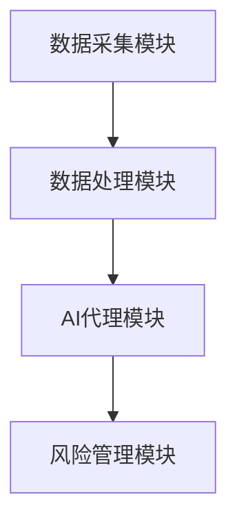

                 


# AI agents优化价值投资策略的动态调整

**关键词**: AI代理, 价值投资策略, 动态调整, 强化学习, Q-learning算法, 金融建模

**摘要**: 本文探讨了如何利用AI代理优化价值投资策略，并实现动态调整。通过分析AI代理的核心算法、强化学习与动态规划的数学模型，构建了动态调整模型，并通过实际案例展示了系统架构和项目实战。文章旨在为投资者和程序员提供一个全面的技术框架，以实现更高效、更智能的投资策略。

---

# 第一部分: AI代理与价值投资策略概述

## 第1章: AI代理与价值投资概述

### 1.1 AI代理的核心概念

#### 1.1.1 AI代理的定义与特点

AI代理是一种智能体，能够感知环境并采取行动以实现目标。在金融领域，AI代理可以用于数据分析、投资决策和风险管理。其特点包括：

- **自主性**: 能够自主决策，无需人工干预。
- **反应性**: 能够实时感知市场变化并做出反应。
- **学习能力**: 通过强化学习等算法不断优化决策策略。

#### 1.1.2 价值投资的基本原理

价值投资是一种投资策略，旨在通过识别市场低估的资产进行长期投资。其核心在于分析企业的基本面，寻找具有长期竞争优势和良好治理结构的企业。价值投资强调长期持有的理念，而非短期市场波动。

#### 1.1.3 AI代理在金融领域的应用

AI代理在金融领域的应用广泛，包括股票交易、风险管理和组合优化。通过自然语言处理（NLP）分析财务报表，利用强化学习优化投资组合，以及使用时间序列分析预测市场趋势。

### 1.2 价值投资策略的动态调整

#### 1.2.1 价值投资的核心要素

价值投资的核心要素包括：

- **企业基本面分析**: 包括财务报表分析、行业地位评估和竞争优势识别。
- **市场估值**: 通过市盈率、市净率等指标判断资产是否被低估。
- **长期持有策略**: 避免频繁交易，降低交易成本。

#### 1.2.2 动态调整的必要性

市场环境不断变化，静态的价值投资策略难以适应动态的市场环境。动态调整能够帮助投资者及时捕捉市场机会，规避潜在风险。

#### 1.2.3 AI代理在动态调整中的作用

AI代理可以通过强化学习实时优化投资组合，根据市场反馈调整交易策略。其在动态调整中的作用包括：

- **实时反馈**: 根据市场反馈调整投资决策。
- **风险控制**: 通过动态调整降低投资组合的风险。
- **机会捕捉**: 及时发现市场中的潜在机会。

---

# 第二部分: AI代理的核心算法与数学模型

## 第2章: 强化学习与动态规划

### 2.1 强化学习的基本原理

#### 2.1.1 状态空间的定义

状态空间是强化学习环境中所有可能的状态的集合。在价值投资中，状态可以定义为市场的当前状况，包括指数点位、行业表现和宏观经济指标。

#### 2.1.2 动作空间的定义

动作空间是强化学习环境中所有可能的操作的集合。在价值投资中，动作可以定义为买入、卖出或持有某种资产。

#### 2.1.3 奖励函数的设计

奖励函数用于衡量AI代理在特定状态下采取某项行动的优劣。在价值投资中，奖励函数可以定义为投资组合的收益与市场指数的收益之差。

### 2.2 Q-learning算法

#### 2.2.1 Q-learning算法的数学模型

$$ Q(s,a) = (1-\alpha) Q(s,a) + \alpha (r + \gamma Q(s',a')) $$

其中：
- $Q(s,a)$: 状态$s$和动作$a$对应的Q值。
- $\alpha$: 学习率。
- $r$: 奖励。
- $\gamma$: 折扣因子。
- $Q(s',a')$: 下一状态$s'$和动作$a'$对应的Q值。

#### 2.2.2 Q-learning算法的实现步骤

1. 初始化Q表，所有状态-动作对的初始值为0。
2. 在每个时间步，根据当前状态选择动作。
3. 执行动作，观察新状态，并获得奖励。
4. 更新Q值：$Q(s,a) = Q(s,a) + \alpha (r + \gamma \max Q(s',a') - Q(s,a))$。
5. 重复步骤2-4，直到达到终止条件。

#### 2.2.3 Q-learning算法的优缺点

- **优点**: 实现简单，适用于离散状态空间。
- **缺点**: 对连续状态空间的处理能力有限，可能需要更多的训练数据。

### 2.3 动态规划与价值迭代

#### 2.3.1 动态规划的基本原理

动态规划是一种通过分解问题来寻找最优解的方法。在价值投资中，可以通过动态规划优化投资组合的配置。

#### 2.3.2 价值迭代算法的数学模型

$$ V_{k+1}(s) = \max_a \left( r + \gamma \sum_{s'} P(s'|s,a) V_k(s') \right) $$

其中：
- $V_k(s)$: 第$k$次迭代中状态$s$的价值。
- $a$: 动作。
- $r$: 奖励。
- $\gamma$: 折扣因子。
- $P(s'|s,a)$: 从状态$s$采取动作$a$转移到状态$s'$的概率。

#### 2.3.3 动态规划与Q-learning的对比

- **动态规划**: 需要已知状态转移概率，适用于确定性环境。
- **Q-learning**: 不需要已知状态转移概率，适用于不确定环境。

---

# 第三部分: 价值投资策略的动态调整模型

## 第3章: 动态调整模型的设计

### 3.1 动态调整模型的构建

#### 3.1.1 状态空间的构建

在价值投资中，状态空间可以包括：

- 市场指数点位。
- 行业表现。
- 宏观经济指标（如GDP增长率、利率水平）。

#### 3.1.2 动作空间的构建

在价值投资中，动作空间可以包括：

- 买入某种资产。
- 卖出某种资产。
- 持有某种资产。

#### 3.1.3 奖励函数的设计

奖励函数可以定义为：

$$ r = \text{投资组合收益} - \text{市场指数收益} $$

如果投资组合收益超过市场指数收益，奖励为正；否则，奖励为负。

### 3.2 动态调整模型的实现

#### 3.2.1 状态转移概率的计算

状态转移概率可以通过历史数据进行估计。例如，如果在市场上涨时买入的概率较高，可以通过历史数据计算出买入后的上涨概率。

#### 3.2.2 奖励函数的优化

可以通过调整奖励函数的权重，优化投资组合的收益与风险的平衡。例如，可以通过引入风险调整因子，降低高风险投资的权重。

#### 3.2.3 动态调整模型的训练

可以通过强化学习算法（如Q-learning）对动态调整模型进行训练，优化投资组合的收益与风险。

### 3.3 动态调整模型的验证

#### 3.3.1 回测分析

回测分析是通过历史数据验证模型的有效性。例如，可以通过回测分析验证模型在不同市场环境下的表现。

#### 3.3.2 风险评估

风险评估是通过分析投资组合的波动性、最大回撤等指标，评估模型的风险水平。

#### 3.3.3 性能优化

性能优化是通过调整模型的参数，优化投资组合的收益与风险。

---

# 第四部分: 价值投资策略的AI代理实现

## 第4章: 系统架构与接口设计

### 4.1 系统架构设计

#### 4.1.1 系统模块划分

系统架构可以划分为以下几个模块：

- 数据采集模块: 采集市场数据。
- 数据处理模块: 处理市场数据，提取特征。
- AI代理模块: 执行强化学习算法，生成投资策略。
- 风险管理模块: 管理投资组合的风险。

#### 4.1.2 系统模块之间的关系

可以通过Mermaid图展示系统模块之间的关系。例如：



---

## 第5章: 项目实战

### 5.1 环境安装

需要安装以下环境：

- Python: 3.8+
- TensorFlow: 2.0+
- Gym: 0.15+
- Pandas: 1.0+

### 5.2 系统核心实现源代码

以下是AI代理优化价值投资策略的Python代码示例：

```python
import numpy as np
import gym
from gym import spaces
from gym.utils import seeding

class ValueInvestingEnv(gym.Env):
    def __init__(self, data):
        super().__init__()
        self.data = data
        self.current_step = 0
        self.observation_space = spaces.Box(low=0, high=1, shape=(len(data),))
        self.action_space = spaces.Discrete(3)  # 0: 买入, 1: 卖出, 2: 持有

    def _get_state(self):
        return self.data[self.current_step]

    def _get_reward(self, action, next_state):
        if action == 0:  # 买入
            reward = next_state[0] - self.data[self.current_step][0]
        elif action == 1:  # 卖出
            reward = - (next_state[0] - self.data[self.current_step][0])
        else:  # 持有
            reward = 0
        return reward

    def step(self, action):
        state = self._get_state()
        next_state = self.data[self.current_step + 1]
        reward = self._get_reward(action, next_state)
        self.current_step += 1
        done = self.current_step >= len(self.data) - 1
        return next_state, reward, done, {}

    def reset(self):
        self.current_step = 0
        return self._get_state()
```

### 5.3 代码解读与分析

- **环境定义**: `ValueInvestingEnv`类定义了价值投资环境，包括状态空间和动作空间。
- **状态获取**: `_get_state`方法获取当前状态。
- **奖励计算**: `_get_reward`方法计算奖励。
- **步骤执行**: `step`方法执行动作，更新状态并返回奖励和终止标志。
- **重置环境**: `reset`方法重置环境，开始新的 episode。

### 5.4 实际案例分析

假设我们有以下市场数据：

| 日期 | 收盘价 |
|------|--------|
| 2023-01-01 | 100    |
| 2023-01-02 | 105    |
| 2023-01-03 | 110    |
| 2023-01-04 | 108    |
| 2023-01-05 | 115    |

我们可以将这些数据输入AI代理，训练其在不同市场环境下做出最优决策。

### 5.5 项目小结

通过实际案例分析，我们可以看到AI代理在价值投资中的应用潜力。通过不断训练，AI代理可以优化投资组合，实现动态调整，提高投资收益。

---

# 第五部分: 总结与展望

## 第6章: 总结与展望

### 6.1 总结

本文详细探讨了AI代理在优化价值投资策略中的应用，构建了动态调整模型，并通过实际案例展示了系统的实现。通过强化学习算法（如Q-learning）和动态规划算法，我们可以实现投资组合的动态调整，提高投资收益。

### 6.2 展望

未来的研究可以进一步优化AI代理的算法，例如引入深度强化学习（Deep RL）提高模型的复杂度。同时，可以通过多智能体协同学习（Multi-Agent Learning）实现更复杂的投资策略。此外，还可以探索将AI代理应用于其他金融领域，如风险管理、市场预测等。

---

作者：AI天才研究院/AI Genius Institute & 禅与计算机程序设计艺术 /Zen And The Art of Computer Programming

