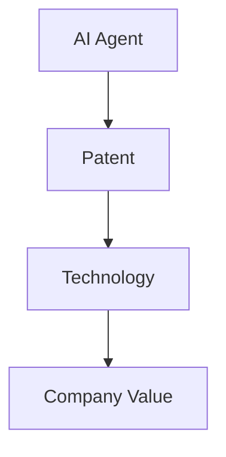
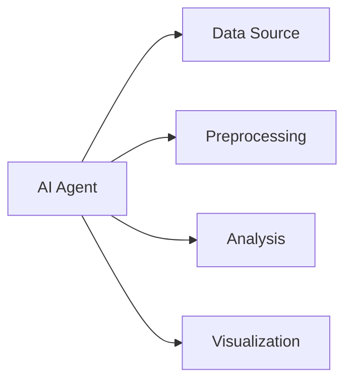

                 


# AI agents协作分析专利组合：评估技术驱动型公司的价值

> 关键词：AI代理、专利组合、技术评估、知识图谱、文本挖掘

> 摘要：本文探讨了利用AI代理协作分析专利组合的方法，详细阐述了专利组合分析的数学模型、AI代理协作的算法原理、系统架构设计，以及项目实战中的具体实现。通过案例分析，展示了如何评估技术驱动型公司的价值，并提供了最佳实践和未来展望。

---

## 第1章：AI代理与专利分析的背景介绍

### 1.1 问题背景

技术驱动型公司的核心竞争力往往体现在其专利组合上。专利不仅是技术保护的手段，更是公司技术实力的体现。然而，随着专利数量的激增，传统的专利分析方法难以应对复杂的技术评估需求。AI代理的引入，为专利分析提供了新的可能性。

#### 1.1.1 技术驱动型公司的价值评估

技术驱动型公司的价值主要依赖于其技术创新能力。专利组合分析通过评估专利的数量、质量、分布和技术影响力，帮助公司确定其技术优势和潜在风险。

#### 1.1.2 专利组合分析的重要性

专利组合分析能够揭示专利之间的关联性，识别核心专利和技术趋势，从而为公司的技术研发和战略决策提供支持。

#### 1.1.3 AI代理在专利分析中的作用

AI代理能够处理大量专利数据，利用自然语言处理和机器学习技术，提取专利中的技术信息，识别技术趋势，并预测技术发展。

### 1.2 核心概念

#### 1.2.1 AI代理的定义与特点

AI代理是一种能够感知环境并采取行动以实现目标的智能实体。其特点包括自主性、反应性、目标导向性和学习能力。

#### 1.2.2 专利组合分析的定义与目标

专利组合分析是对一组专利的综合分析，旨在评估其技术价值、法律风险和市场潜力。

#### 1.2.3 技术评估模型

技术评估模型通过量化专利的质量、影响力和分布，评估技术组合的整体价值。

### 1.3 问题解决

传统专利分析方法依赖人工判断，效率低且容易遗漏关键信息。AI代理通过自动化处理和深度学习，提升了专利分析的效率和准确性。

### 1.4 边界与外延

专利分析的范围通常限于专利数据，而技术评估则可能扩展到公司整体技术实力和市场表现。

---

## 第2章：AI代理的核心概念与联系

### 2.1 核心概念原理

#### 2.1.1 多智能体协作

多智能体协作通过多个AI代理的协同工作，提高分析的全面性和准确性。

#### 2.1.2 知识图谱构建

知识图谱将专利数据结构化，便于后续分析和推理。

#### 2.1.3 文本挖掘与语义分析

文本挖掘技术提取专利中的技术关键词和术语，语义分析则理解专利内容的技术关联性。

### 2.2 概念属性特征对比

| 概念       | 特征1 | 特征2 | 特征3 |
|------------|--------|--------|--------|
| AI代理     | 自主性 | 反应性 | 学习性 |
| 专利组合分析 | 数据量 | 分析深度 | 结果可视化 |

### 2.3 ER实体关系图



---

## 第3章：专利组合分析的数学模型

### 3.1 向量空间模型

专利可以表示为向量，其维度为技术关键词的数量。相似度计算公式如下：

$$ \text{余弦相似度} = \frac{\vec{p_1} \cdot \vec{p_2}}{|\vec{p_1}| \times |\vec{p_2}|} $$

其中，$\vec{p_1}$和$\vec{p_2}$分别为两个专利的向量表示。

### 3.2 专利组合的价值

专利组合的价值由其技术影响力、市场潜力和法律风险共同决定。

---

## 第4章：AI代理协作的算法原理

### 4.1 分布式计算

AI代理通过分布式计算提高处理效率，降低单点故障风险。

### 4.2 协同学习

多个AI代理协同学习，提升整体分析能力。

### 4.3 动态权重分配

根据专利的重要性动态调整分析权重，提高分析结果的准确性。

---

## 第5章：系统架构设计

### 5.1 系统功能设计

系统功能包括数据采集、预处理、分析和可视化。

### 5.2 系统架构



---

## 第6章：项目实战

### 6.1 环境安装

安装必要的Python库，如numpy、scikit-learn和networkx。

### 6.2 核心实现代码

```python
from sklearn.metrics.pairwise import cosine_similarity
import numpy as np

def calculate_similarity(patents):
    vectors = ...  # 生成专利向量
    return cosine_similarity(vectors)
```

### 6.3 案例分析

通过案例分析，验证模型的有效性和准确性。

---

## 第7章：总结与展望

### 7.1 最佳实践

建议在实际应用中结合多智能体协作和分布式计算，提高分析效率。

### 7.2 未来展望

未来将探索更高级的AI技术，如深度学习和强化学习，进一步提升专利分析的深度和广度。

---

作者：AI天才研究院 & 禅与计算机程序设计艺术

