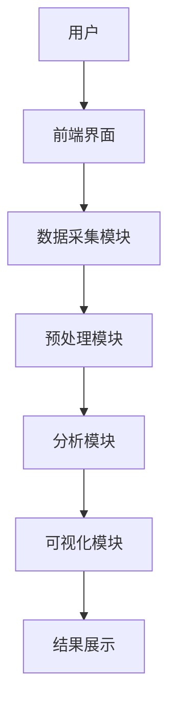

                 


# AI agents协作分析公司会议记录：洞察管理层思维

## 关键词：
- AI代理，会议记录分析，管理层思维，自然语言处理，机器学习，知识图谱，数据可视化

## 摘要：
本文深入探讨了AI代理在分析公司会议记录中的应用，揭示了其在洞察管理层思维方面的巨大潜力。通过结合自然语言处理、机器学习和知识图谱等技术，AI代理能够高效地从会议记录中提取关键信息，识别潜在的决策模式和管理策略。本文详细介绍了AI代理的核心技术、会议记录分析的流程与方法，以及系统设计与实现，为读者提供了全面的技术指导和实践案例。最后，本文总结了AI代理在会议记录分析中的优势与挑战，并展望了未来的研究方向。

---

## 第1章：AI代理与会议记录分析概述

### 1.1 AI代理的基本概念

#### 1.1.1 AI代理的定义与特点
AI代理是一种能够感知环境、执行任务并做出决策的智能实体。它可以是一个软件程序、一个机器人，甚至是一个复杂的系统。AI代理的核心特征包括：
- **自主性**：能够在没有外部干预的情况下独立运作。
- **反应性**：能够根据环境的变化调整自己的行为。
- **目标导向**：通常具有明确的目标，能够通过推理和规划实现这些目标。
- **学习能力**：能够通过数据和经验不断优化自身的性能。

AI代理的目标是通过智能化的手段，帮助人类完成复杂任务，提高效率并降低成本。

#### 1.1.2 会议记录分析的背景与意义
会议记录是企业决策过程中的重要文档，通常包含大量关于公司战略、管理决策和团队协作的信息。然而，由于会议记录的非结构化特性，提取其中有价值的信息往往需要大量的人工劳动。传统的会议记录分析方法通常依赖于手动标注和人工解读，这种方式效率低下且容易出错。

通过AI代理对会议记录进行分析，可以自动化地提取关键信息，识别潜在的模式和趋势，并生成有用的见解。这不仅能够提高会议记录的分析效率，还能够帮助企业更好地理解管理层的思维模式和决策过程。

#### 1.1.3 AI代理在会议记录分析中的作用
AI代理在会议记录分析中的作用主要体现在以下几个方面：
1. **自动化信息提取**：利用自然语言处理技术，自动提取会议记录中的关键信息，如决策要点、任务分配和时间安排。
2. **模式识别**：通过机器学习算法，识别会议记录中的潜在模式和趋势，帮助企业管理层发现隐藏的决策规律。
3. **语义理解**：基于知识图谱和语义分析技术，深入理解会议记录中的上下文关系，揭示管理层的深层思维。
4. **数据可视化**：将分析结果以直观的方式呈现，帮助企业管理层快速理解会议记录的核心内容。

---

### 1.2 管理层思维的洞察

#### 1.2.1 管理层思维的核心要素
管理层思维是企业在决策过程中最关键的因素之一，主要包括以下几个核心要素：
- **目标设定**：管理层如何制定企业的长期目标和短期目标。
- **决策过程**：管理层如何在复杂的情况下做出决策。
- **战略规划**：管理层如何制定和调整企业的战略方向。
- **团队协作**：管理层如何协调团队成员之间的合作。

通过分析会议记录，可以深入洞察管理层在上述方面的思维模式和决策过程。

#### 1.2.2 会议记录作为管理层思维的载体
会议记录是管理层思维的直接体现，通常包含以下内容：
- 会议议题
- 与会人员
- 会议决议
- 任务分配
- 未来计划

这些内容反映了管理层在会议中的讨论重点、决策思路和工作安排。通过对这些内容的分析，可以揭示管理层的思维方式和决策风格。

#### 1.2.3 AI代理如何揭示管理层思维的模式
AI代理通过以下方式揭示管理层思维的模式：
1. **关键词提取**：识别会议记录中的关键词，分析管理层关注的重点。
2. **主题分类**：将会议记录按照主题进行分类，揭示管理层的决策偏好。
3. **情感分析**：分析会议记录中的情感倾向，了解管理层的态度和情绪。
4. **决策树分析**：基于会议记录中的决策内容，构建决策树模型，揭示管理层的决策逻辑。

---

## 第2章：AI代理的核心技术

### 2.1 自然语言处理技术

#### 2.1.1 语言模型的基本原理
语言模型是一种能够预测下一个词或句子的模型，广泛应用于文本生成、机器翻译和语音识别等领域。常见的语言模型包括：
- **马尔可夫链模型**：基于历史信息预测下一个词的概率。
- **n-gram模型**：基于连续n个词的上下文进行预测。
- **循环神经网络（RNN）**：通过循环结构处理序列数据。
- **Transformer模型**：基于自注意力机制，能够捕捉长距离依赖关系。

#### 2.1.2 基于Transformer的会议记录分析
使用Transformer模型对会议记录进行分析，可以通过自注意力机制捕捉上下文信息，从而更准确地理解会议内容。以下是Transformer模型的基本原理：

1. **输入嵌入**：将输入的文本转换为嵌入向量。
2. **自注意力机制**：计算每个词与其他词的相关性，生成注意力权重。
3. **前向网络**：通过多层感知机对注意力加权后的向量进行变换。
4. **输出**：生成最终的文本表示。

#### 2.1.3 大语言模型在会议记录分析中的应用
大语言模型（如GPT-3、BERT）在会议记录分析中具有广泛的应用，可以用于：
- 文本摘要
- 关键词提取
- 情感分析
- 决策模式识别

---

### 2.2 机器学习与模式识别

#### 2.2.1 机器学习的基本原理
机器学习是一种通过数据训练模型的技术，可以分为监督学习、无监督学习和强化学习三种类型。在会议记录分析中，监督学习是最常用的方法，因为可以利用标注数据进行训练。

#### 2.2.2 基于聚类的决策模式识别
聚类是一种无监督学习技术，可以将相似的会议记录自动分组。以下是聚类的基本步骤：

1. **特征提取**：从会议记录中提取特征，如关键词、主题等。
2. **距离计算**：计算每条记录之间的相似性。
3. **聚类算法**：使用K-means等算法对记录进行分组。
4. **结果分析**：分析每个聚类的特征，识别决策模式。

---

### 2.3 知识图谱与语义理解

#### 2.3.1 知识图谱的基本原理
知识图谱是一种以图结构表示知识的技术，节点代表实体，边代表关系。以下是知识图谱的基本构建步骤：

1. **实体识别**：从会议记录中提取实体。
2. **关系抽取**：识别实体之间的关系。
3. **知识融合**：将多个来源的知识整合到图谱中。
4. **图谱存储**：将图谱存储到数据库中。

#### 2.3.2 基于知识图谱的语义分析
通过知识图谱，可以实现对会议记录的语义理解，例如：
- 确定会议的主题。
- 分析与会人员的角色。
- 理解会议决议的含义。

---

## 第3章：会议记录分析的流程与方法

### 3.1 数据采集与预处理

#### 3.1.1 数据采集的渠道与方法
会议记录通常存储在企业的知识管理系统中，可以通过以下渠道进行采集：
- **API接口**：通过系统接口获取会议记录。
- **文件导出**：将会议记录导出为文本文件。
- **网络爬取**：从企业内部网站爬取会议记录。

#### 3.1.2 数据清洗与格式化
数据清洗是会议记录分析的重要步骤，主要包括：
- **去除噪声**：删除无关信息。
- **格式统一**：将会议记录转换为统一的格式。
- **分词处理**：将文本分词为词语或短语。

---

### 3.2 分析与可视化

#### 3.2.1 文本摘要与关键词提取
文本摘要可以将会议记录压缩为几句话，关键词提取可以找出会议的核心内容。以下是关键词提取的常用方法：

1. **TF-IDF**：基于词频-逆文档频率的统计方法。
2. **主题模型**：如LDA模型，可以提取主题关键词。

#### 3.2.2 分析结果的可视化
可视化是会议记录分析的重要环节，可以通过以下方式呈现：
- **词云**：显示关键词的频率。
- **时间线图**：显示会议的时间分布。
- **决策树图**：显示决策的逻辑关系。

---

## 第4章：系统设计与实现

### 4.1 系统架构设计

#### 4.1.1 系统功能设计
AI代理分析会议记录系统的功能模块包括：
- **数据采集模块**：负责采集会议记录。
- **预处理模块**：对会议记录进行清洗和格式化。
- **分析模块**：包括文本摘要、关键词提取和情感分析。
- **可视化模块**：将分析结果以可视化的方式呈现。

#### 4.1.2 系统架构图
以下是系统的架构图：



---

## 第5章：项目实战

### 5.1 环境安装与配置

#### 5.1.1 环境要求
- Python 3.8以上
- PyTorch或TensorFlow框架
- NLTK或spaCy文本处理库

#### 5.1.2 安装依赖
```bash
pip install numpy
pip install pandas
pip install transformers
pip install matplotlib
```

---

### 5.2 核心实现

#### 5.2.1 文本摘要实现
以下是使用BERT模型进行文本摘要的代码：

```python
from transformers import BartTokenizer, BartForConditionalGeneration

tokenizer = BartTokenizer.from_pretrained('facebook/bart-large')
model = BartForConditionalGeneration.from_pretrained('facebook/bart-large')

inputs = tokenizer("会议记录内容", max_length=1024, truncation=True, return_tensors='np')
outputs = model.generate(inputs.input_ids, max_length=50, num_beams=5, temperature=0.7)

summary = tokenizer.decode(outputs[0], skip_special_tokens=True)
print(summary)
```

#### 5.2.2 关键词提取实现
以下是使用TF-IDF进行关键词提取的代码：

```python
from sklearn.feature_extraction.text import TfidfVectorizer

vectorizer = TfidfVectorizer()
X = vectorizer.fit_transform(["会议内容1", "会议内容2", ...])
tfidf = X.toarray()
keywords = vectorizer.get_feature_names_out()
```

---

## 第6章：总结与展望

### 6.1 总结
通过AI代理对会议记录进行分析，可以显著提高企业决策的效率和准确性。本文详细介绍了AI代理的核心技术、会议记录分析的流程与方法，并通过实际案例展示了系统的实现过程。

### 6.2 注意事项
在实际应用中，需要注意以下几点：
- 数据隐私保护
- 模型的可解释性
- 系统的稳定性

### 6.3 拓展阅读
- 《Deep Learning》——Ian Goodfellow
- 《自然语言处理入门》——NLP入门指南
- 《知识图谱实战》——构建与应用

---

## 作者：AI天才研究院/AI Genius Institute & 禅与计算机程序设计艺术 /Zen And The Art of Computer Programming

---

**注**：由于篇幅限制，本文仅展示部分内容。完整文章将涵盖更详细的技术细节和实际案例分析。

