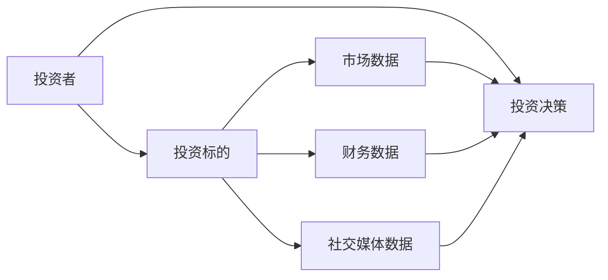
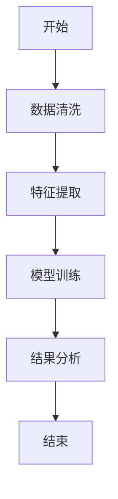
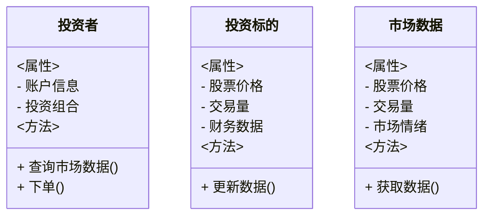
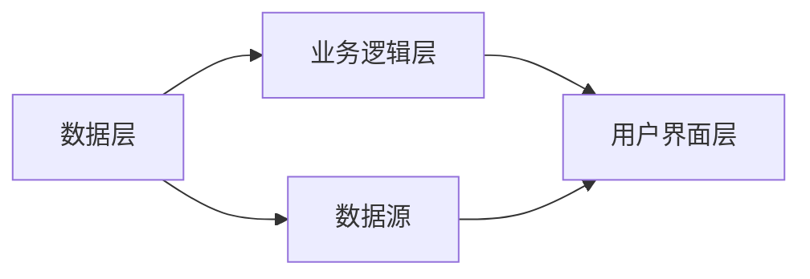
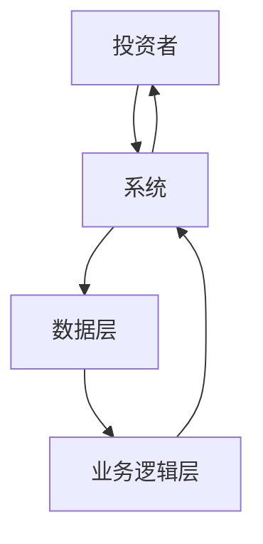

                 


# AI agents协作分析大数据：发现价值投资的隐藏机会

## 关键词：
AI代理，大数据分析，价值投资，金融数据，投资策略优化，风险管理

## 摘要：
本文探讨了AI代理如何协作分析大数据，以发现价值投资中的隐藏机会。通过背景介绍、核心概念、算法原理、系统架构、项目实战和最佳实践，详细阐述了AI代理在金融数据分析中的应用，展示了如何利用AI代理优化投资策略，降低风险，并实现更高的投资回报。文章结合理论与实践，为技术人员和投资者提供了深入的指导和实用的建议。

---

# 第1章: AI代理与大数据分析的背景

## 1.1 AI代理的基本概念

### 1.1.1 AI代理的定义
AI代理（Artificial Intelligence Agents）是指能够感知环境、自主决策并执行任务的智能实体。AI代理可以通过传感器或数据输入获取信息，并通过算法处理数据，做出决策或执行操作。代理可以是软件程序，也可以是物理设备，它们能够协作完成复杂任务。

**AI代理的关键特征：**
- **自主性**：能够自主决策，无需外部干预。
- **反应性**：能够实时感知环境并做出反应。
- **协作性**：多个代理可以协作完成任务。
- **学习能力**：能够通过数据和经验不断优化自身行为。

### 1.1.2 AI代理的核心特征
- **智能性**：AI代理能够理解、推理和学习。
- **适应性**：能够根据环境变化调整策略。
- **分布式协作**：多个代理可以协同工作，形成强大的计算能力。

### 1.1.3 大数据分析的基本概念
大数据分析是指对海量、多样化、高速变化的数据进行处理、分析和挖掘，以提取有价值的信息和知识。大数据分析的核心在于发现数据中的模式、趋势和关联，从而支持决策。

---

## 1.2 AI代理在大数据分析中的作用

### 1.2.1 AI代理如何协作处理大数据
AI代理可以通过分布式计算和协作机制，将大数据分析任务分解为多个子任务，分别处理后再汇总结果。例如，在金融数据分析中，多个AI代理可以分别负责市场数据的收集、清洗、特征提取和预测模型的构建。

**AI代理协作的优势：**
- **提高效率**：通过并行处理，缩短数据分析时间。
- **增强能力**：多个代理协作可以完成单个代理无法完成的任务。
- **容错性**：分布式协作可以提高系统的稳定性和容错性。

### 1.2.2 AI代理在金融领域的应用潜力
金融领域的数据复杂多样，包括股票价格、市场情绪、新闻数据等。AI代理可以通过协作分析这些数据，发现潜在的投资机会和风险。

**AI代理在金融领域的应用：**
- **市场数据处理**：AI代理可以实时收集和处理市场数据，提取有用的特征。
- **投资策略优化**：通过分析历史数据，优化投资策略。
- **风险控制**：AI代理可以实时监控市场变化，及时发现潜在风险。

### 1.2.3 价值投资与大数据分析的结合
价值投资是一种长期投资策略，旨在通过分析企业的基本面，找到被市场低估的投资标的。大数据分析可以帮助投资者发现隐藏的价值，提高投资决策的准确性。

**大数据分析在价值投资中的应用：**
- **财务数据挖掘**：分析企业的财务报表，发现潜在的价值。
- **市场情绪分析**：通过新闻和社交媒体数据，评估市场情绪。
- **竞争分析**：分析竞争对手的市场地位和战略。

---

# 第2章: AI代理与大数据分析的原理

## 2.1 AI代理的协作机制

### 2.1.1 分布式计算与协作
分布式计算是AI代理协作的核心机制。通过将任务分解为多个子任务，分配给不同的代理处理，可以提高计算效率和资源利用率。

**分布式计算的特点：**
- **任务分解**：将复杂任务分解为简单子任务。
- **并行处理**：多个代理同时处理子任务。
- **结果汇总**：将子任务的结果汇总，得到最终结果。

### 2.1.2 多智能体系统
多智能体系统（Multi-Agent System）是由多个智能体组成的系统，这些智能体可以协作完成复杂任务。在大数据分析中，多个AI代理可以协作处理数据，提高分析效率。

**多智能体系统的优点：**
- **提高效率**：通过协作完成任务。
- **增强能力**：多个智能体可以完成单个智能体无法完成的任务。
- **动态适应**：能够根据环境变化调整策略。

### 2.1.3 代理间的通信与协调
AI代理之间的通信与协调是协作的关键。代理之间需要通过某种通信机制交换信息，协调任务分配和结果汇总。

**代理间的通信方式：**
- **直接通信**：代理之间直接交换信息。
- **间接通信**：通过中间媒介交换信息。
- **事件驱动**：通过事件触发通信。

---

## 2.2 大数据分析的方法

### 2.2.1 数据清洗与预处理
数据清洗是大数据分析的第一步，旨在去除噪声数据，填补缺失值，处理异常值，确保数据的干净和一致。

**数据清洗的步骤：**
1. **去除噪声数据**：删除无关数据或噪声。
2. **处理缺失值**：填补缺失值或删除缺失数据。
3. **处理异常值**：识别并处理异常值。
4. **数据转换**：将数据转换为适合分析的形式。

### 2.2.2 数据挖掘与机器学习算法
数据挖掘是从大数据中提取有价值信息的过程。机器学习算法是数据挖掘的核心工具，可以通过训练模型发现数据中的模式和趋势。

**常用机器学习算法：**
- **监督学习**：用于分类和回归任务。
- **无监督学习**：用于聚类和降维任务。
- **强化学习**：用于策略优化任务。

### 2.2.3 数据可视化
数据可视化是将数据以图形化的方式展示，帮助用户更好地理解和分析数据。常用的可视化工具包括Matplotlib、Seaborn和Tableau。

---

## 2.3 价值投资分析中的大数据应用

### 2.3.1 金融数据的特征提取
金融数据的特征提取是大数据分析的重要步骤。通过提取特征，可以更好地理解数据的含义，为投资决策提供支持。

**常用的金融数据特征：**
- **价格数据**：股票价格、指数价格等。
- **交易量数据**：成交额、成交量等。
- **市场情绪数据**：新闻、社交媒体情绪等。
- **财务数据**：收入、利润、资产负债等。

### 2.3.2 市场情绪分析
市场情绪分析是通过分析新闻、社交媒体等数据，评估市场的整体情绪。市场情绪可以影响股票价格，是价值投资的重要参考。

**市场情绪分析的方法：**
- **自然语言处理**：通过文本挖掘技术分析新闻和社交媒体数据。
- **情感分析**：通过情感分析算法评估市场情绪。

### 2.3.3 风险评估与预测
风险评估是投资决策的重要部分。通过分析历史数据和市场动态，可以预测潜在的风险，制定相应的风险管理策略。

**风险评估的方法：**
- **VaR模型**：Value at Risk模型，用于衡量投资组合的风险。
- **波动率分析**：通过分析数据的波动率，评估市场的波动性。

---

# 第3章: AI代理协作分析大数据的核心概念与联系

## 3.1 核心概念的原理

### 3.1.1 AI代理的协作机制
AI代理的协作机制是通过分布式计算和多智能体系统实现的。代理之间通过通信和协调，共同完成复杂任务。

**AI代理协作的流程：**
1. **任务分解**：将复杂任务分解为多个子任务。
2. **任务分配**：将子任务分配给不同的代理处理。
3. **信息交换**：代理之间通过通信机制交换信息。
4. **结果汇总**：将子任务的结果汇总，得到最终结果。

### 3.1.2 大数据分析的算法原理
大数据分析的算法原理包括数据预处理、特征提取、模型训练和结果分析。通过这些步骤，可以提取有价值的信息和知识。

**大数据分析的流程：**
1. **数据清洗**：去除噪声数据，处理缺失值和异常值。
2. **特征提取**：提取数据的特征，为模型训练提供输入。
3. **模型训练**：通过机器学习算法训练模型，发现数据中的模式和趋势。
4. **结果分析**：分析模型的结果，提取有价值的信息。

### 3.1.3 价值投资分析的数学模型
价值投资分析的数学模型包括财务指标分析、市场情绪分析和风险评估模型。这些模型可以帮助投资者发现潜在的投资机会和风险。

**常用的数学模型：**
- **财务指标分析**：ROE、ROA、毛利率等。
- **市场情绪分析**：通过情感分析算法评估市场情绪。
- **风险评估模型**：VaR模型、波动率分析等。

---

## 3.2 核心概念的特征对比

### 3.2.1 AI代理与传统算法的对比
| 特征                | AI代理                          | 传统算法                          |
|---------------------|---------------------------------|-----------------------------------|
| 自主性               | 高                              | 低                                |
| 反应性               | 高                              | 低                                |
| 学习能力             | 高                              | 低                                |
| 适应性               | 高                              | 低                                |
| 协作性               | 高                              | 低                                |

### 3.2.2 大数据分析与传统数据分析的对比
| 特征                | 大数据分析                      | 传统数据分析                      |
|---------------------|---------------------------------|-----------------------------------|
| 数据量               | 大                              | 小                                |
| 数据类型             | 多样化                          | 单一化                            |
| 分析速度             | 快                              | 慢                                |
| 分析工具             | 分布式计算、机器学习算法        | 统计分析、数据挖掘                 |

### 3.2.3 价值投资分析的特征对比
| 特征                | 传统价值投资                   | 基于大数据的价值投资               |
|---------------------|---------------------------------|-----------------------------------|
| 数据来源             | 财务报表、行业报告              | 财务报表、市场数据、社交媒体       |
| 分析方法             | 财务指标分析                   | 大数据分析、机器学习算法           |
| 投资决策             | 主观判断                       | 数据驱动决策                     |

---

## 3.3 实体关系图与算法流程图

### 3.3.1 实体关系图（ER图）



### 3.3.2 算法流程图



---

# 第4章: AI代理协作分析大数据的算法原理

## 4.1 大数据分析的算法原理

### 4.1.1 机器学习算法
机器学习算法是大数据分析的核心工具。通过训练模型，可以发现数据中的模式和趋势。

**常用机器学习算法：**
- **线性回归**：用于回归任务。
- **决策树**：用于分类和回归任务。
- **随机森林**：基于决策树的集成学习算法。
- **支持向量机**：用于分类和回归任务。

### 4.1.2 数据挖掘算法
数据挖掘算法用于从大数据中提取有价值的信息。常用的算法包括聚类、分类和关联规则挖掘。

**常用数据挖掘算法：**
- **聚类**：K-means算法。
- **分类**：决策树、随机森林。
- **关联规则挖掘**：Apriori算法。

### 4.1.3 分布式计算框架
分布式计算框架是大数据分析的重要工具。常用的框架包括Hadoop和Spark。

**常用分布式计算框架：**
- **Hadoop**：用于分布式存储和计算。
- **Spark**：用于快速数据处理和分析。

---

## 4.2 价值投资分析的算法原理

### 4.2.1 投资策略优化算法
投资策略优化算法通过分析历史数据，优化投资组合，提高投资回报。

**常用投资策略优化算法：**
- **均值-方差优化**：通过优化投资组合的收益和风险。
- **遗传算法**：通过模拟进化过程，找到最优解。

### 4.2.2 风险评估与预测算法
风险评估与预测算法通过分析历史数据，预测潜在的风险，制定风险管理策略。

**常用风险评估与预测算法：**
- **VaR模型**：Value at Risk模型，用于衡量投资组合的风险。
- **波动率分析**：通过分析数据的波动率，评估市场的波动性。

---

## 4.3 价值投资分析的数学模型

### 4.3.1 财务指标分析
财务指标分析是价值投资的重要部分。通过分析企业的财务报表，评估企业的财务状况。

**常用的财务指标：**
- **ROE**：净资产收益率，用于衡量企业的盈利能力。
- **ROA**：资产回报率，用于衡量企业的资产使用效率。
- **毛利率**：毛利与营业收入的比率，用于衡量企业的盈利能力。

### 4.3.2 市场情绪分析
市场情绪分析是通过分析新闻、社交媒体等数据，评估市场的整体情绪。

**市场情绪分析的数学模型：**
$$
\text{情绪得分} = \sum_{i=1}^{n} w_i \cdot \text{情感极性}(s_i)
$$
其中，\(w_i\)是第i个词的权重，\(s_i\)是第i个词的情感极性。

### 4.3.3 风险评估模型
风险评估模型是通过分析历史数据，预测潜在的风险。

**VaR模型的数学公式：**
$$
\text{VaR}(\alpha) = \min_{x} \left\{ x \mid P(L \leq x) \geq \alpha \right\}
$$
其中，\(L\)是投资组合的损失，\(\alpha\)是置信水平。

---

# 第5章: AI代理协作分析大数据的系统架构

## 5.1 系统功能设计

### 5.1.1 领域模型
领域模型是系统功能设计的核心。通过领域模型，可以明确系统的功能模块和数据流。

**领域模型的类图：**



---

## 5.2 系统架构设计

### 5.2.1 系统架构图
系统架构图展示了系统的整体架构，包括数据层、业务逻辑层和用户界面层。

**系统架构图：**



### 5.2.2 系统接口设计
系统接口设计是系统架构设计的重要部分。通过接口设计，可以明确系统的输入和输出。

**系统接口设计：**
- **输入接口**：投资者输入查询请求。
- **输出接口**：系统输出分析结果。

### 5.2.3 系统交互流程图
系统交互流程图展示了系统的交互流程，包括用户请求、数据处理和结果返回。

**系统交互流程图：**



---

## 5.3 项目实战

### 5.3.1 环境安装
项目实战需要安装必要的工具和库。常用的工具包括Python、Jupyter Notebook、Pandas、NumPy、Scikit-learn等。

**环境安装步骤：**
1. 安装Python：使用Anaconda安装Python 3.8或更高版本。
2. 安装Jupyter Notebook：通过pip安装。
3. 安装Pandas、NumPy、Scikit-learn：通过pip安装。

### 5.3.2 核心代码实现
核心代码实现包括数据清洗、特征提取、模型训练和结果分析。

**数据清洗代码示例：**

```python
import pandas as pd
import numpy as np

# 读取数据
data = pd.read_csv('data.csv')

# 去除缺失值
data = data.dropna()

# 处理异常值
Q1 = data.quantile(0.25)
Q3 = data.quantile(0.75)
IQR = Q3 - Q1
data = data[(data <= Q3 + 1.5*IQR) & (data >= Q1 - 1.5*IQR)]
```

**模型训练代码示例：**

```python
from sklearn.tree import DecisionTreeClassifier
from sklearn.model_selection import train_test_split

# 数据分割
X_train, X_test, y_train, y_test = train_test_split(X, y, test_size=0.2)

# 模型训练
model = DecisionTreeClassifier()
model.fit(X_train, y_train)

# 模型预测
y_pred = model.predict(X_test)
```

### 5.3.3 实际案例分析
实际案例分析是通过具体案例展示AI代理协作分析大数据的应用。

**案例分析：**
假设我们有一个股票数据集，包含股票价格、交易量、市场情绪等数据。我们可以通过AI代理协作分析这些数据，发现潜在的投资机会。

**分析步骤：**
1. 数据清洗：去除缺失值和异常值。
2. 特征提取：提取股票价格、交易量、市场情绪等特征。
3. 模型训练：训练一个分类模型，预测股票价格的变化趋势。
4. 结果分析：分析模型的预测结果，制定投资策略。

### 5.3.4 项目小结
通过项目实战，我们可以看到AI代理协作分析大数据的强大能力。通过实际案例分析，我们可以发现潜在的投资机会，优化投资策略，提高投资回报。

---

# 第6章: 最佳实践与小结

## 6.1 最佳实践

### 6.1.1 数据处理
数据处理是大数据分析的关键。建议在数据处理过程中，尽量保持数据的完整性和准确性。

**数据处理的建议：**
- **数据清洗**：及时处理缺失值和异常值。
- **数据转换**：将数据转换为适合分析的形式。
- **数据存储**：选择合适的存储方式，确保数据的安全性和可访问性。

### 6.1.2 算法选择
算法选择是大数据分析的重要部分。建议根据具体问题选择合适的算法，同时考虑算法的效率和准确性。

**算法选择的建议：**
- **任务类型**：根据任务类型选择合适的算法。
- **数据规模**：根据数据规模选择合适的算法。
- **计算资源**：根据计算资源选择合适的算法。

### 6.1.3 系统设计
系统设计是系统开发的核心。建议在系统设计过程中，注重系统的可扩展性和可维护性。

**系统设计的建议：**
- **模块化设计**：将系统划分为多个模块，模块之间相对独立。
- **分布式设计**：通过分布式计算提高系统的计算能力。
- **容错设计**：设计系统的容错机制，确保系统的稳定性。

---

## 6.2 小结

通过本文的探讨，我们可以看到AI代理协作分析大数据在价值投资中的巨大潜力。通过AI代理的协作，我们可以更高效地处理大数据，发现潜在的投资机会和风险。同时，通过优化投资策略和风险管理，我们可以提高投资回报，降低投资风险。

---

## 6.3 注意事项

### 6.3.1 数据隐私
在处理大数据时，需要关注数据隐私问题。确保数据的合法性和合规性，避免侵犯用户隐私。

### 6.3.2 算法选择
在选择算法时，需要考虑算法的效率和准确性。同时，要注意算法的可解释性，避免黑箱操作。

### 6.3.3 系统安全
在系统设计和开发过程中，需要注重系统的安全性。防止数据泄露和系统攻击，确保系统的安全性和稳定性。

---

## 6.4 拓展阅读

### 6.4.1 推荐书籍
- 《大数据时代》：维克托·迈尔-舍恩伯格著。
- 《机器学习实战》： Aurélien Géron 著。

### 6.4.2 推荐博客
- Towards Data Science：提供大数据分析和机器学习的最新资讯。
- Medium：提供各种技术文章和博客。

### 6.4.3 推荐在线课程
- Coursera：提供大数据分析和机器学习的在线课程。
- edX：提供计算机科学和数据分析的在线课程。

---

## 作者

作者：AI天才研究院/AI Genius Institute & 禅与计算机程序设计艺术 /Zen And The Art of Computer Programming

---

感谢您的阅读！希望本文对您在AI代理协作分析大数据方面有所帮助，祝您在价值投资和风险管理中取得成功！

