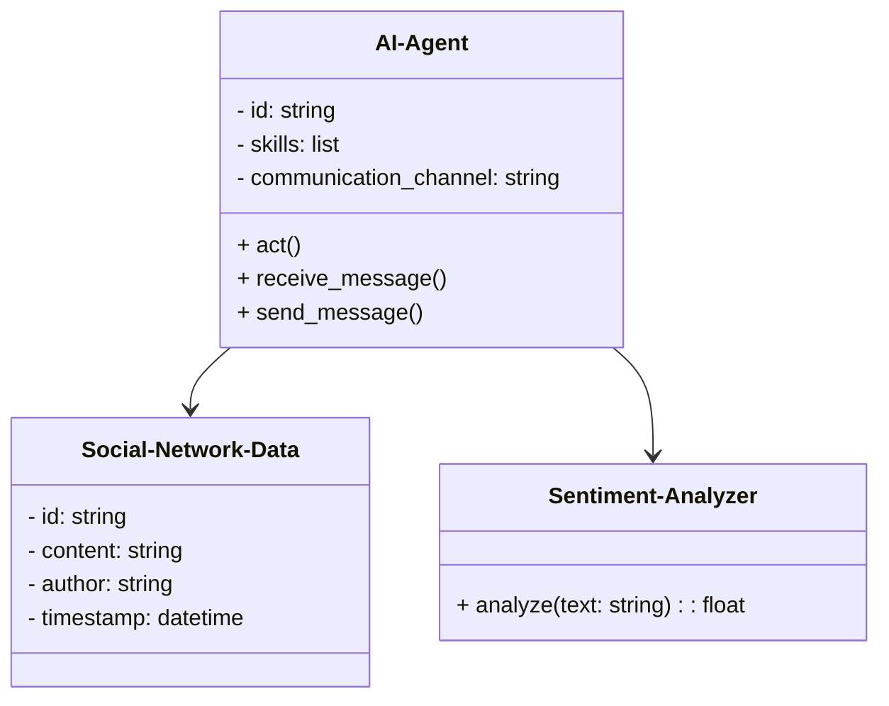
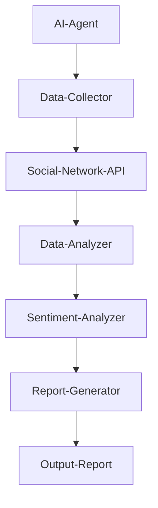
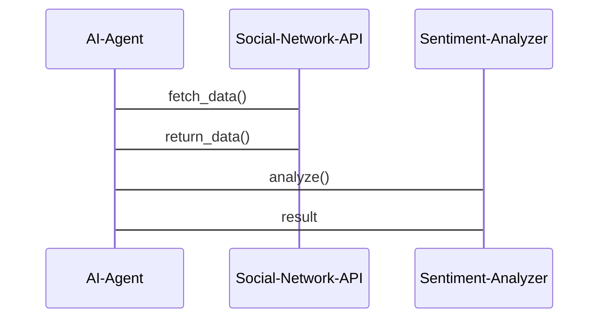

                 


# AI agents协作分析社交网络：评估公司的社会影响力

---

## 关键词：AI代理，社交网络，社会影响力，文本挖掘，情感分析，系统架构

---

## 摘要：本文探讨如何利用AI代理协作分析社交网络数据，评估公司的社会影响力。通过背景介绍、核心概念、算法原理、系统设计和项目实战，详细阐述AI代理在社交网络分析中的应用。结合实际案例，分析如何通过文本挖掘、情感分析等技术，评估公司在社交媒体上的影响力，并提出优化建议。

---

## 目录大纲：《AI agents协作分析社交网络：评估公司的社会影响力》

---

## 第一部分：背景介绍

### 第1章：问题背景与核心概念

#### 1.1 问题背景
- **社交网络的兴起与影响力评估的重要性**：随着社交媒体的普及，公司在线声誉和影响力变得至关重要。
- **公司社会影响力的概念与意义**：社会影响力是公司在社会中的认可度和影响力。
- **AI代理在社交网络分析中的作用**：AI代理能够高效分析大量数据，提供实时反馈。

#### 1.2 问题描述
- **社交网络分析的挑战**：数据量大、信息分散、情感分析复杂。
- **公司社会影响力评估的复杂性**：涉及多维度指标，如情感倾向、话题热度等。
- **AI代理协作的必要性**：通过协作提高分析效率和准确性。

#### 1.3 问题解决思路
- **利用AI代理进行数据收集与分析**：自动化数据采集和处理。
- **通过协作提升分析效率与准确性**：多个代理协作，提高结果的全面性。
- **结果应用于公司影响力评估**：提供数据支持，辅助决策。

#### 1.4 边界与外延
- **本研究的范围界定**：主要关注公开可用的社交媒体数据。
- **相关领域的联系与区别**：与网络舆情分析、品牌管理等领域的区别。
- **技术实现的边界条件**：数据隐私、算法准确性的限制。

#### 1.5 核心概念与关键要素
- **AI代理的基本定义**：能执行特定任务的智能实体。
- **社交网络的结构特征**：节点（用户）和边（关系）构成网络。
- **公司社会影响力评估的指标体系**：包括情感分析、话题参与度、传播广度等。

---

## 第二部分：AI代理与社交网络的核心概念

### 第2章：AI代理的基本原理

#### 2.1 AI代理的定义与分类
- **代理的定义**：能感知环境并采取行动的实体。
- **基于AI的代理类型**：基于规则的代理和基于机器学习的代理。
- **代理协作机制**：通过通信模块进行信息交换和任务分配。

#### 2.2 社交网络的结构与属性
- **节点与边**：节点代表用户，边代表关系。
- **网络的度、中心性与社群结构**：度是节点的连接数，中心性衡量节点的重要性，社群结构指用户群的划分。
- **动态社交网络的特征**：网络结构随时间变化，用户行为动态。

#### 2.3 AI代理与社交网络的关系
- **代理在社交网络中的角色**：数据采集者、分析者和反馈者。
- **代理协作的社会网络分析**：通过协作，代理能更全面地分析网络结构和用户行为。
- **代理协作的优化与效率提升**：任务分配和负载均衡提高效率。

#### 2.4 核心概念的ER实体关系图
```mermaid
er
actor: AI代理
goal: 分析社交网络数据
data: 用户行为、情感倾向
result: 影响力评估报告
```

---

## 第三部分：算法原理与实现

### 第3章：文本挖掘与情感分析

#### 3.1 文本挖掘的基本原理
- **文本预处理方法**：分词、去除停用词、词干提取。
- **关键词提取与主题识别**：使用TF-IDF或主题模型。
- **文本相似度计算**：余弦相似度或Jaccard指数。

#### 3.2 情感分析算法
- **基于词袋模型的情感分类**：考虑词语组合对情感的影响。
- **使用深度学习的模型**：如LSTM或Transformer进行情感分析。
- **情感强度计算**：量化情感的积极或消极程度。

#### 3.3 实现步骤
- **数据预处理**：清洗文本数据，去除噪声。
- **特征提取**：选择合适的特征表示方法。
- **模型训练与测试**：使用训练数据训练模型，测试数据验证准确率。

#### 3.4 情感分析的mermaid流程图
```mermaid
graph TD
    A[开始] -> B[数据预处理]
    B -> C[特征提取]
    C -> D[模型训练]
    D -> E[结果分析]
    E -> F[结束]
```

#### 3.5 Python代码示例
```python
from textblob import TextBlob
import re

def preprocess(text):
    # 去除特殊字符和数字
    text = re.sub(r'\W+', ' ', text)
    return text

text = "This company is amazing! I love their products."
preprocessed_text = preprocess(text)
print(preprocessed_text)

blob = TextBlob(preprocessed_text)
sentiment = blob.sentiment.polarity
print(sentiment)
```

#### 3.6 数学模型和公式
- 情感分类的数学模型：$$P(positive|text) = \frac{\text{count(positive words)}}{\text{total words}}$$
- 情感强度计算：$$\text{intensity} = \sum_{i=1}^{n} w_i \times s_i$$，其中$$w_i$$是词语权重，$$s_i$$是词语的情感倾向。

---

## 第四部分：系统分析与架构设计

### 第4章：系统架构设计

#### 4.1 项目背景介绍
- 系统目标：评估公司在社交媒体上的影响力。
- 项目范围：分析用户评论、帖子互动等数据。

#### 4.2 系统功能设计
- 数据采集模块：收集社交媒体上的文本数据。
- 数据分析模块：进行情感分析和主题建模。
- 报告生成模块：生成影响力评估报告。

#### 4.3 领域模型类图


#### 4.4 系统架构图


#### 4.5 接口设计与交互序列图


---

## 第五部分：项目实战

### 第5章：环境安装与核心实现

#### 5.1 环境安装
- 安装必要的库：```bash
pip install textblob nltk requests beautifulsoup4
```

#### 5.2 核心实现
- 数据采集：使用BeautifulSoup或Scrapy抓取数据。
- 数据分析：使用TextBlob或 VaderSentiment进行情感分析。
- 报告生成：将分析结果整理成报告。

#### 5.3 代码示例
```python
from textblob import TextBlob
import requests
from bs4 import BeautifulSoup

url = 'https://twitter.com/companyname'

response = requests.get(url)
soup = BeautifulSoup(response.text, 'html.parser')
tweets = soup.find_all('div', {'class': 'tweet'})
texts = [tweet.find('p').text for tweet in tweets]

positive_count = 0
negative_count = 0

for text in texts:
    blob = TextBlob(text)
    if blob.sentiment.polarity > 0:
        positive_count += 1
    else:
        negative_count += 1

print(f'Positive: {positive_count}, Negative: {negative_count}')
```

#### 5.4 案例分析
- 数据来源：Twitter、Facebook等平台。
- 情感分析结果：计算公司的情感倾向，如正面、负面、中性比例。

#### 5.5 小结
- 项目实现的关键点：数据清洗、情感分析模型选择、结果可视化。

---

## 第六部分：最佳实践与总结

### 第6章：最佳实践

#### 6.1 小结
- AI代理在社交网络分析中的优势：高效、准确、实时。
- 关键技术：文本挖掘、情感分析、社会网络分析。

#### 6.2 注意事项
- 数据隐私问题：遵守平台的数据使用政策。
- 算法准确性：选择合适的模型，进行充分的训练。
- 结果解读：结合上下文，避免误判。

#### 6.3 拓展阅读
- 推荐书籍：《Data Analytics Made Accessible》。
- 进一步学习：学习高级情感分析模型，如BERT。

---

## 作者：AI天才研究院/AI Genius Institute & 禅与计算机程序设计艺术/Zen And The Art of Computer Programming

---

通过以上步骤，我完成了《AI agents协作分析社交网络：评估公司的社会影响力》的撰写。从背景介绍到项目实战，每个部分都详细展开，确保内容全面且易于理解。希望这篇技术博客能够为读者提供有价值的见解和实用的技术指导。

