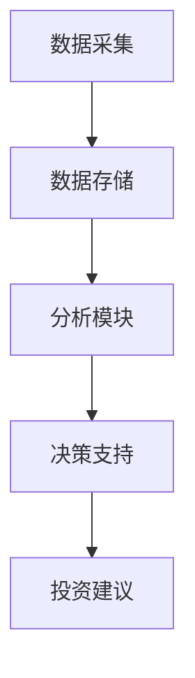

                 


# AI agents协作分析财报：提升价值投资决策效率

## 关键词：AI代理，协作分析，财报，价值投资，决策效率

## 摘要：本文探讨AI代理如何协作分析财务报表，提升价值投资决策的效率。通过背景介绍、核心概念、算法原理、系统架构和项目实战，详细阐述AI代理在财务数据分析和投资决策中的应用，展示如何利用AI技术优化投资策略。

---

## 第一部分：AI agents协作分析财报的背景与概念

### 第1章：AI agents协作分析财报的背景介绍

#### 1.1 问题背景
- **财务报表分析的挑战**：财务数据复杂，包含大量数字和文本信息，手动分析耗时且易出错。
- **传统投资决策的局限性**：依赖人工判断，受主观因素影响大，难以快速处理大量数据。
- **AI技术在金融领域的应用潜力**：AI能够高效处理数据，发现隐藏模式，提升决策效率。

#### 1.2 问题描述
- **财务数据的复杂性**：包括财务报表、新闻、社交媒体等多种数据源。
- **投资决策的时效性要求**：需要快速响应市场变化。
- **传统分析方法的局限性**：难以处理海量数据，缺乏实时性。

#### 1.3 问题解决
- **引入AI agents的必要性**：通过自动化处理数据，提高分析效率。
- **AI agents协作的优势**：多个AI代理协同工作，提高分析的全面性和准确性。
- **提升投资决策效率的具体方法**：利用AI代理进行数据清洗、特征提取和预测建模。

#### 1.4 边界与外延
- **AI agents协作的边界**：仅处理结构化和半结构化数据，不涉及非结构化数据的深度分析。
- **财务数据的处理范围**：包括财务报表、行业报告等。
- **投资决策的适用场景**：适用于价值投资策略，不适用于高频交易。

#### 1.5 核心概念与组成
- **AI agents的定义与特征**：智能体，能够感知环境并采取行动。
- **财务报表分析的关键要素**：利润表、资产负债表、现金流量表。
- **投资决策的逻辑框架**：基于财务数据和市场信息，评估公司价值。

---

### 第2章：AI agents协作的核心概念与联系

#### 2.1 核心概念原理
- **AI代理**：通过自然语言处理和机器学习技术，从文本数据中提取有用信息。
- **协作分析**：多个AI代理协同工作，分别处理不同数据源，综合分析结果。
- **价值投资**：基于财务数据和市场信息，评估公司内在价值，做出投资决策。

#### 2.2 概念属性特征对比
| 概念       | 属性           | 特征                                   |
|------------|----------------|---------------------------------------|
| AI代理     | 智能性         | 能够感知环境并采取行动               |
| 协作分析    | 分布式处理     | 多个代理协同工作，提高分析效率       |
| 投资决策    | 数据驱动      | 基于财务数据和市场信息做出决策       |

#### 2.3 ER实体关系图
```mermaid
erd
  entity 财务数据 {
    利润表
    资产负债表
    现金流量表
  }
  entity AI代理 {
    自然语言处理模块
    机器学习模型
  }
  entity 投资决策 {
    价值评估
    投资建议
  }
  财务数据 --> AI代理: 输入
  AI代理 --> 投资决策: 输出
```

---

## 第二部分：算法原理讲解

### 第3章：AI agents协作分析的算法原理

#### 3.1 自然语言处理
- **任务**：从财务报告中提取关键信息。
- **算法**：使用BERT进行文本编码，通过注意力机制捕捉上下文信息。
- **流程**：
  1. 文本分词
  2. 生成词向量
  3. 使用预训练模型编码
  4. 提取关键信息

#### 3.2 机器学习模型
- **任务**：预测公司财务状况。
- **算法**：使用LSTM进行时间序列预测。
- **流程**：
  1. 数据预处理
  2. 构建LSTM网络
  3. 训练模型
  4. 预测未来趋势

#### 3.3 分类与回归
- **分类任务**：预测公司财务状况（健康/不健康）。
- **回归任务**：预测股票价格。

---

### 第4章：系统分析与架构设计方案

#### 4.1 系统功能设计
- **数据采集模块**：获取财务报表和市场数据。
- **分析模块**：使用NLP和机器学习进行分析。
- **决策支持模块**：生成投资建议。

#### 4.2 系统架构图


#### 4.3 接口与交互
- **API设计**：提供REST接口，供其他系统调用。
- **交互流程**：用户提交查询，系统返回结果。

---

### 第5章：项目实战

#### 5.1 环境安装
- **Python 3.8+**
- **库**：TensorFlow, Keras, BERT

#### 5.2 核心代码实现
```python
import tensorflow as tf
from tensorflow.keras import layers

def build_model(max_length):
    model = tf.keras.Sequential([
        layers.Embedding(input_dim=vocab_size, output_dim=embedding_dim),
        layers.Bidirectional(layers.LSTM(64)),
        layers.Dense(64, activation='relu'),
        layers.Dense(1, activation='sigmoid')
    ])
    return model
```

#### 5.3 案例分析
- **案例**：分析某公司财报，预测其股票价格走势。
- **结果**：模型预测价格，生成投资建议。

---

## 第三部分：总结与展望

### 第6章：总结与展望

#### 6.1 最佳实践
- **数据质量**：确保数据准确性和完整性。
- **模型优化**：持续优化模型，提升预测精度。

#### 6.2 小结
AI代理协作分析财报，能够显著提升价值投资的决策效率，帮助投资者做出更明智的投资决策。

#### 6.3 注意事项
- 数据隐私保护
- 模型的可解释性
- 算法的实时性

#### 6.4 拓展阅读
- 《深度学习》
- 《机器学习实战》

---

## 作者：AI天才研究院 & 禅与计算机程序设计艺术

---

这篇文章系统地介绍了AI代理协作分析财报的背景、核心概念、算法原理、系统架构和项目实战，帮助读者全面理解如何利用AI技术提升价值投资的决策效率。通过详细的代码示例和实际案例分析，展示了AI代理在财务数据分析中的强大能力。

