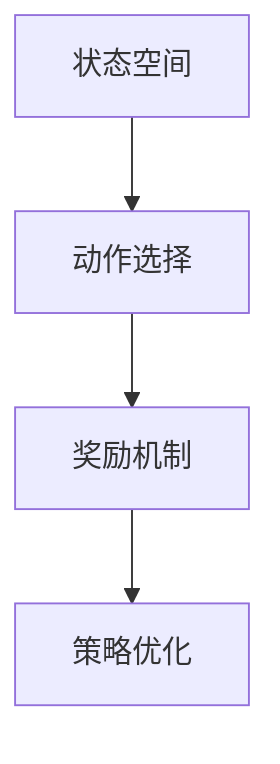
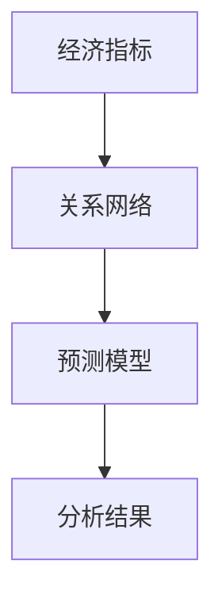
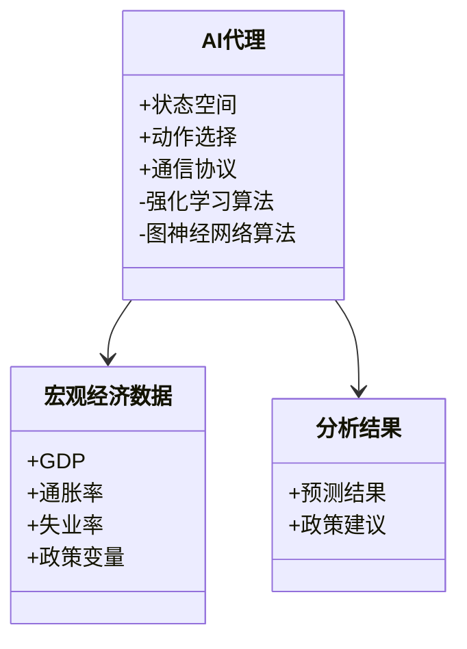
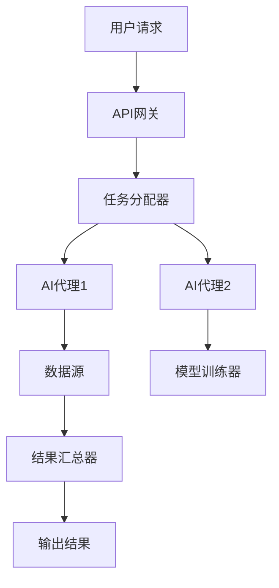

                 


# AI agents协作进行全球宏观经济分析：把握大趋势

## 关键词：AI代理，宏观经济分析，强化学习，图神经网络，协作系统

## 摘要：  
本文将探讨AI代理在全球宏观经济分析中的协作应用。通过结合强化学习和图神经网络等先进算法，AI代理能够实时处理海量数据，预测经济趋势，并提供决策支持。本文从系统设计、算法原理、项目实战等多维度展开，深入分析AI代理协作在宏观经济分析中的潜力与挑战。

---

## 第一部分: AI代理协作的背景与核心概念

### 第1章: AI代理协作的背景与问题描述

#### 1.1 AI代理协作的定义与背景  
- **AI代理**是指能够感知环境、自主决策并执行任务的智能实体。与传统软件代理相比，AI代理具有更强的学习和推理能力。  
- **宏观经济分析**是研究整体经济系统运行规律的学科，涉及GDP、通货膨胀、就业率等关键指标。然而，传统方法依赖人工经验，难以应对数据量大、变量复杂的挑战。  
- AI代理的协作能力为宏观经济分析提供了新思路，能够通过分布式计算和多维度数据挖掘，揭示传统方法难以发现的规律。

#### 1.2 宏观经济分析的核心问题  
- **数据复杂性**：宏观经济数据涉及多个领域，且变量之间存在高度非线性关系。  
- **实时性要求**：宏观经济分析需要快速响应市场变化，传统方法难以满足实时性需求。  
- **决策不确定性**：宏观经济决策往往涉及复杂权衡，AI代理可以通过模拟不同场景，辅助决策者制定最优策略。

#### 1.3 AI代理协作在宏观经济分析中的作用  
- **数据处理与整合**：AI代理能够实时收集、清洗和整合多源数据，为分析提供基础。  
- **模式识别与预测**：通过机器学习算法，AI代理能够识别经济趋势，预测未来走势。  
- **决策支持**：AI代理可以模拟不同政策的实施效果，为决策者提供科学依据。

### 第2章: AI代理协作的核心概念与联系  

#### 2.1 AI代理协作的核心概念  
- **协作机制**：AI代理通过通信协议共享信息，分工合作完成复杂任务。  
- **任务分配**：基于角色分配算法，每个代理负责特定子任务，如数据采集、模型训练等。  
- **推理与决策**：代理之间通过协商达成一致，共同完成复杂决策任务。

#### 2.2 核心概念的属性特征对比  
| 概念 | 特性 | 描述 |
|------|------|------|
| AI代理 | 智能性 | 具备自主学习和推理能力 |  
| 宏观经济分析 | 复杂性 | 涉及多个变量和非线性关系 |  
| 协作系统 | 分布式 | 代理之间通过通信协作完成任务 |  

#### 2.3 ER实体关系图架构  
```mermaid
erd
    customer
    order
    product
    shipper
    supplier
    manufacturer
```

---

## 第二部分: AI代理协作的算法原理  

### 第3章: AI代理协作的算法原理  

#### 3.1 强化学习在AI代理协作中的应用  


- **强化学习框架**：AI代理通过与环境互动，学习最优策略。状态空间表示当前经济状况，动作选择是代理的决策，奖励机制衡量决策效果，策略优化不断改进决策模型。  
- **应用场景**：例如，在货币政策模拟中，代理可以学习最优利率调整策略。

#### 3.2 图神经网络在宏观经济分析中的应用  


- **图神经网络**：通过构建经济指标之间的关系图，捕捉变量间的复杂关系。  
- **预测模型**：基于图结构，预测GDP、通胀等关键指标的变化趋势。

#### 3.3 算法实现步骤  
1. 数据预处理：清洗和整合多源经济数据。  
2. 模型训练：使用强化学习或图神经网络算法训练代理。  
3. 任务分配：基于角色分配算法，分配代理任务。  
4. 协作推理：代理通过通信协议协作完成复杂任务。  
5. 结果分析：输出分析结果并优化模型。

### 第4章: 数学模型与公式  

#### 4.1 状态空间与动作空间  
$$状态空间 = \{s_1, s_2, ..., s_n\}$$  
$$动作空间 = \{a_1, a_2, ..., a_m\}$$  

#### 4.2 奖励函数  
$$R(s, a) = r_1 \cdot a_1 + r_2 \cdot a_2 + ... + r_n \cdot a_n$$  

#### 4.3 损失函数  
$$L = \sum_{i=1}^{n} (y_i - \hat{y}_i)^2$$  

---

## 第三部分: 系统分析与架构设计  

### 第5章: 系统分析与架构设计方案  

#### 5.1 项目介绍  
- **项目目标**：构建一个基于AI代理的宏观经济分析系统，实现经济趋势预测和政策模拟。  
- **技术选型**：使用Python、TensorFlow、Kafka等技术实现代理协作和数据通信。

#### 5.2 系统功能设计  


#### 5.3 系统架构设计  


---

## 结语  
通过AI代理的协作，宏观经济分析将更加高效和精准。本文从背景、算法、系统架构等多个维度，全面探讨了AI代理在宏观经济分析中的应用。未来，随着技术的不断进步，AI代理将在全球经济治理中发挥更大的作用。

---

## 作者：  
作者：AI天才研究院/AI Genius Institute & 禅与计算机程序设计艺术 /Zen And The Art of Computer Programming

