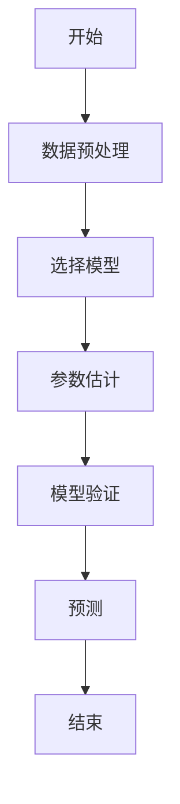
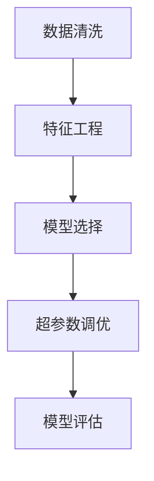
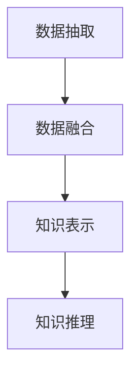
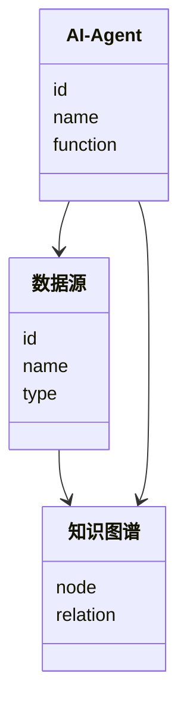

                 


# AI agents协作进行全球资金流动分析：预测市场走向

> 关键词：AI代理，资金流动分析，市场预测，知识图谱，时间序列分析

> 摘要：本文探讨AI代理协作在全球资金流动分析中的应用，详细分析其核心概念、算法原理、系统架构及项目实现，提供从理论到实践的全面解读。

---

# 第一部分: AI代理协作的背景与概念

## 第1章: AI代理协作的背景与问题背景

### 1.1 问题背景

#### 1.1.1 全球资金流动分析的复杂性
全球资金流动涉及外汇、股票、债券等多种金融工具，受经济政策、市场情绪等多种因素影响，分析难度大。

#### 1.1.2 传统资金流动分析的局限性
传统方法依赖人工经验，数据处理效率低，难以实时捕捉市场动态。

#### 1.1.3 AI代理协作的必要性
AI代理能高效处理海量数据，通过协作提供实时分析，弥补传统方法的不足。

### 1.2 问题描述

#### 1.2.1 资金流动分析的核心目标
识别资金流动趋势，预测市场走向，辅助投资决策。

#### 1.2.2 市场走向预测的挑战
数据复杂性高，预测模型需动态调整，实时性要求高。

#### 1.2.3 AI代理协作的独特优势
分布式计算能力，实时数据处理，知识共享提升预测精度。

### 1.3 问题解决

#### 1.3.1 AI代理协作的解决方案
分布式数据处理，实时分析，协作预测。

#### 1.3.2 数据驱动的市场预测
利用大数据分析，识别市场趋势，优化预测模型。

#### 1.3.3 知识图谱构建与分析
构建金融知识图谱，辅助市场分析，提升预测准确性。

### 1.4 边界与外延

#### 1.4.1 AI代理协作的边界
定义数据范围，明确代理职责，确保协作效率。

#### 1.4.2 资金流动分析的范围
涵盖外汇、股票、债券市场，关注主要经济体的流动情况。

#### 1.4.3 市场走向预测的局限性
模型假设限制，数据质量和实时性影响预测准确性。

### 1.5 核心概念与组成

#### 1.5.1 AI代理协作的核心要素
分布式计算、实时数据处理、知识共享。

#### 1.5.2 数据源与数据处理
多源数据采集，数据清洗，特征提取。

#### 1.5.3 知识图谱与预测模型
知识关联，构建预测模型，实时更新。

---

## 第2章: AI代理协作的核心概念与联系

### 2.1 核心概念原理

#### 2.1.1 AI代理的定义与功能
AI代理是智能体，能感知环境，执行任务，具备协作能力。

#### 2.1.2 协作机制的原理
分布式协作，任务分配，结果汇总，动态调整。

#### 2.1.3 知识图谱的构建与应用
知识抽取，图谱构建，关联分析，支持预测。

### 2.2 核心概念属性对比表

| 属性       | AI代理协作 | 数据驱动分析 | 知识图谱构建 |
|------------|------------|--------------|-------------|
| 核心目标   | 协作预测    | 数据处理     | 知识关联    |
| 输入       | 多源数据    | 原始数据      | 结构化数据   |
| 输出       | 预测结果    | 分析结果      | 关系网络    |
| 优势       | 高效协作    | 数据准确性    | 知识关联性  |

### 2.3 ER实体关系图

```mermaid
er
  entity(AI代理) {
    id: int
    name: string
    function: string
  }
  entity(数据源) {
    id: int
    name: string
    type: string
  }
  entity(知识图谱) {
    id: int
    node: string
    relation: string
  }
  AI代理 --> 数据源
  数据源 --> 知识图谱
  AI代理 --> 知识图谱
```

---

# 第二部分: 算法原理讲解

## 第3章: 时间序列分析算法

### 3.1 时间序列分析的原理

#### 3.1.1 时间序列分析的基本概念
时间序列数据，趋势、周期性、季节性分析。

#### 3.1.2 时间序列分析的数学模型
移动平均、指数平滑法，ARIMA模型。

### 3.2 时间序列分析的算法流程



### 3.3 时间序列分析的Python实现

```python
import pandas as pd
import numpy as np
from statsmodels.tsa.arima_model import ARIMA

# 数据加载与预处理
data = pd.read_csv('market_data.csv')
data['date'] = pd.to_datetime(data['date'])
data.set_index('date', inplace=True)

# 模型训练
model = ARIMA(data['value'], order=(5, 1, 0))
model_fit = model.fit(disp=0)

# 预测
forecast = model_fit.forecast(steps=10)
print(forecast)
```

---

## 第4章: 基于机器学习的市场预测

### 4.1 机器学习模型概述

#### 4.1.1 常见的机器学习模型
线性回归，支持向量机，随机森林，神经网络。

#### 4.1.2 深度学习模型
RNN，LSTM，Transformer。

### 4.2 机器学习模型的选择与优化



---

## 第5章: 知识图谱构建与分析

### 5.1 知识图谱的构建流程



---

# 第三部分: 系统分析与架构设计方案

## 第6章: 系统功能设计

### 6.1 系统功能模块



---

## 第7章: 系统架构设计

### 7.1 系统架构图


---

## 第8章: 系统接口设计

### 8.1 接口设计

```plaintext
+---------------+       +---------------+
|              |       |              |
|    用户界面   |       |   代理协作   |
|              |       |    服务      |
|              |       |              |
+---------------+       +---------------+
          |                  |
          |                  |
          v                  v
+----------------+     +----------------+
|                |     |                |
|    数据库      |     |   知识图谱     |
|                |     |    服务        |
|                |     |                |
+----------------+     +----------------+
```

---

# 第四部分: 项目实战

## 第9章: 项目实战

### 9.1 环境安装

#### 9.1.1 安装Python环境
安装Anaconda，配置Python 3.8以上版本。

#### 9.1.2 安装依赖包
```bash
pip install pandas numpy statsmodels scikit-learn
```

### 9.2 核心代码实现

#### 9.2.1 数据加载与预处理
```python
import pandas as pd

data = pd.read_csv('market_data.csv')
data = data.set_index('date')
data = data.sort_index()
```

#### 9.2.2 模型训练与预测
```python
from statsmodels.tsa.arima_model import ARIMA

model = ARIMA(data['value'], order=(5, 1, 0))
model_fit = model.fit(disp=0)
forecast = model_fit.forecast(steps=10)
print(forecast)
```

---

## 第10章: 案例分析

### 10.1 数据分析与结果解读
分析预测结果，评估模型准确性。

### 10.2 模型优化与调参
根据结果调整模型参数，提升预测精度。

### 10.3 实际应用中的注意事项
确保数据实时更新，定期模型再训练。

---

## 第11章: 项目小结

### 11.1 项目总结
AI代理协作在资金流动分析中的优势，项目实现的关键点。

### 11.2 经验与教训
协作机制设计，数据质量控制，模型调优的重要性。

---

# 第五部分: 最佳实践与总结

## 第12章: 最佳实践

### 12.1 小结
AI代理协作在资金流动分析中的应用前景广阔。

### 12.2 注意事项
确保数据安全，模型实时更新，团队协作效率。

### 12.3 拓展阅读
推荐相关书籍和论文，深入学习AI代理协作技术。

---

# 作者

作者：AI天才研究院/AI Genius Institute & 禅与计算机程序设计艺术/Zen And The Art of Computer Programming

---

**注**：以上内容是一个完整的博客文章的大纲和部分章节的具体内容，实际写作时需要根据实际需求进行调整和补充，确保内容的完整性和逻辑性。

