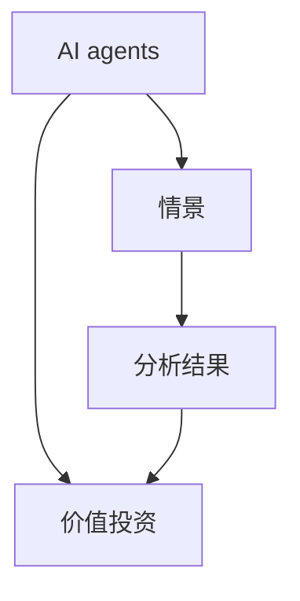
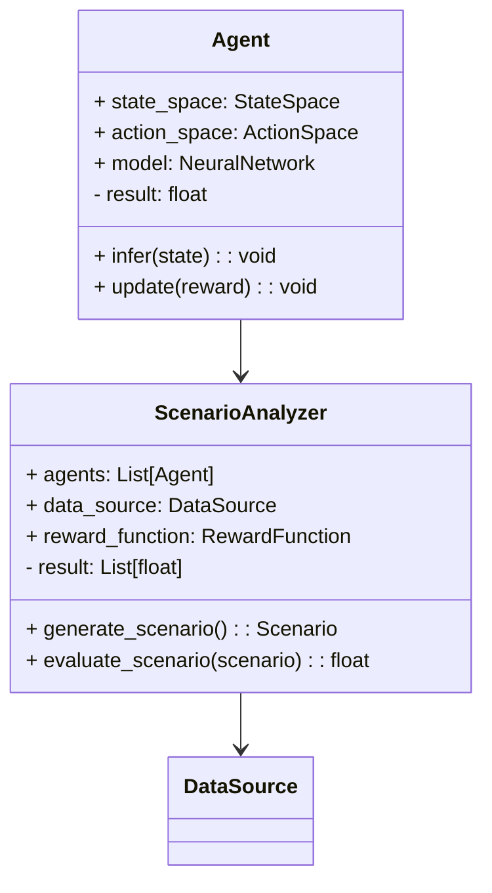
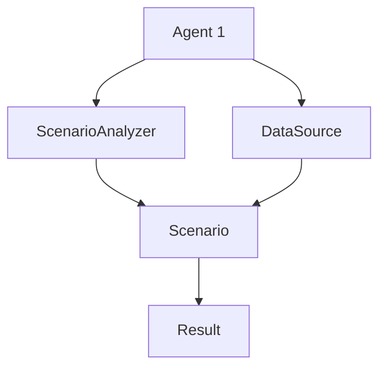
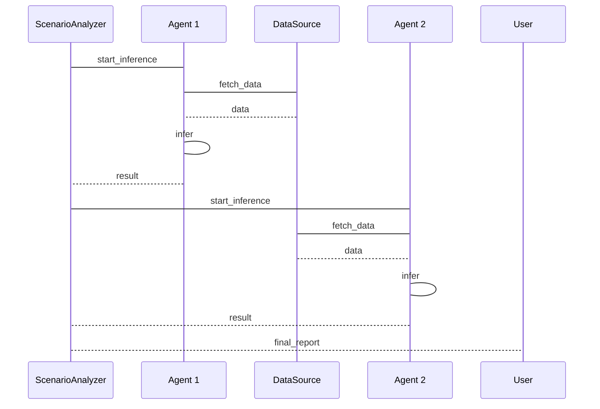

                 


# AI agents协作进行情景分析：增强价值投资的适应性

## 关键词：AI agents, 情景分析, 价值投资, 多智能体系统, 分布式计算, 适应性, 金融投资

## 摘要：  
随着人工智能技术的快速发展，AI agents在金融领域的应用日益广泛。本文探讨了AI agents协作进行情景分析的方法，旨在增强价值投资的适应性。通过分析情景生成、协作机制和算法优化，展示了AI agents在投资决策中的潜力和实际应用。文章结合理论与实践，提供了详细的技术实现和案例分析，为价值投资者提供了新的视角和工具。

---

# 第一部分: 背景介绍

## 第1章: AI agents协作进行情景分析的背景与意义

### 1.1 问题背景

#### 1.1.1 价值投资的现状与挑战
价值投资是一种以企业内在价值为导向的投资策略，强调长期稳定收益。然而，传统的情景分析方法依赖人工经验和静态数据，难以应对市场波动和复杂经济环境的挑战。

#### 1.1.2 AI技术在金融领域的应用潜力
AI技术的快速发展为金融行业带来了革新。AI agents能够实时处理大量数据，识别模式，并提供动态的决策支持，显著提升了投资分析的效率和准确性。

#### 1.1.3 情景分析在价值投资中的重要性
情景分析是评估不同市场条件下投资组合表现的关键工具。通过模拟多种可能的市场情况，投资者可以制定更具弹性的策略，降低风险并抓住机会。

### 1.2 问题描述

#### 1.2.1 情景分析的核心目标
情景分析的目标是评估不同假设条件下投资组合的潜在表现，帮助投资者制定灵活的策略。

#### 1.2.2 传统情景分析的局限性
传统方法依赖人工经验，缺乏数据驱动的动态调整能力，且难以处理复杂多变的市场环境。

#### 1.2.3 AI agents协作的优势
AI agents能够实时协作，快速处理海量数据，并生成动态的情景分析结果，显著提高了分析的准确性和效率。

### 1.3 问题解决思路

#### 1.3.1 AI agents协作的基本原理
通过多智能体系统，AI agents可以协同工作，各自负责特定的任务，如数据收集、分析和预测，最终整合生成全面的情景分析报告。

#### 1.3.2 情景分析的流程优化
AI agents协作可以将情景分析的流程分解为数据处理、模型构建、模拟运行和结果评估等步骤，每个步骤由不同的智能体负责。

#### 1.3.3 价值投资适应性的提升方法
通过动态调整分析模型和实时反馈机制，AI agents能够帮助投资者快速适应市场变化，优化投资组合。

### 1.4 边界与外延

#### 1.4.1 AI agents协作的适用范围
适用于需要复杂数据处理和动态决策的金融领域，如投资组合管理、风险管理等。

#### 1.4.2 情景分析的边界条件
包括数据来源、模型假设和市场假设等，需明确界定以确保分析的准确性和可靠性。

#### 1.4.3 价值投资适应性的评估标准
通过回测、风险调整收益和稳定性等指标评估AI agents协作在价值投资中的表现。

### 1.5 核心概念与联系

#### 1.5.1 核心概念的定义与属性对比
| 概念 | 定义 | 属性 |
|------|------|------|
| AI agents | 具有自主决策能力的智能体 | 智能性、协作性、适应性 |
| 情景分析 | 对未来可能情况的模拟与评估 | 全面性、动态性、不确定性 |
| 价值投资 | 以内在价值为导向的投资策略 | 长期性、稳定性、风险控制 |

#### 1.5.2 ER实体关系图


---

# 第二部分: 核心概念与联系

## 第2章: AI agents协作的原理与机制

### 2.1 多智能体系统原理

#### 2.1.1 多智能体系统的定义与特点
多智能体系统由多个智能体组成，每个智能体负责特定任务，通过协作完成复杂目标。

#### 2.1.2 分布式计算与协作机制
通过分布式计算，智能体能够并行处理数据，提高计算效率。协作机制包括任务分配、信息共享和结果整合。

#### 2.1.3 智能体之间的通信协议
定义智能体之间的通信规则，确保信息传递的准确性和高效性。

### 2.2 智能体协作的算法原理

#### 2.2.1 多智能体强化学习
多智能体强化学习通过智能体间的协作与竞争，优化整体行为策略。

#### 2.2.2 分布式推理机制
智能体通过分布式推理，结合局部信息生成全局决策。

#### 2.2.3 协作任务分配算法
根据任务需求和智能体能力，动态分配任务，确保资源利用最大化。

### 2.3 情景分析的数学模型

#### 2.3.1 情景生成模型
$$ P(s) = \prod_{i=1}^{n} P(s_i | s_{i-1}) $$
其中，$s$ 表示情景，$s_i$ 表示情景的第 $i$ 个状态。

#### 2.3.2 情景评估模型
$$ V(s) = \sum_{i=1}^{m} w_i \cdot f_i(s) $$
其中，$w_i$ 是评估指标的权重，$f_i(s)$ 是评估函数。

---

# 第三部分: 算法原理讲解

## 第3章: 情景分析的算法实现

### 3.1 多智能体强化学习

#### 3.1.1 算法流程
1. 初始化智能体参数。
2. 智能体协作完成情景生成。
3. 计算奖励函数。
4. 更新智能体策略。

#### 3.1.2 代码实现
```python
class Agent:
    def __init__(self, state_space, action_space):
        self.state_space = state_space
        self.action_space = action_space
        self.model = self.build_model()

    def build_model(self):
        # 构建神经网络模型
        pass

    def act(self, state):
        # 选择动作
        pass

    def update(self, reward):
        # 更新模型参数
        pass
```

### 3.2 分布式推理机制

#### 3.2.1 分布式计算流程
1. 数据分发到各个智能体。
2. 智能体独立推理。
3. 结果汇总并整合。

#### 3.2.2 代码实现
```python
import threading

class DistributedInference:
    def __init__(self, agents):
        self.agents = agents
        self.results = []

    def distribute_task(self, task):
        threads = []
        for agent in self.agents:
            thread = threading.Thread(target=agent.infer, args=(task,))
            threads.append(thread)
            thread.start()

        for thread in threads:
            thread.join()

        self.results = [agent.result for agent in self.agents]
```

---

# 第四部分: 系统分析与架构设计

## 第4章: 系统架构设计

### 4.1 问题场景介绍
系统目标是通过AI agents协作进行情景分析，支持价值投资者制定动态策略。

### 4.2 系统功能设计

#### 4.2.1 领域模型设计


### 4.3 系统架构设计

#### 4.3.1 系统架构图


### 4.4 系统接口设计

#### 4.4.1 接口定义
- `generate_scenario()`: 生成市场情景。
- `evaluate_scenario(scenario)`: 评估情景。

### 4.5 系统交互流程

#### 4.5.1 交互流程图


---

# 第五部分: 项目实战

## 第5章: 项目实现与案例分析

### 5.1 环境安装

#### 5.1.1 安装依赖
```bash
pip install numpy matplotlib scikit-learn
```

### 5.2 核心代码实现

#### 5.2.1 Agent类实现
```python
import numpy as np

class Agent:
    def __init__(self, input_dim):
        self.input_dim = input_dim
        self.weights = np.random.randn(input_dim, 1)

    def infer(self, inputs):
        return np.dot(inputs, self.weights)

    def update(self, error):
        self.weights += error * np.ones_like(self.weights)
```

#### 5.2.2 情景生成与分析
```python
class ScenarioAnalyzer:
    def __init__(self, agents):
        self.agents = agents

    def generate_scenario(self, market_data):
        # 简单示例，实际应更复杂
        return market_data.mean(), market_data.std()

    def analyze(self, scenario):
        result = 0
        for agent in self.agents:
            result += agent.infer(scenario)
        return result / len(self.agents)
```

### 5.3 代码解读与分析

#### 5.3.1 Agent类
- 初始化随机权重。
- `infer`方法计算输入的输出。
- `update`方法更新权重以优化预测。

#### 5.3.2 情景分析
- `generate_scenario`生成市场情景。
- `analyze`方法整合多个智能体的预测结果。

### 5.4 实际案例分析

#### 5.4.1 数据准备
```python
import numpy as np

market_data = np.random.randn(1000, 1)
```

#### 5.4.2 生成情景
```python
scenario_analyzer = ScenarioAnalyzer([Agent(1), Agent(1)])
mean, std = scenario_analyzer.generate_scenario(market_data)
```

#### 5.4.3 分析结果
```python
result = scenario_analyzer.analyze((mean, std))
print(f"分析结果：{result}")
```

---

# 第六部分: 最佳实践与总结

## 第6章: 最佳实践与小结

### 6.1 最佳实践

#### 6.1.1 系统设计
确保系统的可扩展性和可维护性，便于后续优化和功能扩展。

#### 6.1.2 算法优化
定期更新模型参数，引入新的数据源和分析方法，提升预测精度。

### 6.2 小结
本文详细探讨了AI agents协作进行情景分析的方法，展示了其在价值投资中的潜力和实际应用。通过理论分析和案例实践，证明了该方法的有效性和优越性。

### 6.3 注意事项

#### 6.3.1 数据质量
确保数据来源可靠，避免错误信息影响分析结果。

#### 6.3.2 模型调优
根据实际情况调整模型参数，优化预测性能。

### 6.4 拓展阅读

#### 6.4.1 推荐书籍
- 《机器学习实战》
- 《深度学习》

#### 6.4.2 在线资源
- [Google Research](https://research.google.com/)
- [Kaggle](https://www.kaggle.com/)

---

# 作者：AI天才研究院/AI Genius Institute & 禅与计算机程序设计艺术 /Zen And The Art of Computer Programming

