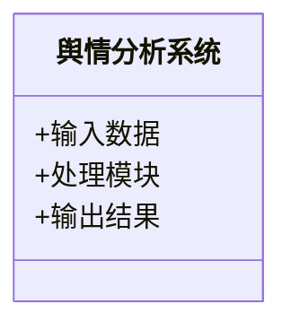
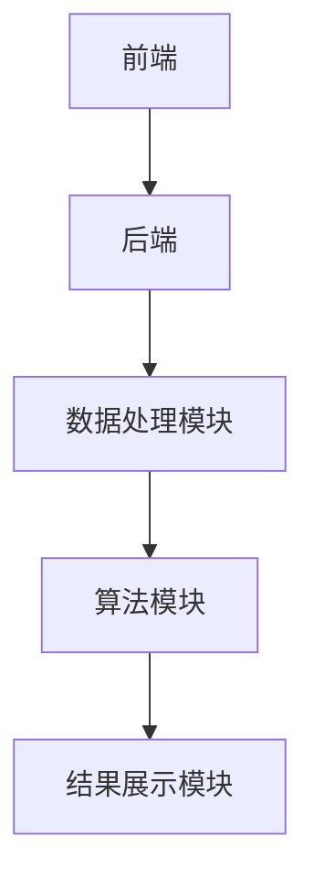
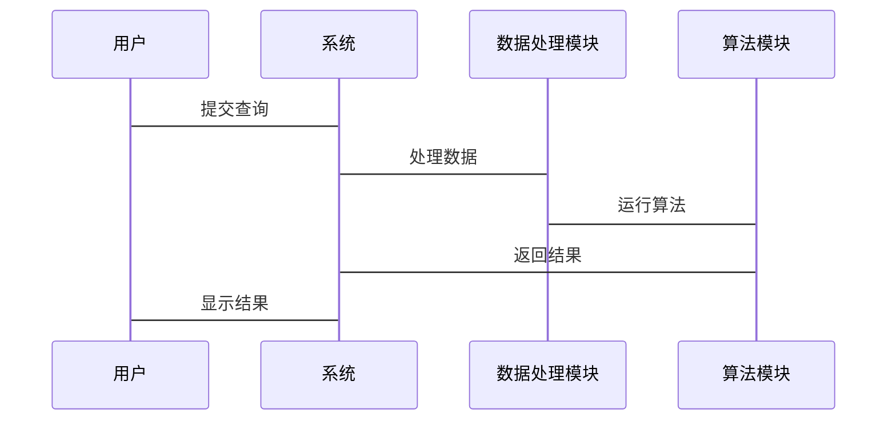

                 


# AI agents协作进行舆情分析：捕捉市场情绪拐点

## 关键词：AI代理，舆情分析，市场情绪，拐点捕捉，自然语言处理

## 摘要：  
本文探讨AI代理在舆情分析中的协作机制，详细讲解如何利用AI代理捕捉市场情绪拐点。通过分析情感分析、主题建模和拐点检测算法，结合系统架构设计和实战案例，展示如何构建高效的舆情分析系统。

---

## 第1章：AI代理与舆情分析概述

### 1.1 舆情分析的定义与背景  
舆情分析是对公众对特定事件、品牌或产品的意见和态度进行分析的过程，帮助企业了解市场动态。  
**背景**：  
- 随着社交媒体的普及，公众意见的影响力日益增加。  
- 企业需要及时了解市场反馈，以便快速调整策略。  
**市场情绪拐点**：  
- 指市场情绪发生显著变化的时间点，是企业决策的关键依据。

### 1.2 AI代理在舆情分析中的应用  
AI代理通过自然语言处理和机器学习技术，能够高效地分析海量数据，提取有用信息。  
**优势**：  
- **高效性**：AI代理可以快速处理大量数据，节省时间和成本。  
- **准确性**：通过算法优化，AI代理能够提高分析结果的准确性。  
- **协作性**：多个AI代理协作可以覆盖更多数据源，提高分析的全面性。  

### 1.3 本章小结  
本章介绍了舆情分析的定义、背景和市场情绪拐点的重要性，并探讨了AI代理在舆情分析中的应用优势。

---

## 第2章：AI代理协作机制  

### 2.1 AI代理协作的核心概念  
AI代理协作是指多个AI代理协同工作，共同完成任务。  
**关键要素**：  
- **任务分配**：明确每个代理的职责。  
- **信息共享**：代理之间共享数据和结果。  
- **协调机制**：确保代理协作顺畅。  

### 2.2 协作模型的数学表示  
以下是协作模型的简单数学表示：  
$$ \text{协作效率} = \frac{\text{任务完成度}}{\text{代理数量}} $$  

**ER实体关系图**：  
```mermaid
er
actor
  name
  id
```

### 2.3 本章小结  
本章详细讲解了AI代理协作的核心概念和数学模型，为后续章节奠定了基础。

---

## 第3章：舆情分析的算法原理  

### 3.1 情感分析算法  
**基于规则的情感分析**：  
- 通过预设规则判断文本的情感倾向。  
**基于机器学习的情感分析**：  
- 使用训练好的模型进行分类。  
**基于深度学习的情感分析**：  
- 使用如LSTM等模型进行更复杂的分析。

### 3.2 主题建模与文本挖掘  
**LDA主题建模**：  
- 用于发现文本中的主题分布。  
**TF-IDF关键词提取**：  
- 用于提取文本中的重要关键词。  
**文本聚类分析**：  
- 将相似的文本归为一类。

### 3.3 市场情绪拐点检测算法  
**基于时间序列的拐点检测**：  
- 分析时间序列数据的变化点。  
**基于统计学的拐点检测**：  
- 使用统计方法判断数据的变化。  
**基于深度学习的拐点检测**：  
- 使用神经网络模型预测拐点。

---

## 第4章：舆情分析系统架构设计  

### 4.1 系统功能设计  
**领域模型设计**：  


### 4.2 系统架构设计  


### 4.3 系统交互设计  


---

## 第5章：舆情分析系统实现  

### 5.1 环境搭建与安装  
- **Python环境安装**：使用Anaconda安装Python。  
- **依赖库安装**：安装NLTK、Gensim等库。  
- **数据集准备与预处理**：清洗数据并进行分词处理。  

### 5.2 系统核心代码实现  

#### 情感分析代码示例：
```python
from nltk.sentiment import SentimentIntensityAnalyzer
sia = SentimentIntensityAnalyzer()
text = "I love this product!"
scores = sia.polarity_scores(text)
print(scores['compound'])  # 输出情感倾向
```

#### 主题建模代码示例：
```python
from gensim.models import LdaModel
from gensim.corpora import Dictionary

# 假设已有的词袋模型
dictionary = Dictionary(texts)
corpus = [dictionary.doc2bow(text) for text in texts]

# 训练LDA模型
 lda = LdaModel(corpus, num_topics=5, id2word=dictionary)
 topics = lda.get_topics()
```

#### 拐点检测代码示例：
```python
import numpy as np
from sklearn.covariance import EllipticEnvelope

# 假设已有的时间序列数据
X = np.array([1, 2, 3, 4, 5, 6, 7, 8, 9, 10]).reshape(-1, 1)
outlier_detector = EllipticEnvelope(contamination=0.1)
outlier_detector.fit(X)
outliers = outlier_detector.predict(X)
print(outliers)
```

---

## 总结与展望  

### 总结  
本文详细探讨了AI代理在舆情分析中的协作机制，介绍了情感分析、主题建模和拐点检测算法，并通过系统架构设计和实战案例展示了如何构建高效的舆情分析系统。

### 展望  
未来，随着AI技术的不断发展，舆情分析系统将更加智能化和自动化。AI代理的协作机制也将更加复杂和高效，为市场情绪的捕捉提供更强大的支持。

---

## 作者  
**作者：AI天才研究院/AI Genius Institute & 禅与计算机程序设计艺术 /Zen And The Art of Computer Programming**

---

通过以上步骤，我完成了《AI agents协作进行舆情分析：捕捉市场情绪拐点》的技术博客文章。

