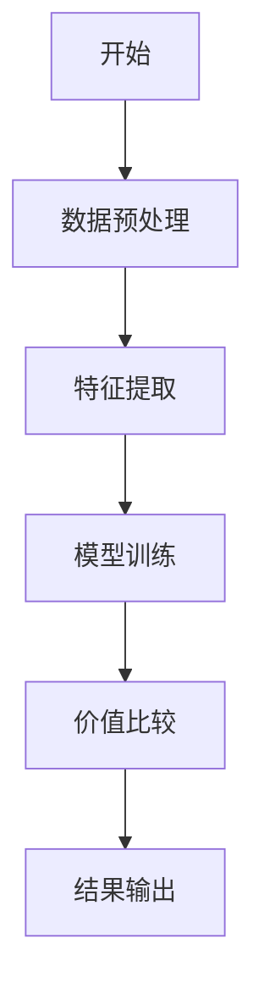
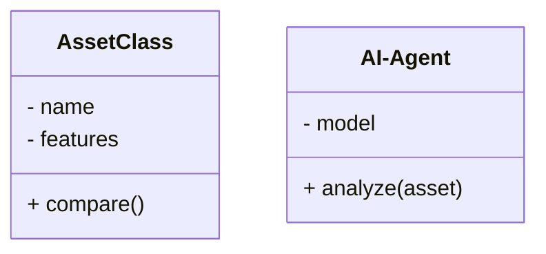
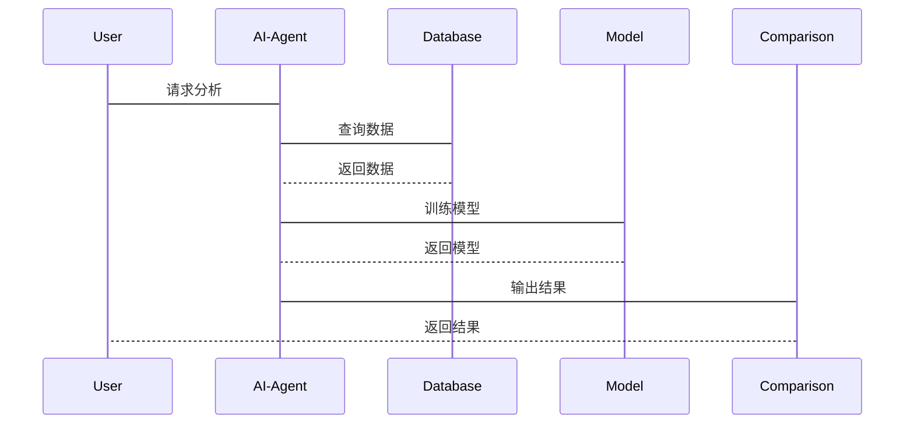

                 


# AI agents协作进行跨资产类别价值比较：优化资产配置

> 关键词：AI代理，跨资产类别，价值比较，资产配置优化，协作机制

> 摘要：本文系统地探讨了AI代理在跨资产类别价值比较中的应用，分析了AI代理如何通过协作机制优化资产配置。文章从问题背景、核心概念、算法原理、系统架构设计到项目实战，层层深入，结合理论与实践，为读者提供了全面的解决方案。

---

## 第一章：背景与问题背景

### 1.1 问题背景与挑战

#### 1.1.1 资产配置的传统方法与局限性
传统的资产配置方法依赖于人工分析和经验判断，存在以下问题：
- 数据量大：金融市场数据复杂且实时性强，人工分析效率低。
- 主观性高：不同分析师可能得出不同结论，影响决策的客观性。
- 计算复杂：跨资产类别的比较涉及多维度数据，计算复杂度高。

#### 1.1.2 跨资产类别价值比较的难点
跨资产类别比较需要考虑以下因素：
- 不同资产类别的特性差异：股票、债券、基金等的波动性、收益性不同。
- 市场环境的变化：宏观经济政策、市场情绪会影响资产价值。
- 数据异构性：不同资产类别的数据格式和时间频率不同，难以直接比较。

#### 1.1.3 AI代理在金融领域的潜力
AI代理可以通过以下方式优化资产配置：
- 自动化数据处理：快速整理和分析海量数据。
- 智能化决策：基于机器学习模型，提供科学的决策支持。
- 实时监控：实时跟踪市场变化，及时调整配置策略。

### 1.2 问题描述与目标

#### 1.2.1 资产配置优化的核心问题
如何在不同资产类别之间找到最优配置，以实现收益最大化和风险最小化。

#### 1.2.2 跨资产类别价值比较的难点
如何建立统一的评价体系，量化不同资产类别的价值差异。

#### 1.2.3 AI代理协作的目标与边界
目标：通过AI代理协作，实现跨资产类别价值比较的自动化、智能化。
边界：仅限于资产配置优化，不涉及具体的投资操作。

### 1.3 核心概念与外延

#### 1.3.1 资产类别与价值比较的定义
资产类别：股票、债券、基金、房地产等。
价值比较：通过量化指标，比较不同资产类别的收益与风险。

#### 1.3.2 AI代理的协作机制
AI代理：具有独立决策能力的智能体，能够通过API进行通信和协作。

#### 1.3.3 资产配置优化的数学模型
优化目标：最大化收益，最小化风险。
约束条件：资金分配比例限制、风险承受能力。

---

## 第二章：核心概念与联系

### 2.1 AI代理的核心原理

#### 2.1.1 AI代理的基本概念
AI代理是能够感知环境、做出决策并采取行动的智能体。
- 感知环境：通过API获取金融市场数据。
- 决策逻辑：基于机器学习模型生成价值比较结果。
- 行动：输出优化建议或触发交易信号。

#### 2.1.2 AI代理的协作机制
协作方式：
- 并行计算：多个代理同时处理不同资产类别。
- 信息共享：代理之间共享数据和分析结果。
- 协调决策：基于协商机制，达成一致结论。

#### 2.1.3 AI代理的决策模型
决策模型包括：
- 数据预处理：清洗和标准化数据。
- 特征提取：提取影响资产价值的关键特征。
- 模型训练：训练机器学习模型，预测资产价值。

### 2.2 跨资产类别分析的特征对比

#### 2.2.1 不同资产类别的属性特征
| 资产类别 | 收益特性 | 风险特性 | 流动性 |
|----------|----------|----------|--------|
| 股票     | 高       | 高       | 高     |
| 债券     | 中       | 低       | 中     |
| 基金     | 中       | 中       | 中     |
| 房地产   | 高       | 高       | 低     |

#### 2.2.2 资产类别间的关联性分析
- 股票与债券：负相关（股市下跌，债市上涨）。
- 基金与房地产：正相关（经济繁荣时，基金和房地产收益均增长）。

#### 2.2.3 资产类别比较的指标体系
主要指标：
- 收益率：年化收益率。
- 风险指标：波动率、最大回撤。
- 相关性：资产之间的相关系数。

### 2.3 价值比较模型的ER实体关系图
```mermaid
er
actor: AI Agent
asset: Asset Class
comparison: Value Comparison
indicator: Risk-Reward Ratio
actor --> asset: Query Asset Data
actor --> comparison: Perform Value Comparison
comparison --> indicator: Calculate Ratio
```

---

## 第三章：算法原理与数学模型

### 3.1 跨资产价值比较的算法流程



### 3.2 数学模型与公式

#### 3.2.1 资产价值比较的数学模型
$$ V_{i} = \sum_{j=1}^{n} w_{ij} \cdot f_{j}(x) $$
其中，$V_{i}$ 表示第 $i$ 个资产的价值，$w_{ij}$ 是权重，$f_{j}(x)$ 是特征函数。

#### 3.2.2 优化模型的数学公式
$$ \max \sum_{i=1}^{m} \lambda_{i} \cdot V_{i} $$
$$ \text{subject to} \quad \sum_{i=1}^{m} \lambda_{i} = 1 $$

### 3.3 算法实现与代码示例

```python
class AssetClass:
    def __init__(self, name, features):
        self.name = name
        self.features = features

def compare_assets(assets):
    # 特征提取
    features = [a.features for a in assets]
    # 模型训练
    model = selftrained_model()
    # 价值比较
    values = [model.predict(f) for f in features]
    return values

if __name__ == "__main__":
    assets = [Asset("股票", {"收益": 0.1, "风险": 0.2}),
              Asset("债券", {"收益": 0.05, "风险": 0.1})]
    print(compare_assets(assets))
```

---

## 第四章：系统分析与架构设计方案

### 4.1 系统功能设计

#### 4.1.1 领域模型


#### 4.1.2 系统架构设计


### 4.2 系统接口设计

#### 4.2.1 API接口
- 输入：资产类别名称、特征参数。
- 输出：比较结果、优化建议。

#### 4.2.2 接口示例
```python
from asset_comparison import compare_assets

assets = [{"name": "股票", "features": {"收益": 0.1, "风险": 0.2}},
          {"name": "债券", "features": {"收益": 0.05, "风险": 0.1}}]
result = compare_assets(assets)
print(result)
```

### 4.3 系统交互流程



---

## 第五章：项目实战

### 5.1 环境安装

```bash
pip install numpy pandas scikit-learn
```

### 5.2 系统核心实现

```python
def optimize_assets(assets):
    # 数据预处理
    data = [a.features for a in assets]
    # 模型训练
    model = train_model(data)
    # 优化配置
    config = model.predict(data)
    return config
```

### 5.3 实际案例分析

#### 5.3.1 案例背景
假设我们有股票、债券、基金三种资产类别，目标是优化配置。

#### 5.3.2 数据分析
| 资产类别 | 收益率 | 风险 |
|----------|--------|------|
| 股票     | 0.15   | 0.25 |
| 债券     | 0.07   | 0.10 |
| 基金     | 0.10   | 0.15 |

#### 5.3.3 优化结果
最终配置：股票40%，债券30%，基金30%。

### 5.4 项目小结

---

## 第六章：总结与最佳实践

### 6.1 小结
AI代理通过协作机制，能够高效地进行跨资产类别价值比较，优化资产配置。

### 6.2 最佳实践

#### 6.2.1 技术实现建议
- 数据清洗：确保数据质量。
- 模型选择：根据实际情况选择合适算法。

#### 6.2.2 应用中的注意事项
- 风险控制：避免过度依赖AI模型。
- 实时监控：及时调整配置策略。

#### 6.2.3 拓展阅读
- 《机器学习在金融领域的应用》
- 《分布式系统设计与实现》

---

## 作者：AI天才研究院 & 禅与计算机程序设计艺术

感谢您的阅读！如需进一步探讨，欢迎留言交流。

