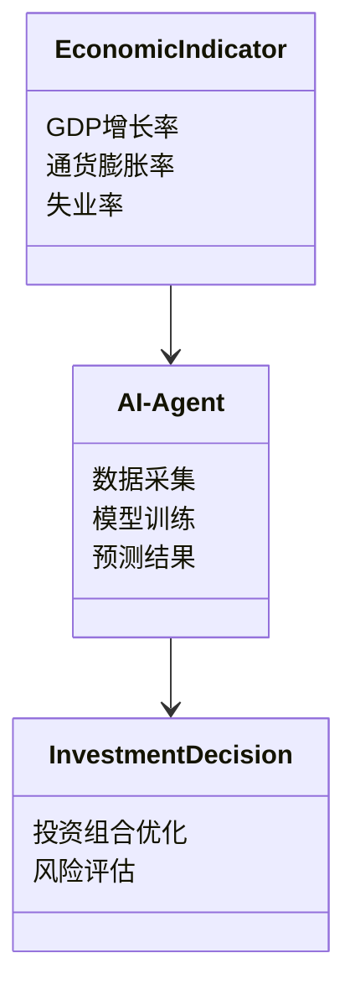

                 


# AI agents在价值投资中的宏观经济分析应用

## 关键词：人工智能，投资学，宏观经济，价值投资，强化学习

## 摘要

本文探讨了AI agents在价值投资中的宏观经济分析应用。首先，我们介绍了AI agents的基本概念及其在宏观经济分析中的潜力。接着，详细分析了宏观经济预测的核心算法原理，包括强化学习、监督学习和无监督学习，以及时间序列分析模型如ARIMA、GARCH和LSTM网络的数学公式。随后，我们结合AI agents与宏观经济预测，讨论了其在价值投资中的应用，包括数据采集、模型训练和预测结果的解释。最后，通过实际案例分析，我们展示了AI agents在宏观经济分析中的优势，并提出了系统的架构设计和实战项目，以帮助读者更好地理解和应用这些技术。

---

# 第一部分: AI Agent与宏观经济分析的背景与基础

## 第1章: AI Agent的基本概念与原理

### 1.1 AI Agent的定义与类型

#### 1.1.1 AI Agent的基本定义

AI Agent（人工智能代理）是指能够感知环境并采取行动以实现目标的智能实体。它可以是一个软件程序、机器人或其他智能系统，具备以下核心特征：

- **自主性**：能够在没有外部干预的情况下独立运行。
- **反应性**：能够根据环境输入做出实时响应。
- **目标导向**：通过采取行动来实现预设的目标。
- **学习能力**：能够通过数据和经验不断优化自身的决策能力。

AI Agent可以分为以下几类：

- **简单反射型**：基于预设规则做出反应，不涉及复杂决策。
- **基于模型的反应型**：利用内部模型和环境信息进行决策。
- **目标驱动型**：以实现特定目标为导向。
- **实用驱动型**：通过优化目标函数来做出决策。

#### 1.1.2 AI Agent的类型与特点

1. **简单反射型AI Agent**：
   - 优点：实现简单，适用于规则明确的场景。
   - 缺点：缺乏灵活性，无法应对复杂或不确定的环境。

2. **基于模型的反应型AI Agent**：
   - 优点：能够利用环境模型进行更复杂的决策。
   - 缺点：模型构建和维护需要大量资源。

3. **目标驱动型AI Agent**：
   - 优点：明确的目标导向，适用于需要长期规划的任务。
   - 缺点：目标设定和调整可能需要外部干预。

4. **实用驱动型AI Agent**：
   - 优点：通过优化目标函数实现最优决策。
   - 缺点：优化过程复杂，计算资源消耗较大。

#### 1.1.3 AI Agent的核心属性与功能

AI Agent的核心属性包括：

- **感知能力**：通过传感器或数据输入感知环境。
- **决策能力**：基于感知信息做出决策。
- **执行能力**：通过行动影响环境或实现目标。
- **学习能力**：通过经验优化自身的行为。

---

### 1.2 宏观经济分析的基本框架

#### 1.2.1 宏观经济的主要指标

宏观经济分析主要关注以下指标：

1. **GDP（国内生产总值）**：衡量一个国家或地区的经济规模。
2. **通货膨胀率**：物价水平的变动趋势。
3. **失业率**：劳动力市场的就业情况。
4. **利率**：资金成本的体现。
5. **汇率**：不同货币之间的兑换比率。
6. **财政政策**：政府的支出和税收政策。
7. **货币政策**：中央银行的货币供应和利率政策。

#### 1.2.2 宏观经济分析的基本方法

宏观经济分析的基本方法包括：

1. **总量分析**：从整体角度分析经济指标的变化。
2. **结构分析**：分析经济结构中的各个部分及其相互关系。
3. **动态分析**：研究经济变量随时间的变化趋势。
4. **比较分析**：比较不同经济体制或政策下的经济表现。

#### 1.2.3 宏观经济与价值投资的关系

价值投资的核心理念是寻找被市场低估的资产，并长期持有以实现收益。宏观经济分析在价值投资中的作用包括：

1. **行业分析**：通过宏观经济指标判断行业的景气度和投资价值。
2. **政策分析**：分析财政和货币政策对市场的影响。
3. **市场周期分析**：识别市场的周期性波动，指导投资决策。

---

## 第2章: AI Agent在宏观经济分析中的应用背景

### 2.1 价值投资的核心理念

#### 2.1.1 价值投资的基本原则

价值投资的基本原则包括：

1. **安全边际**：以低于内在价值的价格买入资产。
2. **长期视角**：关注企业的长期价值而非短期波动。
3. **基本面分析**：通过分析企业的财务状况和行业前景做出投资决策。

#### 2.1.2 宏观经济对价值投资的影响

宏观经济因素对价值投资的影响主要体现在以下几个方面：

1. **经济周期**：经济周期的波动影响企业的盈利能力和股票价格。
2. **利率政策**：利率变化影响债券收益率和股票市场的估值。
3. **通货膨胀**：通货膨胀率影响企业的成本和利润。

#### 2.1.3 AI技术在投资分析中的优势

AI技术在投资分析中的优势包括：

1. **数据处理能力**：能够处理海量的宏观经济数据，提取有用的信息。
2. **预测能力**：通过机器学习算法预测宏观经济指标的变化趋势。
3. **实时性**：能够实时分析市场动态，快速做出反应。

### 2.2 AI Agent在宏观经济分析中的潜力

#### 2.2.1 数据驱动的宏观经济预测

AI Agent可以通过分析历史数据，识别经济变量之间的关系，从而实现宏观经济预测。

#### 2.2.2 AI Agent在投资决策中的作用

AI Agent可以帮助投资者做出更科学的投资决策，例如：

1. **风险评估**：通过分析宏观经济指标评估投资风险。
2. **投资组合优化**：根据宏观经济预测优化投资组合。
3. **市场情绪分析**：通过自然语言处理技术分析市场情绪。

#### 2.2.3 宏观经济分析的复杂性与AI的优势

宏观经济分析涉及大量复杂变量，AI Agent可以通过复杂的算法和模型，捕捉变量之间的非线性关系，从而提供更准确的预测和分析。

---

# 第二部分: AI Agent的算法原理与宏观经济预测模型

## 第3章: AI Agent的核心算法原理

### 3.1 强化学习算法

#### 3.1.1 强化学习的基本概念

强化学习是一种机器学习范式，通过智能体与环境的交互，学习如何做出决策以最大化累积奖励。其核心概念包括：

- **状态（State）**：智能体所处的环境状态。
- **动作（Action）**：智能体根据当前状态做出的决策。
- **奖励（Reward）**：智能体采取某个动作后获得的反馈。
- **策略（Policy）**：智能体在不同状态下选择动作的概率分布。
- **值函数（Value Function）**：衡量某个状态或动作的价值。

#### 3.1.2 状态、动作与奖励的定义

在宏观经济预测中，强化学习可以应用于以下场景：

1. **状态**：当前的宏观经济指标（如GDP增长率、通货膨胀率等）。
2. **动作**：智能体可以采取的行动（如调整投资组合、买入或卖出资产）。
3. **奖励**：根据投资收益或损失计算的奖励值。

#### 3.1.3 策略网络与值函数网络的构建

策略网络和值函数网络是强化学习中的两个重要组件：

- **策略网络**：直接根据状态输出动作的概率分布。
- **值函数网络**：根据状态评估某个动作的期望奖励值。

策略网络和值函数网络可以通过神经网络实现，常用的网络结构包括卷积神经网络（CNN）和循环神经网络（RNN）。

---

### 3.2 监督学习与无监督学习

#### 3.2.1 监督学习在宏观经济预测中的应用

监督学习是一种机器学习方法，通过训练数据学习输入与输出之间的关系。在宏观经济预测中，监督学习可以用于以下任务：

1. **单变量时间序列预测**：如预测GDP增长率。
2. **多变量时间序列预测**：如预测通货膨胀率和失业率。

#### 3.2.2 无监督学习在数据挖掘中的优势

无监督学习是一种机器学习方法，用于从无标签数据中发现隐藏的模式和结构。在宏观经济分析中，无监督学习可以用于：

1. **聚类分析**：将相似的经济指标分组。
2. **异常检测**：发现经济指标中的异常值。

#### 3.2.3 深度学习模型的宏观经济预测能力

深度学习模型，如卷积神经网络（CNN）和生成对抗网络（GAN），在宏观经济预测中表现出色。例如，LSTM网络可以用于时间序列预测，其结构如下：


---

## 第4章: 宏观经济预测的数学模型与公式

### 4.1 时间序列分析模型

#### 4.1.1 ARIMA模型的数学公式

ARIMA（自回归积分移动平均模型）是一种常用的时间序列分析模型，其数学公式如下：

$$
ARIMA(p, d, q) = y_t = c + \sum_{i=1}^{p} \phi_i y_{t-i} + \sum_{j=1}^{q} \theta_j \epsilon_{t-j} + \epsilon_t
$$

其中：
- \( p \) 为自回归阶数
- \( d \) 为差分阶数
- \( q \) 为移动平均阶数
- \( \phi_i \) 为自回归系数
- \( \theta_j \) 为移动平均系数
- \( \epsilon_t \) 为白噪声

#### 4.1.2 GARCH模型的数学公式

GARCH（广义自回归条件异方差模型）用于预测时间序列的波动性，其数学公式如下：

$$
\sigma_t^2 = \alpha_0 + \sum_{i=1}^{p} \alpha_i r_{t-i}^2 + \sum_{j=1}^{q} \beta_j \sigma_{t-j}^2
$$

其中：
- \( \sigma_t^2 \) 为时间序列在时刻 \( t \) 的方差
- \( \alpha_0 \) 为常数项
- \( \alpha_i \) 和 \( \beta_j \) 为模型参数
- \( r_{t-i} \) 为时间序列在时刻 \( t-i \) 的残差

#### 4.1.3 LSTM网络的数学原理

LSTM（长短期记忆网络）是一种特殊的RNN，用于处理长序列数据。其核心在于引入记忆单元（Cell）和遗忘门（Forget Gate），从而避免传统RNN的梯度消失问题。LSTM的基本结构如下：


---

### 4.2 经济指标的权重分配与综合评价

#### 4.2.1 经济指标的权重计算公式

在宏观经济分析中，经济指标的权重可以通过主成分分析（PCA）或因子分析等方法计算。例如，使用PCA计算权重的公式如下：

$$
w_i = \frac{\lambda_i}{\sum_{j=1}^{n} \lambda_j}
$$

其中：
- \( w_i \) 为第 \( i \) 个经济指标的权重
- \( \lambda_i \) 为第 \( i \) 个经济指标的特征值
- \( n \) 为经济指标的总数

#### 4.2.2 宏观经济综合评价模型

综合评价模型可以将多个经济指标综合为一个综合指数，例如：

$$
S = \sum_{i=1}^{n} w_i x_i
$$

其中：
- \( S \) 为综合指数
- \( w_i \) 为第 \( i \) 个经济指标的权重
- \( x_i \) 为第 \( i \) 个经济指标的数值

#### 4.2.3 综合评价模型的数学表达

综合评价模型可以进一步优化，例如引入时间序列分析模型：

$$
S_t = \alpha S_{t-1} + (1-\alpha) x_t
$$

其中：
- \( S_t \) 为时刻 \( t \) 的综合指数
- \( \alpha \) 为平滑系数
- \( x_t \) 为时刻 \( t \) 的新经济指标

---

## 第5章: AI Agent与宏观经济预测的结合

### 5.1 AI Agent在宏观经济预测中的角色

#### 5.1.1 数据采集与处理

AI Agent可以通过多种数据源采集宏观经济数据，例如：

1. **政府统计机构**：如国家统计局发布的GDP数据。
2. **金融市场数据**：如股票价格、债券收益率等。
3. **新闻媒体**：通过自然语言处理技术分析新闻情绪。

#### 5.1.2 模型训练与优化

AI Agent需要对宏观经济预测模型进行训练和优化，例如：

1. **数据预处理**：包括数据清洗、标准化和特征工程。
2. **模型选择**：根据数据特点选择合适的算法，如ARIMA、LSTM等。
3. **模型调优**：通过交叉验证优化模型参数。

#### 5.1.3 预测结果的解释与应用

AI Agent需要将预测结果解释为可操作的信号，例如：

1. **经济预警**：当预测GDP增长率大幅下降时，发出经济衰退预警。
2. **投资建议**：根据宏观经济预测调整投资组合。

### 5.2 宏观经济预测的不确定性分析

#### 5.2.1 预测误差的来源

宏观经济预测的不确定性主要来源于以下因素：

1. **数据噪声**：数据中不可避免的随机误差。
2. **模型假设**：模型假设与实际经济运行的差异。
3. **外部冲击**：如突发的政策变化或自然灾害。

#### 5.2.2 概率预测与风险评估

AI Agent可以通过概率预测模型评估宏观经济预测的不确定性，例如：

1. **概率分布估计**：通过蒙特卡洛模拟估计经济指标的概率分布。
2. **风险评估**：根据概率分布评估不同经济情景下的风险。

---

# 第三部分: AI Agent的系统设计与宏观经济分析应用

## 第6章: 系统架构与实现

### 6.1 问题场景介绍

在价值投资中，宏观经济分析是投资决策的重要组成部分。AI Agent可以通过宏观经济预测帮助投资者优化投资组合，降低投资风险。

### 6.2 系统功能设计

#### 6.2.1 领域模型（mermaid类图）



#### 6.2.2 系统架构设计（mermaid架构图）


#### 6.2.3 系统接口设计和交互流程

1. **数据接口**：AI Agent通过API接口获取宏观经济数据。
2. **模型接口**：AI Agent调用预测模型进行宏观经济预测。
3. **投资决策接口**：AI Agent根据预测结果生成投资建议。

---

## 第7章: 项目实战

### 7.1 环境安装与配置

#### 7.1.1 安装Python环境

```bash
python --version
pip install numpy pandas scikit-learn tensorflow
```

#### 7.1.2 安装其他依赖

```bash
pip install matplotlib seaborn
```

### 7.2 核心代码实现

#### 7.2.1 数据处理代码

```python
import pandas as pd
import numpy as np

# 数据加载
data = pd.read_csv('macroeconomic_data.csv')

# 数据预处理
data = data.dropna()
data = (data - data.mean()) / data.std()
```

#### 7.2.2 LSTM模型实现

```python
from tensorflow.keras.models import Sequential
from tensorflow.keras.layers import LSTM, Dense

# 模型构建
model = Sequential()
model.add(LSTM(64, input_shape=(timesteps, features)))
model.add(Dense(1))
model.compile(loss='mean_squared_error', optimizer='adam')
```

#### 7.2.3 模型训练与预测

```python
# 训练模型
model.fit(x_train, y_train, epochs=100, batch_size=32)

# 预测结果
predictions = model.predict(x_test)
```

### 7.3 案例分析与解读

#### 7.3.1 案例背景

假设我们有一个包含GDP增长率、通货膨胀率和失业率的宏观经济数据集。

#### 7.3.2 数据分析与结果展示

```python
import matplotlib.pyplot as plt

plt.plot(data['GDP增长率'], label='实际值')
plt.plot(predictions, label='预测值')
plt.legend()
plt.show()
```

#### 7.3.3 投资决策建议

根据宏观经济预测结果，AI Agent可以生成以下投资建议：

1. **行业选择**：建议投资于经济增长较快的行业。
2. **资产配置**：根据预测的通货膨胀率调整债券和股票的配置比例。

---

## 第8章: 总结与展望

### 8.1 总结

本文详细探讨了AI Agent在价值投资中的宏观经济分析应用。通过结合强化学习、监督学习和时间序列分析模型，AI Agent能够帮助投资者优化投资组合，降低投资风险。

### 8.2 未来展望

未来的研究方向包括：

1. **多模态数据融合**：结合文本、图像等多种数据源进行宏观经济分析。
2. **实时预测系统**：开发实时宏观经济预测系统，为投资者提供即时决策支持。
3. **可解释性增强**：提升AI Agent的可解释性，帮助投资者更好地理解预测结果。

---

# 作者：AI天才研究院 & 禅与计算机程序设计艺术

