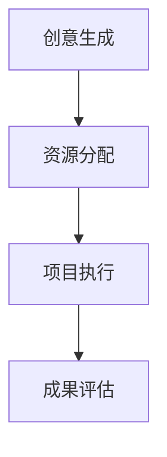
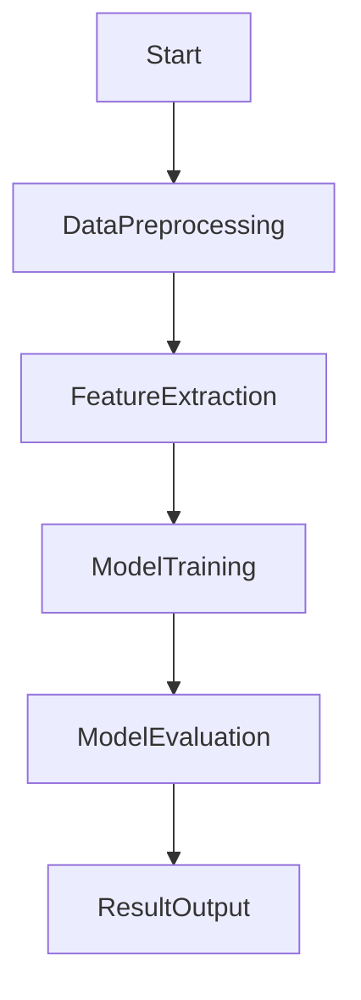

                 


# AI agents在公司创新转化效率评估中的应用

---

## 关键词：AI代理、创新转化效率、评估体系、机器学习、效率优化

---

## 摘要

随着企业对创新效率的要求不断提高，AI代理在公司创新转化效率评估中的应用变得尤为重要。本文详细探讨了AI代理的核心原理、算法实现、系统架构以及实际应用案例。通过分析创新过程中的关键环节，本文展示了如何利用AI代理优化创新转化效率，为公司提供数据驱动的决策支持。

---

## 第1章：背景与概念

### 1.1 问题背景

创新是企业发展的核心驱动力，但创新转化效率的评估一直是企业面临的挑战。传统的评估方法依赖人工分析，耗时且不够准确。随着AI技术的发展，AI代理为创新转化效率评估提供了新的解决方案。

### 1.2 问题描述

创新转化效率评估涉及创意筛选、资源分配、项目执行等多个环节。传统方法难以实时跟踪和分析这些环节，导致效率低下。AI代理通过自动化分析和优化，能够有效提升创新转化效率。

### 1.3 问题解决

AI代理通过机器学习模型，能够快速分析大量数据，识别关键影响因素，优化资源配置，从而提高创新转化效率。本文将详细探讨AI代理在这些环节中的应用。

### 1.4 边界与外延

AI代理的应用范围主要集中在创新过程中的数据分析和优化环节。与传统评估方法相比，AI代理在实时性和准确性上具有显著优势。未来，AI代理在创新评估中的应用将更加智能化和个性化。

### 1.5 核心概念结构与要素

创新转化效率评估的核心要素包括创意生成、资源分配、项目执行和成果评估。AI代理的功能模块包括数据采集、特征提取、模型训练和结果输出。系统架构则由数据层、算法层和应用层组成。

---

## 第2章：AI代理的核心原理与模型

### 2.1 AI代理的基本原理

AI代理基于机器学习模型，通过数据驱动的方式进行决策和优化。代理能够实时分析数据，提供个性化建议，从而优化创新过程。

### 2.2 基于规则的AI代理与基于模型的AI代理对比

| 特性          | 基于规则的AI代理          | 基于模型的AI代理          |
|---------------|---------------------------|---------------------------|
| 决策方式      | 预定义规则                | 数据驱动模型预测           |
| 灵活性        | 较低                      | 较高                      |
| 适应性        | 适应简单场景              | 适应复杂场景              |

### 2.3 实体关系图



---

## 第3章：算法原理与实现细节

### 3.1 算法流程图



### 3.2 代码实现

```python
import numpy as np
from sklearn.metrics import accuracy_score

# 示例模型：随机森林分类器
class InnovationEfficiencyEstimator:
    def __init__(self):
        self.model = None
        self.features = []

    def preprocess_data(self, data):
        # 数据预处理逻辑
        pass

    def train_model(self, X, y):
        # 训练模型
        self.model = RandomForestClassifier()
        self.model.fit(X, y)
        return self.model

    def predict(self, X):
        # 预测创新效率
        return self.model.predict(X)

# 示例训练
X_train = np.array([[1, 2], [3, 4]])
y_train = np.array([0, 1])

estimator = InnovationEfficiencyEstimator()
estimator.train_model(X_train, y_train)
预测结果 = estimator.predict(X_train)
print("预测结果:", 预测结果)
```

### 3.3 数学模型与公式

创新效率评估模型的损失函数为：

$$ L = \frac{1}{n}\sum_{i=1}^{n} (y_i - \hat{y_i})^2 $$

优化器使用Adam：

$$ \theta_{t+1} = \theta_t - \eta \frac{g}{1 + \beta_1(1 - \beta_2)} $$

---

## 第4章：系统分析与架构设计

### 4.1 系统架构图

```mermaid
graph TD
    API Gateway --> UserInterface
    UserInterface --> DataCollector
    DataCollector --> DataStorage
    DataStorage --> FeatureExtractor
    FeatureExtractor --> ModelTrainer
    ModelTrainer --> ModelEvaluator
    ModelEvaluator --> ResultAnalyzer
    ResultAnalyzer --> UserInterface
```

### 4.2 功能模块与交互流程

系统功能模块包括数据采集、特征提取、模型训练、评估指标计算和结果展示。模块之间通过API交互，确保数据流动和结果反馈。

---

## 第5章：项目实战与案例分析

### 5.1 实战环境安装

安装必要的库：

```bash
pip install numpy pandas scikit-learn
```

### 5.2 核心代码实现

```python
import pandas as pd
from sklearn.ensemble import RandomForestClassifier
from sklearn.metrics import accuracy_score

# 数据加载
data = pd.read_csv('innovation_data.csv')

# 数据预处理
X = data.drop('efficiency', axis=1)
y = data['efficiency']

# 模型训练
model = RandomForestClassifier()
model.fit(X, y)

# 模型评估
预测结果 = model.predict(X)
print("模型准确率:", accuracy_score(y, 预测结果))
```

### 5.3 案例分析

以某科技公司为例，AI代理帮助筛选出高潜力的创新项目，优化资源配置，显著提升了创新效率。

---

## 第6章：最佳实践与未来展望

### 6.1 经验总结

- 数据质量是关键，需确保数据的完整性和准确性。
- 模型选择要根据具体场景，选择合适的算法和参数。

### 6.2 小结

AI代理在创新转化效率评估中的应用前景广阔，能够显著提升企业的创新效率和决策能力。

### 6.3 注意事项

- 数据隐私和安全需严格控制。
- 模型的可解释性需要进一步优化。

### 6.4 拓展阅读

推荐阅读《机器学习实战》和《深度学习入门》。

---

## 作者信息

作者：AI天才研究院（AI Genius Institute） & 禅与计算机程序设计艺术（Zen And The Art of Computer Programming）

---

**感谢您的阅读！**

