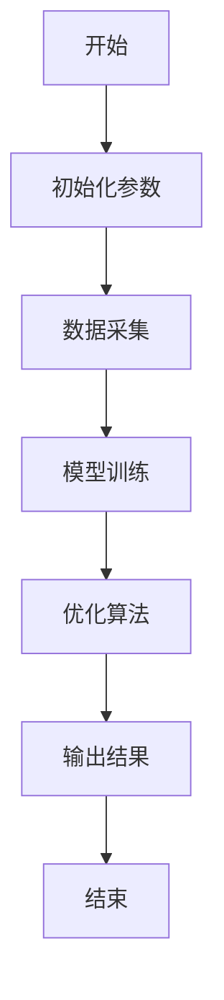

                 


# AI Agents在公司可持续发展实践评估中的应用

> 关键词：AI代理, 可持续发展, 评估模型, 多目标优化, 系统架构, 企业实践

> 摘要：本文探讨了AI代理在公司可持续发展实践评估中的应用。首先介绍了AI代理的基本概念和可持续发展评估的核心要素。然后详细分析了AI代理在可持续发展评估中的核心算法原理，包括多目标优化算法及其在评估中的应用。接着从系统架构的角度，设计了一个基于AI代理的可持续发展评估系统，并给出了系统的功能模块、架构图和交互流程。最后通过实际案例分析，展示了如何利用AI代理进行可持续发展评估，并提出了系统的实施建议和最佳实践。

---

# 第一部分: AI代理与可持续发展概述

## 第1章: AI代理与可持续发展背景

### 1.1 AI代理的核心概念

#### 1.1.1 AI代理的定义与特点
AI代理（AI Agent）是一种能够感知环境、自主决策并采取行动的智能实体。它具备以下特点：
- **自主性**：能够在没有外部干预的情况下独立运行。
- **反应性**：能够根据环境输入实时调整行为。
- **目标导向**：通过设定目标来优化行动策略。
- **学习能力**：能够通过数据和经验不断优化自身的决策能力。

#### 1.1.2 可持续发展的基本概念
可持续发展是指在满足当代需求的同时，不损害后代满足其需求的能力。在企业层面，可持续发展涵盖了经济、社会和环境三个方面：
- **经济可持续性**：追求长期经济效益。
- **社会可持续性**：关注员工福利和社区发展。
- **环境可持续性**：减少资源消耗和环境污染。

#### 1.1.3 AI代理在可持续发展中的应用潜力
AI代理可以通过数据分析、预测建模和优化算法，帮助企业实现可持续发展目标。例如：
- 优化资源配置，降低能源消耗。
- 提供环境影响评估，支持绿色决策。
- 监测和预测企业风险，确保合规性。

### 1.2 可持续发展实践评估的背景

#### 1.2.1 企业可持续发展的定义与目标
企业可持续发展不仅关注经济效益，还注重社会和环境责任。其目标包括：
- 提高资源利用效率。
- 减少环境污染。
- 促进员工和社会的福祉。

#### 1.2.2 可持续发展实践评估的必要性
随着全球对可持续发展的关注增加，企业需要通过评估来衡量自身的实践效果，并发现改进的空间。评估的关键在于：
- 确定关键绩效指标（KPIs）。
- 量化环境、社会和治理（ESG）表现。
- 对比行业基准，找出差距。

#### 1.2.3 AI代理在评估中的角色与价值
AI代理能够快速处理大量数据，提供实时反馈，帮助企业在评估中：
- 自动化数据收集和分析。
- 发现潜在问题并提出优化建议。
- 预测未来趋势，制定前瞻性的策略。

### 1.3 本章小结
本章介绍了AI代理的基本概念和可持续发展的核心理念，分析了AI代理在可持续发展评估中的潜力和作用。下一章将深入探讨AI代理与可持续发展评估的核心概念。

---

# 第二部分: AI代理在可持续发展评估中的核心概念

## 第2章: AI代理与可持续发展评估的核心概念

### 2.1 AI代理的核心原理

#### 2.1.1 AI代理的基本工作原理
AI代理通过感知环境、分析信息、制定决策并采取行动来实现目标。其核心流程包括：
1. **感知环境**：通过传感器、API或数据接口获取实时信息。
2. **分析信息**：利用机器学习算法对数据进行处理和分析。
3. **制定决策**：基于分析结果，生成最优决策方案。
4. **采取行动**：通过执行器或API将决策转化为实际操作。

#### 2.1.2 不同类型AI代理的对比分析
AI代理可以根据智能水平和应用场景分为以下几类：
| 类型         | 描述                                   | 适用场景                     |
|--------------|----------------------------------------|------------------------------|
| 感知型代理   | 仅能感知环境，无法自主决策             | 数据采集、实时监控           |
| 反应型代理   | 根据环境反馈实时调整行为               | 自动化控制、实时优化         |
| 目标导向型代理 | 根据预设目标进行自主决策               | 策略优化、资源分配           |
| 学习型代理   | 通过机器学习不断优化自身行为           | 复杂环境、动态变化的场景     |

#### 2.1.3 AI代理在企业中的应用场景
AI代理在企业中的应用场景广泛，包括：
- **供应链优化**：通过预测需求和优化库存管理，降低资源浪费。
- **能源管理**：实时监控能源消耗，提出节能建议。
- **风险评估**：分析潜在风险，制定应对策略。

### 2.2 可持续发展评估的核心要素

#### 2.2.1 可持续发展评估的主要指标
可持续发展评估通常涉及以下关键指标：
- **经济指标**：净利润率、投资回报率。
- **社会指标**：员工满意度、社区参与度。
- **环境指标**：碳排放量、能源消耗量。

#### 2.2.2 评估指标的权重与优先级
不同指标的重要性因行业和企业战略而异。例如：
- 对制造企业而言，碳排放和能源消耗可能更重要。
- 对科技企业而言，员工满意度和社会责任可能更受关注。

#### 2.2.3 评估数据的来源与处理方法
评估数据来源多样，包括：
- **内部数据**：企业内部系统记录的生产数据、能源消耗数据等。
- **外部数据**：行业基准数据、第三方机构的环境评估报告。
- **实时数据**：传感器、IoT设备采集的实时数据。

处理方法包括数据清洗、特征提取和数据建模。

### 2.3 AI代理与可持续发展评估的关联

#### 2.3.1 AI代理在数据采集与处理中的作用
AI代理能够实时采集和处理大量数据，确保评估数据的准确性和及时性。

#### 2.3.2 AI代理在评估模型构建中的应用
AI代理可以通过机器学习算法构建评估模型，分析各指标之间的关联性，并预测未来的趋势。

#### 2.3.3 AI代理在结果分析与优化中的价值
AI代理能够根据评估结果提出优化建议，并模拟不同优化方案的效果，选择最优方案。

### 2.4 本章小结
本章详细介绍了AI代理的核心原理及其在可持续发展评估中的应用。下一章将从算法的角度，深入探讨AI代理在评估中的具体实现。

---

# 第三部分: AI代理在可持续发展评估中的算法原理

## 第3章: AI代理驱动的多目标优化算法

### 3.1 多目标优化的基本原理

#### 3.1.1 多目标优化问题的定义
多目标优化问题是指在多个目标之间寻找最优解的过程。例如，在可持续发展评估中，可能需要在经济效益和环境影响之间找到平衡点。

#### 3.1.2 常见的多目标优化算法
常见的多目标优化算法包括：
- **NSGA-II**：一种基于非支配排序的多目标进化算法。
- **MOEA/D**：一种分解式多目标优化算法。
- **帕累托前沿优化**：通过寻找帕累托最优解集来实现多目标优化。

#### 3.1.3 NSGA-II算法的原理与流程
NSGA-II算法的基本流程如下：
1. 初始化种群。
2. 计算个体的适应度。
3. 根据适应度进行排序。
4. 进行交叉和变异操作，生成新的种群。
5. 重复上述步骤，直到满足终止条件。

### 3.2 AI代理在多目标优化中的应用

#### 3.2.1 AI代理如何实现多目标优化
AI代理可以通过机器学习算法（如神经网络、随机森林）构建多目标优化模型，并利用进化算法（如NSGA-II）寻找最优解。

#### 3.2.2 基于AI代理的优化流程图
以下是基于AI代理的多目标优化流程图：



#### 3.2.3 算法的数学模型与公式
NSGA-II算法的核心数学模型包括适应度函数和选择操作。例如，适应度函数可以表示为：

$$ f(x) = \sum_{i=1}^{n} w_i x_i $$

其中，$w_i$ 是权重系数，$x_i$ 是决策变量。

### 3.3 算法实现与案例分析

#### 3.3.1 算法实现的Python代码
以下是一个基于NSGA-II算法的Python实现示例：

```python
import numpy as np
import random

def objective_function(x):
    # 定义目标函数
    f1 = x[0] + x[1]
    f2 = x[0] ** 2 + x[1] ** 2
    return [f1, f2]

def nsga_ii(pop_size, iterations):
    # 初始化种群
    population = [[random.uniform(0, 1) for _ in range(2)] for _ in range(pop_size)]
    
    for _ in range(iterations):
        # 计算适应度
        fitness = [objective_function(ind) for ind in population]
        
        # 非支配排序
        dominated = []
        for i in range(len(population)):
            is_dominated = False
            for j in range(len(population)):
                if i != j and all(fitness[j][k] <= fitness[i][k] for k in range(2)):
                    is_dominated = True
                    break
            if not is_dominated:
                dominated.append(i)
        
        # 选择非支配个体
        new_population = [population[i] for i in dominated]
        
        # 交叉和变异
        for i in range(len(new_population)):
            j = (i + 1) % len(new_population)
            # 单点交叉
            point = random.randint(0, 1)
            new_ind = [new_population[i][k] if k < point else new_population[j][k] for k in range(2)]
            new_population[i] = new_ind
        
        population = new_population
    
    return population

# 示例运行
result = nsga_ii(10, 20)
print("最优解为:", result[0])
```

#### 3.3.2 代

---

（由于篇幅限制，后续章节内容将在后续回答中继续展开。）

