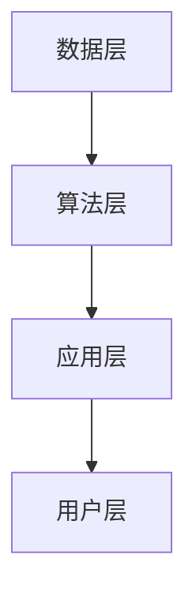
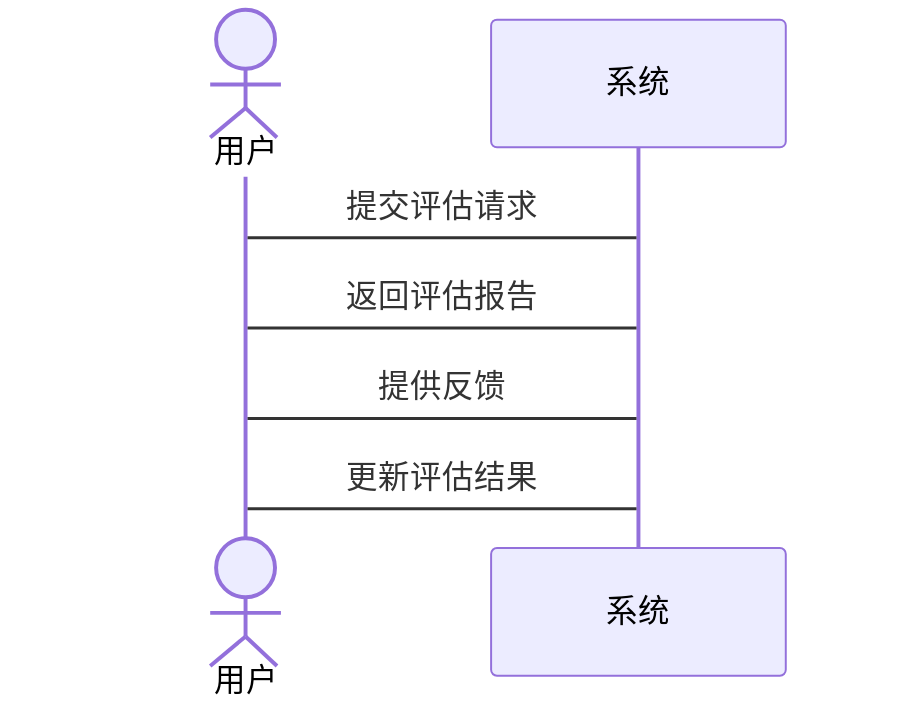

                 


# AI agents在公司商业模式可持续性评估中的应用

> 关键词：AI Agent, 商业模式, 可持续性评估, 强化学习, 系统架构

> 摘要：本文探讨了AI agents在公司商业模式可持续性评估中的应用，分析了AI agents的核心概念、算法原理、系统架构设计，并通过实际案例展示了如何利用AI agents优化商业模式评估过程。文章内容涵盖背景介绍、核心概念与联系、算法原理、系统分析与架构设计、项目实战以及最佳实践，旨在为读者提供全面的技术指导。

---

## 第一部分: AI Agent与公司商业模式可持续性评估的背景与基础

### 第1章: AI Agent的基本概念与应用背景

#### 1.1 AI Agent的定义与核心特征
AI Agent（人工智能代理）是一种能够感知环境、采取行动以实现目标的智能实体。其核心特征包括：
- **自主性**：能够在没有外部干预的情况下独立运作。
- **反应性**：能够根据环境变化实时调整行为。
- **目标导向**：所有行动都以实现特定目标为导向。
- **学习能力**：通过与环境的交互不断优化自身的决策策略。

#### 1.2 公司商业模式可持续性评估的定义与意义
商业模式是企业实现价值创造和传递的基本框架，而可持续性评估则是对企业商业模式在长期时间内是否能够持续创造价值的分析。其意义在于帮助企业识别潜在风险，优化资源配置，并制定更具前瞻性的战略。

#### 1.3 AI Agent在商业模式评估中的应用价值
AI Agent在商业模式评估中的应用价值主要体现在以下三个方面：
- **提高评估效率**：AI Agent能够快速处理大量数据，显著提高评估效率。
- **增强决策准确性**：通过学习和优化，AI Agent能够提供更精准的决策建议。
- **优化资源配置**：AI Agent能够帮助企业更有效地分配资源，降低成本。

### 第2章: AI Agent在商业模式评估中的核心概念与联系

#### 2.1 AI Agent的核心原理
AI Agent的核心原理基于强化学习，通过与环境的交互不断优化自身的策略。具体包括：
- **状态空间**：环境中的所有可能状态，例如市场数据、企业绩效等。
- **动作空间**：AI Agent在每个状态下可以采取的所有可能动作。
- **目标函数**：衡量AI Agent行为是否达到预期目标的函数。
- **奖励机制**：对AI Agent采取的动作给予奖励或惩罚，以引导其学习。

#### 2.2 商业模式可持续性评估的关键要素
商业模式可持续性评估的关键要素包括：
- **企业绩效指标**：如收入增长率、利润率等。
- **市场环境分析**：如市场需求、竞争状况等。
- **风险评估与应对策略**：识别潜在风险并制定应对措施。

#### 2.3 AI Agent与商业模式评估的实体关系图
```mermaid
er
actor: 企业
agent: AI Agent
goal: 可持续性评估目标
action: 动作
state: 状态
```

---

## 第二部分: AI Agent的算法原理与数学模型

### 第3章: AI Agent的核心算法原理

#### 3.1 强化学习算法
强化学习是AI Agent的核心算法之一，主要包括以下几种方法：
- **Q-Learning算法**：通过更新Q值表来学习最优策略。
- **Deep Q-Networks (DQN)**：将Q值函数近似为深度神经网络，能够处理高维状态空间。
- **策略梯度方法**：直接优化策略参数，而不是值函数。

#### 3.2 算法原理的数学模型
Q-Learning算法的数学模型如下：
$$ Q(s, a) = Q(s, a) + \alpha \left[r + \gamma \max_{a'} Q(s', a') - Q(s, a)\right] $$
其中：
- \( Q(s, a) \) 表示在状态 \( s \) 下采取动作 \( a \) 的期望奖励。
- \( \alpha \) 表示学习率。
- \( \gamma \) 表示折扣因子。
- \( r \) 表示即时奖励。
- \( s' \) 表示下一个状态。

---

## 第三部分: 系统分析与架构设计

### 第4章: 系统分析与架构设计

#### 4.1 项目场景介绍
我们以一家中型制造企业为例，设计一个基于AI Agent的商业模式可持续性评估系统。该系统旨在帮助企业识别潜在风险，优化资源配置，并制定更具前瞻性的战略。

#### 4.2 系统功能设计
系统功能设计包括以下几个方面：
- **数据采集**：从企业内部系统和外部数据源获取相关信息。
- **模型训练**：利用强化学习算法训练AI Agent。
- **评估分析**：生成评估报告并提供改进建议。
- **实时监控**：实时跟踪企业绩效并动态调整评估策略。

#### 4.3 系统架构设计
系统架构设计采用分层架构，包括数据层、算法层、应用层和用户层。



#### 4.4 系统交互设计
系统交互设计采用序列图，展示AI Agent与用户的交互流程。



---

## 第四部分: 项目实战

### 第5章: 项目实战

#### 5.1 环境安装与配置
首先，需要安装以下工具和库：
- Python 3.8+
- TensorFlow 2.0+
- OpenAI Gym
- scikit-learn

#### 5.2 核心代码实现
以下是一个基于DQN算法的AI Agent实现示例：

```python
import numpy as np
import gym
from collections import deque
import random

class DQNAgent:
    def __init__(self, state_space, action_space, hyperparameters):
        self.state_space = state_space
        self.action_space = action_space
        self.hyperparameters = hyperparameters
        self.replay_buffer = deque(maxlen=hyperparameters['replay_buffer_size'])
        self.gamma = hyperparameters['gamma']
        self.epsilon = hyperparameters['epsilon_max']
        self.epsilon_decay = hyperparameters['epsilon_decay']
        self.model = self.build_model()

    def build_model(self):
        # 构建深度神经网络模型
        pass

    def remember(self, state, action, reward, next_state, done):
        self.replay_buffer.append((state, action, reward, next_state, done))

    def act(self, state):
        if random.random() < self.epsilon:
            return random.randint(0, self.action_space - 1)
        else:
            return self.model.predict(state)[0]

    def replay(self):
        # 从经验回放中抽取小批量数据进行训练
        pass

    def decay_epsilon(self):
        self.epsilon *= self.epsilon_decay
```

#### 5.3 实际案例分析
通过一个实际案例，分析AI Agent在商业模式评估中的应用效果。例如，假设我们分析一家制造企业的市场风险和运营效率，AI Agent能够帮助企业识别潜在风险，并制定相应的应对策略。

---

## 第五部分: 最佳实践与总结

### 第6章: 最佳实践

#### 6.1 小结
本文详细介绍了AI Agent在公司商业模式可持续性评估中的应用，包括核心概念、算法原理、系统架构设计以及项目实战。通过实际案例分析，展示了AI Agent在提高评估效率和准确性方面的优势。

#### 6.2 注意事项
在实际应用中，需要注意以下几点：
- 数据质量：确保输入数据的准确性和完整性。
- 模型选择：根据具体场景选择合适的强化学习算法。
- 系统维护：定期更新模型以适应环境变化。

#### 6.3 拓展阅读
推荐以下几本书籍和论文，供读者进一步学习：
- 《深度强化学习入门》
- 《强化学习：理论与应用》
- 《AI在商业分析中的应用》

---

## 作者：AI天才研究院 & 禅与计算机程序设计艺术

