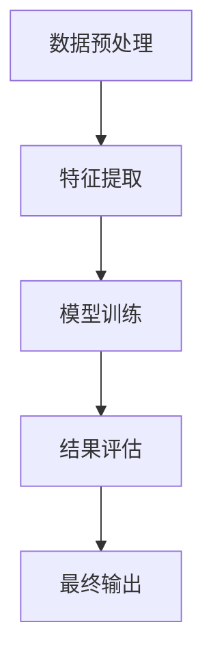

                 


# AI agents在公司无形资产价值评估中的创新应用

> 关键词：AI代理，无形资产，价值评估，算法原理，系统架构

> 摘要：本文探讨了AI代理在公司无形资产价值评估中的创新应用，通过详细分析AI代理的核心原理、算法实现、系统架构以及实际案例，展示了AI代理如何通过高效的数据处理和智能算法提升无形资产评估的准确性和效率。文章内容涵盖背景介绍、核心概念、算法原理、系统设计、项目实战等多个方面，为读者提供了全面的技术解读和实践指南。

---

# 第一部分: AI 代理在公司无形资产价值评估中的背景与基础

## 第1章: AI代理与无形资产评估概述

### 1.1 无形资产的基本概念

#### 1.1.1 无形资产的定义与分类

无形资产是指企业拥有或控制的，没有实物形态，但能够为企业带来长期经济利益的资源。常见的无形资产包括：

- **品牌价值**：品牌知名度和美誉度带来的市场价值。
- **专利与知识产权**：技术专利、商标、著作权等。
- **商誉**：企业并购时产生的商誉价值。
- **客户关系**：客户忠诚度和客户关系的价值。

#### 1.1.2 无形资产评估的难点与挑战

无形资产评估的难点在于其无形性和主观性：

- **数据不足**：无形资产的价值往往难以量化，缺乏直接的市场交易数据。
- **波动性**：市场环境的变化会影响无形资产的价值评估。
- **复杂性**：无形资产的评估需要考虑多种因素，如市场、技术、法律等。

#### 1.1.3 AI代理在无形资产评估中的潜在价值

AI代理通过数据挖掘、机器学习和自然语言处理等技术，可以高效地处理大量非结构化数据，为无形资产评估提供更准确、更客观的支持。

---

## 第2章: AI代理的核心原理与应用

### 2.1 AI代理的核心原理

AI代理是一种智能系统，能够感知环境、自主决策并执行任务。其核心原理包括：

- **感知**：通过数据采集、分析和理解环境信息。
- **决策**：基于感知信息，利用算法进行推理和判断。
- **执行**：根据决策结果，执行具体的操作。

### 2.2 AI代理与无形资产评估的结合

AI代理在无形资产评估中的应用主要体现在以下几个方面：

- **数据处理**：AI代理可以快速处理大量非结构化数据，如市场报告、新闻资讯等。
- **价值预测**：通过机器学习模型，预测无形资产的市场价值。
- **风险评估**：分析无形资产相关的风险因素，如法律风险、市场风险等。

---

## 第3章: 无形资产评估的传统方法与局限性

### 3.1 无形资产评估的传统方法

传统的无形资产评估方法主要包括以下三种：

1. **市场法**：通过市场交易数据进行比较分析。
2. **收益法**：通过预测未来收益折现计算价值。
3. **成本法**：通过估算重置成本进行评估。

### 3.2 传统方法的局限性

- **数据不足**：市场交易数据有限，难以准确评估。
- **主观性**：评估结果受到评估人员主观判断的影响。
- **效率低下**：传统方法需要大量人工参与，效率较低。

### 3.3 AI代理如何弥补传统方法的不足

AI代理通过自动化数据处理和智能算法，可以显著提高评估效率和准确性。例如：

- **自动化数据采集**：AI代理可以实时采集市场数据，构建动态评估模型。
- **智能预测**：利用机器学习模型，预测无形资产的未来价值。
- **风险预警**：通过实时监控，识别潜在风险并及时预警。

---

## 第4章: AI代理在无形资产评估中的核心概念与联系

### 4.1 AI代理的核心概念原理

AI代理在无形资产评估中的核心概念包括：

- **感知机制**：通过自然语言处理技术，分析市场报告、新闻资讯等非结构化数据。
- **决策机制**：利用机器学习算法，预测无形资产的市场价值。
- **执行机制**：根据评估结果，生成报告或触发相关操作。

### 4.2 无形资产评估的核心要素

无形资产评估的核心要素包括：

- **资产类型**：品牌、专利、商誉等。
- **市场环境**：市场供需、竞争状况等。
- **财务数据**：收入、利润等财务指标。

### 4.3 AI代理与无形资产评估的实体关系图

```mermaid
er
    entity 无形资产 {
        id
        名称
        类型
        价值
    }
    entity AI代理系统 {
        id
        功能模块
        输入数据
        输出结果
    }
    relationship 关联关系 {
        无形资产 --> AI代理系统: 输入评估数据
        AI代理系统 --> 无形资产: 输出评估结果
    }
```

---

## 第5章: AI代理在无形资产评估中的算法原理

### 5.1 算法原理概述

AI代理在无形资产评估中的算法原理主要包括以下步骤：

1. **数据预处理**：清洗和整理数据，提取特征。
2. **模型训练**：利用机器学习算法训练评估模型。
3. **结果评估**：验证模型的准确性和稳定性。

### 5.2 算法流程图



### 5.3 算法实现代码

以下是一个简单的AI代理算法实现代码示例：

```python
import pandas as pd
from sklearn.model

