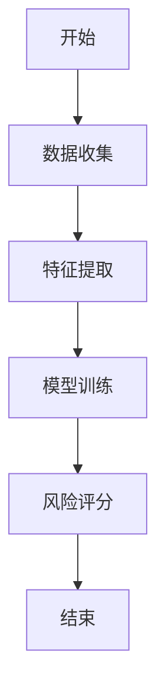
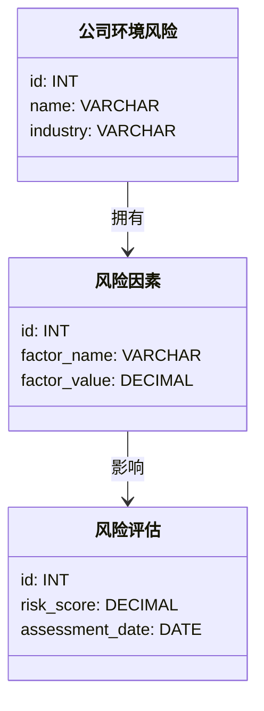
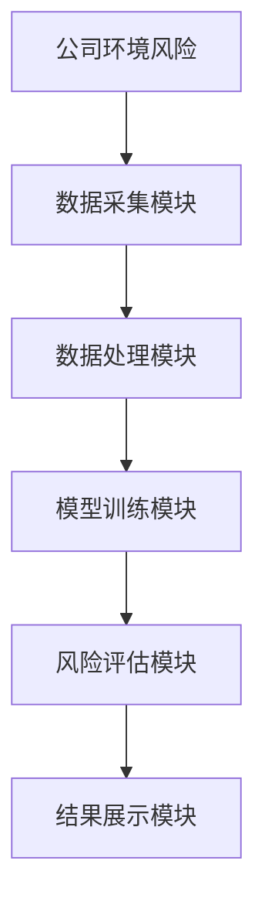
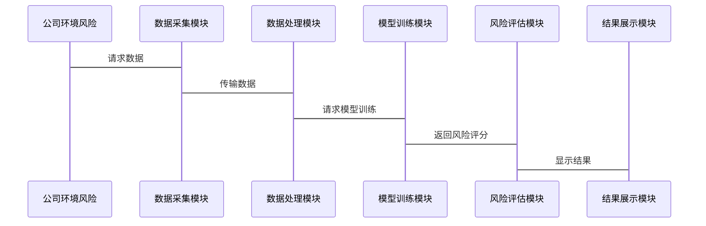

                 


# AI agents在公司环境风险暴露评估中的应用

> 关键词：AI代理, 环境风险, 暴露评估, 风险管理, 技术应用

> 摘要：本文探讨了AI代理在公司环境风险暴露评估中的应用，分析了其核心概念、算法原理、系统架构，并通过实际案例展示了其在风险管理中的优势。

---

## 第1章: 背景介绍

### 1.1 问题背景
#### 1.1.1 风险暴露评估的重要性
- 风险暴露评估是企业风险管理的核心环节。
- 通过评估潜在风险，企业可以制定有效的应对策略。

#### 1.1.2 AI代理在风险评估中的作用
- AI代理能够快速处理大量数据，提供实时风险评估。
- 利用机器学习算法，AI代理可以预测潜在风险。

#### 1.1.3 当前企业风险管理的挑战
- 数据量大、复杂性高，传统方法效率低下。
- 风险因素多样，难以全面覆盖。

### 1.2 问题描述
#### 1.2.1 风险暴露的定义与分类
- 风险暴露是企业在特定环境下的潜在损失。
- 分为财务风险、操作风险、声誉风险等。

#### 1.2.2 公司环境中的风险来源
- 市场波动、政策变化、内部操作失误等。

#### 1.2.3 风险暴露评估的复杂性
- 多因素影响，难以量化。
- 需要实时监控和动态评估。

### 1.3 问题解决
#### 1.3.1 AI代理在风险评估中的优势
- 高效的数据处理能力。
- 实时监控和预测能力。

#### 1.3.2 数据驱动的风险评估方法
- 利用大数据分析，提取风险因素。
- 通过机器学习模型进行预测。

#### 1.3.3 AI代理如何优化风险暴露评估
- 自动化数据采集和分析。
- 提供实时反馈和建议。

### 1.4 边界与外延
#### 1.4.1 风险暴露评估的边界条件
- 限定于公司内部环境。
- 数据范围和时间范围的限制。

#### 1.4.2 AI代理应用的适用范围
- 适用于数据量大、动态变化快的环境。
- 适合需要实时监控的场景。

#### 1.4.3 与其他风险管理方法的区别
- AI代理结合了数据分析和实时监控。
- 传统方法依赖人工分析和静态评估。

### 1.5 核心概念与要素
#### 1.5.1 风险暴露评估的核心要素
- 数据源、评估模型、风险指标。

#### 1.5.2 AI代理的关键属性
- 数据处理能力、学习能力、实时性。

#### 1.5.3 评估模型的输入与输出
- 输入：历史数据、实时数据。
- 输出：风险评分、预警信息。

---

## 第2章: 核心概念与联系

### 2.1 AI代理的基本原理
#### 2.1.1 AI代理的定义与分类
- 定义：AI代理是一种能够感知环境并采取行动的智能体。
- 分类：基于任务类型，分为监视型、决策型等。

#### 2.1.2 AI代理的核心算法
- 机器学习算法：如随机森林、神经网络。
- 自然语言处理：用于文本分析。

#### 2.1.3 AI代理与传统代理的区别
- 传统代理基于规则，AI代理基于学习。
- 传统代理无法适应变化，AI代理能够动态调整。

### 2.2 环境风险暴露评估的核心概念
#### 2.2.1 风险暴露的评估指标
- 风险评分、概率、影响程度。

#### 2.2.2 风险暴露的评估方法
- 定性评估、定量评估、混合评估。

#### 2.2.3 风险暴露的评估模型
- 统计模型、机器学习模型、混合模型。

### 2.3 AI代理与环境风险暴露评估的联系
#### 2.3.1 AI代理如何辅助风险评估
- 数据收集与预处理。
- 模型训练与预测。

#### 2.3.2 AI代理在风险暴露评估中的优势
- 高效性、准确性、实时性。

#### 2.3.3 AI代理与传统风险评估方法的对比
- 效率：AI代理更快。
- 准确性：AI代理更精准。

### 2.4 核心概念属性特征对比
| **属性**       | **AI代理**           | **传统方法**          |
|------------------|----------------------|-----------------------|
| 数据处理能力    | 强大                 | 较弱                  |
| 学习能力        | 具备                 | 无                    |
| 实时性          | 高                   | 低                    |
| 精准度          | 高                   | 中                    |
| 可扩展性        | 高                   | 低                    |

### 2.5 ER实体关系图
```mermaid
erDiagram
    actor 公司环境风险
    company_info {
        id INT
        name VARCHAR
        industry VARCHAR
    }
    risk_assessment {
        id INT
        risk_score DECIMAL
        assessment_date DATE
    }
    risk_factors {
        id INT
        factor_name VARCHAR
        factor_value DECIMAL
    }
    company_info -> risk_factors : 拥有
    risk_factors -> risk_assessment : 影响
```

---

## 第3章: 算法原理讲解

### 3.1 算法原理概述
#### 3.1.1 状态评估算法
- 定义：用于评估当前风险状态。
- 算法步骤：数据收集、特征提取、模型训练、风险评分。

#### 3.1.2 风险评分模型
- 使用机器学习模型（如XGBoost）进行预测。
- 模型输入：历史数据、实时数据。
- 输出：风险评分。

### 3.2 算法流程图


### 3.3 算法实现代码
```python
import pandas as pd
from sklearn.ensemble import GradientBoostingClassifier

# 数据加载
data = pd.read_csv('risk_factors.csv')

# 特征工程
features = data.drop('label', axis=1)
labels = data['label']

# 模型训练
model = GradientBoostingClassifier()
model.fit(features, labels)

# 预测风险
new_data = pd.read_csv('new_risk_factors.csv')
predictions = model.predict(new_data)
```

### 3.4 数学模型与公式
- 风险评分公式：
  $$ \text{风险评分} = \sum (\text{权重} \times \text{特征值}) $$

---

## 第4章: 系统分析与架构设计

### 4.1 项目介绍
#### 4.1.1 项目背景
- 开发一个基于AI代理的风险评估系统。

### 4.2 系统功能设计
#### 4.2.1 领域模型


#### 4.2.2 系统架构


#### 4.2.3 接口设计
- 数据接口：REST API。
- 模型接口：函数调用。

#### 4.2.4 交互序列图


---

## 第5章: 项目实战

### 5.1 环境安装
#### 5.1.1 安装Python
- 使用Anaconda安装Python 3.8+。

#### 5.1.2 安装依赖库
- 使用pip安装pandas、scikit-learn等。

### 5.2 核心功能实现
#### 5.2.1 数据预处理
```python
import pandas as pd

data = pd.read_csv('risk_factors.csv')
data = data.dropna()
```

#### 5.2.2 模型训练
```python
from sklearn.ensemble import GradientBoostingClassifier

model = GradientBoostingClassifier()
model.fit(X_train, y_train)
```

#### 5.2.3 风险评估
```python
predictions = model.predict(X_test)
```

### 5.3 案例分析
#### 5.3.1 案例背景
- 某公司面临市场波动风险。

#### 5.3.2 数据分析
- 历史数据：市场波动、财务指标。
- 预测结果：风险评分95分。

#### 5.3.3 实施方案
- 优化供应链管理。
- 增加应急储备资金。

---

## 第6章: 最佳实践

### 6.1 小结
- AI代理在风险评估中的优势明显。
- 数据质量和模型选择是关键。

### 6.2 注意事项
- 数据隐私保护。
- 模型的可解释性。

### 6.3 拓展阅读
- 推荐书籍：《机器学习实战》。
- 推荐论文：《基于AI的金融风险管理》。

---

## 作者：AI天才研究院 & 禅与计算机程序设计艺术

---

**摘要**：本文详细探讨了AI代理在公司环境风险暴露评估中的应用，从核心概念到算法实现，再到系统架构和项目实战，全面展示了其在风险管理中的重要性。通过实际案例分析，进一步验证了AI代理在优化风险评估过程中的巨大潜力。

---

**结语**：随着AI技术的不断发展，AI代理在风险管理中的应用将越来越广泛。企业需要充分利用AI技术，提升自身的风险应对能力，确保在复杂多变的商业环境中立于不败之地。

