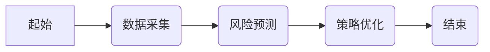
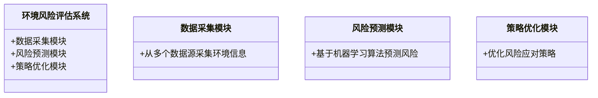
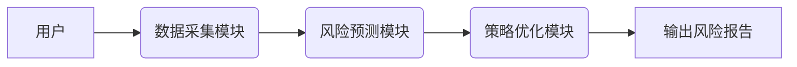
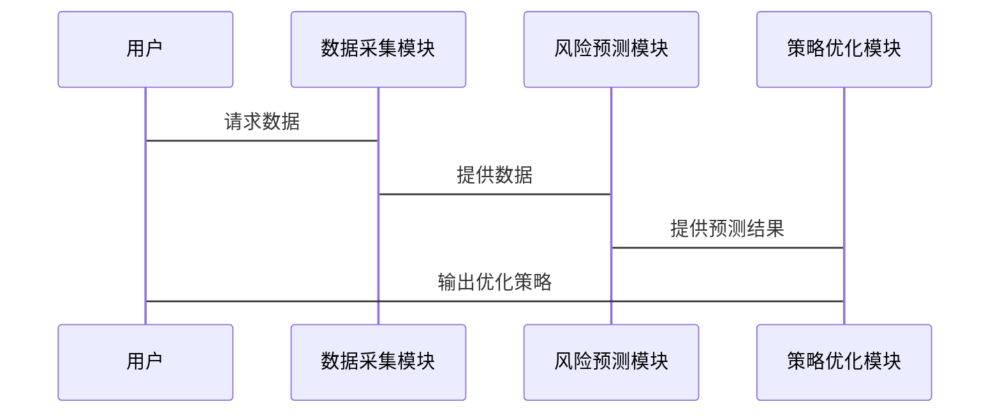

                 


# AI agents在公司环境风险评估中的应用

> 关键词：AI Agent, 环境风险评估, 多智能体协同算法, 系统架构设计, 项目实战

> 摘要：本文探讨了AI Agent在公司环境风险评估中的应用，从背景介绍、核心概念、算法原理、系统架构设计到项目实战，全面分析了AI Agent在环境风险评估中的价值和实现方式。通过详细的技术分析和实际案例，本文展示了如何利用AI Agent优化公司环境风险管理流程，提升风险预测和应对能力。

---

# 第1章: AI Agent与环境风险评估的背景介绍

## 1.1 AI Agent的基本概念

### 1.1.1 AI Agent的定义

AI Agent（人工智能代理）是一种能够感知环境、自主决策并执行任务的智能实体。它能够根据输入的信息做出反应，通过学习和优化不断改进自身的行为模式。AI Agent的核心在于其智能性，它能够处理复杂问题并提供解决方案。

### 1.1.2 AI Agent的核心特征

1. **自主性**：AI Agent能够在没有外部干预的情况下自主运行。
2. **反应性**：能够实时感知环境变化并做出反应。
3. **学习能力**：通过数据和经验不断优化自身算法。
4. **协作性**：能够与其他AI Agent或系统协同工作。

### 1.1.3 AI Agent与传统算法的区别

传统算法通常基于固定的规则和逻辑进行计算，而AI Agent具备自主性和学习能力，能够在复杂环境中动态调整策略。例如，传统算法用于简单的数据分类，而AI Agent可以动态调整分类策略以应对环境变化。

## 1.2 公司环境风险评估的定义

### 1.2.1 环境风险评估的范围

环境风险评估是指对公司内部和外部环境中的潜在风险进行识别、分析和评估的过程。这些风险可能来自市场波动、政策变化、技术故障、自然灾害等多个方面。

### 1.2.2 环境风险评估的方法

常见的环境风险评估方法包括定性分析、定量分析和混合分析。定性分析侧重于风险的性质和影响，定量分析则通过数据和模型计算风险的具体概率和损失。混合分析则是两者的结合。

### 1.2.3 环境风险评估的意义

环境风险评估是企业风险管理的重要组成部分，能够帮助企业提前识别潜在风险，制定应对策略，减少损失，提高企业的抗风险能力。

## 1.3 AI Agent在环境风险评估中的应用价值

### 1.3.1 提高风险评估效率

AI Agent能够快速处理大量数据，显著提高风险评估的效率。例如，通过自然语言处理技术，AI Agent可以快速分析大量文档，识别潜在风险点。

### 1.3.2 增强风险预测准确性

AI Agent基于机器学习算法，能够从历史数据中学习，预测未来风险的可能性。通过不断优化模型，AI Agent可以提供更准确的风险预测。

### 1.3.3 优化风险应对策略

AI Agent不仅能够识别风险，还能够根据风险的性质和影响程度，提出最优的应对策略。例如，当预测到市场波动风险时，AI Agent可以建议调整投资组合以降低风险。

## 1.4 本章小结

本章介绍了AI Agent的基本概念及其在环境风险评估中的应用价值。通过对比传统算法和AI Agent的特点，强调了AI Agent在提高效率、增强预测准确性以及优化应对策略方面的重要作用。

---

# 第2章: AI Agent与环境风险评估的核心概念与联系

## 2.1 AI Agent的核心原理

### 2.1.1 AI Agent的感知模块

感知模块是AI Agent获取环境信息的关键部分。它通过传感器或数据接口收集外部信息，并将其转化为可处理的数据。例如，AI Agent可以通过网络爬虫获取市场数据。

### 2.1.2 AI Agent的决策模块

决策模块基于感知模块提供的信息，结合预设的目标和规则，生成决策方案。决策模块通常采用强化学习或监督学习算法，通过不断优化策略来提高决策的准确性。

### 2.1.3 AI Agent的执行模块

执行模块负责将决策模块生成的决策转化为具体行动。例如，AI Agent可以自动执行交易指令或触发预警机制。

## 2.2 环境风险评估的核心要素

### 2.2.1 风险源识别

风险源识别是环境风险评估的第一步，需要识别所有可能影响公司环境的因素。例如，市场波动、政策变化、技术故障等。

### 2.2.2 风险影响分析

风险影响分析是对每个风险源可能带来的影响进行评估，包括损失的大小、影响的范围和持续时间等。

### 2.2.3 风险应对策略

根据风险评估结果，制定相应的应对策略，例如分散投资、购买保险、优化供应链等。

## 2.3 AI Agent与环境风险评估的结合点

### 2.3.1 数据采集与处理

AI Agent能够从多个数据源采集环境信息，并通过数据清洗、特征提取等技术进行处理，为风险评估提供高质量的数据支持。

### 2.3.2 风险预测与评估

AI Agent通过机器学习算法，对历史数据进行建模，预测未来可能的风险，并评估其影响程度。

### 2.3.3 风险应对与优化

AI Agent根据预测结果，优化风险应对策略，例如动态调整投资组合或优化供应链布局。

## 2.4 核心概念对比表格

| 概念 | 传统环境风险评估 | AI Agent驱动的环境风险评估 |
|------|------------------|---------------------------|
| 数据采集 | 手动收集，效率低 | 自动采集，高效准确 |
| 风险预测 | 基于经验判断，准确性低 | 基于机器学习，准确性高 |
| 风险应对 | 策略固定，适应性差 | 动态优化，适应性强 |

---

# 第3章: AI Agent在环境风险评估中的算法原理

## 3.1 多智能体协同算法

### 3.1.1 多智能体协同算法的定义

多智能体协同算法是指多个AI Agent协同工作，共同完成复杂任务的算法。例如，在公司环境风险评估中，多个AI Agent可以分别负责数据采集、风险预测和策略优化。

### 3.1.2 多智能体协同算法的流程图



### 3.1.3 多智能体协同算法的数学模型

多智能体协同算法的核心是通过分布式计算和协作学习来优化整体性能。数学模型如下：

$$
\text{损失函数} = \sum_{i=1}^{n} (y_i - \hat{y}_i)^2
$$

其中，$y_i$ 是实际值，$\hat{y}_i$ 是预测值，$n$ 是数据点的数量。

### 3.1.4 多智能体协同算法的Python代码示例

```python
import numpy as np
from sklearn import linear_model

# 示例数据
X = np.array([[1], [2], [3], [4], [5]])
y = np.array([2, 4, 5, 4, 7])

# 训练模型
model = linear_model.LinearRegression()
model.fit(X, y)

# 预测
print(model.predict(np.array([[6]])))
```

---

# 第4章: 环境风险评估系统架构设计

## 4.1 问题场景介绍

本章将介绍一个公司环境风险评估系统的设计，该系统利用AI Agent技术，实现对市场波动、政策变化等风险的实时监测和预测。

## 4.2 系统功能设计

### 4.2.1 领域模型



### 4.2.2 系统架构设计



### 4.2.3 系统接口设计

系统接口主要分为数据接口和用户接口。数据接口用于与外部数据源交互，用户接口用于展示风险报告和优化策略。

### 4.2.4 系统交互流程



---

# 第5章: 项目实战

## 5.1 环境安装

为了运行本项目，需要安装以下Python库：

```bash
pip install numpy scikit-learn matplotlib
```

## 5.2 系统核心实现源代码

```python
import numpy as np
from sklearn import linear_model

# 数据采集模块
def collect_data():
    return np.array([[1], [2], [3], [4], [5]]), np.array([2, 4, 5, 4, 7])

# 风险预测模块
def predict_risk(X, y):
    model = linear_model.LinearRegression()
    model.fit(X, y)
    return model

# 策略优化模块
def optimize_strategy(model):
    print("优化策略：", model.predict(np.array([[6]])))

# 主程序
if __name__ == "__main__":
    X, y = collect_data()
    model = predict_risk(X, y)
    optimize_strategy(model)
```

## 5.3 代码应用解读与分析

上述代码展示了如何利用Python和机器学习库实现一个简单的环境风险评估系统。数据采集模块从给定的数据源中获取数据，风险预测模块使用线性回归算法进行预测，策略优化模块根据预测结果优化应对策略。

## 5.4 实际案例分析

假设我们有一个市场波动数据集，包含过去5年的市场指数和波动率。通过上述代码，我们可以训练一个线性回归模型，预测未来市场的波动情况，并根据预测结果优化投资策略。

## 5.5 项目小结

本章通过实际案例展示了AI Agent在环境风险评估中的具体应用。通过代码实现，读者可以理解如何将理论应用于实际项目。

---

# 第6章: 最佳实践与总结

## 6.1 小结

本文详细介绍了AI Agent在公司环境风险评估中的应用，从背景介绍、核心概念、算法原理到系统架构设计和项目实战，全面分析了AI Agent在环境风险评估中的价值和实现方式。

## 6.2 注意事项

在实际应用中，需要注意数据的质量和模型的可解释性。此外，还需要定期更新模型以适应环境的变化。

## 6.3 未来发展趋势

未来，随着AI技术的不断发展，AI Agent在环境风险评估中的应用将更加广泛和深入。例如，结合边缘计算和物联网技术，可以实现更实时的风险监测和预测。

## 6.4 拓展阅读

推荐阅读以下书籍和论文：

1. 《机器学习实战》
2. 《深度学习》
3. "Multi-Agent Reinforcement Learning: A Survey" (2020)

---

# 作者：AI天才研究院 & 禅与计算机程序设计艺术

