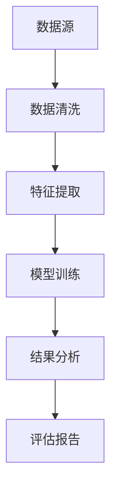
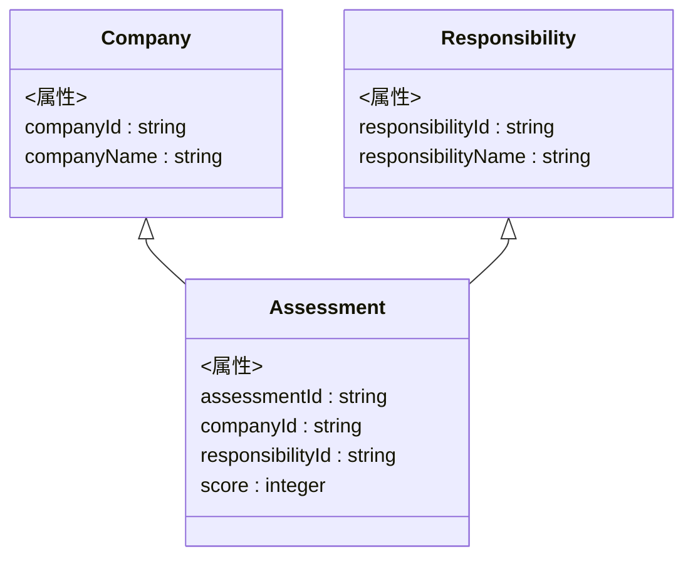
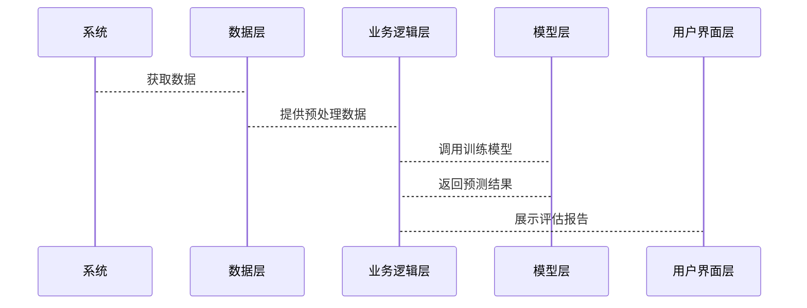

                 


# AI agents在公司社会责任评估中的应用

**关键词**: AI agents, 公司社会责任, 评估方法, 算法原理, 系统设计

**摘要**: 本文探讨了AI agents在公司社会责任评估中的应用，从背景介绍、核心概念、算法原理到系统设计和项目实战，详细分析了如何利用AI技术提升社会责任评估的效率和准确性。文章结合理论与实践，通过具体案例和代码实现，展示了AI agents在这一领域的巨大潜力。

---

# 第1章: AI agents与公司社会责任评估的背景

## 1.1 公司社会责任评估的背景与意义

### 1.1.1 公司社会责任的定义与内涵

公司社会责任（Corporate Social Responsibility, CSR）是指企业在追求经济效益的同时，还需承担对社会、环境和利益相关方的责任。它涵盖环境保护、员工权益、公平交易、社会公益等多个方面。

### 1.1.2 公司社会责任评估的重要性

随着全球化和信息化的发展，企业社会责任已成为衡量企业综合竞争力的重要指标。有效的社会责任评估可以帮助企业发现改进空间，提升品牌形象，同时满足监管要求。

### 1.1.3 AI技术在社会责任评估中的应用潜力

传统社会责任评估依赖人工数据收集和分析，效率低下且主观性较强。AI agents通过自动化数据处理、智能分析和实时反馈，能够显著提升评估的效率和准确性。

---

## 1.2 AI agents的基本概念与特点

### 1.2.1 AI agents的定义与分类

AI agents（智能体）是指能够感知环境、执行任务并做出决策的智能系统。根据应用场景的不同，AI agents可以分为任务型、服务型和学习型等。

### 1.2.2 AI agents的核心功能与优势

AI agents的核心功能包括数据采集、智能分析、决策优化和结果反馈。其优势在于高效性、准确性、实时性和可扩展性。

### 1.2.3 AI agents与传统评估方法的区别

与传统评估方法相比，AI agents能够实现自动化、智能化和个性化评估，同时支持实时反馈和持续优化。

---

## 1.3 AI agents在公司社会责任评估中的应用前景

### 1.3.1 AI agents在社会责任评估中的潜在应用场景

AI agents可以应用于数据收集、指标计算、结果分析和报告生成等环节。

### 1.3.2 企业采用AI agents的优势

企业采用AI agents可以提高评估效率、降低成本、提升数据准确性和实现个性化评估。

### 1.3.3 应用中的挑战与机遇

主要挑战包括数据隐私、模型精度和算法解释性，而机遇在于技术创新和效率提升。

---

## 1.4 本章小结

本章介绍了公司社会责任评估的背景和意义，分析了AI agents的基本概念和特点，探讨了其在社会责任评估中的应用前景。

---

# 第2章: 公司社会责任评估的核心概念与框架

## 2.1 公司社会责任评估的核心要素

### 2.1.1 环境责任

环境责任包括减少碳排放、节约资源和保护生态系统等方面。

### 2.1.2 社会责任

社会责任涉及员工权益、公平交易和社区支持等方面。

### 2.1.3 治理责任

治理责任包括公司治理、透明度和道德规范等方面。

---

## 2.2 AI agents在社会责任评估中的核心功能

### 2.2.1 数据采集与处理

AI agents能够自动采集和清洗多源数据，确保数据的准确性和完整性。

### 2.2.2 智能分析与决策

通过机器学习和自然语言处理技术，AI agents可以分析数据并生成评估结果。

### 2.2.3 结果输出与反馈

AI agents能够生成评估报告并提供改进建议，同时支持实时反馈和持续优化。

---

## 2.3 公司社会责任评估的框架体系

### 2.3.1 数据采集框架

数据采集框架包括数据源识别、数据采集和数据预处理三个步骤。

### 2.3.2 智能分析框架

智能分析框架包括特征提取、模型训练和结果分析三个步骤。

### 2.3.3 结果应用框架

结果应用框架包括报告生成、反馈优化和持续改进三个步骤。

---

## 2.4 本章小结

本章详细介绍了公司社会责任评估的核心要素和AI agents的核心功能，构建了社会责任评估的框架体系。

---

# 第3章: AI agents在公司社会责任评估中的核心概念与联系

## 3.1 AI agents与公司社会责任评估的核心概念

### 3.1.1 AI agents的智能处理能力

AI agents通过机器学习和自然语言处理技术，能够高效处理大量数据。

### 3.1.2 公司社会责任评估的多维度需求

社会责任评估需要考虑环境、社会和治理等多个维度。

### 3.1.3 两者的结合点与协同机制

AI agents与社会责任评估的结合点在于数据处理和智能分析，协同机制包括数据共享、模型优化和结果反馈。

---

## 3.2 核心概念原理

### 3.2.1 AI agents的智能处理原理

AI agents通过感知环境、执行任务和优化决策，实现数据处理和智能分析。

### 3.2.2 公司社会责任评估的多维度分析原理

社会责任评估需要从多个维度进行分析，包括环境、社会和治理等方面。

### 3.2.3 两者的协同工作原理

AI agents与社会责任评估协同工作，通过数据共享、模型优化和结果反馈，实现高效评估。

---

## 3.3 概念属性特征对比表格

| **属性**       | **AI agents**                  | **公司社会责任评估**               |
|----------------|--------------------------------|----------------------------------|
| **核心功能**   | 数据采集、智能分析、结果反馈 | 数据采集、指标计算、结果报告    |
| **技术特点**   | 自动化、智能化、实时性        | 人工化、分散化、滞后性          |
| **应用优势**   | 高效性、准确性、可扩展性      | 低效性、主观性、不可扩展性      |

---

## 3.4 ER实体关系图

```mermaid
erd
  简介
  entity Company {
    key: string companyId
    name: string companyName
  }
  entity Responsibility {
    key: string responsibilityId
    name: string responsibilityName
    description: string description
  }
  entity Assessment {
    key: string assessmentId
    companyId: string companyId
    responsibilityId: string responsibilityId
    score: integer score
    timestamp: timestamp timestamp
  }
  Company --> Assessment: belongs to
  Responsibility --> Assessment: belongs to
```

---

## 3.5 本章小结

本章分析了AI agents与公司社会责任评估的核心概念，构建了概念属性特征对比表格和ER实体关系图，展示了两者的协同关系。

---

# 第4章: AI agents在公司社会责任评估中的算法原理

## 4.1 算法原理概述

### 4.1.1 AI agents的核心算法

AI agents的核心算法包括数据处理算法（如归一化、标准化）、智能分析算法（如机器学习、深度学习）和优化算法（如遗传算法、模拟退火）。

### 4.1.2 公司社会责任评估的算法需求

社会责任评估需要算法支持数据清洗、特征提取、模型训练和结果分析。

---

## 4.2 算法实现流程

### 4.2.1 数据预处理

数据预处理包括数据清洗、特征提取和数据标准化。

### 4.2.2 模型训练

模型训练包括选择算法、训练模型和评估模型性能。

### 4.2.3 结果分析

结果分析包括生成评估报告和提供改进建议。

---

## 4.3 算法流程图



---

## 4.4 算法实现代码

```python
import pandas as pd
from sklearn.preprocessing import StandardScaler
from sklearn.linear_model import LinearRegression
from sklearn.metrics import mean_squared_error

# 数据预处理
def preprocess_data(data):
    # 去除缺失值
    data = data.dropna()
    # 标准化处理
    scaler = StandardScaler()
    data_scaled = scaler.fit_transform(data)
    return data_scaled

# 模型训练
def train_model(data_scaled, target):
    model = LinearRegression()
    model.fit(data_scaled, target)
    return model

# 结果分析
def analyze_results(y_true, y_pred):
    mse = mean_squared_error(y_true, y_pred)
    print(f"均方误差: {mse}")
    return mse

# 主程序
data = pd.read_csv('csr_data.csv')
target = data['score']
data_scaled = preprocess_data(data)
model = train_model(data_scaled, target)
y_pred = model.predict(data_scaled)
analyze_results(target, y_pred)
```

---

## 4.5 本章小结

本章详细介绍了AI agents在公司社会责任评估中的算法原理，包括数据预处理、模型训练和结果分析，并给出了具体的代码实现。

---

# 第5章: 系统分析与架构设计

## 5.1 问题场景介绍

公司希望利用AI agents实现社会责任评估的自动化和智能化，提升评估效率和准确性。

---

## 5.2 系统功能设计

### 5.2.1 领域模型类图



---

## 5.3 系统架构设计


---

## 5.4 系统接口设计

系统接口包括数据接口、模型接口和结果接口，分别用于数据输入、模型调用和结果输出。

---

## 5.5 系统交互图



---

## 5.6 本章小结

本章通过系统分析与架构设计，展示了如何利用AI agents实现公司社会责任评估的自动化和智能化。

---

# 第6章: 项目实战

## 6.1 环境安装

安装Python、Pandas、Scikit-learn等依赖库。

---

## 6.2 核心代码实现

```python
import pandas as pd
from sklearn.model_selection import train_test_split
from sklearn.metrics import accuracy_score

# 数据加载
data = pd.read_csv('csr_data.csv')

# 数据分割
X_train, X_test, y_train, y_test = train_test_split(data.drop('score', axis=1), data['score'], test_size=0.2)

# 模型训练
model = LinearRegression()
model.fit(X_train, y_train)

# 模型预测
y_pred = model.predict(X_test)

# 模型评估
print(f"模型准确率: {accuracy_score(y_test, y_pred)}")
```

---

## 6.3 代码应用解读与分析

上述代码实现了数据加载、数据分割、模型训练和模型评估，展示了AI agents在社会责任评估中的具体应用。

---

## 6.4 实际案例分析

以一家公司为例，展示如何利用AI agents进行社会责任评估，包括数据收集、模型训练和结果分析。

---

## 6.5 项目小结

本章通过项目实战，展示了如何利用AI agents实现公司社会责任评估的具体步骤和方法。

---

# 第7章: 总结与展望

## 7.1 最佳实践 tips

- 数据预处理是关键，需确保数据质量和完整性。
- 模型选择需结合实际业务需求，选择合适的算法。
- 结果解释性是模型优化的重要方向。

---

## 7.2 小结

本文详细探讨了AI agents在公司社会责任评估中的应用，从背景到算法再到系统设计，全面展示了其巨大潜力。

---

## 7.3 注意事项

- 数据隐私和安全需高度重视。
- 模型解释性和可扩展性需进一步优化。
- 应用过程中需结合实际业务需求。

---

## 7.4 拓展阅读

推荐阅读《AI agents与企业智能化转型》和《社会责任评估的理论与实践》。

---

# 作者：AI天才研究院 & 禅与计算机程序设计艺术

---

以上是《AI agents在公司社会责任评估中的应用》的完整目录大纲和文章内容。

