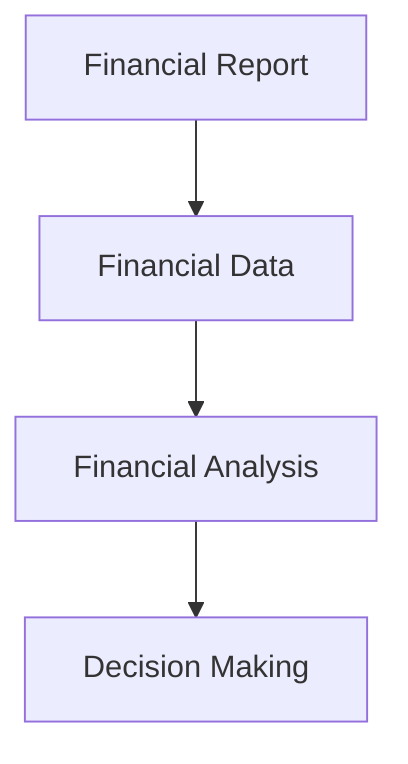
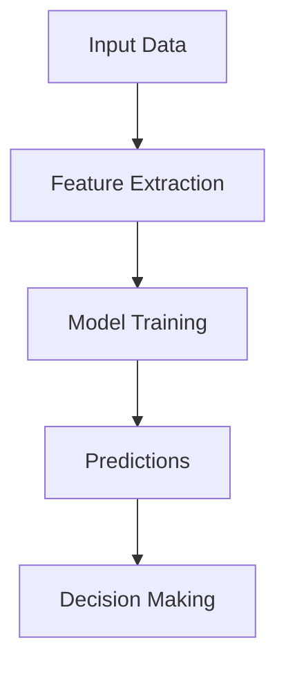
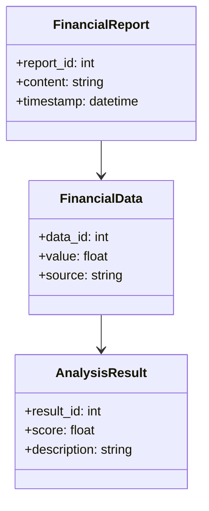
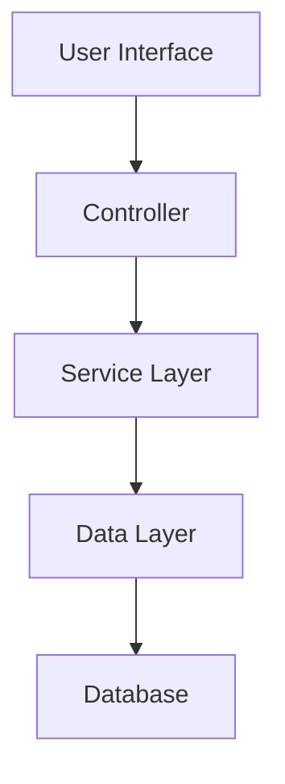
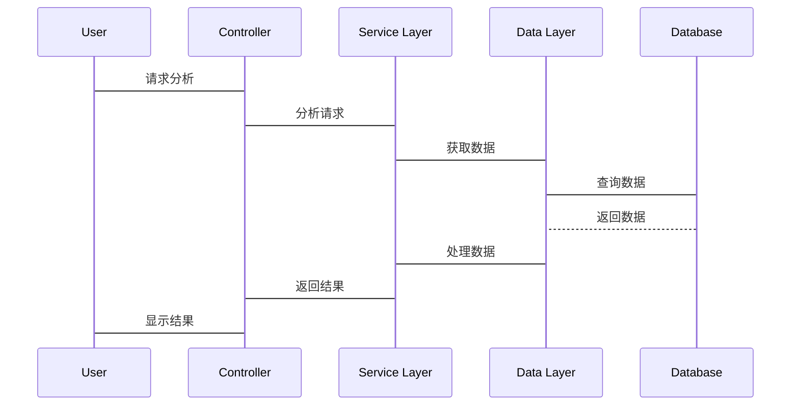

                 


# AI 代理在公司财务报表分析中的应用

> 关键词：AI 代理，财务报表分析，自然语言处理，机器学习，深度学习

> 摘要：本文探讨了AI代理在公司财务报表分析中的应用，详细分析了AI代理的基本概念、核心算法原理及系统架构设计，结合实际案例，展示了AI代理如何提升财务分析的效率和准确性。文章还总结了最佳实践和未来发展方向。

---

# 第一部分：AI 代理与财务报表分析的背景与基础

## 第1章：AI 代理与财务报表分析的背景

### 1.1 AI 代理的基本概念

#### 1.1.1 代理的定义与特点
- **代理（Agent）**：能够感知环境并采取行动以实现目标的实体。
- **特点**：
  - **自主性**：能够在没有外部干预的情况下运行。
  - **反应性**：能够根据环境变化调整行为。
  - **社会性**：能够与其他代理或人类交互协作。

#### 1.1.2 AI 代理的核心技术
- **自然语言处理（NLP）**：用于处理财务报告中的文本数据。
- **机器学习（ML）**：用于模式识别和预测。
- **强化学习（RL）**：用于优化决策过程。

#### 1.1.3 AI 代理在企业中的应用价值
- **提高效率**：自动化处理大量财务数据。
- **增强准确性**：减少人为错误。
- **实时监控**：及时发现财务异常。

### 1.2 财务报表分析的基本原理

#### 1.2.1 财务报表的主要组成部分
- **资产负债表**：展示企业在某一特定日期的财务状况。
- **利润表**：展示企业在一定会计期间的经营成果。
- **现金流量表**：展示企业在一定会计期间的现金流入和流出情况。

#### 1.2.2 财务报表分析的常见方法
- **比率分析**：通过计算各项财务比率来评估企业财务状况。
- **趋势分析**：分析财务数据的变化趋势。
- **行业比较**：将企业财务数据与行业平均水平进行比较。

#### 1.2.3 财务报表分析的挑战与痛点
- **数据复杂性**：财务报表涉及大量数据，人工分析耗时耗力。
- **信息不完整**：数据可能存在缺失或不准确的情况。
- **主观性**：财务分析结果受到分析师主观判断的影响。

### 1.3 AI 代理在财务报表分析中的应用前景

#### 1.3.1 传统财务报表分析的局限性
- **效率低下**：人工分析速度慢，容易出错。
- **主观性**：依赖分析师的经验和判断。
- **缺乏实时性**：无法实时监控财务数据。

#### 1.3.2 AI 代理在财务分析中的优势
- **高效性**：能够快速处理大量数据。
- **准确性**：减少人为错误，提高分析结果的准确性。
- **实时性**：可以实时监控财务数据，及时发现异常。

#### 1.3.3 未来发展趋势与潜在价值
- **智能化**：AI代理将更加智能化，能够自主学习和优化。
- **集成化**：AI代理将与企业管理系统集成，实现无缝对接。
- **行业应用**：AI代理将在金融、会计等行业得到广泛应用。

### 1.4 本章小结
本章介绍了AI代理的基本概念及其在财务报表分析中的应用前景，分析了传统财务报表分析的局限性以及AI代理的优势，为后续章节的深入探讨奠定了基础。

---

## 第2章：AI 代理与财务报表分析的核心概念

### 2.1 AI 代理的感知模块

#### 2.1.1 数据采集与处理
- **数据来源**：财务报表数据、行业报告、市场数据等。
- **数据清洗**：去除无效数据，处理缺失值。
- **数据转换**：将文本数据转换为结构化数据。

#### 2.1.2 自然语言处理在财务文本中的应用
- **关键词提取**：提取财务报告中的关键信息。
- **情感分析**：分析财务报告中的情感倾向。
- **文本摘要**：生成财务报告的摘要。

#### 2.1.3 数据特征提取方法
- **文本特征**：TF-IDF、Word2Vec。
- **数值特征**：均值、方差、趋势。

### 2.2 AI 代理的决策模块

#### 2.2.1 基于机器学习的财务指标预测
- **线性回归**：用于预测财务指标的趋势。
- **支持向量机（SVM）**：用于分类问题。
- **随机森林**：用于特征重要性分析。

#### 2.2.2 基于规则的财务分析决策
- **财务比率分析**：如ROE（净资产收益率）、毛利率。
- **行业基准比较**：将企业财务数据与行业平均水平进行比较。

#### 2.2.3 混合型决策模型
- **集成学习**：结合多种算法的结果，提高准确性。

### 2.3 AI 代理的执行模块

#### 2.3.1 自动化财务报告生成
- **模板化生成**：根据分析结果自动生成财务报告。
- **个性化定制**：根据用户需求生成定制化报告。

#### 2.3.2 智能化财务预警系统
- **异常检测**：实时监控财务数据，发现异常情况。
- **风险评估**：评估财务风险，提供预警信息。

#### 2.3.3 自动化财务决策支持
- **投资决策**：基于财务数据提供投资建议。
- **融资决策**：优化企业融资方案。

### 2.4 核心概念对比分析

#### 2.4.1 概念属性对比表
| 概念         | 特性               |
|--------------|--------------------|
| 数据采集     | 来源多样，需清洗处理 |
| 自然语言处理 | 用于文本分析       |
| 机器学习     | 用于预测和分类       |

#### 2.4.2 ER 实体关系图


### 2.5 本章小结
本章详细介绍了AI代理在财务报表分析中的核心模块，包括感知、决策和执行模块，并通过对比分析和实体关系图展示了各模块之间的关系。

---

## 第3章：AI 代理在财务报表分析中的算法原理

### 3.1 基于深度学习的自然语言处理模型

#### 3.1.1 BERT 模型在财务文本分析中的应用
- **BERT模型**：基于Transformer的预训练语言模型。
- **应用**：用于财务文本的语义理解、实体识别。

#### 3.1.2 GPT 模型的文本生成能力
- **GPT模型**：用于生成财务报告摘要、预测财务文本。

#### 3.1.3 模型训练与微调策略
- **预训练**：在大规模通用文本上进行预训练。
- **微调**：在特定财务文本上进行微调，提高模型的领域适应性。

### 3.2 基于机器学习的财务预测算法

#### 3.2.1 线性回归模型
- **公式**：$$ y = \beta_0 + \beta_1 x + \epsilon $$
- **应用**：用于预测财务指标的趋势。

#### 3.2.2 支持向量机（SVM）
- **原理**：通过构建超平面将数据分成不同类别。
- **应用**：用于财务数据的分类问题。

#### 3.2.3 随机森林与梯度提升树
- **随机森林**：通过随机采样构建多棵决策树，取其平均值。
- **梯度提升树**：通过不断优化损失函数构建决策树。

### 3.3 基于强化学习的财务决策优化

#### 3.3.1 强化学习的基本原理
- **定义**：通过试错的方式，学习最优策略。
- **应用**：用于优化财务决策过程。

#### 3.3.2 财务决策场景中的状态与动作空间
- **状态**：当前的财务数据和市场环境。
- **动作**：可能的财务决策，如买入、卖出股票。

#### 3.3.3 奖励函数设计与优化
- **奖励函数**：根据决策结果给予奖励或惩罚。
- **优化目标**：最大化累积奖励。

### 3.4 算法实现流程图


### 3.5 本章小结
本章详细介绍了AI代理在财务报表分析中使用的各种算法，包括自然语言处理模型、机器学习算法和强化学习方法，并通过流程图展示了算法实现的流程。

---

## 第4章：AI 代理在财务报表分析中的系统架构设计

### 4.1 系统功能设计

#### 4.1.1 领域模型（Domain Model）


#### 4.1.2 系统架构设计（System Architecture）


#### 4.1.3 系统接口设计（System Interfaces）
- **API接口**：提供RESTful API，供其他系统调用。
- **数据接口**：与企业财务系统对接，获取实时数据。

#### 4.1.4 系统交互流程图（System Interaction）


### 4.2 本章小结
本章详细介绍了AI代理在财务报表分析系统中的架构设计，包括领域模型、系统架构、接口设计和交互流程图，为后续的项目实现奠定了基础。

---

## 第5章：AI 代理在财务报表分析中的项目实战

### 5.1 环境安装与配置

#### 5.1.1 安装Python与相关库
- **Python**：3.8以上版本。
- **库**：numpy、pandas、scikit-learn、transformers、tensorflow。

#### 5.1.2 安装与配置
- 使用pip安装依赖：
  ```bash
  pip install numpy pandas scikit-learn transformers tensorflow
  ```

### 5.2 系统核心实现

#### 5.2.1 数据预处理代码
```python
import pandas as pd
import numpy as np

# 加载数据
df = pd.read_csv('financial_data.csv')

# 数据清洗
df.dropna(inplace=True)
df = df[~df.isin([np.nan, np.inf, -np.inf]).any(axis=1)]

# 数据转换
from sklearn.preprocessing import StandardScaler
scaler = StandardScaler()
scaled_data = scaler.fit_transform(df[['revenue', 'net_profit']])

print("Data preprocessed successfully.")
```

#### 5.2.2 模型训练代码
```python
from sklearn.ensemble import RandomForestClassifier
from sklearn.model_selection import train_test_split
from sklearn.metrics import accuracy_score

# 划分数据集
X_train, X_test, y_train, y_test = train_test_split(scaled_data, df['status'], test_size=0.2, random_state=42)

# 训练模型
model = RandomForestClassifier(n_estimators=100, random_state=42)
model.fit(X_train, y_train)

# 评估模型
y_pred = model.predict(X_test)
print("Accuracy:", accuracy_score(y_test, y_pred))
```

#### 5.2.3 模型部署代码
```python
from flask import Flask, request, jsonify

app = Flask(__name__)
model = RandomForestClassifier(n_estimators=100, random_state=42)
model.fit(X_train, y_train)

@app.route('/predict', methods=['POST'])
def predict():
    data = request.json
    input_data = np.array([data['revenue'], data['net_profit']]).reshape(1, -1)
    prediction = model.predict(input_data)
    return jsonify({'prediction': int(prediction[0])})

if __name__ == '__main__':
    app.run(debug=True)
```

### 5.3 项目实战总结

#### 5.3.1 实战案例分析
- **案例背景**：某公司财务数据预测。
- **分析过程**：数据预处理、模型训练、结果验证。
- **结果展示**：预测结果与实际结果对比。

#### 5.3.2 代码实现解读
- **数据预处理**：清洗数据，标准化处理。
- **模型训练**：随机森林模型，评估准确率。
- **模型部署**：Flask接口，提供预测服务。

### 5.4 本章小结
本章通过一个实际案例，详细讲解了AI代理在财务报表分析中的项目实现过程，包括环境配置、数据预处理、模型训练和部署，为读者提供了实战经验。

---

## 第6章：最佳实践与未来展望

### 6.1 最佳实践 tips

#### 6.1.1 数据处理注意事项
- **数据清洗**：确保数据的完整性和准确性。
- **特征选择**：选择具有代表性的特征，避免冗余。

#### 6.1.2 模型选择建议
- **任务类型**：分类、回归、文本处理。
- **数据规模**：小数据适合SVM，大数据适合深度学习。

#### 6.1.3 系统优化建议
- **性能优化**：使用分布式计算、缓存技术。
- **可扩展性**：设计模块化架构，便于扩展。

### 6.2 小结
- **总结**：AI代理在财务报表分析中的优势和应用场景。
- **关键点**：数据处理、模型选择、系统设计。

### 6.3 注意事项
- **数据隐私**：确保数据的安全性和隐私性。
- **模型解释性**：选择可解释性强的模型，便于分析结果的验证。

### 6.4 拓展阅读
- **推荐书籍**：《Python机器学习实战》、《深度学习入门》。
- **推荐论文**：自然语言处理在金融领域的应用。

### 6.5 本章小结
本章总结了AI代理在财务报表分析中的最佳实践，并展望了未来的发展方向，为读者提供了进一步学习和实践的指导。

---

## 作者

作者：AI天才研究院/AI Genius Institute & 禅与计算机程序设计艺术 /Zen And The Art of Computer Programming

---

# 结语
本文全面探讨了AI代理在公司财务报表分析中的应用，从背景介绍到系统设计，再到项目实战，为读者提供了全面的知识和实践指导。希望本文能够帮助读者更好地理解AI代理在财务分析中的潜力和价值。

---

