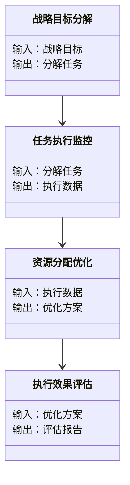
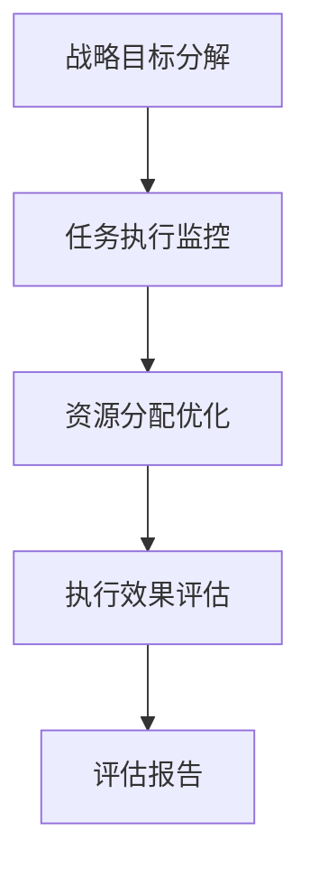
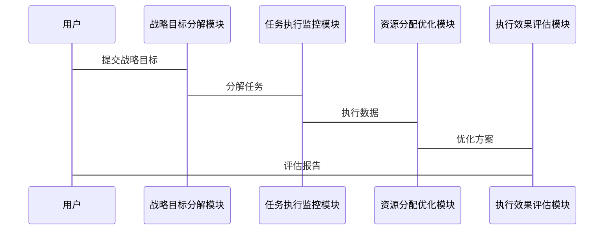

                 


# AI Agents在公司长期战略执行力评估中的应用

## 关键词：AI代理, 战略执行力评估, 人工智能, 系统架构, 评估算法

## 摘要：本文探讨了AI代理在公司长期战略执行力评估中的应用，分析了AI代理的核心原理，系统设计，以及在实际应用中的优势。通过详细的技术分析和实际案例，展示了如何利用AI代理优化战略执行力评估过程，为企业提供更高效、更准确的评估方法。

---

# 第一部分：AI代理与公司战略执行力评估的背景与概念

## 第1章：AI代理与战略执行力评估的背景

### 1.1 问题背景与挑战

#### 1.1.1 公司战略执行力的重要性
公司战略执行能力是企业成功的关键因素之一。战略执行力涉及公司如何将战略目标转化为实际成果，包括资源配置、团队协作、任务执行等。有效的战略执行力能够确保公司目标的实现，增强市场竞争力。

#### 1.1.2 传统战略执行力评估的局限性
传统的战略执行力评估方法通常依赖于人工分析和主观判断，存在以下问题：
- 数据量大且复杂，难以全面分析。
- 评估过程耗时长，成本高。
- 结果受主观因素影响，缺乏客观性。
- 无法实时更新和调整，难以应对快速变化的市场环境。

#### 1.1.3 AI技术在战略评估中的潜力
AI技术，尤其是AI代理，具有强大的数据处理和分析能力，能够实时监控和评估战略执行情况。通过机器学习算法，AI代理可以预测潜在问题，优化资源分配，提供数据驱动的决策支持，从而显著提升战略执行力评估的效率和准确性。

### 1.2 问题描述与目标

#### 1.2.1 战略执行力评估的核心问题
战略执行力评估的核心问题包括：
- 如何量化战略执行的成果？
- 如何识别影响战略执行的关键因素？
- 如何优化资源配置以提高执行效率？

#### 1.2.2 AI代理在评估中的应用目标
AI代理在战略执行力评估中的目标是：
- 实时监控战略执行过程，提供动态反馈。
- 自动识别潜在风险，提前预警。
- 优化资源配置，提高执行效率。
- 提供数据驱动的决策支持，提升战略执行的精准性。

#### 1.2.3 评估的边界与外延
战略执行力评估的边界包括：
- 评估范围：公司内部战略执行的各个阶段。
- 评估对象：战略目标、资源配置、团队协作、任务完成情况等。
- 评估时间：从战略制定到执行结束的整个周期。

### 1.3 核心概念与联系

#### 1.3.1 AI代理的核心概念
AI代理是一种能够感知环境、自主决策并采取行动的智能实体。它通过传感器获取信息，利用算法处理数据，做出决策，并通过执行器采取行动。AI代理可以分为任务型代理和学习型代理，分别适用于不同的应用场景。

#### 1.3.2 战略执行力评估的框架
战略执行力评估的框架通常包括以下几个方面：
- 战略目标分解：将总体战略目标分解为可执行的具体任务。
- 执行过程监控：实时跟踪任务执行情况，识别偏差。
- 评估结果分析：分析执行结果，评估与目标的差距。
- 优化建议：根据评估结果提出改进建议。

#### 1.3.3 AI代理与战略评估的关系
AI代理通过数据处理、分析和决策能力，为战略执行力评估提供技术支持。AI代理可以实时收集和分析执行数据，自动识别问题，优化资源配置，从而提升评估的效率和准确性。

### 1.4 本章小结
本章介绍了AI代理在公司战略执行力评估中的背景和重要性，分析了传统评估方法的局限性，以及AI代理在其中的应用潜力和目标。通过明确核心概念和它们之间的关系，为后续章节的深入分析奠定了基础。

---

# 第二部分：AI代理的核心原理与技术

## 第2章：AI代理的核心原理

### 2.1 AI代理的基本原理

#### 2.1.1 代理的定义与分类
代理（Agent）是指能够感知环境、自主决策并采取行动的智能实体。根据智能水平，代理可以分为以下几类：
- 反应式代理：根据当前感知做出反应。
- 规则型代理：基于预定义规则进行决策。
- 学习型代理：通过机器学习算法不断优化决策模型。

#### 2.1.2 AI代理的核心算法
AI代理的核心算法包括：
- 强化学习（Reinforcement Learning）：通过试错机制优化决策策略。
- 分层强化学习（HRL）：将复杂任务分解为多个子任务，分层决策。
- 多智能体协作（Multi-Agent Collaboration）：多个代理协同工作，共同完成复杂任务。

#### 2.1.3 代理的决策机制
AI代理的决策机制通常包括以下步骤：
1. **感知环境**：通过传感器或数据接口获取环境信息。
2. **状态表示**：将感知信息转换为内部状态表示。
3. **决策制定**：基于当前状态和目标，选择最优行动。
4. **行动执行**：通过执行器或接口执行决策行动。

### 2.2 AI代理的关键技术

#### 2.2.1 任务分解与优先级排序
任务分解是将复杂任务分解为多个子任务，每个子任务由特定的代理或模块负责。优先级排序则是根据任务的重要性和紧急程度，确定执行顺序。

#### 2.2.2 目标识别与优化
目标识别是通过分析战略目标，识别关键影响因素。目标优化则是通过算法优化目标实现路径，提高执行效率。

#### 2.2.3 决策优化算法
决策优化算法包括：
- 动态规划（Dynamic Programming）：通过分阶段决策优化整体目标。
- 遗传算法（Genetic Algorithm）：通过模拟自然选择优化决策方案。
- 模拟退火（Simulated Annealing）：通过随机搜索找到全局最优解。

### 2.3 AI代理的数学模型

#### 2.3.1 多目标优化模型
多目标优化模型用于处理多个目标之间的权衡问题。例如，在战略执行中，可能需要在成本、时间、质量等多个目标之间找到最优解。数学模型可以表示为：
$$
\text{minimize } f(x) \\
\text{subject to } g(x) \leq 0 \\
$$
其中，\( f(x) \) 是目标函数，\( g(x) \) 是约束条件。

#### 2.3.2 状态空间与动作空间
状态空间（State Space）是所有可能状态的集合，动作空间（Action Space）是代理在每个状态下可以执行的所有动作的集合。状态空间和动作空间的定义对于代理的决策至关重要。

#### 2.3.3 奖励函数设计
奖励函数用于衡量代理的决策效果。例如，在战略执行中，完成任务可以得到正奖励，偏离目标则得到负奖励。奖励函数通常表示为：
$$
R(s, a) = \begin{cases}
+1 & \text{if } a \text{ leads to desired outcome} \\
-1 & \text{otherwise}
\end{cases}
$$

### 2.4 本章小结
本章详细介绍了AI代理的核心原理，包括基本定义、核心算法、决策机制以及数学模型。这些内容为后续章节在战略执行力评估中的应用奠定了理论基础。

---

# 第三部分：战略执行力评估的系统设计

## 第3章：战略执行力评估的系统分析

### 3.1 问题场景介绍

#### 3.1.1 公司战略执行的典型场景
公司战略执行的典型场景包括：
- 战略目标分解：将总体战略目标分解为具体任务。
- 任务执行监控：实时跟踪任务执行情况。
- 资源分配优化：根据执行情况动态调整资源分配。
- 执行效果评估：评估执行结果，总结经验教训。

#### 3.1.2 评估系统的功能需求
评估系统需要具备以下功能：
- 数据采集：收集战略执行过程中的各项数据。
- 数据分析：对数据进行处理和分析，识别关键问题。
- 评估报告：生成评估报告，提供改进建议。
- 实时监控：实时跟踪执行情况，提供动态反馈。

#### 3.1.3 系统的边界条件
系统的边界条件包括：
- 数据来源：仅限于公司内部数据。
- 使用范围：仅用于战略执行评估。
- 时间范围：从战略制定到执行结束。

### 3.2 系统功能设计

#### 3.2.1 领域模型设计
领域模型是系统设计的核心，用于描述系统的功能和交互关系。以下是一个简单的领域模型示例：



#### 3.2.2 功能模块划分
系统功能模块包括：
- 数据采集模块：负责收集战略执行数据。
- 数据分析模块：对数据进行处理和分析。
- 评估报告模块：生成评估报告。
- 实时监控模块：实时跟踪执行情况。

#### 3.2.3 模块之间的关系
模块之间的关系可以通过以下流程图表示：



### 3.3 系统架构设计

#### 3.3.1 分层架构设计
系统架构采用分层设计，包括数据层、业务逻辑层和表现层。

#### 3.3.2 模块化设计
系统模块化设计包括数据采集模块、数据分析模块、评估报告模块和实时监控模块。

#### 3.3.3 高可用性设计
高可用性设计包括负载均衡、数据备份和故障恢复机制。

### 3.4 系统接口设计

#### 3.4.1 数据接口
数据接口用于与其他系统的数据交互，通常采用API接口。

#### 3.4.2 用户接口
用户接口是系统的前端界面，供用户进行操作。

#### 3.4.3 第三方接口
第三方接口用于与外部系统的数据交互。

### 3.5 系统交互设计

#### 3.5.1 用户与系统的交互流程
用户通过前端界面提交战略目标，系统接收后进行分解任务。

#### 3.5.2 系统内部的交互流程
系统内部模块之间的交互流程可以通过以下序列图表示：



#### 3.5.3 异常情况的处理流程
异常情况的处理流程包括错误检测、异常处理和状态恢复。

### 3.6 本章小结
本章详细分析了战略执行力评估系统的功能需求、系统架构和模块设计，为后续章节的系统实现奠定了基础。

---

# 第四部分：AI代理在战略执行力评估中的应用

## 第4章：AI代理在战略评估中的算法实现

### 4.1 算法实现步骤

#### 4.1.1 数据采集与预处理
数据采集包括从公司内部系统中获取战略执行数据。预处理包括数据清洗、特征提取和数据标准化。

#### 4.1.2 模型训练与优化
模型训练包括使用机器学习算法（如强化学习）训练AI代理。模型优化包括通过调整参数和优化算法提高模型性能。

#### 4.1.3 系统集成与测试
系统集成包括将AI代理集成到战略评估系统中。系统测试包括功能测试、性能测试和安全测试。

### 4.2 项目实战

#### 4.2.1 环境安装
安装所需的Python库，如TensorFlow、Keras、Scikit-learn等。

#### 4.2.2 核心功能实现
实现AI代理的核心功能，如任务分解、目标识别和决策优化。

#### 4.2.3 代码解读与分析
以下是核心功能的Python代码示例：

```python
import numpy as np
import tensorflow as tf

# 定义强化学习模型
class AI-Agent:
    def __init__(self, state_space, action_space):
        self.state_space = state_space
        self.action_space = action_space
        self.model = self.build_model()

    def build_model(self):
        # 定义神经网络模型
        model = tf.keras.Sequential([
            tf.keras.layers.Dense(64, activation='relu', input_dim=self.state_space),
            tf.keras.layers.Dense(self.action_space, activation='linear')
        ])
        model.compile(optimizer='adam', loss='mse')
        return model

    def act(self, state):
        # 根据当前状态选择动作
        prediction = self.model.predict(np.array([state]))
        action = np.argmax(prediction[0])
        return action

    def train(self, state, action, reward, next_state):
        # 训练模型
        self.model.fit(np.array([state]), np.array([reward]), epochs=1, verbose=0)

# 使用代理进行战略执行评估
agent = AI-Agent(state_space=10, action_space=5)
state = initial_state
action = agent.act(state)
next_state, reward = environment.step(action)
agent.train(state, action, reward, next_state)
```

#### 4.2.4 案例分析与详细解读
通过具体案例分析AI代理在战略执行评估中的应用效果，例如在资源配置优化中的应用。

### 4.3 本章小结
本章通过实际案例展示了AI代理在战略执行力评估中的应用，详细讲解了算法实现和系统集成的步骤，为读者提供了实践指导。

---

# 第五部分：总结与展望

## 第5章：总结与展望

### 5.1 本章总结
本文详细探讨了AI代理在公司长期战略执行力评估中的应用，分析了AI代理的核心原理和系统设计，并通过实际案例展示了其在战略评估中的优势。

### 5.2 未来展望
未来，随着AI技术的不断发展，AI代理在战略执行力评估中的应用将更加广泛。可能的发展方向包括：
- 更加智能化的代理系统。
- 更加高效的数据处理和分析算法。
- 更加个性化的战略评估方案。

### 5.3 小结
AI代理的应用为公司战略执行力评估带来了新的可能性，通过不断优化算法和系统设计，可以进一步提升战略执行的效率和准确性。

---

# 作者

作者：AI天才研究院/AI Genius Institute & 禅与计算机程序设计艺术 /Zen And The Art of Computer Programming

---

以上是文章的完整目录结构和内容概要。通过系统的分析和详细的技术阐述，本文为读者提供了关于AI代理在战略执行力评估中的全面认识和实践指导。

