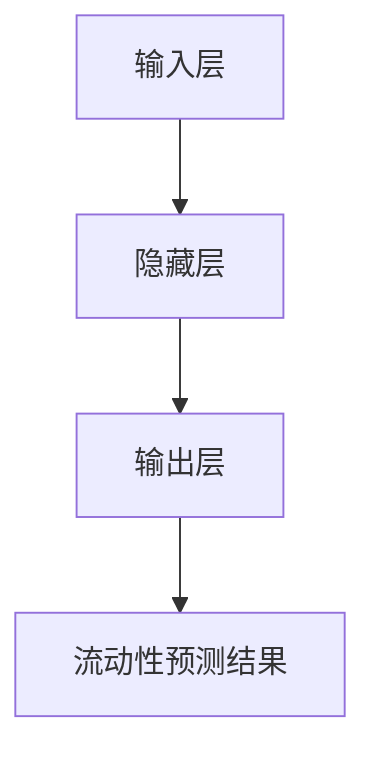

                 


# AI agents增强价值投资的市场流动性分析

> 关键词：AI代理，价值投资，市场流动性，强化学习，神经网络

> 摘要：本文探讨了AI代理如何通过增强市场流动性来优化价值投资策略。通过分析AI代理的算法原理、数学模型和系统架构，结合实际案例，展示了AI代理在价值投资中的应用及其对市场流动性的积极影响。

---

# 第1章: AI代理与价值投资的结合

## 1.1 AI代理的基本概念

### 1.1.1 AI代理的定义与特点
AI代理是一种能够感知环境、自主决策并执行任务的智能体。其特点包括：
- **自主性**：无需外部干预，自主完成任务。
- **反应性**：能够实时感知环境变化并做出反应。
- **学习能力**：通过数据和经验不断优化决策模型。
- **协作性**：能够与其他代理或系统协同工作。

### 1.1.2 价值投资的核心理念
价值投资是一种以内在价值为导向的投资策略，强调通过基本面分析发现被市场低估的投资标的。其核心理念包括：
- **长期视角**：关注企业的长期盈利能力。
- **安全边际**：在价格低于内在价值时买入。
- **分散投资**：降低单一投资的风险。

### 1.1.3 AI代理与价值投资的结合方式
AI代理通过分析海量数据、识别市场趋势和优化投资组合，为价值投资提供技术支持。其结合方式包括：
- **数据驱动的决策**：利用AI代理分析财务数据和市场信息，辅助投资决策。
- **实时监控与调整**：AI代理实时跟踪市场变化，动态优化投资组合。
- **风险控制**：通过AI代理进行风险评估和预警，降低投资风险。

---

## 1.2 市场流动性分析的背景

### 1.2.1 市场流动性的定义与影响
市场流动性指资产在市场中迅速买卖而不影响价格的能力。高流动性意味着交易成本低、成交速度快，反之则可能导致交易成本高、成交延迟。

### 1.2.2 传统市场流动性分析方法
传统方法包括：
- **成交量分析**：通过分析交易量判断市场活跃度。
- **波动率分析**：通过资产价格波动率评估流动性风险。
- **买卖价差分析**：通过买卖价差衡量交易成本。

### 1.2.3 AI代理在流动性分析中的优势
AI代理能够处理海量数据、识别复杂模式，并实时优化决策，具有以下优势：
- **高效率**：快速处理和分析数据。
- **准确性**：通过机器学习模型提高预测精度。
- **自适应性**：根据市场变化动态调整分析策略。

---

## 1.3 本书的核心目标

### 1.3.1 增强价值投资的市场流动性
通过AI代理优化市场流动性，降低交易成本，提高交易效率。

### 1.3.2 AI代理在流动性分析中的具体应用
- **流动性预测**：利用AI代理预测市场流动性变化。
- **交易策略优化**：基于流动性分析优化投资组合。
- **风险控制**：通过AI代理实时监控流动性风险。

### 1.3.3 本书的结构与内容概述
本书将从AI代理的基本原理出发，逐步深入分析其在价值投资中的应用，并结合实际案例，探讨如何通过AI代理增强市场流动性。

---

# 第2章: AI代理的算法原理

## 2.1 强化学习与AI代理

### 2.1.1 强化学习的基本原理
强化学习是一种通过试错学习策略的方法，其核心是通过奖励机制优化决策。公式表示为：
$$ R = r_1 + r_2 + \cdots + r_n $$
其中，$R$ 是总奖励，$r_i$ 是每一步的奖励。

### 2.1.2 AI代理的决策过程
AI代理通过感知环境、选择动作、执行动作并获得反馈，不断优化决策模型。流程如下：
1. 环境感知：获取市场数据。
2. 状态表示：将数据转化为状态。
3. 动作选择：基于状态选择最优动作。
4. 反馈接收：根据动作结果更新模型。

### 2.1.3 强化学习在流动性分析中的应用
- **流动性预测**：通过强化学习模型预测市场流动性变化。
- **交易策略优化**：基于流动性预测优化交易策略。

---

## 2.2 神经网络与市场预测

### 2.2.1 神经网络的基本结构
神经网络由输入层、隐藏层和输出层组成。其结构如下：
```
输入层 -> 隐藏层 -> 输出层
```

### 2.2.2 市场数据的特征提取
特征提取是将市场数据转化为神经网络可处理的特征向量。例如，将股票价格、成交量等数据转化为特征向量：
$$ X = [x_1, x_2, \ldots, x_n] $$

### 2.2.3 神经网络在流动性预测中的实现
通过训练神经网络模型，实现对市场流动性的预测。模型结构如下：


---

## 2.3 流动性分析的数学模型

### 2.3.1 流动性指数的计算公式
流动性指数（LI）计算公式为：
$$ LI = \frac{V_t}{P_t} $$
其中，$V_t$ 是第 $t$ 时间的成交量，$P_t$ 是第 $t$ 时间的价格。

### 2.3.2 市场波动性与流动性关系的数学表达
市场波动性与流动性呈负相关关系，公式为：
$$ \text{波动性} = \frac{1}{LI} $$

### 2.3.3 AI代理的决策优化模型
通过强化学习优化决策模型，公式为：
$$ \theta_{t+1} = \theta_t + \alpha \cdot R $$

---

# 第3章: 价值投资与市场流动性分析

## 3.1 价值投资的核心要素

### 3.1.1 股票估值的基本方法
股票估值方法包括：
- **DCF模型**：通过现金流折现计算内在价值。
- **PE估值法**：通过市盈率评估股票价值。

### 3.1.2 财务指标分析
关键财务指标包括：
- **净利润率**：净利润/收入。
- **ROE**：净资产收益率。
- **周转率**：资产周转率。

### 3.1.3 行业分析与竞争环境评估
行业分析包括市场规模、竞争结构、发展趋势等。

---

## 3.2 市场流动性对投资决策的影响

### 3.2.1 流动性与资产价格的关系
流动性对资产价格的影响公式为：
$$ P = \text{内在价值} \times \text{流动性溢价} $$

### 3.2.2 传统流动性风险的评估
传统流动性风险评估方法包括：
- **VaR法**：计算潜在损失。
- **压力测试法**：模拟极端市场情况下的流动性风险。

### 3.2.3 流动性对投资组合的影响
高流动性资产更容易变现，降低投资组合的风险。

---

## 3.3 AI代理在价值投资中的应用

### 3.3.1 AI代理如何优化投资决策
通过分析市场数据和基本面信息，AI代理能够识别被低估的投资标的。

### 3.3.2 流动性分析对投资策略的改进
AI代理通过优化交易时机和交易规模，提高投资组合的回报率。

### 3.3.3 AI代理在风险管理中的作用
通过实时监控市场变化和优化风险敞口，AI代理能够有效管理投资风险。

---

# 第4章: AI代理增强市场流动性的机制

## 4.1 AI代理如何提升市场流动性

### 4.1.1 提高市场信息透明度
通过AI代理分析和分享市场数据，提高市场透明度。

### 4.1.2 优化市场参与者决策
通过AI代理提供决策支持，优化市场参与者的投资决策。

### 4.1.3 增加市场交易活跃度
通过优化交易策略和降低交易成本，增加市场交易活跃度。

---

## 4.2 AI代理在市场流动性管理中的具体应用

### 4.2.1 流动性预测模型的构建
通过时间序列分析和机器学习模型，构建流动性预测模型。

### 4.2.2 AI代理在订单匹配中的优化
通过优化订单匹配算法，提高市场流动性。

### 4.2.3 流动性风险的实时监控
通过实时监控市场数据，及时发现和预警流动性风险。

---

## 4.3 流动性增强的数学模型

### 4.3.1 流动性预测的回归模型
回归模型公式为：
$$ \text{流动性} = \beta_0 + \beta_1x_1 + \beta_2x_2 + \cdots + \beta_nx_n + \epsilon $$

### 4.3.2 基于强化学习的流动性优化算法
通过强化学习算法优化流动性管理策略。

### 4.3.3 流动性风险的数学表达
流动性风险公式为：
$$ \text{风险} = \text{流动性不足} \times \text{资产规模} $$

---

# 结语

通过本文的分析，我们探讨了AI代理如何通过增强市场流动性来优化价值投资策略。结合算法原理、数学模型和实际案例，展示了AI代理在投资中的巨大潜力。未来，随着技术的进步，AI代理将在价值投资中发挥更加重要的作用。

---

作者：AI天才研究院

