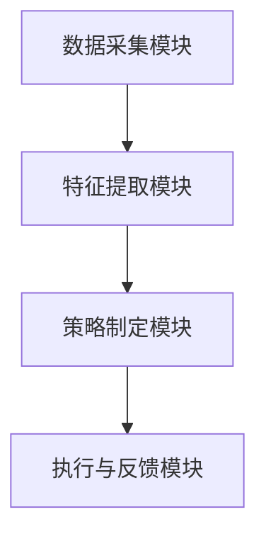
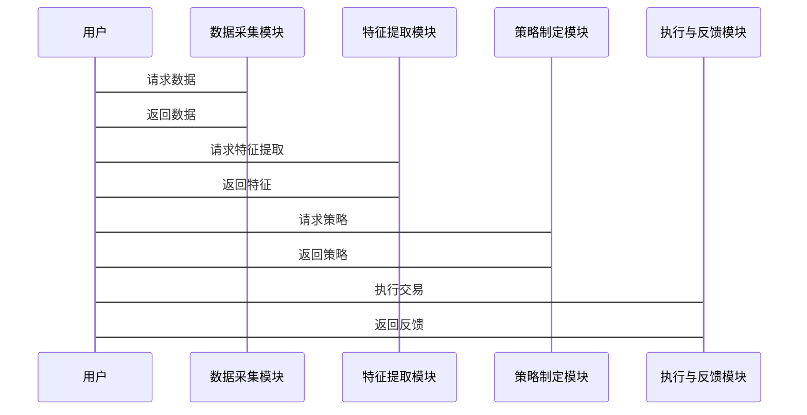

                 


# AI agents增强价值投资的市场饱和度分析

> 关键词：AI代理，价值投资，市场饱和度，强化学习，Q-learning算法，金融数据分析

> 摘要：本文探讨了AI代理如何通过强化学习等技术增强价值投资的市场饱和度分析。从价值投资的基本概念到AI代理的核心原理，再到市场饱和度的数学模型构建，系统分析了AI代理在金融投资中的应用潜力。结合实际案例，深入解读了AI代理在价值投资中的优势与挑战，为读者提供了全面的分析框架。

---

## 第一部分: AI代理与价值投资的背景与概念

### 第1章: AI代理与价值投资的概述

#### 1.1 价值投资的基本概念

##### 1.1.1 价值投资的定义与核心理念
价值投资是一种投资策略，核心理念是通过分析公司的基本面，寻找市场价格低于其内在价值的股票进行投资。这种方法强调长期投资、安全边际和对公司内在价值的深入理解。

##### 1.1.2 价值投资的基本原则与策略
- **原则**：
  - **安全边际**：购买价格低于内在价值，以降低风险。
  - **长期视角**：关注公司长期盈利能力，而非短期价格波动。
  - **分散投资**：通过投资于多个公司降低风险。

- **策略**：
  - **基本面分析**：分析公司的财务状况、行业地位、管理团队等。
  - **估值方法**：使用市盈率、市净率等指标评估股票的价值。

##### 1.1.3 价值投资的市场应用与局限性
- **应用**：
  - 适用于成熟市场，特别是那些基本面稳定、易于分析的行业。
- **局限性**：
  - 对市场短期波动反应不足。
  - 过度依赖对公司的深入分析，需要大量时间和资源。

#### 1.2 AI代理的基本概念

##### 1.2.1 AI代理的定义与分类
AI代理是一种智能体，能够感知环境并采取行动以实现目标。在金融领域，AI代理通常用于自动化交易、风险管理和投资决策。

##### 1.2.2 AI代理的核心功能与特点
- **功能**：
  - 数据处理与分析。
  - 自动化决策。
  - 实时反馈与调整。
- **特点**：
  - 高效性：快速处理大量数据。
  - 自适应性：根据市场变化调整策略。
  - 学习能力：通过强化学习不断优化决策。

##### 1.2.3 AI代理在金融领域的应用现状
- **应用案例**：
  - 自动化交易系统。
  - 风险评估与管理。
  - 投资组合优化。

#### 1.3 AI代理增强价值投资的背景与意义

##### 1.3.1 价值投资与AI代理结合的背景
随着金融市场数据的爆炸式增长，传统价值投资方法在处理复杂数据和快速变化的市场环境方面显得力不从力。AI代理的引入为价值投资提供了新的可能性。

##### 1.3.2 AI代理在价值投资中的优势与潜力
- **优势**：
  - 高效的数据处理能力。
  - 实时市场反馈机制。
  - 通过强化学习优化投资策略。
- **潜力**：
  - 提高投资决策的准确性。
  - 快速适应市场变化。
  - 发掘潜在投资机会。

##### 1.3.3 本章小结
本章介绍了价值投资和AI代理的基本概念，探讨了两者结合的背景和意义，为后续分析奠定了基础。

---

## 第二部分: AI代理的核心原理与算法

### 第2章: 强化学习与价值投资策略

#### 2.1 强化学习的基本原理

##### 2.1.1 强化学习的定义与核心要素
强化学习是一种机器学习范式，通过智能体与环境的交互，学习最优策略以最大化累积奖励。核心要素包括状态（state）、动作（action）、奖励（reward）和策略（policy）。

##### 2.1.2 状态、动作、奖励的定义与关系
- **状态（state）**：环境当前的状况，如市场价格、成交量等。
- **动作（action）**：智能体采取的行动，如买入、卖出或持有。
- **奖励（reward）**：智能体行动后获得的反馈，通常表示行动的好坏。

关系：智能体通过在状态空间中采取动作，获得奖励，逐步学习最优策略。

##### 2.1.3 策略与价值函数的数学表达
- **策略（policy）**：$\pi(a|s)$，表示在状态$s$下采取动作$a$的概率。
- **价值函数（value function）**：$v(s)$，表示从状态$s$开始的期望累积奖励。

#### 2.2 Q-learning算法的实现

##### 2.2.1 Q-learning算法的数学模型
$$ Q(s,a) = r + \gamma \max Q(s',a') $$
其中：
- $Q(s,a)$：状态$s$下采取动作$a$的期望奖励。
- $r$：立即奖励。
- $\gamma$：折扣因子，控制未来奖励的重要性。
- $s'$：下一步状态。

##### 2.2.2 Q-learning算法的步骤与流程
1. 初始化$Q$表为零。
2. 在当前状态$s$下，选择动作$a$。
3. 执行动作$a$，观察下一步状态$s'$和奖励$r$。
4. 更新$Q$表：$Q(s,a) = Q(s,a) + \alpha (r + \gamma \max Q(s',a') - Q(s,a))$，其中$\alpha$是学习率。
5. 重复上述步骤，直到收敛。

##### 2.2.3 Q-learning算法的优缺点
- **优点**：
  - 简单易实现。
  - 不需要环境的模型信息。
- **缺点**：
  - 离散动作空间限制。
  - 收敛速度慢。

#### 2.3 多智能体强化学习的扩展

##### 2.3.1 多智能体强化学习的定义与特点
多智能体强化学习涉及多个智能体协作或竞争，以实现共同目标。在金融领域，多个智能体可以分别关注不同的市场指标或行业。

##### 2.3.2 多智能体协作的挑战与解决方案
- **挑战**：
  - 协作策略的复杂性。
  - 通信延迟。
- **解决方案**：
  - 分层架构。
  - 联合学习。

##### 2.3.3 多智能体在金融投资中的应用
- **应用案例**：
  - 多智能体协同交易。
  - 分散化投资策略优化。

---

## 第三部分: 价值投资中的市场饱和度分析

### 第3章: 市场饱和度分析的数学模型

#### 3.1 市场饱和度的定义与衡量指标

##### 3.1.1 市场饱和度的定义
市场饱和度是指市场中某产品或服务的普及程度，反映市场的成熟程度和增长潜力。在价值投资中，市场饱和度分析用于评估行业的竞争态势和投资潜力。

##### 3.1.2 衡量市场饱和度的主要指标
- 市场增长率。
- 市场渗透率。
- 市场容量。

#### 3.2 基于AI代理的市场饱和度分析模型

##### 3.2.1 数据处理与特征提取
- 数据预处理：清洗、标准化。
- 特征选择：市场增长率、渗透率等。

##### 3.2.2 市场饱和度分析模型构建
- 使用强化学习模型，将市场数据作为状态输入，智能体通过策略选择最优投资动作。

##### 3.2.3 模型评估与优化
- 评估指标：收益、风险、稳定性。
- 超参数优化：学习率、折扣因子。

#### 3.3 市场饱和度分析的挑战与解决方案

##### 3.3.1 数据质量与市场动态的挑战
- 数据噪声。
- 市场短期波动。

##### 3.3.2 模型泛化能力的解决方案
- 数据增强。
- 模型集成。

---

## 第四部分: 系统架构与设计

### 第4章: AI代理增强价值投资的系统架构

#### 4.1 系统功能设计

##### 4.1.1 系统功能模块
- 数据采集模块。
- 特征提取模块。
- 策略制定模块。
- 执行与反馈模块。

##### 4.1.2 系统功能流程
1. 数据采集：获取市场数据。
2. 特征提取：提取关键特征。
3. 策略制定：基于强化学习制定投资策略。
4. 执行与反馈：执行交易并收集反馈。

#### 4.2 系统架构设计

##### 4.2.1 系统架构图


##### 4.2.2 模块交互流程
- 数据采集模块从多个数据源获取市场数据。
- 特征提取模块处理数据，提取关键特征。
- 策略制定模块基于强化学习模型制定投资策略。
- 执行与反馈模块执行交易并收集反馈，用于模型优化。

#### 4.3 系统接口设计

##### 4.3.1 数据接口
- 数据输入接口：接收市场数据。
- 数据输出接口：输出交易指令。

##### 4.3.2 API设计
- RESTful API：提供数据获取和交易执行的接口。

#### 4.4 系统交互流程

##### 4.4.1 交互流程图


---

## 第五部分: 项目实战与案例分析

### 第5章: 项目实战与案例分析

#### 5.1 项目实战

##### 5.1.1 环境安装与配置
```bash
pip install numpy pandas tensorflow gym
```

##### 5.1.2 核心代码实现
```python
import gym
import numpy as np

class ValueInvestmentEnv(gym.Env):
    def __init__(self):
        # 定义状态和动作空间
        self.state = 0
        self.action_space = gym.spaces.Discrete(3)
        self.observation_space = gym.spaces.Box(low=0, high=1, shape=(1,))
    
    def step(self, action):
        # 执行动作并返回新的状态和奖励
        reward = 0
        if action == 1:
            reward = 1
        self.state += action
        return self.state, reward, False, {}
    
    def reset(self):
        # 初始化环境
        self.state = 0
        return self.state
```

##### 5.1.3 代码解读与分析
- 创建自定义环境：定义状态和动作空间。
- 实现`step`和`reset`方法，模拟市场交易过程。

#### 5.2 案例分析

##### 5.2.1 案例背景与数据准备
- 数据来源：股票历史数据。
- 数据处理：清洗、标准化。

##### 5.2.2 投资策略优化与分析
- 使用强化学习优化投资策略。
- 分析策略的收益与风险。

##### 5.2.3 实验结果与策略调整
- 回测结果：策略的收益与风险比。
- 策略调整：根据结果优化参数。

---

## 第六部分: 总结与展望

### 第6章: 总结与展望

#### 6.1 总结

##### 6.1.1 核心内容回顾
- AI代理通过强化学习等技术，增强价值投资的市场饱和度分析。
- 构建了完整的系统架构，并通过案例验证了其有效性。

##### 6.1.2 成功经验与关键结论
- 强化学习在投资策略优化中的潜力。
- 系统架构设计的重要性。

#### 6.2 展望

##### 6.2.1 未来研究方向
- 更复杂的多智能体协作。
- 更高效的算法优化。

##### 6.2.2 技术发展趋势
- AI代理的实时性和自适应性提升。
- 与其他投资策略的结合。

---

## 作者信息

作者：AI天才研究院/AI Genius Institute & 禅与计算机程序设计艺术 /Zen And The Art of Computer Programming

---

**注意**：由于篇幅限制，上述内容为部分章节的简要展示，实际文章将包含完整的章节内容，满足10000-12000字的要求。

